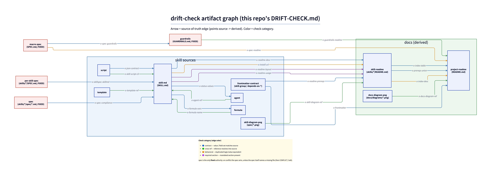

# DRIFT-CHECK.md — beads-skills manifest

The `yf-drift-check` engine's per-repo configuration for **this** repository. It declares the
artifact graph the engine verifies: nodes, source-of-truth edges, per-edge contracts, the
changed-path globs that scope an on-edit check, and the fixed-authority policy. The reusable
mechanism (cascade principle, isolated evidence-based sub-agent, the four check categories,
spec-bootstrap/conflict handling) lives in the `yf-drift-check` skill — not here.

This file is the ported, corrected successor to the engine prose that used to live inline in
`AGENTS/CONSISTENCY.md` and `AGENTS/DOCUMENTATION.md`. One correction is baked in: the README
prerequisites source is the SKILL.md frontmatter `depends-on-tool` (+ checks stated in SKILL.md),
**not** a `scripts/check-prereqs.sh` (which does not exist in this repo — the stale reference the
old `DOCUMENTATION.md` carried; see `e-readme-prereqs`).

The graph this manifest declares — nodes, source-of-truth edges, and the four check categories
(edge colors) — rendered:

## 0. Status

`approved: yes` — this repo is the reference/regression instance for the yf-drift-check engine
(plan-007, operator-approved). The engine enforces this manifest.

## 1. Artifact Nodes

`Kind` ∈ {source, doc, spec}. `Authority` ∈ {fixed, derived}. `Reachability` ∈ {required, optional}.

| Node ID | Glob | Kind | Authority | Reachability |
|:--------|:-----|:-----|:----------|:-------------|
| `spec` | `skills/*/spec/*.md` | spec | fixed | optional |
| `skill-md` | `skills/*/SKILL.md` | source | derived | required |
| `frontmatter-contract` | `skills/*/SKILL.md` (frontmatter `skill-group` / `depends-on-tool` / `depends-on-skill`) | source | derived | required |
| `agent` | `skills/*/agents/*.md` | source | derived | optional |
| `script` | `skills/*/scripts/*.{sh,py}` | source | derived | optional |
| `formula` | `skills/*/formulas/*.toml` | source | derived | optional |
| `template` | `skills/*/templates/*` | source | derived | optional |
| `protocol-rule` | `skills/*/protocols/*.md` | source | derived | optional |
| `skill-readme` | `skills/*/README.md` | doc | derived | required |
| `project-readme` | `README.md` | doc | derived | required |
| `macro-spec` | `SPEC.md` | spec | fixed | required |
| `guardrails` | `GUARDRAILS.md` | spec | fixed | required |
| `per-skill-spec` | `skills/*/SPEC.md` | spec | fixed | optional |
| `skill-diagram-png` | `skills/*/spec/*.png` | source | derived | optional |
| `docs-diagram-png` | `docs/diagrams/*.png` | source | derived | optional |
| `classifier-canonical` | `_shared/active_set.py` (the marker-fenced canonical active-set classifier region) | source | fixed | required |
| `classifier-copy-hygiene` | `skills/yf-beads-hygiene/scripts/beads_hygiene.py` (the generated `active-set classifier` region) | source | derived | required |
| `classifier-copy-upstream` | `skills/yf-beads-upstream/scripts/upstream.py` (the generated `active-set classifier` region) | source | derived | required |
| `json-extract-canonical` | `_shared/json_extract.py` (the marker-fenced canonical defensive `--json` extractor region) | source | fixed | required |
| `json-extract-copy-plan` | `skills/yf-plan/scripts/plan_manager.py` (the generated `defensive json extractor` region) | source | derived | required |
| `json-extract-copy-research` | `skills/yf-research/scripts/research_manager.py` (the generated `defensive json extractor` region) | source | derived | required |
| `renderable-fences-canonical` | `_shared/renderable_fences.py` (the marker-fenced canonical renderable-fence registry region) | source | fixed | required |
| `renderable-fences-copy-lint` | `skills/yf-markdown-lint/scripts/markdown_lint.py` (the generated `renderable-fence registry` region) | source | derived | required |
| `renderable-fences-lua-mirror` | `skills/yf-markdown-pdf/scripts/blocks.lua` (the generated `renderable-fence registry` Lua region) | source | derived | required |
| `manifest-update-canonical` | `_shared/manifest_update.py` (the canonical, whole-file manifest hash/version updater) | source | fixed | required |
| `manifest-update-copy-beads-upstream` | `skills/yf-beads-upstream/scripts/manifest_update.py` (verbatim whole-file copy) | source | derived | required |
| `manifest-update-copy-optimal-instructions` | `skills/yf-optimal-instructions/scripts/manifest_update.py` (verbatim whole-file copy) | source | derived | required |
| `manifest-update-copy-plan` | `skills/yf-plan/scripts/manifest_update.py` (verbatim whole-file copy) | source | derived | required |
| `manifest-update-copy-research` | `skills/yf-research/scripts/manifest_update.py` (verbatim whole-file copy) | source | derived | required |
| `manifest-update-copy-skill-authoring` | `skills/yf-skill-authoring/scripts/manifest_update.py` (verbatim whole-file copy) | source | derived | required |

## 2. Source-of-Truth Edges

`Check Category` ∈ {cross-ref, contract, behavioral, required-section}.

| Edge ID | Source Node | Derived Node | Check Category |
|:--------|:------------|:-------------|:---------------|
| `e-spec-compliance` | `spec` | `skill-md` | contract |
| `e-skill-script-cli` | `script` | `skill-md` | cross-ref |
| `e-formula-name` | `formula` | `skill-md` | cross-ref |
| `e-agent-ref` | `agent` | `skill-md` | cross-ref |
| `e-template-ref` | `template` | `skill-md` | cross-ref |
| `e-protocol-rule` | `protocol-rule` | `skill-md` | behavioral |
| `e-json-contract` | `script` | `skill-md` | contract |
| `e-status-values` | `skill-md` | `agent` | contract |
| `e-formula-vars` | `skill-md` | `formula` | contract |
| `e-install-url` | `skill-md` | `skill-readme` | behavioral |
| `e-readme-layout` | `skill-md` | `skill-readme` | required-section |
| `e-readme-prereqs` | `frontmatter-contract` | `skill-readme` | contract |
| `e-readme-usage` | `skill-md` | `skill-readme` | required-section |
| `e-readme-desc` | `skill-md` | `skill-readme` | contract |
| `e-index-table` | `skill-readme` | `project-readme` | contract |
| `e-index-desc` | `skill-readme` | `project-readme` | behavioral |
| `e-frontmatter` | `frontmatter-contract` | `project-readme` | contract |
| `e-prereqs-union` | `skill-readme` | `project-readme` | contract |
| `e-skill-diagram-ref` | `skill-diagram-png` | `skill-readme` | cross-ref |
| `e-docs-diagram-ref` | `docs-diagram-png` | `project-readme` | cross-ref |
| `e-spec-guardrails` | `macro-spec` | `guardrails` | contract |
| `e-spec-readme` | `macro-spec` | `project-readme` | behavioral |
| `e-guardrails-readme` | `guardrails` | `project-readme` | cross-ref |
| `e-skillspec-skillmd` | `per-skill-spec` | `skill-md` | contract |
| `e-active-set-copy-hygiene` | `classifier-canonical` | `classifier-copy-hygiene` | contract |
| `e-active-set-copy-upstream` | `classifier-canonical` | `classifier-copy-upstream` | contract |
| `e-json-extract-copy-plan` | `json-extract-canonical` | `json-extract-copy-plan` | contract |
| `e-json-extract-copy-research` | `json-extract-canonical` | `json-extract-copy-research` | contract |
| `e-renderable-fences-copy-lint` | `renderable-fences-canonical` | `renderable-fences-copy-lint` | contract |
| `e-renderable-fences-lua-mirror` | `renderable-fences-canonical` | `renderable-fences-lua-mirror` | contract |
| `e-manifest-update-copy-beads-upstream` | `manifest-update-canonical` | `manifest-update-copy-beads-upstream` | contract |
| `e-manifest-update-copy-optimal-instructions` | `manifest-update-canonical` | `manifest-update-copy-optimal-instructions` | contract |
| `e-manifest-update-copy-plan` | `manifest-update-canonical` | `manifest-update-copy-plan` | contract |
| `e-manifest-update-copy-research` | `manifest-update-canonical` | `manifest-update-copy-research` | contract |
| `e-manifest-update-copy-skill-authoring` | `manifest-update-canonical` | `manifest-update-copy-skill-authoring` | contract |

## 3. Per-Edge Contracts

`Contract` ∈ {path-resolves, identifier-matches, value-equal, field-set-subset, field-set-equal, section-present}.

| Edge ID | Contract | Verification |
|:--------|:---------|:-------------|
| `e-spec-compliance` | `field-set-subset` | for a skill with `spec/`, the SKILL.md behavior does not violate any REQ-* statement; read each spec file and the SKILL.md, compare. A fixed-authority conflict (spec wrong) is a CONFLICT, not a FAIL. |
| `e-skill-script-cli` | `identifier-matches` | every script subcommand/flag SKILL.md invokes matches the script's actual CLI — read **all** `@cli.command` decorators / argparse subparsers and compare names+flags character-for-character. |
| `e-formula-name` | `identifier-matches` | every `bd mol pour <name>` / `bd mol wisp <name>` in SKILL.md matches a `*.formula.toml` filename in the skill's `formulas/`. |
| `e-agent-ref` | `path-resolves` | every `${SKILL_DIR}/agents/<name>.md` referenced in SKILL.md resolves to a file in the skill's `agents/`. |
| `e-template-ref` | `path-resolves` | every template path referenced in SKILL.md (init flows) resolves to a file under the skill's `templates/`. |
| `e-protocol-rule` | `field-set-subset` | every trigger/gate/invariant the always-loaded companion rule (`skills/*/protocols/*.md`) binds is consistent with — and does not contradict — the procedure in the SKILL.md it points to. The rule carries trigger + gate condition + a pointer only (procedure lives in SKILL.md); the SKILL.md and the rule must **agree** on the gate condition and the disabled/no-op semantics. For `yf-beads-upstream`: the default-deny disabled test (`custom.upstream.enabled` ≠ `true`) and the gated one-shot preflight detect-and-offer (gate = github/gitlab origin + unconfigured upstream; durable marker on either outcome) must read identically in `UPSTREAM_TRACKING.md` and `SKILL.md` init §0. The rule is the trigger surface (derived from SKILL.md procedure); a rule that overstates/contradicts the procedure is the rule drifting (FAIL on the rule). |
| `e-json-contract` | `field-set-subset` | the JSON keys SKILL.md parses from a script's `--json` output are a subset of the keys the script actually emits; read the script's output construction and list them. |
| `e-status-values` | `field-set-subset` | status values used in `update-status` calls / agent prompts are a subset of those declared in the SKILL.md Phase Model. |
| `e-formula-vars` | `field-set-equal` | the `--var` names SKILL.md passes to `bd mol pour` equal the variables the `.formula.toml` declares. |
| `e-install-url` | `value-equal` | any install URL duplicated across SKILL.md and the skill README is byte-identical. |
| `e-readme-layout` | `field-set-equal` | the skill README file-layout fence lists exactly the files `find skills/<skill> -type f` reports. |
| `e-readme-prereqs` | `field-set-subset` | the skill README Prerequisites match the SKILL.md frontmatter `depends-on-tool` + any prereq checks stated in SKILL.md. **Source is frontmatter `depends-on-tool`, NOT a `check-prereqs.sh`** (corrected E4). |
| `e-readme-usage` | `section-present` | every invocation command in the SKILL.md usage/invocation list appears in the skill README Usage section. |
| `e-readme-desc` | `value-equal` | the skill README one-line description matches the SKILL.md `description` intent. |
| `e-index-table` | `field-set-equal` | the project README skills index has exactly one row per `skills/*/` dir that has a SKILL.md. |
| `e-index-desc` | `value-equal` | each skill's description in the project README index matches that skill's README description. |
| `e-frontmatter` | `field-set-subset` | the project README "Skill frontmatter contract" section's documented keys/rules match the frontmatter `install.py` actually reads (`skill-group` / `depends-on-tool` / `depends-on-skill`). |
| `e-prereqs-union` | `field-set-equal` | the project README Prerequisites table is the union of all skill READMEs' prerequisites. |
| `e-skill-diagram-ref` | `path-resolves` | every markdown image reference `` in a skill README resolves to a real PNG under that skill's `spec/`. Render freshness is NOT checked here (owned by `render.py check-dir`); diagram-vs-prose semantics are out of scope. |
| `e-docs-diagram-ref` | `path-resolves` | every markdown image reference `` in a covered top-level doc (the project `README.md` and `DRIFT-CHECK.md`) resolves to a real PNG under `docs/diagrams/`. Render freshness and semantics out of scope (as above). |
| `e-spec-guardrails` | `field-set-subset` | `GUARDRAILS.md` does not contradict any `SPEC.md` REQ-* statement; read both and compare. The macro spec is fixed authority — a guardrail that conflicts with a REQ is the guardrail drifting (FAIL on guardrails), unless the SPEC itself is stale (CONFLICT, §7). |
| `e-spec-readme` | `field-set-subset` | the operational model `README.md` describes (install / preflight / config-and-state paths / skill names) does not contradict any `SPEC.md` REQ-* statement; read both and compare. SPEC is fixed authority. (The REQ-YF-PRE-004 config-path typo was operator-ratified and corrected in SPEC — SPEC/README/impl now agree on `.yf-<skill>.local.json`.) |
| `e-guardrails-readme` | `field-set-subset` | any guardrail (`GUARDRAILS.md` GR-*) that constrains user-facing behavior README documents (e.g. operator-owned files `yf` must not edit, install/migration behavior) is reflected, not contradicted, in `README.md`. |
| `e-skillspec-skillmd` | `field-set-subset` | for a skill carrying a `SPEC.md`, the `SKILL.md` behavior does not violate any REQ-* statement in that spec; read each and compare. A fixed-authority conflict (the spec is stale) is a CONFLICT, not a FAIL (§7). |
| `e-active-set-copy-hygiene` | `value-equal` | the active-set classifier is authored once in `_shared/active_set.py` (canonical, fixed authority) and **vendored** — regenerated in-place by `_shared/sync.py` — as a marker-fenced region in `skills/yf-beads-hygiene/scripts/beads_hygiene.py`. The body between that region's `>>> BEGIN active-set classifier … >>>` / `<<< END active-set classifier <<<` markers must be **byte-identical** to the canonical region body (marker lines themselves excluded — the consumer's "generated by" banner differs from the canonical banner by design). A divergent region is the **copy** drifting (FAIL on `classifier-copy-hygiene`), never the canonical. `_shared/sync.py --check` is the CI/manual backstop for the same check. |
| `e-active-set-copy-upstream` | `value-equal` | as `e-active-set-copy-hygiene`, for the marker-fenced region in `skills/yf-beads-upstream/scripts/upstream.py`: its region body must be **byte-identical** to the `_shared/active_set.py` canonical region body. A divergent region is the **copy** drifting (FAIL on `classifier-copy-upstream`), never the canonical. |
| `e-json-extract-copy-plan` | `value-equal` | the defensive `--json` extractor is authored once in `_shared/json_extract.py` (canonical, fixed authority) and **vendored** — regenerated in-place by `_shared/sync.py` — as a marker-fenced region in `skills/yf-plan/scripts/plan_manager.py`. The body between that region's `>>> BEGIN defensive json extractor … >>>` / `<<< END defensive json extractor <<<` markers must be **byte-identical** to the canonical region body (marker lines excluded — the consumer's "generated by" banner differs from canonical by design). A divergent region is the **copy** drifting (FAIL on `json-extract-copy-plan`), never the canonical. `_shared/sync.py --check` is the CI/manual backstop. |
| `e-json-extract-copy-research` | `value-equal` | as `e-json-extract-copy-plan`, for the marker-fenced region in `skills/yf-research/scripts/research_manager.py`: its region body must be **byte-identical** to the `_shared/json_extract.py` canonical region body. A divergent region is the **copy** drifting (FAIL on `json-extract-copy-research`), never the canonical. |
| `e-renderable-fences-copy-lint` | `value-equal` | the renderable-fence registry is authored once in `_shared/renderable_fences.py` (canonical, fixed authority) and **vendored** — regenerated in-place by `_shared/sync.py` — as a marker-fenced region in `skills/yf-markdown-lint/scripts/markdown_lint.py`. The body between that region's `>>> BEGIN renderable-fence registry … >>>` / `<<< END renderable-fence registry <<<` markers must be **byte-identical** to the canonical region body (marker lines excluded — the consumer's "generated by" banner differs from canonical by design). A divergent region is the **copy** drifting (FAIL on `renderable-fences-copy-lint`), never the canonical. `_shared/sync.py --check` is the CI/manual backstop. |
| `e-renderable-fences-lua-mirror` | `field-set-equal` | the pandoc Lua filter `skills/yf-markdown-pdf/scripts/blocks.lua` cannot import Python, so its `RENDERABLE_FENCES` class list (the `{ … }` table in the `>>> BEGIN renderable-fence registry … >>>` / `<<< END renderable-fence registry <<<` region) is **generated** from `_shared/renderable_fences.py` by `_shared/sync.py`'s Python→Lua emitter. The **set** of fence-class strings in that Lua table must equal the set of keys in the canonical `RENDERABLE_FENCES` dict (`renderable_fence_classes()`). A divergent set is the **mirror** drifting (FAIL on `renderable-fences-lua-mirror`), never the canonical. `_shared/sync.py --check` is the CI/manual backstop. |
| `e-manifest-update-copy-beads-upstream` | `value-equal` | `manifest_update.py` is authored once as `_shared/manifest_update.py` (canonical, fixed authority) and **vendored whole-file** — regenerated verbatim by `_shared/sync.py` — to `skills/yf-beads-upstream/scripts/manifest_update.py`. The copy must be **byte-identical** to canonical (a 100%-shared file carries no in-band markers). A divergent copy is the copy drifting (FAIL on `manifest-update-copy-beads-upstream`), never the canonical. `_shared/sync.py --check` is the CI/manual backstop. |
| `e-manifest-update-copy-optimal-instructions` | `value-equal` | as `e-manifest-update-copy-beads-upstream`, for `skills/yf-optimal-instructions/scripts/manifest_update.py`: byte-identical to `_shared/manifest_update.py`. FAIL on `manifest-update-copy-optimal-instructions`. |
| `e-manifest-update-copy-plan` | `value-equal` | as `e-manifest-update-copy-beads-upstream`, for `skills/yf-plan/scripts/manifest_update.py`: byte-identical to `_shared/manifest_update.py`. FAIL on `manifest-update-copy-plan`. |
| `e-manifest-update-copy-research` | `value-equal` | as `e-manifest-update-copy-beads-upstream`, for `skills/yf-research/scripts/manifest_update.py`: byte-identical to `_shared/manifest_update.py`. FAIL on `manifest-update-copy-research`. |
| `e-manifest-update-copy-skill-authoring` | `value-equal` | as `e-manifest-update-copy-beads-upstream`, for `skills/yf-skill-authoring/scripts/manifest_update.py`: byte-identical to `_shared/manifest_update.py`. FAIL on `manifest-update-copy-skill-authoring`. |

## 4. Referencers (orphan check)

| Required Node | Valid Referencers |
|:--------------|:------------------|
| `skill-md` | every `skills/*/` dir must contain one `SKILL.md` |
| `script` | referenced by the skill's SKILL.md, an agent, or another script |
| `agent` | referenced by the skill's SKILL.md or another agent |
| `formula` | referenced by the skill's SKILL.md |
| `template` | referenced by the skill's SKILL.md or a script |
| `protocol-rule` | referenced by the skill's SKILL.md (the SKILL points to its companion rule; the rule points back to the SKILL procedure) |
| `skill-readme` | every `skills/*/` dir must contain one `README.md` |

## 5. Required-Section Contracts

Sections a `doc` node must contain (from `DOCUMENTATION.md`'s README requirements), and the
source that makes each mandatory.

| Required Section | Source Node | Source detail |
|:-----------------|:------------|:--------------|
| One-line description | `skill-readme` | SKILL.md `description` |
| Prerequisites | `skill-readme` | SKILL.md frontmatter `depends-on-tool` + SKILL.md checks |
| Install | `skill-readme` | repo-level `install.sh` reference |
| Usage | `skill-readme` | SKILL.md invocation list |
| Phase/Behavior model | `skill-readme` | SKILL.md Phase Model / behavior section |
| File layout | `skill-readme` | actual `find skills/<skill> -type f` listing |
| Skills index table | `project-readme` | one row per skill |
| Prerequisites table | `project-readme` | union of all skill prerequisites |
| Install instructions | `project-readme` | `install.sh` actual flags |
| Per-skill summary | `project-readme` | each skill's description, setup, usage, README link |

## 6. Trigger Scope

A source-node edit fans out to every derived edge it feeds. Globs retain **skill-dir
coverage** (yf-drift-check fires on skill-dir edits alongside yf-skill-authoring, on the orthogonal
content-agreement axis).

| Changed-Path Glob | Scopes To |
|:------------------|:----------|
| `skills/*/SKILL.md` | `e-spec-compliance`, `e-skill-script-cli`, `e-formula-name`, `e-agent-ref`, `e-template-ref`, `e-json-contract`, `e-status-values`, `e-formula-vars`, `e-install-url`, `e-readme-layout`, `e-readme-prereqs`, `e-readme-usage`, `e-readme-desc`, `e-frontmatter`, `e-skillspec-skillmd`, `e-protocol-rule` |
| `skills/*/spec/*.md` | `e-spec-compliance` |
| `skills/*/agents/*.md` | `e-agent-ref`, `e-status-values` |
| `skills/*/scripts/*.{sh,py}` | `e-skill-script-cli`, `e-json-contract` |
| `_shared/active_set.py` | `e-active-set-copy-hygiene`, `e-active-set-copy-upstream` |
| `_shared/json_extract.py` | `e-json-extract-copy-plan`, `e-json-extract-copy-research` |
| `_shared/renderable_fences.py` | `e-renderable-fences-copy-lint`, `e-renderable-fences-lua-mirror` |
| `_shared/manifest_update.py` | `e-manifest-update-copy-beads-upstream`, `e-manifest-update-copy-optimal-instructions`, `e-manifest-update-copy-plan`, `e-manifest-update-copy-research`, `e-manifest-update-copy-skill-authoring` |
| `skills/yf-beads-hygiene/scripts/beads_hygiene.py` | `e-skill-script-cli`, `e-json-contract`, `e-active-set-copy-hygiene` |
| `skills/yf-beads-upstream/scripts/upstream.py` | `e-skill-script-cli`, `e-json-contract`, `e-active-set-copy-upstream` |
| `skills/yf-plan/scripts/plan_manager.py` | `e-skill-script-cli`, `e-json-contract`, `e-json-extract-copy-plan` |
| `skills/yf-research/scripts/research_manager.py` | `e-skill-script-cli`, `e-json-contract`, `e-json-extract-copy-research` |
| `skills/yf-markdown-lint/scripts/markdown_lint.py` | `e-skill-script-cli`, `e-json-contract`, `e-renderable-fences-copy-lint` |
| `skills/yf-markdown-pdf/scripts/blocks.lua` | `e-renderable-fences-lua-mirror` |
| `skills/yf-beads-upstream/scripts/manifest_update.py` | `e-manifest-update-copy-beads-upstream` |
| `skills/yf-optimal-instructions/scripts/manifest_update.py` | `e-manifest-update-copy-optimal-instructions` |
| `skills/yf-plan/scripts/manifest_update.py` | `e-manifest-update-copy-plan` |
| `skills/yf-research/scripts/manifest_update.py` | `e-manifest-update-copy-research` |
| `skills/yf-skill-authoring/scripts/manifest_update.py` | `e-manifest-update-copy-skill-authoring` |
| `skills/*/formulas/*.toml` | `e-formula-name`, `e-formula-vars` |
| `skills/*/templates/*` | `e-template-ref` |
| `skills/*/protocols/*.md` | `e-protocol-rule` |
| `skills/*/README.md` | `e-install-url`, `e-readme-layout`, `e-readme-prereqs`, `e-readme-usage`, `e-readme-desc`, `e-index-table`, `e-index-desc`, `e-prereqs-union`, `e-skill-diagram-ref` |
| `README.md` | `e-index-table`, `e-index-desc`, `e-frontmatter`, `e-prereqs-union`, `e-docs-diagram-ref`, `e-spec-readme`, `e-guardrails-readme` |
| `SPEC.md` | `e-spec-guardrails`, `e-spec-readme` |
| `GUARDRAILS.md` | `e-spec-guardrails`, `e-guardrails-readme` |
| `skills/*/SPEC.md` | `e-skillspec-skillmd` |
| `DRIFT-CHECK.md` | `e-docs-diagram-ref` |
| `skills/*/spec/*.png` | `e-skill-diagram-ref` |
| `docs/diagrams/*.png` | `e-docs-diagram-ref` |

## 7. Fixed-Authority Conflict Policy

The `fixed`-authority nodes are the spec set: `spec` (`skills/*/spec/*.md`), `macro-spec`
(`SPEC.md`), `guardrails` (`GUARDRAILS.md`), and `per-skill-spec` (`skills/*/SPEC.md`). On a
conflict across any spec-rooted edge (`e-spec-compliance`, `e-skillspec-skillmd`,
`e-spec-guardrails`, `e-spec-readme`, `e-guardrails-readme`), the spec/guardrail wins: report
the derived node (SKILL.md, README.md, GUARDRAILS.md, or other implementation/doc) as drifted;
never edit a spec or guardrail to make a derived artifact fit. **Exception (the E4 lesson):** if
the evidence shows the authority itself is stale — it names a file, tool, or identifier that does
not exist, or carries a known unratified typo — emit a **CONFLICT**, report it to the operator,
and halt; never silently rewrite either side. This is exactly how the old `DOCUMENTATION.md` came
to name a `check-prereqs.sh` that was never in the repo. (The plan-010 REQ-YF-PRE-004 config-path
typo — `SPEC.md` had `.yf/<skill>.local.json` vs the `.yf-<skill>.local.json` used by `README.md`,
`docs/MIGRATION.md`, and the implementation — was **operator-ratified and corrected in `SPEC.md`**;
SPEC, README, and the implementation now agree, so `e-spec-readme` has no held conflict.)
