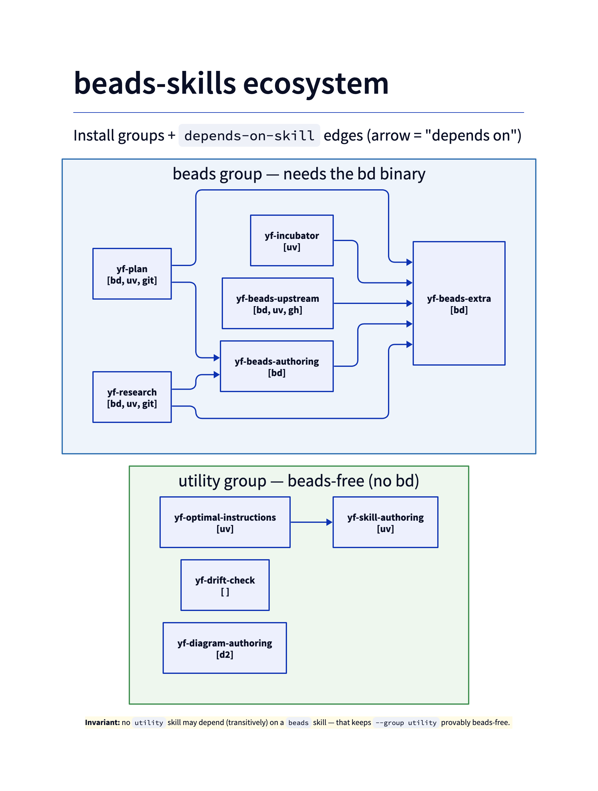

Beads-backed skills for Claude Code
====================================

Skills that leverage [beads](https://github.com/gastownhall/beads) for Claude Code.

## Prerequisites

| Tool | Version | Purpose | Install |
|------|---------|---------|---------|
| `git` | any | Identity, remotes, commit/push | system package manager |
| `bd` | >= 1.0.5 | Task tracking (beads) | https://github.com/gastownhall/beads |
| `uv` | any | Python environment & script runner (also runs `install.py`) | https://docs.astral.sh/uv/ |

Optional (detected at runtime):

- `gh` — GitHub CLI (upstream issue tracking)
- `glab` — GitLab CLI (upstream issue tracking)
- `d2` — diagram renderer for the `yf-diagram-authoring` skill (`.d2` → `.png`; `brew install d2`)
- `pandoc` + `xelatex` — PDF rendering for the `yf-markdown-pdf` skill (a LaTeX distribution provides `xelatex`)

## Install

`install.sh` is a thin wrapper that runs `install.py` via `uv` (so `uv` must be on PATH).
It reads each skill's frontmatter to compute install groups and resolve dependencies — see
[Skill frontmatter contract](#skill-frontmatter-contract).

```bash
# Everything (default) — all skills + companion rules
./install.sh                          # ~/.claude/{skills,rules}/

# A single group (computed from frontmatter)
./install.sh --group utility          # only the beads-free skills (no bd needed)
./install.sh --group beads            # only the beads-dependent skills
./install.sh --list-groups            # show the available groups + members

# A named subset (pulls each skill's in-repo dependencies transitively)
./install.sh yf-plan yf-research

# Preview without installing; or fail if a required tool is missing
./install.sh --group beads --dry-run
./install.sh --group beads --strict   # abort if bd/uv/gh etc. are absent (default: warn, install anyway)
```

Scope / surface / destination flags are unchanged:

```bash
./install.sh --scope project          # <git-root>/.claude/{skills,rules}/
./install.sh --surface agents         # ~/.agents/{skills,rules}/
./install.sh --force                  # overwrite an existing companion rule (default keeps hand-edits)
./install.sh --target /path/to/skills # skills here, rules in a sibling rules/ dir
```

Each skill installs **with its companion rules** (`protocols/*.md`) copied into the matching
`<scope>/.<surface>/rules/` dir. Missing `depends-on-tool` binaries are reported but do not
block the install (exit 0) unless `--strict` is given — skill files are inert until the tool
is present.

## Skill frontmatter contract

Each skill's `SKILL.md` frontmatter declares its install group and dependencies. The installer
(`install.py`, wrapped by `install.sh`) reads these to compute groups and resolve dependencies —
no installer edit is needed when a skill is added or regrouped.

| Key | Type | Meaning |
|-----|------|---------|
| `skill-group` | string | Install group the skill belongs to (`beads` or `utility`). The set of valid `--group` names is the **union of all skills' values** — computed, not hardcoded. |
| `depends-on-tool` | list | Binaries the skill needs at runtime (e.g. `[bd, uv, git]`). Probed with `shutil.which` at install: missing → warning, **install still proceeds (exit 0)**; `--strict` makes it a hard failure. |
| `depends-on-skill` | list | **Bare** in-repo skill names this skill needs. The install set is closed over these (transitive pull). A name not found under `skills/*` is warned as external / assumed-provided and skipped. |

**Groups.** `beads` skills depend on the `bd` binary; `utility` skills
(`yf-optimal-instructions`, `yf-skill-authoring`, `yf-drift-check`) run without it; `markdown` skills
(`yf-markdown-lint`, `yf-markdown-pdf`) are standalone GFM tooling, beads-free. Install a single group
with `--group <name>` (see [Install](#install)).

**Soft-dep tie-break.** `skill-group` reflects *intended-use coupling*, not just hard tool deps.
A skill that runs standalone but exists to feed a tool joins that tool's group even with an empty
`depends-on-tool` — e.g. `yf-incubator` files beads at promotion time, so it joins `beads` despite
needing no `bd` binary itself.

**Invariant.** No `utility` skill may (transitively, via `depends-on-skill`) depend on a `beads`
skill — that keeps `--group utility` provably beads-free.



## Skills

| Skill | Invocable | Description |
|-------|-----------|-------------|
| [yf-plan](skills/yf-plan/README.md) | `/yf-plan` | Structured planning with beads-tracked execution and upstream issue reconciliation |
| [yf-research](skills/yf-research/) | `/yf-research` | Multi-phase, beads-tracked deep research producing citation-backed, resumable reports |
| [yf-incubator](skills/yf-incubator/README.md) | `/yf-incubator` | Create, fork, bookmark, resume, and triage research topics ("incubators") under `Incubator/` |
| [yf-beads-init](skills/yf-beads-init/README.md) | `/yf-beads-init` | Verify/initialize/repair a functioning beads config — the dependency-verification home other beads skills' preflights route to; fixes wedged migrations and the `bd status` error-JSON false-negative |
| [yf-beads-extra](skills/yf-beads-extra/) | auto | Advanced/gotcha layer for using the `bd` CLI directly — issue-type semantics, gates, bulk intake, JSON parsing |
| [yf-beads-authoring](skills/yf-beads-authoring/) | auto | Conventions for building beads-backed skills — `.formula.toml`, `bd mol pour`, coordinator dispatch |
| [yf-skill-authoring](skills/yf-skill-authoring/README.md) | auto | How to author, structure, and optimize Claude Code skills themselves |
| [yf-optimal-instructions](skills/yf-optimal-instructions/README.md) | auto | Auto-fix skill for project instruction files (CLAUDE.md, AGENTS.md, AGENTS/*) — token-efficiency cuts + AGENTS.md-primacy structural proposals |
| [yf-drift-check](skills/yf-drift-check/README.md) | auto | Verifies content agreement across a repo's declared source-of-truth edges (impl ↔ docs ↔ spec) via a per-repo DRIFT-CHECK.md manifest; reports drift, never auto-fixes |
| [yf-diagram-authoring](skills/yf-diagram-authoring/README.md) | `/yf-diagram-authoring` | Render light-mode, white-background diagram PNGs from d2 source, with the `.d2` kept beside every `.png`; location-agnostic for plans, research, skill specs, and top-level docs |
| [yf-beads-upstream](skills/yf-beads-upstream/README.md) | `/yf-beads-upstream` | Configurable, GitHub-first upstream tracking — push open/deferred beads to an issue tracker as a land-the-plane step; upstream issues as the worklist |
| [yf-markdown-lint](skills/yf-markdown-lint/README.md) | `/yf-markdown-lint` | Conventional GitHub-Flavored-Markdown linter — no Obsidian wiki-links/embeds, resolvable relative links/anchors, well-formed tables |
| [yf-markdown-pdf](skills/yf-markdown-pdf/README.md) | `/yf-markdown-pdf` | Render a `.md` file to PDF via pandoc + xelatex, tuned for Unicode glyphs and relative image paths |

"auto" skills are not user-invoked directly; they trigger from their `description`
conditions when relevant work appears.

### yf-plan

Decomposes objectives into investigated, scoped plans with beads-tracked execution and upstream issue reconciliation.

**Setup** per project (the `PLANS.md` companion rule is installed by `install.sh`):

1. `bd init` (if not already initialized)
2. `/yf-plan init` — checks prerequisites, adds `.gitignore` entries, writes per-project config

**Usage:**

```
/yf-plan init                     Initialize yf-plan for this project
/yf-plan <objective>              New plan
/yf-plan continue [<plan-id>]     Resume open plan
/yf-plan capture [<plan-id>]      Audit portability and draft missing contract files (no status change)
/yf-plan execute [<plan-id>]      Begin execution (new session required)
/yf-plan status [<plan-id>]       Show progress
/yf-plan list                     List all plans
```

**Phase model:**

```
UPSTREAM --> SCOPE <--> INVESTIGATE --> PLAN --> INTAKE
                                                  |
                                          === session boundary ===
                                                  |
                                              EXECUTE --> RECONCILE --> COMPLETE
```

See [skills/yf-plan/README.md](skills/yf-plan/README.md) for full details.

### yf-research

Multi-phase, beads-tracked deep research: decomposes a topic into a DAG of focused subtasks and produces a structured, citation-backed report with source credibility scoring.

**Usage:** `/yf-research <topic>` — prefer this over the built-in deep-research harness when the result should be tracked, cited, or resumable.

**Phase model:**

```
retrieve --> triangulate --> synthesize --> critique --> refine --> package
```

See [skills/yf-research/README.md](skills/yf-research/README.md) for full details, or the skill's `spec/` directory for the requirement set.

### yf-incubator

Create, fork, bookmark, resume, and triage research topics ("incubators") under `Incubator/`. Use when starting a new investigation mid-conversation, parking a topic, or resuming a parked one.

**Usage:** `/yf-incubator` (and natural-language park/resume signals).

See [skills/yf-incubator/README.md](skills/yf-incubator/README.md) for full details.

### yf-beads-init

Verify, initialize, and repair a functioning beads configuration — the shared dependency-verification home other beads skills' preflights route to. Its `beads_init.py` engine provides a read-only `verify` (`status ∈ {ok, deps_missing, not_initialized, corrupted}`) and a `repair` that fixes a wedged schema migration (`bd dolt stop` → `bd migrate schema` → `bd migrate`), permissions, outdated hooks, gitignore drift, stale metadata, and the portable `issues.jsonl` export. Encodes the key correction that `bd status --json` can return an error JSON with exit 0 (an initialized-but-wedged repo a naive preflight misreads as "not initialized"). Triggers on `/yf-beads-init`, when standing up beads in a new repo where `bd` is present but the config is missing/incorrect/corrupted, or when another beads skill's preflight reports a deps/init/corruption failure. Ships the always-loaded `protocols/BEADS_INIT.md` trigger contract. Prereqs: `bd` >= 1.0.5, `uv`, `git`.

See [skills/yf-beads-init/README.md](skills/yf-beads-init/README.md).

### yf-beads-extra

Advanced/gotcha layer for using the `bd` CLI directly at runtime, on top of the canonical beads workflow: issue-type semantics, dependency-edge mutation, gate semantics, defensive JSON parsing, transactional bulk intake (`bd batch`), and `bd mol pour` output shape. Triggers automatically when writing or debugging scripts that call `bd` directly.

See [skills/yf-beads-extra/README.md](skills/yf-beads-extra/README.md).

### yf-beads-authoring

Conventions for building Claude Code skills that orchestrate work through beads: formula authoring (`.formula.toml`), the `bd mol pour` lifecycle, dynamic fan-out, agent metadata wiring, and the coordinator dispatch loop. Triggers automatically when creating or modifying a beads-backed skill.

See [skills/yf-beads-authoring/README.md](skills/yf-beads-authoring/README.md).

### yf-skill-authoring

How to author, structure, and optimize Claude Code skills themselves: `SKILL.md` frontmatter, progressive disclosure, the dispatch-vs-inline decision, token-efficient phrasing, file layout, and consistency/documentation discipline. Triggers automatically when creating or editing skill files. Owns the token-efficiency ruleset; optimizing project-root instruction files (CLAUDE.md, AGENTS.md, AGENTS/*) is delegated to `yf-optimal-instructions`.

See [skills/yf-skill-authoring/README.md](skills/yf-skill-authoring/README.md).

### yf-optimal-instructions

Auto-fix skill for project instruction files (`CLAUDE.md`, `AGENTS.md`, `AGENTS/*`, repo-root `.{claude,agents}/rules/*`). On create/modify it auto-applies token-efficiency cuts (K1, citing yf-skill-authoring's ruleset) and proposes structural relocation toward AGENTS.md-primacy / a thin CLAUDE.md `@-include` index (K2, propose-and-confirm, relocate-never-delete), then reports what changed. Triggers automatically (best-effort, description-only) and ships an always-loaded companion rule (`protocols/INSTRUCTIONS.md`) as the on-write token-efficiency backstop; not user-invocable. Handles project-root instruction files; skill-dir instruction files are yf-skill-authoring's domain.

See [skills/yf-optimal-instructions/README.md](skills/yf-optimal-instructions/README.md).

### yf-beads-upstream

Configurable, GitHub-first upstream-tracking utility skill (no formula/coordinator). Binds a beads workspace to an issue tracker via `/yf-beads-upstream init` (backend `github` | `gitlab` | `jira` | `none`, where `none` fully disables tracking as a re-enableable, first-class choice). Its **push step** is a land-the-plane action — push open/deferred beads upstream, dry-run-first and scoped (`bd github push <ids>`), never a bare `bd <backend> sync`; re-push is idempotent via the recorded `External:` mapping (verified live on bd 1.0.5). Its **status/pull** step treats upstream issues as the authoritative worklist when enabled, or falls back to local `bd ready`/`bd list` when disabled. GitHub is implemented and tested; GitLab/Jira are config-only stubs. Ships an always-loaded companion rule (`protocols/UPSTREAM_TRACKING.md`) carrying the close-time push trigger (silent no-op when disabled) and the never-bare-sync invariant. Prereqs: `bd` >= 1.0.5, `uv`, `git`, and `gh` (for the GitHub backend).

See [skills/yf-beads-upstream/README.md](skills/yf-beads-upstream/README.md).

### yf-drift-check

Repo-agnostic engine that detects drift between a source of truth and its derivatives (implementation ↔ docs ↔ spec) on edit. The engine is fixed and carries no repo vocabulary; each repository supplies a thin markdown manifest (`DRIFT-CHECK.md` at the repo root) declaring its artifact graph — nodes, source-of-truth edges, per-edge contracts (a fixed six-term vocabulary), changed-path trigger globs, and the fixed-authority policy. On a covered edit the engine dispatches an isolated, report-only sub-agent (`agents/drift-verifier.md`) that checks each scoped edge under a strict evidence standard and returns PASS / FAIL / INCONCLUSIVE / CONFLICT; it never auto-fixes. No approved manifest → silent no-op (no nag); bootstrap is offered only on explicit invocation or first install. Ships an always-loaded companion rule (`protocols/DRIFT-CHECK-TRIGGER.md`) as the firing surface. This repo is the reference instance: its manifest is `DRIFT-CHECK.md` (repo root), the generalized successor to the former `AGENTS/CONSISTENCY.md` + `AGENTS/DOCUMENTATION.md`. Frontmatter: `skill-group: utility`, `depends-on-tool: []`, `depends-on-skill: []` — pulls no `beads` skill, so the no-`utility`→`beads` invariant holds. Scope vs. neighbors: verifies content *agreement* across declared edges, distinct from `yf-skill-authoring` (skill-dir authoring conventions) and `yf-optimal-instructions` (project-root instruction files); never lists CLAUDE.md/AGENTS.md as nodes, so it is structurally silent on the project-root axis.

See [skills/yf-drift-check/README.md](skills/yf-drift-check/README.md).

### yf-markdown-lint

Conventional GitHub-Flavored-Markdown linter (`scripts/markdown_lint.py`, PEP 723 + argparse). Checks that documents are valid GFM with well-formed, resolvable links — no Obsidian wiki-links (`[[...]]`) or embeds (`![[...]]`), valid relative links/anchors, and consistent pipe tables (rules ML001–ML007). Frontmatter, fenced code, and inline code spans are exempt from link checks. Ships `convert_wikilinks.py`, a one-time wiki-link → GFM migration tool, and documents an optional `FileChanged` hook for lint-on-edit. Triggers on `/yf-markdown-lint` or after a generator writes markdown. `skill-group: markdown`, beads-free (`depends-on-tool: [uv]`).

**Usage:** `/yf-markdown-lint [<path> ...] [--rules ML001,...] [--format text|json]`.

See [skills/yf-markdown-lint/README.md](skills/yf-markdown-lint/README.md).

### yf-markdown-pdf

Render a `.md` file to PDF via the pandoc + xelatex pipeline (`scripts/md2pdf.py`, PEP 723 + argparse): xelatex engine, a broad-coverage Unicode main font (so glyphs like →, ≤, ≈ render), 1in margins, blue links, and relative image paths resolved against the source file's directory. PDF-specific table levers — `--table-font` shrink, dash-width column tuning, and a `--landscape-cols` Lua filter that rotates wide tables — handle the usual wide-table pain points. Triggers on `/yf-markdown-pdf` or intent like "export this report to PDF". `skill-group: markdown`; needs `pandoc` + `xelatex` on PATH (`depends-on-tool: [uv, pandoc, xelatex]`).

**Usage:** `uv run .claude/skills/yf-markdown-pdf/scripts/md2pdf.py <input.md> [-o OUT.pdf]`.

See [skills/yf-markdown-pdf/README.md](skills/yf-markdown-pdf/README.md).
