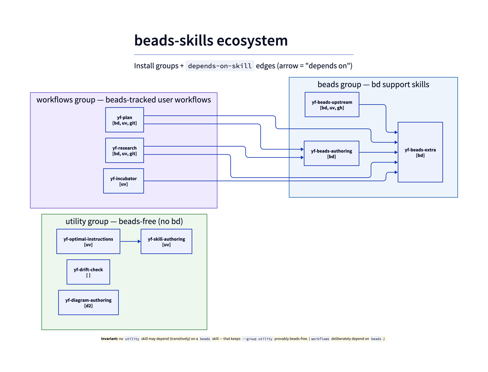

Yoshiko Flow (`yf`)
===================

[Yoshiko Flow](https://github.com/dixson3/yoshiko-flow) is a family of portable, cross-harness
agent **skills** plus a single compiled CLI, **`yf`**, that installs, upgrades, verifies, and
preflights those skills and the toolchain they depend on. The skills are built on
[beads](https://github.com/gastownhall/beads) (`bd`) for dependency-aware, multi-session work,
and install into either the `.claude` or `.agents` surface, at user or project scope.

## Prerequisites

`yf` is a single self-contained binary. **Installing it does not pull in `bd` or `uv`** —
the Homebrew formula does not declare them as dependencies, so
install those separately. `git` is assumed already present. The toolchain `yf` and the skills
rely on:

| Tool  | Version  | Purpose                                            | Install                                                     |
| :---- | :------- | :------------------------------------------------- | :---------------------------------------------------------- |
| `bd`  | >= 1.0.5 | Task tracking (beads)                              | `brew install beads` — https://github.com/gastownhall/beads |
| `uv`  | any      | Python env & script runner (skill helper scripts) | `brew install uv` — https://docs.astral.sh/uv/              |
| `git` | any      | Identity, remotes, commit/push                     | system package manager                                      |

Optional (detected at runtime):

- `gh` / `glab` — GitHub / GitLab CLI (upstream issue tracking)
- `d2` — diagram renderer for the `yf-diagram-authoring` skill (`.d2` → `.png`; `brew install d2`)
- `pandoc` + `xelatex` — PDF rendering for the `yf-markdown-pdf` skill (a LaTeX distribution provides `xelatex`)
- `pandoc` — HTML rendering for the `yf-markdown-html` skill (no `xelatex` needed)
- `herdr` — terminal multiplexer for coding agents, required by the `yf-herdr` skill (which is inert without it) — https://github.com/dixson3/herdr

## Install

**Recommended: the `curl | sh` vendor installer.** Downloads a prebuilt `yf` to
`~/.local/bin`, adds that dir to `PATH`, and writes an install receipt under `~/.config/yf` —
the uv-style self-contained model — served from the project's own domain,
[yoshikoflow.sh](https://yoshikoflow.sh):

```bash
curl --proto '=https' --tlsv1.2 -LsSf https://yoshikoflow.sh/install.sh | sh
```

The hosted `install.sh` is a byte-for-byte mirror of cargo-dist's `yf-installer.sh` from a
pinned GitHub release; **GitHub Releases stays canonical** for every binary and for
self-update. This does not install `bd` / `uv` — see [Prerequisites](#prerequisites).

`yf` then manages **itself** (distinct from `yf skills upgrade`, which manages the embedded
skills):

```bash
yf self update            # check GitHub Releases + swap the binary in place (vendor installs)
yf self update --check    # report whether a newer release exists; do not swap
yf self uninstall         # remove the binary + yf-owned dirs (installed skills untouched)
```

`yf version` / `yf doctor` print a throttled, vendor-only nudge when a newer release exists
(silence it with `YF_NO_UPDATE_CHECK=1`). `yf self update` deliberately **refuses** on a
Homebrew (Cellar) copy and points you back to `brew upgrade`.

**Alternative: the Homebrew tap.** Installs a working `yf` from the tap; upgrade with
`brew upgrade` (a Homebrew copy does not self-update via `yf self update`):

```bash
brew install dixson3/tap/yf
```

This does not install `bd` / `uv` either — see [Prerequisites](#prerequisites).

**Developing on this repo?** Promote your local build to `~/.local/bin` instead of a release:

```bash
yf self install --from-build                   # copy target/release/yf → ~/.local/bin/yf
yf self install --from-build --debug --build   # build the debug profile first, then promote
```

A from-build install suppresses the upgrade nudge; `yf self update --force` round-trips back to
a vendor release.

### Deploy the skills

The canonical form is **`yf harness skills <verb>`**. The bare `yf skills <verb>` still works
and behaves identically, but it is a **deprecated alias** kept until the next major release and
it prints a notice.

```bash
yf harness skills install                       # all skills → the detected harness(es)
yf harness skills install --harness pi          # one named harness
yf harness skills install --harness claude-code --harness codex   # repeatable
yf harness skills install --group workflows     # yf-plan/research/incubator + the beads skills they need
yf harness skills install --group beads         # only the beads support skills (yf-beads-*)
yf harness skills install --scope project       # <git-root>/… instead of ~/…
yf harness skills install --dry-run             # preview without writing
yf doctor                                       # verify the toolchain + skill-install health
```

#### The five harnesses

`yf` installs to a **descriptor table**, so every harness resolves from one source of truth —
which is also what `yf skill-dir <name>` reads, so a skill and the tooling that finds it can
never disagree.

| `--harness` | user scope | project scope | notes |
| :-- | :-- | :-- | :-- |
| `claude-code` | `~/.claude/skills` | `<git-root>/.claude/skills` | rules land in the sibling `rules/` dir |
| `codex` | `~/.agents/skills` | `<git-root>/.agents/skills` | rules go into `AGENTS.md` as a managed block |
| `opencode` | `~/.config/opencode/skills` | `<git-root>/.opencode/skills` | reads `opencode.jsonc` **ahead of** `opencode.json` |
| `pi` | `~/.pi/agent/skills` | `<git-root>/.pi/skills` | applies a lowercase-hyphen name transform; **config tuning is deferred** — `--harness pi` tunes rules and skills only |
| `agents` | `~/.agents/skills` | `<git-root>/.agents/skills` | shares codex's path deliberately |

`codex` and `agents` resolve to the **same** directory. That is intentional, not a duplicate row.

With **no** `--harness`, install targets every auto-detected harness. `--surface claude|agents`
is retained as a **deprecated alias** for `--harness` (`claude`→`claude-code`,
`agents`→`agents`).

#### Finding an installed skill

```bash
yf skill-dir yf-plan     # prints the absolute path; 0 resolved, 1 not installed, 2 could not look
```

This is what shipped skills use to locate their own scripts, and it searches **every** harness
destination above. The exit code is three-valued on purpose: `1` and `2` are different facts, and
a caller that collapses them cannot tell "not installed" from "could not look".

`yf harness skills install` selectors: `--group <name>` (group computed from `skill-group`
frontmatter), `--scope user|project`, repeatable `--harness {claude-code,codex,opencode,pi,agents}`,
`--target <path>`,
`--strict` (abort if a required tool is missing; default warns and installs anyway),
`--dry-run`, `--tune` (also align config + deploy rules for the acted-on harnesses — an
**opt-in bridge**; install and tune stay separable), and `--prune` (remove deployed files no
longer in the embedded tree — **opt-in on `install`**, default-on for `upgrade`;
`--dry-run --prune` reports the exact per-destination set first). `--force` no longer affects the companion ruleset — the aggregated `YOSHIKO_FLOW.md` is a
fully `yf`-managed artifact whose sections are always regenerated to the embedded source, so it is
inert on the rule axis. *(One narrow exception to "no hand-edit tolerance": `yf harness tune
--revert` is **conservative-keep** — if you hand-edited the aggregate, revert keeps the file and
reports the mismatch rather than deleting it.)*
A named subset (`yf skills install yf-plan yf-research`) pulls each skill's in-repo
dependencies transitively.

### Files and directories (XDG)

`yf` resolves its own directories via the XDG layout on **both** Linux and macOS (not macOS's
`~/Library`), honoring `XDG_*` overrides:

| Path                  | Contents                                                       |
| :-------------------- | :------------------------------------------------------------- |
| `~/.local/bin/yf`     | the binary (the vendor install target)                         |
| `~/.config/yf/`       | install receipt (`yf-receipt.json`) + the from-build marker    |
| `~/.cache/yf/`        | the update-check throttle cache (`update-check.json`)          |
| `~/.local/share/yf/`  | reserved for future on-disk content (planned)                  |

Environment overrides: `XDG_CONFIG_HOME` / `XDG_CACHE_HOME` / `XDG_DATA_HOME` / `XDG_BIN_HOME`
relocate the respective dirs; `YF_NO_UPDATE_CHECK=1` silences the upgrade nudge; `YF_VERSION`
overrides the version `yf self update` compares against (useful for testing).

**macOS note:** binaries installed by `curl | sh` or `yf self update` are **not** quarantined.
Only a release archive downloaded **through a browser** is quarantined by Gatekeeper — clear it
with `xattr -d com.apple.quarantine ~/.local/bin/yf`.

Each skill installs **with its companion rules** (`protocols/*.md`), surfaced into the matching
`<scope>/.<surface>/rules/` dir as a **single aggregated `YOSHIKO_FLOW.md`** — one
HTML-comment-fenced, hash-bearing section per protocol, ordered alphabetically and headed by a
`managed by yf` banner — rather than a scatter of standalone `*.md` rule files. Any pre-existing
standalone `yf`-owned rule file is folded into `YOSHIKO_FLOW.md` and removed on the next
**`yf harness tune`** write; non-`yf` rule files (e.g. `BEADS.md` from `bd init`) are never
touched. **`yf harness tune` is the aggregate's sole writer** — neither `skills install` nor
`skills upgrade` writes it, so a guard or managed block that `tune` places cannot be clobbered by
a second writer. `yf skills remove` is the one deliberate exception: it drops the named skills'
sections and deletes `YOSHIKO_FLOW.md` once its last section is gone, because reconcile-prune keys
on the *embedded* set and nothing else would ever drop a removed skill's section. Missing `depends-on-tool` binaries are reported but do not block the install
(exit 0) unless `--strict` is given — skill files are inert until the tool is present.

## Operating & health

After install, the `yf` CLI is the single front door for skill health:

```bash
yf doctor                        # toolchain + per-skill install health, all in one report
yf skills status                 # installed / up-to-date / complete, per skill (--json for machines)
yf skills upgrade                # bring installed skills up to the embedded version
yf preflight <skill>             # a single skill's readiness check (e.g. yf preflight plan)
```

`yf preflight <skill>` is the per-skill readiness gate the beads skills run before they do
work — it probes system deps + min `bd` version, verifies the companion rule against the
embedded manifest, **checks** the beads config, and ensures the gitignore scaffold.

**Preflight does not repair the beads config.** It is **read-only** on that axis: it reports a
`bd_not_initialized` (or corrupted) verdict and routes you to `/yf-beads-init`, which owns the
repair sequence. Repair is **opt-in** and explicit — `yf doctor --repair` is the flag that
applies it. An earlier version of this section said preflight "checks/repairs", which described
a write that never happens and would have been the wrong default besides: a readiness probe that
silently mutates a repository's beads state is not a probe. Its `--json` output is the machine-readable verdict (a
`status` enum; parse the field, not the exit code). See
[docs/yf/preflight-contract.md](docs/yf/preflight-contract.md) for the full contract.

Several skill contracts assume you have turned off competing Claude Code built-ins
(native workflows, the TodoWrite task feature, native memory). See
[Claude Code Optimization](#claude-code-optimization) below for the recommended
`settings.json` changes and [docs/recommended-settings.md](docs/recommended-settings.md)
for the full per-key rationale.

Per-skill runtime state lives under `.yf/<skill>/` and operator config under
`.yf-<skill>.local.json`. If you are coming from the pre-`yf` skills (`bdplan`/`bdresearch`
and the `.state/` layout), run `yf migrate` once — it idempotently moves legacy state/config
into the `.yf/` layout. See [docs/MIGRATION.md](docs/MIGRATION.md) for the one-time rename
guide (skill names, `/commands`, `.gitignore` anchors).

## Claude Code Optimization

The `yf-*` skills run more efficiently when Claude Code's competing native
mechanisms are turned off. Every unused native tool still costs **context /
tool-schema budget on every turn**, and the always-loaded rule prose that *forbids*
those mechanisms (native plan mode, workflows, TodoWrite, native memory) only steers
the model — it does not stop paying to keep their schemas loaded. Disabling them at
the `settings.json` level reclaims that budget, keeps state local/portable, and lets
long autonomous runs proceed without prompt interruptions.

The highest-leverage lever is the `permissions` block:

```jsonc
{
  "permissions": {
    "defaultMode": "bypassPermissions",   // trusted local dev — a real tradeoff, see the doc
    "deny": [
      // Safety guards (call-time block only; operator-tunable):
      "Bash(rm -rf /)", "Bash(rm -rf /*)", "Bash(rm -rf ~)", "Bash(rm -rf ~/*)",
      "Bash(rm -rf $HOME)", "Bash(rm -rf $HOME/*)", "Bash(sudo rm -rf *)",
      // Tool disables (bare names → schema removed from context; Agent stays enabled):
      "EnterPlanMode", "ExitPlanMode", "EnterWorktree", "ExitWorktree",
      "TaskCreate", "TaskGet", "TaskList", "TaskOutput", "TaskUpdate",
      "DesignSync", "NotebookEdit", "SendMessage", "PushNotification",
      "RemoteTrigger", "ReportFindings", "ScheduleWakeup",
      "CronCreate", "CronDelete", "CronList"
    ]
  }
}
```

Plus a handful of flag keys — highest-leverage first:

- `disableWorkflows: true`, `todoFeatureEnabled: false` — `bd` (beads) and the
  `Agent` tool are the only task/dispatch surfaces; native workflows and TodoWrite
  are forbidden by every skill contract.
- `autoMemoryEnabled: false`, `autoDreamEnabled: false`, `autoUploadSessions: false`,
  `disableClaudeAiConnectors: true` — keep yf state cross-harness and off
  Anthropic's servers.
- `disableBundledSkills: true` — stop bundled skills from shadowing the
  description-triggered `yf-*` skills.
- `inputNeededNotifEnabled: false`, `agentPushNotifEnabled: false` — less
  notification noise on long runs.

Two are genuine tradeoffs, not free wins: `defaultMode: bypassPermissions` (pair it
with `skipDangerousModePermissionPrompt: true`) removes the per-call human guard,
and `askUserQuestionTimeout: "never"` **blocks** a run for a human rather than
auto-answering. See [docs/recommended-settings.md](docs/recommended-settings.md) for
the full per-key rationale, the bare-name-vs-scoped mechanism split, the boolean
correction, and why the `Agent` tool must stay enabled.

## Skill frontmatter contract

Each skill's `SKILL.md` frontmatter declares its install group and dependencies. `yf skills install`
reads these to compute groups and resolve dependencies — no installer edit is needed when a skill is
added or regrouped.

| Key | Type | Meaning |
|:----|:-----|:--------|
| `skill-group` | string | Install group the skill belongs to (`workflows`, `beads`, `utility`, or `markdown`). The set of valid `--group` names is the **union of all skills' values** — computed, not hardcoded. |
| `depends-on-tool` | list | Binaries the skill needs at runtime (e.g. `[bd, uv, git]`). Probed on `PATH` at install: missing → warning, **install still proceeds (exit 0)**; `--strict` makes it a hard failure. |
| `depends-on-skill` | list | **Bare** in-repo skill names this skill needs. The install set is closed over these (transitive pull). A name not found under `skills/*` is warned as external / assumed-provided and skipped. |

**Groups.** `workflows` are the end-to-end, beads-tracked skills you invoke to get work done
(`yf-plan`, `yf-research`, `yf-incubator`); `beads` are the `bd` support skills the workflows build
on (`yf-beads-init`, `-extra`, `-authoring`, `-hygiene`, `-upstream`); `utility` skills
(`yf-optimal-instructions`, `yf-skill-authoring`, `yf-drift-check`, …) run without `bd`; `markdown`
skills (`yf-markdown-lint`, `yf-markdown-pdf`, `yf-markdown-html`, `yf-markdown-format`) are
standalone GFM tooling, beads-free (`yf-markdown-pdf` needs `pandoc` + `xelatex`, `yf-markdown-html`
needs `pandoc`, `yf-markdown-lint` / `yf-markdown-format` are stdlib-only). Install a single group
with `--group <name>`; the install closes over the group's `depends-on-skill` closure, so
`--group workflows` pulls in the `beads` skills its members need (see [Install](#install)).

**Soft-dep tie-break.** `skill-group` reflects *intended-use coupling*, not just hard tool deps.
`yf-incubator` needs no `bd` binary itself but files beads at promotion time and is a user-facing
workflow, so it joins `workflows` (which depends on `beads` via `depends-on-skill`).

**Invariant.** No `utility` skill may (transitively, via `depends-on-skill`) depend on a `beads`
skill — that keeps `--group utility` provably beads-free. (`workflows` deliberately *do* depend on
`beads`.)



## Skills

| Skill | Invocable | Description |
|:------|:----------|:------------|
| [yf-plan](skills/yf-plan/README.md) | `/yf-plan` | Structured planning with beads-tracked execution and upstream issue reconciliation |
| [yf-research](skills/yf-research/) | `/yf-research` | Multi-phase, beads-tracked deep research producing citation-backed, resumable reports |
| [yf-incubator](skills/yf-incubator/README.md) | `/yf-incubator` | Create, fork, bookmark, resume, and triage research topics ("incubators") under `Incubator/` |
| [yf-beads-init](skills/yf-beads-init/README.md) | `/yf-beads-init` | Verify/initialize/repair a functioning beads config — the dependency-verification home other beads skills' preflights route to; fixes wedged migrations and the `bd status` error-JSON false-negative |
| [yf-beads-extra](skills/yf-beads-extra/) | auto | Advanced/gotcha layer for using the `bd` CLI directly — issue-type semantics, gates, bulk intake, JSON parsing |
| [yf-beads-authoring](skills/yf-beads-authoring/) | auto | Conventions for building beads-backed skills — `.formula.toml`, `bd mol pour`, coordinator dispatch |
| [yf-beads-hygiene](skills/yf-beads-hygiene/README.md) | `/yf-beads-hygiene` | Safe, read-only-first audit and gated repair of a beads dependency graph — finds orphaned beads and dangling edges without mistaking a live gate for one |
| [yf-okf](skills/yf-okf/README.md) | `/yf-okf` | Constructs and conformance-checks the OKF artifact bundles the yf workflow skills emit, and owns the versioned OKF-\* spec family |
| [yf-skill-authoring](skills/yf-skill-authoring/README.md) | auto | How to author, structure, and optimize Claude Code skills themselves |
| [yf-optimal-instructions](skills/yf-optimal-instructions/README.md) | auto | Auto-fix skill for project instruction files (CLAUDE.md, AGENTS.md, AGENTS/*) — token-efficiency cuts + AGENTS.md-primacy structural proposals |
| [yf-drift-check](skills/yf-drift-check/README.md) | auto | Verifies content agreement across a repo's declared source-of-truth edges (impl ↔ docs ↔ spec) via a per-repo DRIFT-CHECK.md manifest; reports drift, never auto-fixes |
| [yf-change-validation](skills/yf-change-validation/README.md) | `/yf-change-validation` | Per-repo change-set validation engine — runs a repo's recorded validation recipe over a merged tree, manifest-driven, self-maintaining |
| [yf-diagram-authoring](skills/yf-diagram-authoring/README.md) | `/yf-diagram-authoring` | Render light-mode, white-background diagram PNGs from d2 source, with the `.d2` kept beside every `.png`; location-agnostic for plans, research, skill specs, and top-level docs |
| [yf-herdr](skills/yf-herdr/README.md) | `/yf-herdr` | Delegate an approved `yf-plan` or gated `yf-research` project to a new herdr tab running a fresh session of the same agent kind, then observe that subordinate and mine its deviations for planning-process defects |
| [yf-beads-upstream](skills/yf-beads-upstream/README.md) | `/yf-beads-upstream` | Configurable, GitHub-first upstream tracking — push open/deferred beads to an issue tracker as a land-the-plane step; upstream issues as the worklist |
| [yf-markdown-lint](skills/yf-markdown-lint/README.md) | `/yf-markdown-lint` | Conventional GitHub-Flavored-Markdown linter — no Obsidian wiki-links/embeds, resolvable relative links/anchors, well-formed tables |
| [yf-markdown-pdf](skills/yf-markdown-pdf/README.md) | `/yf-markdown-pdf` | Render a `.md` file to PDF via pandoc + xelatex, tuned for Unicode glyphs and relative image paths |
| [yf-markdown-html](skills/yf-markdown-html/README.md) | `/yf-markdown-html` | Render a `.md` file to a single, self-contained HTML file via pandoc — embedded resources, default stylesheet, self-contained math |
| [yf-markdown-format](skills/yf-markdown-format/README.md) | `/yf-markdown-format` | The autofix side of `yf-markdown-lint` — rewrites Markdown in place to plain GFM: strict table alignment and Obsidian → GFM wiki-link migration |

"auto" skills are not user-invoked directly; they trigger from their `description`
conditions when relevant work appears.

### yf-plan

Decomposes objectives into investigated, scoped plans with beads-tracked execution and upstream issue reconciliation.

**Setup** per project (the `PLANS.md` companion rule is installed by `yf skills install`):

1. `bd init` (if not already initialized)
2. `/yf-plan init` — checks prerequisites, adds `.gitignore` entries, writes per-project config

**Usage:**

```
/yf-plan init                     Initialize yf-plan for this project
/yf-plan <objective>              New plan
/yf-plan continue [<plan-id>]     Resume open plan
/yf-plan capture [<plan-id>]      Audit portability and draft missing contract files (no status change)
/yf-plan execute [<plan-id>]      Begin execution (new session required)
/yf-plan status [<plan-id>]       Show progress
/yf-plan list                     List all plans
```

**Phase model:**

```
UPSTREAM --> SCOPE <--> INVESTIGATE --> PLAN --> INTAKE
                                                  |
                                          === session boundary ===
                                                  |
                                              EXECUTE --> RECONCILE --> COMPLETE
```

See [skills/yf-plan/README.md](skills/yf-plan/README.md) for full details.

### yf-research

Multi-phase, beads-tracked deep research: decomposes a topic into a DAG of focused subtasks and produces a structured, citation-backed report with source credibility scoring.

**Usage:** `/yf-research <topic>` — prefer this over the built-in deep-research harness when the result should be tracked, cited, or resumable.

**Phase model:**

```
retrieve --> triangulate --> synthesize --> critique --> refine --> package
```

See [skills/yf-research/README.md](skills/yf-research/README.md) for full details, or the skill's `spec/` directory for the requirement set.

### yf-incubator

Create, fork, bookmark, resume, and triage research topics ("incubators") under `Incubator/`. Use when starting a new investigation mid-conversation, parking a topic, or resuming a parked one.

**Usage:** `/yf-incubator` (and natural-language park/resume signals).

See [skills/yf-incubator/README.md](skills/yf-incubator/README.md) for full details.

### yf-beads-init

Verify, initialize, and repair a functioning beads configuration — the shared dependency-verification home other beads skills' preflights route to. Its `beads_init.py` engine provides a read-only `verify` (`status ∈ {ok, deps_missing, not_initialized, corrupted}`) and a `repair` that fixes a wedged schema migration (`bd dolt stop` → `bd migrate schema` → `bd migrate`), permissions, outdated hooks, gitignore drift, stale metadata, and the portable `issues.jsonl` export. Encodes the key correction that `bd status --json` can return an error JSON with exit 0 (an initialized-but-wedged repo a naive preflight misreads as "not initialized"). Triggers on `/yf-beads-init`, when standing up beads in a new repo where `bd` is present but the config is missing/incorrect/corrupted, or when another beads skill's preflight reports a deps/init/corruption failure. Ships the always-loaded `protocols/BEADS_INIT.md` trigger contract. Prereqs: `bd` >= 1.0.5, `uv`, `git`.

See [skills/yf-beads-init/README.md](skills/yf-beads-init/README.md).

### yf-beads-extra

Advanced/gotcha layer for using the `bd` CLI directly at runtime, on top of the canonical beads workflow: issue-type semantics, dependency-edge mutation, gate semantics, defensive JSON parsing, transactional bulk intake (`bd batch`), and `bd mol pour` output shape. Triggers automatically when writing or debugging scripts that call `bd` directly.

See [skills/yf-beads-extra/README.md](skills/yf-beads-extra/README.md).

### yf-beads-authoring

Conventions for building Claude Code skills that orchestrate work through beads: formula authoring (`.formula.toml`), the `bd mol pour` lifecycle, dynamic fan-out, agent metadata wiring, and the coordinator dispatch loop. Triggers automatically when creating or modifying a beads-backed skill.

See [skills/yf-beads-authoring/README.md](skills/yf-beads-authoring/README.md).

### yf-skill-authoring

How to author, structure, and optimize Claude Code skills themselves: `SKILL.md` frontmatter, progressive disclosure, the dispatch-vs-inline decision, token-efficient phrasing, file layout, and consistency/documentation discipline. Triggers automatically when creating or editing skill files. Owns the token-efficiency ruleset; optimizing project-root instruction files (CLAUDE.md, AGENTS.md, AGENTS/*) is delegated to `yf-optimal-instructions`.

See [skills/yf-skill-authoring/README.md](skills/yf-skill-authoring/README.md).

### yf-optimal-instructions

Auto-fix skill for project instruction files (`CLAUDE.md`, `AGENTS.md`, `AGENTS/*`, repo-root `.{claude,agents}/rules/*`). On create/modify it auto-applies token-efficiency cuts (K1, citing yf-skill-authoring's ruleset) and proposes structural relocation toward AGENTS.md-primacy / a thin CLAUDE.md `@-include` index (K2, propose-and-confirm, relocate-never-delete), then reports what changed. Triggers automatically (best-effort, description-only) and ships an always-loaded companion rule (`protocols/INSTRUCTIONS.md`) as the on-write token-efficiency backstop; not user-invocable. Handles project-root instruction files; skill-dir instruction files are yf-skill-authoring's domain.

See [skills/yf-optimal-instructions/README.md](skills/yf-optimal-instructions/README.md).

### yf-beads-upstream

Configurable, GitHub-first upstream-tracking utility skill (no formula/coordinator). Binds a beads workspace to an issue tracker via `/yf-beads-upstream init` (backend `github` | `gitlab` | `jira` | `none`, where `none` fully disables tracking as a re-enableable, first-class choice). Its **push step** is a land-the-plane action — push open/deferred beads upstream, dry-run-first and scoped (`bd github push <ids>`), never a bare `bd <backend> sync`; re-push is idempotent via the recorded `External:` mapping (verified live on bd 1.0.5). Its **status/pull** step treats upstream issues as the authoritative worklist when enabled, or falls back to local `bd ready`/`bd list` when disabled. GitHub is implemented and tested; GitLab/Jira are config-only stubs. Ships an always-loaded companion rule (`protocols/UPSTREAM_TRACKING.md`) carrying the close-time push trigger (silent no-op when disabled) and the never-bare-sync invariant. Prereqs: `bd` >= 1.0.5, `uv`, `git`, and `gh` (for the GitHub backend).

See [skills/yf-beads-upstream/README.md](skills/yf-beads-upstream/README.md).

### yf-drift-check

Repo-agnostic engine that detects drift between a source of truth and its derivatives (implementation ↔ docs ↔ spec) on edit. The engine is fixed and carries no repo vocabulary; each repository supplies a thin markdown manifest (`DRIFT-CHECK.md` at the repo root) declaring its artifact graph — nodes, source-of-truth edges, per-edge contracts (a fixed six-term vocabulary), changed-path trigger globs, and the fixed-authority policy. On a covered edit the engine dispatches an isolated, report-only sub-agent (`agents/drift-verifier.md`) that checks each scoped edge under a strict evidence standard and returns PASS / FAIL / INCONCLUSIVE / CONFLICT; it never auto-fixes. No approved manifest → silent no-op (no nag); bootstrap is offered only on explicit invocation or first install. Ships an always-loaded companion rule (`protocols/DRIFT-CHECK-TRIGGER.md`) as the firing surface. This repo is the reference instance: its manifest is `DRIFT-CHECK.md` (repo root), the generalized successor to the former `AGENTS/CONSISTENCY.md` + `AGENTS/DOCUMENTATION.md`. Frontmatter: `skill-group: utility`, `depends-on-tool: []`, `depends-on-skill: []` — pulls no `beads` skill, so the no-`utility`→`beads` invariant holds. Scope vs. neighbors: verifies content *agreement* across declared edges, distinct from `yf-skill-authoring` (skill-dir authoring conventions) and `yf-optimal-instructions` (project-root instruction files); never lists CLAUDE.md/AGENTS.md as nodes, so it is structurally silent on the project-root axis.

See [skills/yf-drift-check/README.md](skills/yf-drift-check/README.md).

### yf-herdr

Delegates an **already-approved** `yf-plan` or **already-gated** `yf-research` project to a subordinate agent session in a new herdr tab, then observes that session on the operator's behalf and mines its deviations for defects in the *planning* workflow. It fires only when all four conditions hold: `HERDR_ENV=1`, `herdr` on `PATH`, a **mechanically verified** readiness assertion (for a plan: status `approved` **and** `resume-scan` reporting `stale_approved: false` — never inferred from conversation), and a **context-dirty** parent session (a fresh session executes in place, since it has no session boundary to cross). Failure of any condition produces an explanation, never a speculative tab. The subordinate runs the **same agent kind** as the parent, resolved at run time from `$HERDR_PANE_ID` against `herdr agent list`; at most one subordinate per target, because two sessions racing one bead DAG is a corruption hazard. Observation is **push-primary**: the subordinate pushes at epic completion, a blocker or failed gate, and plan completion or abort — never per bead, and never with `--wait`, which reintroduces lockstep. Polling is the fallback and is honest about its limits: the parent's own checks happen at **operator turn boundaries and on demand, never continuously**. It reads `blocked` before sending any prompt (a prompt to a blocked agent is swallowed by its dialog and lost), and never treats `idle`/`done` as completion without checking remaining beads. It never resolves a capability gate and never auto-files an issue — improvements are reported and filed only on explicit authorisation. Frontmatter: `skill-group: utility`, `depends-on-tool: [herdr, uv]`, and deliberately **no** `depends-on-skill`: `herdr` is a third-party skill this repo does not ship, so the relationship is a prose soft-dep (the `yf-plan` ↔ `yf-change-validation` pattern) rather than a force-install.

**Usage:** `/yf-herdr` (or "execute the plan" / "run it in a new session" with the four conditions met).

See [skills/yf-herdr/README.md](skills/yf-herdr/README.md).

### yf-change-validation

Repo-agnostic engine that runs a repo's **recorded validation recipe** (build / test / lint) over a change-set or merged tree and reports **PASS / FAIL / INCONCLUSIVE** plus the first failing command. Unlike `yf-drift-check` (prose + a read-only LLM sub-agent), this engine **executes** commands via a Python runner — the verdict is an exit code, not an LLM judgment. The engine is fixed and carries no repo vocabulary; each repository supplies a thin markdown manifest (`CHANGE-VALIDATION.md` at the repo root) — inferred from the toolchain, operator-approved, then re-proposed when the toolchain drifts. On a covered edit it runs the FAST tier; at pre-push / land-the-plane it runs the FULL tier. No approved manifest → silent no-op (no nag); never auto-fixes a failing command and never auto-rewrites the manifest. Frontmatter: `skill-group: utility`, `depends-on-tool: [uv]`, `depends-on-skill: []`. Scope vs. neighbor: proves a change-set is *behaviorally* valid by running commands, distinct from `yf-drift-check` (proves already-written artifacts *agree*); neither invokes the other.

**Usage:** `/yf-change-validation` (and the on-edit / pre-push triggers).

See [skills/yf-change-validation/README.md](skills/yf-change-validation/README.md).

### yf-markdown-lint

Conventional GitHub-Flavored-Markdown linter (`scripts/markdown_lint.py`, PEP 723 + argparse). Checks that documents are valid GFM with well-formed, resolvable links — no Obsidian wiki-links (`[[...]]`) or embeds (`![[...]]`), valid relative links/anchors, and consistent pipe tables (rules ML001–ML007). Frontmatter, fenced code, and inline code spans are exempt from link checks. Documents an optional `FileChanged` hook for lint-on-edit. Triggers on `/yf-markdown-lint` or after a generator writes markdown. `skill-group: markdown`, beads-free (`depends-on-tool: [uv]`).

**Usage:** `/yf-markdown-lint [<path> ...] [--rules ML001,...] [--format text|json]`.

See [skills/yf-markdown-lint/README.md](skills/yf-markdown-lint/README.md).

### yf-markdown-pdf

Render a `.md` file to PDF via the pandoc + xelatex pipeline (`scripts/md2pdf.py`, PEP 723 + argparse): xelatex engine, a broad-coverage Unicode main font (so glyphs like →, ≤, ≈ render), 1in margins, blue links, and relative image paths resolved against the source file's directory. PDF-specific table levers — `--table-font` shrink, dash-width column tuning, and a `--landscape-cols` Lua filter that rotates wide tables — handle the usual wide-table pain points. Triggers on `/yf-markdown-pdf` or intent like "export this report to PDF". `skill-group: markdown`; needs `pandoc` + `xelatex` on PATH (`depends-on-tool: [uv, pandoc, xelatex]`).

**Usage:** `uv run .claude/skills/yf-markdown-pdf/scripts/md2pdf.py <input.md> [-o OUT.pdf]`.

See [skills/yf-markdown-pdf/README.md](skills/yf-markdown-pdf/README.md).

### yf-markdown-html

Render a `.md` file to a single, self-contained HTML file via pandoc (`scripts/md2html.py`, PEP 723 + argparse): a standalone document with all resources embedded (images, CSS, fonts), a broad-coverage default stylesheet, relative image paths (``) resolved against the source file's directory, self-contained math (MathML, no CDN), and opt-in CriticMarkup rendering. No `xelatex` needed — that is `yf-markdown-pdf`. Triggers on `/yf-markdown-html` or intent like "export this report to HTML". `skill-group: markdown`; needs `pandoc` on PATH (`depends-on-tool: [uv, pandoc]`).

**Usage:** `uv run .claude/skills/yf-markdown-html/scripts/md2html.py <input.md> [-o OUT.html]`.

See [skills/yf-markdown-html/README.md](skills/yf-markdown-html/README.md).

### yf-markdown-format

The autofix side of `yf-markdown-lint` — rewrites Markdown in place to conform to plain GFM along the axes the linter flags. Owns two transforms: strict GFM **table alignment** (`scripts/md_table_align.py` — `--check` gate / `--write` idempotent autofix / bare stdout) and Obsidian → GFM **wiki-link migration** (`scripts/convert_wikilinks.py`, a one-time `[[…]]` → GFM migration tool with dry-run / in-place modes). Opt-in per repo — never an always-on autofix. Triggers on `/yf-markdown-format` or intent like "align these GFM tables" / "convert wiki-links to GFM". `skill-group: markdown`, beads-free and stdlib-only (`depends-on-tool: [uv]`).

**Usage:** `uv run .claude/skills/yf-markdown-format/scripts/md_table_align.py <input.md> --write`.

See [skills/yf-markdown-format/README.md](skills/yf-markdown-format/README.md).

## Contributing

Bugs in the `yf-*` skills are tracked in **this** repo (the fix lands here), even
when they surface inside a consuming project. See [CONTRIBUTING.md](CONTRIBUTING.md)
for where to file and what a good defect report includes.
