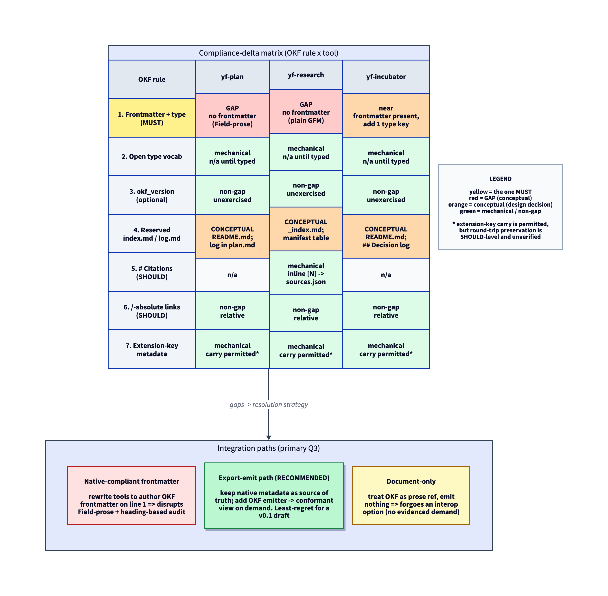

# OKF Compliance-Delta for yf-plan / yf-research / yf-incubator

**Research project:** 001-okf-compliance-delta · **Phase:** synthesize · **Date:** 2026-07-17

This report maps the compliance delta between what the `yf-plan`, `yf-research`, and `yf-incubator`
skills emit and what the Open Knowledge Format (OKF) v0.1 SPEC requires. Findings are drawn from the
triangulation artifact (27 sources across three clusters); citations link to [sources.md](sources.md).

## Executive summary

OKF's mandatory conformance surface is astonishingly small: every non-reserved `.md` file must carry
a parseable YAML frontmatter block, and that block must contain a non-empty `type` field. Everything
else — `resource`, `tags`, `timestamp`, `okf_version`, `# Citations`, `/`-absolute links — is
SHOULD-level [S1](sources.md#s1), [E14](sources.md#e14), [E3](sources.md#e3). Measured against that
bar, the three yf-* tools are close: **the only genuinely conceptual gaps are (1) yf-plan and
yf-research emit no YAML frontmatter at all, carrying metadata as bold `**Field:**` prose headers or
plain GFM, and (2) the reserved index filename diverges — `README.md` (yf-plan, yf-incubator) and
`_index.md` (yf-research) versus OKF's `index.md`** [L4](sources.md#l4), [L7](sources.md#l7),
[L1](sources.md#l1). Every other rule is mechanical (add a YAML key) or a non-gap (the feature is
optional and unexercised even in Google's own reference bundles). yf-incubator is closest to
conformance — it already emits frontmatter and needs only one added `type` key
[L8](sources.md#l8); yf-plan is furthest.

OKF's extension mechanism addresses the "does our metadata fit?" question favorably, though at
SHOULD-level force, not a guarantee: producers MAY add any keys, and consumers **SHOULD** preserve
them (a spec recommendation a conformant consumer may decline, not a hard requirement)
[S1](sources.md#s1). So plan ID, status, fingerprint, upstream dispositions, phase log, and review
passes *can* ride as producer-defined extension keys — `type` is the only newly-mandatory field —
but whether they survive a producer→consumer→producer round-trip depends on consumer good behavior
and is not demonstrated against any specific tool `[insufficient evidence]`. Combined with the low
hard-conformance bar, this still makes conformant frontmatter cheap to *produce*.

**Recommendation (primary Q3): the export-emit path, as a least-regret option for a v0.1 draft.**
Keep the tools' existing prose/table metadata model as the working source of truth, and add an OKF
*emitter* that lifts that metadata into a conformant frontmatter view on demand. This avoids
destabilizing `plan_manager.py`'s heading-based audit and the human-readable `**Field:**`
convention. The recommendation is *provisional*, contingent on three conditions that the evidence
leaves open: (i) SHOULD-level extension-key preservation being acceptable (round-trip fidelity is
spec-recommended, not guaranteed — items above); (ii) demand for OKF-conformant yf-* artifacts
actually materializing (no source establishes any consumer wanting these software-plan/research
folders as OKF bundles — see the demand caveat below) `[insufficient evidence]`; and (iii)
accepting the emitter's real build cost (a whole-bundle conformant tree, not just a `type` key —
see Q3 costs). It is the least-regret path given a v0.1 *draft* with no confirmed non-Google
production adopter yet [S1](sources.md#s1), [E1](sources.md#e1) — not a fidelity-guaranteed win.
Rationale detailed below.

## Compliance-delta table

| OKF rule | OKF requirement | yf-plan | yf-research | yf-incubator | Gap nature |
|:--|:--|:--|:--|:--|:-:|
| 1. Frontmatter + `type` (MUST) | YAML block + non-empty `type` [S1](sources.md#s1), [S3](sources.md#s3) | none — `**Field:**` prose [L4](sources.md#l4) | none — plain GFM [L6](sources.md#l6), [L7](sources.md#l7) | frontmatter present, no `type` key [L8](sources.md#l8) | mechanical |
| 2. Open `type` vocabulary | free-form title-case; no enum [S1](sources.md#s1) | n/a (no type) | n/a | n/a | mechanical |
| 3. `okf_version` (optional) | bundle-root `index.md` only; unexercised [S1](sources.md#s1), [S4](sources.md#s4), [S5](sources.md#s5) | absent [L4](sources.md#l4) | absent [L6](sources.md#l6) | absent [L8](sources.md#l8) | non-gap |
| 4. Reserved `index.md` / `log.md` | `index.md` listing + optional `log.md` [S1](sources.md#s1), [S4](sources.md#s4), [S5](sources.md#s5) | `README.md`; phase-log in plan.md [L1](sources.md#l1), [L4](sources.md#l4) | `_index.md`; manifest table [L5](sources.md#l5), [L7](sources.md#l7) | `README.md` / `INDEX.md`; `## Decision log` [L8](sources.md#l8) | conceptual (index) / non-gap (log) |
| 5. `# Citations` heading (SHOULD) | bottom `# Citations` list [S1](sources.md#s1), [S3](sources.md#s3) | n/a | inline `[N]`→sources.json [L5](sources.md#l5), [L6](sources.md#l6) | n/a | mechanical |
| 6. `/`-absolute links (SHOULD) | recommended, not required [S1](sources.md#s1), [S4](sources.md#s4) | relative; audit forbids dangling abs [L2](sources.md#l2), [L3](sources.md#l3) | relative | relative | non-gap |
| 7. Extension-key metadata | any keys; consumers SHOULD preserve on round-trip (recommendation, not MUST) [S1](sources.md#s1) | rich `**Field:**` metadata [L4](sources.md#l4) | sources.json scores | frontmatter keys [L8](sources.md#l8) | mechanical (carry permitted; round-trip unverified) |

*The matrix above (7 OKF rules × 3 yf-* tools) and the three integration paths of primary Q3, with
the recommended export-emit path highlighted. Full derivation in the sections below.*

## Primary questions

### Q1 — Exactly where do the tools diverge from OKF?

The divergences, rule by rule:

**Frontmatter + `type` (Rule 1, the only MUST).** OKF requires a YAML frontmatter block delimited by
`---` with a REQUIRED `type` field on every non-reserved `.md` file [S1](sources.md#s1), and a real
conformant concept doc carries it:

> "---\ntype: Reference\nresource: https://developers.google.com/analytics/bigquery/basic-queries\ntitle: Average Pageviews\n..." [S3](sources.md#s3)

Third-party validators converge on this as *the* enforceable check — okf-lint "reports errors when a
bundle violates a mandatory OKF conformance requirement (e.g. a concept document is missing its
`type` field)" [E4](sources.md#e4), corroborated by [E5](sources.md#e5), [E7](sources.md#e7). Against
that:

- **yf-plan** emits no frontmatter at all; metadata rides as bold `**Field:**` prose headers. Every
  file's first line is a `#` heading, confirmed against the real completed plan-028 folder
  [L4](sources.md#l4).
- **yf-research** emits no frontmatter; all artifacts are plain GFM with a `#`-heading `_index.md`
  template [L6](sources.md#l6), [L7](sources.md#l7).
- **yf-incubator** *has* YAML frontmatter but keyed `title/created/status/priority/last_reviewed` —
  **no `type` key** [L8](sources.md#l8).

**Reserved filenames (Rule 4).** OKF reserves `index.md` (directory listing) and `log.md` (update
history) at every level; a non-`index.md` file is treated as a *concept document* requiring `type`
frontmatter [S1](sources.md#s1). The tools' reserved index names collide semantically but differ
lexically: yf-plan and yf-incubator use `README.md`, yf-research uses `_index.md`
[L1](sources.md#l1), [L5](sources.md#l5), [L7](sources.md#l7), [L8](sources.md#l8). No tool emits a
`log.md`; each keeps its own log surface (yf-plan's in-`plan.md` `**Phase log:**`, yf-research's
`_index.md` manifest table, yf-incubator's `## Decision log`) [L4](sources.md#l4), [L7](sources.md#l7),
[L8](sources.md#l8).

**Citations (Rule 5).** OKF *recommends* (SHOULD) a bottom `# Citations` heading [S1](sources.md#s1).
yf-research instead uses inline `[N]` markers resolving to `sources.json` plus a `> "..." [N]` quote
convention — no `# Citations` heading [L5](sources.md#l5), [L6](sources.md#l6). yf-plan and
yf-incubator have no citation convention (n/a).

**Non-divergences.** `okf_version` (Rule 3) and `/`-absolute links (Rule 6) are optional and, per the
absence findings below, unexercised even in Google's own bundles [S4](sources.md#s4),
[S5](sources.md#s5) — so their absence in the yf-* tools is not a conformance failure. The Rule 6
non-gap rests on the OKF side alone: absolute links are SHOULD-level and unexercised even in
Google's reference `index.md`, which itself uses relative links [S4](sources.md#s4). The tool side
is *not* part of this justification: the exact link-emission syntax of shipped yf-* bundles is not
directly evidenced — the local cluster documents only the *audit's* link constraint
[L2](sources.md#l2), [L3](sources.md#l3), so no claim of tool link conformance is made
`[insufficient evidence]`.

### Q2 — Which gaps are mechanical vs conceptual?

**Conceptual (design decisions, not one-line edits):**

1. **No frontmatter in yf-plan / yf-research (Rule 1).** Introducing a YAML block is a genuine format
   change to tools that today put a `#` heading on line 1 [L4](sources.md#l4), [L7](sources.md#l7). It
   touches the human-readable `**Field:**` convention and the heading-based audit (see S2). Mechanical
   in *content* (the metadata already exists) but conceptual in *placement*.
2. **Reserved index filename (`README.md` / `_index.md` vs `index.md`) (Rule 4).** OKF treats any
   non-`index.md` file as a typed concept document, so the tools' index files would need either
   renaming to `index.md` (adopting OKF's frontmatter-free listing format) or acceptance as typed
   concept docs — a design decision [S1](sources.md#s1), [L1](sources.md#l1), [L5](sources.md#l5).

**Mechanical (add a key / a section) or non-gaps:**

- Adding `type` to yf-incubator: one key, since frontmatter already exists [L8](sources.md#l8).
- The open `type` vocabulary (Rule 2) imposes no obstacle — a producer picks free-form title-case
  strings like `Plan`, `Research Index`, `Incubator` [S1](sources.md#s1).
- `okf_version` (Rule 3), `log.md` naming (Rule 4), and `/`-absolute links (Rule 6) are optional and
  unexercised — non-gaps [S4](sources.md#s4), [S5](sources.md#s5).
- `# Citations` (Rule 5) is a SHOULD-level formatting change, not a data-model change
  [S1](sources.md#s1).
- Extension-key metadata (Rule 7) is mechanical *and favorable* — see the secondary answer below.

So the phrasing in the research question maps directly: `**Field:**` headers vs frontmatter is
**conceptual** (placement/format), README vs `index.md` is **conceptual** (naming semantics), and
phase-log vs `log.md` is **mechanical/non-gap** (the log surface is optional in OKF and never
demonstrated even in the reference repo [S5](sources.md#s5)).

### Q3 — Which integration path is recommended, and why?

**Recommended: the export-emit path** — keep each tool's native metadata model as the working source
of truth and add a thin OKF emitter that projects a conformant frontmatter view on demand, rather
than rewriting the tools to author OKF frontmatter natively or treating OKF as document-only.

The rationale rests on two triangulated findings, both stated at the force the evidence supports:

1. **Extension keys make metadata carry *permitted* — but preservation is spec-recommended
   (SHOULD), not guaranteed.** OKF welcomes arbitrary producer keys and *recommends* consumers
   preserve them:

   > "**Extensions:** Producers MAY include any additional keys. Consumers SHOULD preserve unknown keys when round-tripping and SHOULD NOT reject documents with unrecognized fields." [S1](sources.md#s1)

   `SHOULD`/`SHOULD NOT` is a recommendation a conformant consumer may decline (RFC-2119 force), not
   a MUST. So an emitter *can* map `ID/Status/Epic/Fingerprint`, upstream dispositions, phase log,
   and review passes into extension keys beside the one mandatory `type` field
   [L4](sources.md#l4), [L8](sources.md#l8) — but nothing in the record demonstrates an actual
   producer→consumer→producer round-trip of yf-* keys through any OKF tool, and preservation
   ultimately depends on each consumer's good behavior `[insufficient evidence]`. (okf-schema even
   "preserves YAML comments" as a *per-tool* feature [E6](sources.md#e6), underscoring that
   fidelity is tool-dependent, not a format guarantee.) Native authoring buys no fidelity an
   emitter lacks — both inherit the same SHOULD-level preservation.

2. **The hard-conformance bar is low, and the standard is young.** Only `frontmatter + type` is
   enforced [S1](sources.md#s1), [E14](sources.md#e14), and OKF is a self-identified v0.1 *draft*
   with "no schema registry, no central authority, and no required tooling" [S1](sources.md#s1),
   [E3](sources.md#e3), plus no confirmed non-Google production adopter yet [E1](sources.md#e1). An
   emitter lets the tools reach conformance without coupling their stable internal formats to a
   moving target; if OKF ratifies and adoption grows, the emitter is the natural upgrade point.

**Costs of the export-emit path (both sides on the table).** The emitter is not free, and two
costs weigh against it:

- **Dual-representation drift.** An exported bundle is a *snapshot* of a mutating source of truth.
  It goes stale between emitter runs and must be regenerated to stay current — the classic cost of
  any derived view. The native path avoids this by having a single representation.
- **The emitter is not thin.** OKF conformance is a *whole-bundle* property: §9 requires a
  parseable frontmatter block with a non-empty `type` on **every** non-reserved `.md` file, and
  reserved files (`index.md`, `log.md`) must follow §6/§7 structure [S1](sources.md#s1). Per S4,
  a conformant bundle needs a progressive-disclosure `index.md` at **each** directory level. An
  emitter producing this from a plan folder must synthesize a nested `index.md` tree and type every
  file — materially more than "add a `type` key" [S4](sources.md#s4).

Why not the alternatives:

- **Native-compliant frontmatter** would force yf-plan and yf-research to relocate metadata off
  line 1 into YAML, disrupting the human-readable `**Field:**` convention and the heading-based
  portability audit (S2) — high cost against a draft standard with thin adoption, for no fidelity
  gain over an emitter (both share the same SHOULD-level preservation).
- **Document-only** (treat OKF as prose reference, emit nothing) forgoes the *potential* interop
  win — a real nascent tooling ecosystem (linters, validators, MCP servers, converters) already
  consumes conformant bundles [E4](sources.md#e4)–[E10](sources.md#e10), and Google's Knowledge
  Catalog can ingest OKF [E1](sources.md#e1). But note that no source establishes *demand* for
  yf-* plan/research/incubator folders specifically: Knowledge Catalog ingests *data-catalog*
  knowledge, not software-plan/research artifacts [E1](sources.md#e1), and the ecosystem's
  producer/consumer lists are generic capabilities, not attestations that anyone wants these
  bundles `[insufficient evidence]`. Document-only forgoes an *option*, not an evidenced use case.

The export-emit path is best read as the **least-regret** choice for a v0.1 draft with, at most,
one adopter: it preserves the working formats intact and keeps a low-cost upgrade path open should
demand and standard-maturity materialize. It is *not* a fidelity-guaranteed categorical win — the
preservation is SHOULD-level and unverified (item 1), the demand is unestablished, and the emitter
carries real whole-bundle build cost.

## Secondary questions

### S1 — Does OKF's model carry our plan metadata? What needs a type-specific extension?

**In principle yes, via the extension mechanism — but round-trip preservation is spec-recommended
(SHOULD), not guaranteed, and unverified against any specific consumer.**
`title/description/resource/tags/timestamp` are all optional/recommended, and producers MAY add any
additional keys, which consumers **SHOULD** preserve when round-tripping (a recommendation, not a
hard requirement) [S1](sources.md#s1). Every metadata payload the tools carry maps cleanly onto
extension keys: yf-plan's `ID/Author/Created/Status/Epic/Fingerprint` and phase log
[L4](sources.md#l4), yf-incubator's `status/priority/last_reviewed` [L8](sources.md#l8),
yf-research's `sources.json` credibility scores [L5](sources.md#l5). The *only* newly-mandatory
field is `type`; nothing in the plan/research/incubator metadata conflicts with OKF's model. What
"needs a type-specific extension" is therefore not any single field but the **namespacing
convention** for the producer keys — e.g. grouping plan-specific fields under a documented
`type: Plan` extension set (upstream dispositions, review passes, fingerprint) so consumers
recognize them as a coherent group. OKF provides no schema registry [S1](sources.md#s1), so any
per-type schema (as okf-schema's `_schema/` approach shows [E6](sources.md#e6)) would be a
producer-owned convention, not a spec obligation. The "carry is *possible*" conclusion is
well-grounded; the "carry is *lossless* end-to-end" claim is not — no producer→consumer→producer
round-trip of yf-* keys is demonstrated in the record, so lossless carry remains an open question
(see open questions). `[confidence: moderate — SHOULD-level preservation, round-trip unverified]`

### S2 — Impact of README→index.md and phase-log→log.md on the portability contract and audit

**Material for the audit; low for the log.** `plan_manager.py`'s `_audit_plan()` is entirely
heading-name and filename based — it checks for `README.md` with `File map` / `Reading order`
sections, `context.md`'s five required sections, `references/upstream-<N>.md` counts, and
`reviews/pass-*.md` counts, all via stdlib regex with **no frontmatter parsing**
[L2](sources.md#l2), [L3](sources.md#l3), [L1](sources.md#l1).

- **README → index.md** would break the audit unless updated in lockstep: the audit hard-codes
  `_README_REQUIRED_SECTIONS = ("File map", "Reading order")` and looks for the file `README.md`
  [L3](sources.md#l3). Renaming the reserved index to `index.md` (and adopting OKF's frontmatter-free
  listing format) means the `File map` / `Reading order` section contract and the audit constant must
  move together — this is the concrete cost of the Rule 4 conceptual gap. It also intersects the
  portability contract's promise that a cold reader understands the plan from the folder alone: OKF's
  `index.md` listing format is a *different* reader-orientation surface than the current
  `README.md` file-map.
- **Phase-log → log.md** is low-impact: `log.md` is optional in OKF and unexercised even in the
  reference repo (zero `log.md` files exist) [S5](sources.md#s5), and the audit reads the phase log
  *in place* inside `plan.md` to reconcile review-pass counts (`reviews/pass-*.md` count ==
  phase-log review-line count) [L2](sources.md#l2), [L1](sources.md#l1). Extracting the phase log to
  a separate `log.md` is neither required for conformance nor free — it would break REQ-PORT-006's
  in-`plan.md` reconciliation. Best left as-is. `[confidence: high]`

The emitter path (Q3) sidesteps both impacts: the audit keeps operating on the native `README.md` /
in-`plan.md` phase log, and OKF's `index.md` / `log.md` are produced only in the exported view.

### S3 — What real-world OKF adoption / tooling exists, and what does compliance unlock?

**A real but nascent tooling ecosystem exists; production adoption beyond Google is unconfirmed.**

- **Adoption `[absence finding, confidence: high]`:** the only named production consumer is Google's
  own Knowledge Catalog — "We have also updated Google Cloud's Knowledge Catalog to be able to ingest
  Open Knowledge Format..." [E1](sources.md#e1) — and it ingests *data-catalog* knowledge, not
  software plan/research/incubator folders. The README's producer/consumer lists (ADK, LangChain,
  Obsidian, Notion, MkDocs, Collibra) are *intended targets*, not attestations [E2](sources.md#e2).
  The spec was roughly five weeks old at retrieval (computed from E1's June 2026 date against the
  2026-07-17 retrieval).
- **Demand for yf-* artifacts as OKF specifically is unestablished `[insufficient evidence]`.** No
  source shows any consumer wanting yf-plan / yf-research / yf-incubator folders ingested as OKF
  bundles. The "interop unlock" below enumerates generic *capabilities* of the format, not demand
  for these particular software-development artifacts. This is the load-bearing gap under the Q3
  recommendation: the emitter is justified by supply-side ease, not by an evidenced use case.
- **Tooling `[confidence: high]`:** the tools that exist are hobby-scale packages whose *existence*
  does not evidence adoption — at least seven independent third-party tools are verifiable but
  solo/hobby-scale and low-adoption, though they do converge on the same enforceable checks
  (required `type`, reserved `index.md`, link/timestamp hygiene): okf-lint [E4](sources.md#e4),
  okft (validator + MCP server) [E5](sources.md#e5), okf-schema (JSONSchema per-type)
  [E6](sources.md#e6), okflint ("the Ruff of documentation," a CI exit-0/1 gate)
  [E7](sources.md#e7), okfcli's Go binary [E8](sources.md#e8), WitsCode's conformance suite
  [E9](sources.md#e9), and okf-cli's markdown→OKF converter [E10](sources.md#e10).
- **What compliance unlocks (generic capabilities, not evidenced demand for yf-* bundles):**
  ingestion by Google's Knowledge Catalog and serving to its agents [E1](sources.md#e1); consumption
  by MCP-capable agents (Claude, Gemini CLI, Cursor) as navigation tools via okft serve
  [E5](sources.md#e5); CI-gated validation [E7](sources.md#e7); and the broad "any static file
  server / KM UI / search index / graph viewer" consumer surface the format advertises
  [E2](sources.md#e2). Structurally, OKF's minimalism mirrors Anthropic's Agent Skills
  (folder + minimal-required-YAML + markdown body) — "the entire spec is two required YAML fields and
  a Markdown body" [E12](sources.md#e12), [E11](sources.md#e11), [E14](sources.md#e14) — a useful
  interop-framing analog, though a structural parallel rather than a compliance fact `[moderate]`.

## Caveats and evidence limits

- **Open question — round-trip fidelity is unverified.** Extension-key preservation is spec-level
  SHOULD, and no producer→consumer→producer round-trip of yf-* metadata through any OKF tool is
  demonstrated in the record. Whether a given consumer actually preserves yf-* extension keys is
  an open question that only a concrete round-trip test against a target consumer (e.g. Knowledge
  Catalog, okft, okf-schema) would settle `[insufficient evidence]`.
- **Open question — demand is unestablished.** No source shows any consumer wanting yf-plan /
  yf-research / yf-incubator folders as OKF bundles (S3). The Q3 recommendation is grounded in
  supply-side ease, not evidenced demand; that gap is the primary reason it is framed as
  least-regret optionality rather than a captured interop win `[insufficient evidence]`.
- **OKF is a draft.** The SPEC self-identifies as "Version 0.1 — Draft" and the repo notes it "is not
  an official Google product"; any conformance targets a moving standard [S1](sources.md#s1).
  `[confidence: moderate on stability]`
- **Spec vs. its own reference bundle diverge** on two SHOULD points — citation numbering (SPEC shows
  numbered `[1] [text](url)`; the ga4 concept uses an unnumbered bare-URL list) and link form
  (recommended `/`-absolute vs. the reference `index.md`'s relative links) [S1](sources.md#s1),
  [S3](sources.md#s3), [S4](sources.md#s4). Neither breaks conformance (both are SHOULD-level) but
  both signal that even Google does not exercise the recommendations. It is `[uncertain]` whether any
  consumer tooling actually parses citation numbering.
- **Tool link-emission syntax is not directly evidenced** — only the yf-plan *audit's* link
  constraint is documented, not emitted link forms in a shipped bundle [L2](sources.md#l2),
  [L3](sources.md#l3). Tool link conformance is not claimed beyond "relative links within a folder"
  `[insufficient evidence]`.
- **Credibility: the `category` is a manual designation; the numeric `overall` should be
  disregarded.** Every source carries an automated `overall` in the questionable band (spec/local
  cluster ≈ 41; E1 = 58; E14 = 46) because the generic batch scorer's domain heuristic does not
  recognize github.com / pypi.org / raw.githubusercontent.com or local `skills/...` paths and
  therefore assigns them a low `domain_authority` (30). That 41 is *internally consistent* with the
  scorer's sub-weights (Domain 35 / Currency 20 / Expertise 25 / Bias 20; e.g. S1:
  .35·30 + .20·50 + .25·35 + .20·60 = 41) — it is not a corrupted number, it is a correct score of
  the *wrong inputs*. To be transparent: the `category` labels (`high_trust` / `verify`) are a
  **manual override applied on domain-authority grounds, not recomputed from the rubric formula**.
  The justification is rubric-based: the OKF SPEC/README/reference bundles (S1–S5, E1–E3) and the
  local skill artifacts (L1–L8) are primary, authoritative sources on the exact matter under
  study — the spec's own text and the tools' own code — which is a Tier-1 `domain_authority`
  regardless of the URL host the heuristic saw. A reader should therefore read `category` as the
  trust signal and **treat the numeric `overall` as an artifact to disregard**, not as a competing
  score. The per-source `credibility.basis` field in `sources.json` records this for each entry.
  Caveat on the third-party tooling sources (E4–E10): these are labeled `verify` precisely because
  they are real-but-verify-scale packages — the override lifts primary sources, it does not launder
  hobby-scale tools into `high_trust`.
