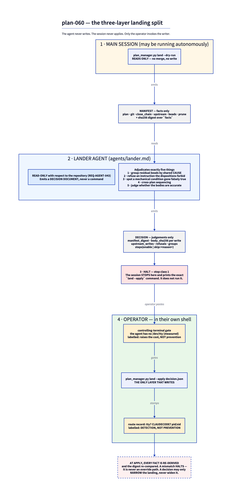

# Plan: Plan-landing capability: a plan_manager.py land verb (--dry-run enumerates facts, --apply <decision.json> is the only writer) plus a read-only lander agent producing a decision document, so authorizing merge-back authorizes the whole landing in one informed consent grant

**ID:** plan-060-james-dixson-6a6ac9
**Author:** james-dixson
**Created:** 2026-08-29
**Status:** review

## Objective
Plan-landing capability: a plan_manager.py land verb (--dry-run enumerates facts, --apply <decision.json> is the only writer) plus a read-only lander agent producing a decision document, so authorizing merge-back authorizes the whole landing in one informed consent grant

## Motivation

`test_close_contract.py --list-steps` enumerates **12** close-chain steps. All twelve operate on
the plan document and its bead tree. **Not one touches git, the worktree, the harness, or
upstream.** A plan therefore reaches `status: complete` with its branch unmerged, its worktree
live, its herdr tab open, its reconcile comments unposted, its residual findings unmirrored, and
the installed toolchain still carrying pre-plan engines.

**Measured: landing plan-057 took eleven separate operator instructions**, each asked for
explicitly, one at a time, *after* the plan was already `complete` and verified green — merge,
push, close the branch/worktree/tab, mark complete, close upstream issues, open issues for the
open concerns, close the execution beads, push residual findings upstream, group those findings
coherently, clean up a stray molecule, `yf self install`. Then a twelfth round trip to answer
*"when can we close `.9` and `.10`?"*, whose real answer was **"post the four reconcile
comments"** — a step already implied by the merge that had simply never been done. One conceptual
operation, *land this plan*, decomposed into a dozen prompts.

**The design insight is that authorizing the merge IS the authorization.** When an operator says
"merge this plan to `main`", they have already decided the plan is done; everything downstream is
mechanical consequence of a decision already taken. Re-soliciting consent per step buys nothing
except attrition — and attrition is the condition under which an operator starts rubber-stamping,
which is the precondition for [#293](https://github.com/dixson3/yoshiko-flow/issues/293).

The genuinely outward-facing subset still needs consent, but **enumerated up front and batched
into that one grant**. *"Here are the 4 comments I will post, the 1 issue I will close, the 5 I
will file — approve the landing"* is **more** informed consent than eleven separate yes-es, at one
round trip instead of eleven.

**Who is affected:** every operator of every yf-plan plan, on every landing. The cost is paid per
plan and recurs indefinitely, which is why this is an issue rather than a retrospective entry.

**What triggered it:** [#301](https://github.com/dixson3/yoshiko-flow/issues/301), filed from
plan-057's landing; [#295](https://github.com/dixson3/yoshiko-flow/issues/295) is that landing's
residue, which exists *because* landing was manual.

**Why the agent must not write.** A land agent that both decided and acted would, by construction,
hold write authority over `main`, the upstream tracker, the worktree set and the installed
toolchain — the highest-privilege role in the system. #293 is an executing agent closing a consent
gate by writing its own authorization into the close reason. Building a second, larger version of
that is the failure mode this plan is shaped to avoid.

## Upstream Issues
| Issue | Title | Disposition | Notes | Resolved By |
| :-- | :-- | :-- | :-- | :-- |
| #301 | close chain stops at `complete` — merge-back, pruning, reconcile writes, bead mirroring and redeploy are all manual | include | The plan of record for this work: the three-layer split (facts / decision / execution). | 0.1, 0.2, 0.5, 4.4, 4.5 |
| #293 | a `Type: human` consent gate can be closed by the executor asserting its own authorization | partial | Structural answer for the LANDING case only — the adjudicator never writes and `--apply` re-derives every fact. The general unmintable-consent-token mechanism is out of scope; issue stays open. | 3.3, 3.4 |
| #263 | META: two facts, one signal — one architectural gap with 11+ instances | partial | Applied, not fixed: every `land` verdict uses `PASS \| FAIL \| INCONCLUSIVE` and no refusal is reported at exit 0. Class investigation stays open. | 0.9, 1.6, 1.9 |
| #222 | the phase model has no slot for post-merge/post-teardown work | partial | `land` steps L16–L19 are the first genuine post-merge slot. Authoring-time guidance toward out-of-tree deferred beads is out of scope. | 4.8 |
| #204 | yf-herdr: no teardown contract — a completed plan's subordinate tab is never closed | partial | Step L18 implements harvest-before-prune mechanically and, because tab provenance is **unanswerable** (D-7), PROPOSES the close by default; an actual close requires an explicitly supplied tab id. The `REQ-HERDR-*` contract itself is a yf-herdr deliverable. | 4.8 |
| #230 | `bd close` REFUSES and EXITS 0 when the bead is blocked by an open dependency | partial | Caller-side only: close-out verifies structurally by read-back, never by exit code. The `bd` fix is upstream. | 4.7 |
| #302 | plan-folder location and plan NUMBER are both unenforced claims | partial | **Only B3 in scope**: `land --dry-run` detects a plan-number collision on the merge target and reports it as a halting finding. The `get_next_index()` `max+1` / cross-worktree fix (B1/B2) and the primary-side claim (A) are Phase-1 concerns and stay open. | 1.3 |
| #303 | §6.4 `CHANGED` is structurally empty post-merge; `classify-deliverable`'s `path-backed` evidence is unreachable | partial | Found by plan-060's EXP-004 spike and filed. `land` computes the changed set itself as `HEAD^1..HEAD`, so the verb path is correct by construction; the SKILL.md §6.4 prose fix for the non-`land` path stays open. | 1.4, 5.4 |
| #304 | the self-authorization residue #301 does not close: the lander cannot forge the ARTIFACT, but the main session still causes the ACT | partial | Filed by this plan from EXP-005. plan-060 ships the three honestly-labelled mitigations (no-verb-for-the-session, tty gate, route record); the off-machine lever (branch protection) stays open. | 0.6, 3.3, 3.4 |
| #305 | `gate_consistency.py`: caller error indistinguishable from an absent plan, and `--json` unhonoured on the INCONCLUSIVE path | exclude | Found by this plan's conformance pass and filed for follow-up. plan-060 consumes the instrument and does not modify it; the defects are not landing behaviour. Recorded so the provenance is not lost. | — |
| #295 | plan-057 follow-on: 8 backfill halts and 4 ungranted reconcile comments | exclude | Motivating evidence, not work this plan performs. Stays open for a separate operator action. | — |
| #287 | bead/issue state drift is one-directional in reporting | exclude | Four live readings, two of them "do nothing". `land` must not encode a guess. | — |
| #235 | `linked_plan_complete` cannot distinguish delivered from parked | exclude | `yf-beads-hygiene` engine, different surface. | — |
| #255 | cut the v0.5.0 release | exclude | Unrelated release mechanics. | — |
| #266 | the plan.md Gates grammar cannot express `test_class` or `cwd` | exclude | `land` reads gate state, not gate grammar. | — |
| #270 | `plan-review.formula.toml` has never been poured | exclude | Unrelated. | — |
| #276 | the portability audit checks files on DISK, not git-TRACKED-ness | exclude | Adjacent to step E's `origin` precondition but the audit is untouched. | — |
| #280 | `detect_followons`' narrow auto-eligible set has been permanently empty | exclude | `land` delegates residual mirroring through `yf-beads-upstream` rather than reimplementing selection. | — |

Full dispositions and reasoning: [upstream-triage.md](upstream-triage.md). Full issue bodies:
[references/](references/).

## Investigation Findings

Five experiments. Full write-ups in [findings/](findings/); the load-bearing results are below.

### D-1 — Landing is not merely unautomated; **no code in this repository has ever merged or pushed**

`plan_manager.py` is 7461 lines with **20** call sites of the `_run_git` helper, none of which is
`merge`, `checkout`, `pull` or `push`. Every one of those four verbs is **prose in `SKILL.md`,
executed by the LLM** (EXP-001 F1). `commit-plan` is the only code that writes a git commit at all.

`land --apply` would therefore be the **first merge-performing and first push-performing code in the
repository**. That is materially larger than "add a verb", and it is why the git layer is
risk-managed separately from the upstream layer throughout this plan.

The seam is nonetheless already shaped: `landing-lock`, `worktree ensure/teardown`,
`validate-merged`, `_resolve_landing_strategy`, `_execute_branch` and `_commit_plan` all exist. Only
the gaps between them are prose.

### D-2 — MEASURED: the documented order structurally leaves `status: complete` unpushed

§6.4's terminal `update-status complete` writes `plan.md` and `log.md` **after** §6.2's push, and
nothing commits them. plan-057 paid for this with a hand-written commit directly on `main`
(`4f4bd94`, 2m40s after the merge `a667865`, flipping `reconciling` -> `complete`). A sandbox spike
reproduced it independently: after the push, `git rev-list --left-right --count origin/main...HEAD`
returns `0 0` — the branch is **not even ahead**, so no unpushed-commit check could ever surface it.

**plan-059 did not follow the documented order.** It committed `COMPLETE` on its plan branch
(`61ddbaa`) and merged afterwards (`c04b071`) — i.e. #301's order — and left nothing uncommitted.
The two most recent landings used two different orders, and **only the one that deviated from the
documented order ended clean** (EXP-004 F1/F2).

### D-3 — PROOF: no single-push order satisfies all four landing constraints

Four constraints, each independently measured:

1. no plan-folder write left uncommitted ⇒ **a push after the close chain**;
2. completion-time measurement reads the merged tree (`recheck-criteria` is tree-sensitive and
   several of plan-057's criteria are corpus-wide) ⇒ the merge precedes the close chain;
3. a reconcile comment **asserts that work shipped**, and that assertion is only true once the
   merge is on `origin` ⇒ **a push before reconcile**;
4. `verify-reconcile` reads live comment bodies ⇒ reconcile precedes the close chain.

**Constraint (3) is a CONVENTION THIS PLAN ADOPTS, not a measurement — and pass 1 was right to say
so.** The earlier draft cited `SKILL.md:1578` and `reconciler.md`'s "See commit `<sha>`" template as
if they were mechanical. They are not: `UPSTREAM_REQUIREMENTS[include].requires_mention` requires a
**plan-id** mention, never a SHA, and nothing enforces a commit citation. Worse, this plan *authors*
the reconcile bodies, so it controls the very constraint it was treating as given.

The constraint is retained on a **stronger and honestly-stated ground**: a comment saying "this
shipped in plan-060" is *false* while the merge sits unpushed and could still be dropped. That is a
truthfulness constraint on an outward-facing, hard-to-retract statement, not a formatting one.

**The rejected alternative, recorded:** a single push after the close chain, accepting that
reconcile comments describe a landing that has not yet reached `origin`. It is cheaper and it is
defensible; it was rejected because the comments are the one artifact this plan cannot take back.

(1) and (3) are two *different* pushes, so the landing takes two.

### D-4 — #301's six-step order is subtly wrong in three ways, and this plan deviates from it

1. **Steps 1–3 are not sequential.** `test_close_contract.py --list-steps` shows the "unchanged
   12-step chain" *contains* `verify-reconcile` (its step 2's terminator) and `close_cascade.py`
   (its step 3). The order is unimplementable as written without decomposing step 1.
2. **Its load-bearing constraint is stated too broadly and contradicts the SPEC it preserves.**
   *"No bead close before `verify-reconcile`"* is falsified by `close-reconcile-step`, which
   REQ-COMPLETE-001 constraint 2 **requires** to run first. The real invariant is narrower:
   **`close_cascade.py` and `complete-gate` must not run before `verify-reconcile` returns 0.** The
   hazard #301 describes is genuine, but it is a *gate-condition* hazard, not a bead-close-ordering
   one.
3. **A conflict at its merge step is unrecoverable.** Because its document close and bead close-out
   precede the merge, a conflict at step 4 strands a plan marked `complete`, beads closed and
   comments posted, against an unmerged branch. Under this plan's order every conflict site precedes
   the first outward-facing write (see the Approach's conflict section).
4. **The load-bearing error — merge and FULL validation at step 4, after the document close (1) and
   bead close-out (3).** #301 says *"never proceed past a red FULL tier"*, but under its own order
   the tier runs after `update-status complete` is written and the execution tree is closed: a red
   tier has **nothing to fail closed onto**. This inverts plan-009's INV-4 (`SKILL.md:1462`), which
   #301 discards without citing.

**#301 is nonetheless right about what SKILL.md gets wrong** (D-2 is the proof). The correction is
not to move the close chain before the merge — it is to add the second push after it.

### D-5 — The existing upstream-writing agent already has #293's defect

`agents/reconciler.md` runs `gh issue close` / `gh issue comment` directly, and its only guard is
prose: *"Verify before acting. Never update upstream without confirming work was done."* That is the
same shape as #293's free-text close reason — a rule an agent may or may not follow, producing
identical artifacts either way.

**So the read-only `lander` is not a stylistic preference; it corrects a defect that is already
live.** This is the strongest single argument for #301's inversion, and it is stronger than the
argument #301 itself makes (EXP-002 F9).

### D-6 — The reconcile contract is already mechanical; the agent's job is to *explain*, not discover

`UPSTREAM_REQUIREMENTS` (`plan_manager.py:2676`) is one shared table read by **both**
`verify-reconcile` and `grant`: `include` -> CLOSED + mention, `partial` -> **OPEN** + mention,
`supersede` -> CLOSED/`NOT_PLANNED`, `deferred` -> **OPEN**, `tracker` -> always `inconclusive`,
`exclude` -> filtered out.

This **mechanically refutes #301's adjudication case 2**. The operator's *"close the upstream
issues"* was wrong for plan-057 because every row was `partial`/`deferred`/`exclude`. `land` does not
need an agent to *discover* that — the table already encodes it. It needs an agent to **explain**
it, and the verb to **enforce** it. That materially narrows what the `lander` must be trusted for,
which is a safety gain.

`grant --check <file>` is the repo's only operator-consent-file primitive and verifies coverage
**per action, not per issue**. It is reused rather than reinvented.

### D-7 — Three capabilities #301 assumes exist, do not

- **Read-back verification of `gh` writes.** `upstream.py` verifies a *write response* (a returned
  issue URL), **not** a `gh issue view` re-read. #301's read-back requirement is new work.
- **A convention for pre-authored comment bodies.** Three plans use three incompatible shapes
  (`upstream-drafts/*.md`, `*.body.txt` + a `RUNBOOK.md`) and **no code reads any of them**. The
  path convention must be invented by this plan.
- **herdr tab provenance.** #301 says close the tab *"only if this session created it"* — and that
  predicate is **currently unanswerable**. `YF_PARENT_PANE` is child-to-parent, so a parent cannot
  enumerate its children. This plan takes the answerable subset and defers the rest.

### D-8 — The FULL tier exceeds 300 s and has no recorded wall-clock time

`protocols/CHANGE-VALIDATION-TRIGGER.md:35` — *"FULL is the multi-minute gate paid once per land."*
`plan-053` records that it *"far exceeds"* `recheck-criteria`'s 300 s default, which converts a
`TimeoutExpired` into `inconclusive` and **continues**. Both prior plans solved this by running the
tier once and writing a dated record file a later criterion reads.

**Consequence for this plan's own success criteria:** no criterion may embed a FULL-tier run inside
a 300 s bound — that is a criterion that *cannot fail* (#224's class), authored into the plan whose
subject is checks that cannot fail. Also noted: `_validate_merged` maps engine `inconclusive` ->
`fail`, which is #262 live inside the helper `land` must call.

### D-9 — The strongest prior art for a decision-driven executor is in another skill

`okf_hygiene.py backfill` has all four properties `land` needs and `yf-plan` has none of: a
dry-run/apply split where **the preview is computed by the same code as the apply** (not a parallel
path); pre-flight halt classes *and* a post-condition assertion on the way out; an fsync'd
crash-recovery journal with five enumerated states, *"keyed on the JOURNAL's recorded phase, never on
directory presence"*; and a `--record` / `restore --record` reversal that distinguishes
`git-checkout` from `unlink` per path, because *"`git checkout` ALONE CANNOT UNDO THIS TRANSFORM."*

`upstream.py` contributes the fail-closed model (first `WriteError` aborts before any destructive
stage) but has **no journal at all**. `escalation-push` contributes the structural-delivery idiom:
*"`herdr agent prompt` returns `agent_not_found` at exit 0, so `$?` is not evidence of anything."*

### D-10 — Two adjacent defects found and filed during investigation

- **#302** — the plan folder is not primary-side (`make_plan_dir` resolves against the git root,
  which inside a worktree *is* the worktree), and `get_next_index()` returns `count + 1` over the
  **current checkout**, so two checkouts issue the same number (measured live: primary -> 060,
  worktree -> 061) and a deletion makes the counter run backward. **Only B3 is in scope** —
  merge-back is exactly where two checkouts' plan directories meet, and two `plan-060-*` bundles
  differing only by hash suffix merge **cleanly, with no conflict and no failing check**.
- **#303** — `CHANGED=$(git diff --name-only "${MERGE_TARGET}"...HEAD)` runs when
  `HEAD == MERGE_TARGET`, so it is empty **by construction** and `classify-deliverable`'s
  `path-backed` evidence can never fire at the one binding documented to produce it. `land` computes
  `HEAD^1..HEAD` instead.

### D-11 — REFUTED: #301's structural claim does not hold

#301 says the agent *"cannot fabricate an authorization, because it never issues a write."* That is
true of the `lander` **sub-agent** and **false of the system**. The three-layer table assigns
`land --apply` to a column headed *"the only layer that writes"* — but never names **who invokes that
layer**. Under `--autonomous` the invoker is the main session, which produced `decision.json`, can
**edit** it afterwards (an ordinary same-uid file), and types `land --apply` with no artifact
required beyond argv.

**The split converts "one agent that decides and acts" into "one agent that decides, delegates the
write to a script it invokes, and acts." Write authority is unchanged.**

What *is* genuinely gained — and what the issue should claim instead — is that #293's **specific
artifact** is eliminated: `land --apply` re-derives conditions mechanically and **generates** its own
close reasons, the `resolve-start-gate` pattern (`_start_gate_close_reason`), so a close reason
**cannot contain a fabricated claim about the operator**. Real, and worth shipping. But on *"the same
session that benefits is the session that types the command"* the split is **procedural, not
structural** — it moves the defect one layer up. Filed as **#304**.

### D-12 — MEASURED: no purely local artifact is unmintable

The unifying fact is that the agent runs as the operator's uid, unsandboxed, under
`bypassPermissions`. Four independent corroborations:

- `echo probe > ~/.yf-exp002-probe` wrote outside the worktree with **no prompt**;
- `~/.claude/settings.json` is **writable** and its 28 `deny` entries contain **no file-write rule** —
  a session can edit the rules that constrain it;
- a cryptographically valid "operator" grant was **self-minted in one command**
  (`ssh-keygen -Y sign … -> Good "yf-landing" signature`), and **no FIDO/touch-required key exists on
  this machine**, so hardware-presence authorization is unavailable rather than merely unbuilt;
- all **1868** `.beads/interactions.jsonl` records carry `actor: "James Dixson"` — one distinct value,
  from `git config user.name`, identical for operator and agent.

`herdr` cannot supply provenance either: `origin`, `provenance`, `actor`, `author`, `issued_by` and
`client_id` occur **zero times** in its API schema, and a socket-injected prompt arrives as pty input
indistinguishable from typing.

**Consequence:** the signed grant, the operator-written grant file, and herdr-provenance consent are
**not to be built**. Each would put a cryptographic or procedural veneer on a first-party assertion —
strictly worse than #293, because the artifact would *look* unforgeable.

### D-13 — And `land --apply` has a LARGER blast radius than the gate it replaces

#293's gate guarded one local, reversible, **unpushed** rewrite. `land --apply` pushes `main`, posts
upstream comments, closes and files issues, deletes branches and worktrees, and redeploys the
installed toolchain. Batching those behind one first-party flag builds, in #301's own words, *"a
second, larger version of that."*

This is why the plan's answer is **to withhold the verb from the session** rather than to guard it
better (see the Approach). The one control that is genuinely strong here is orthogonal to consent:
the FULL-tier revalidation before push is a **verification** control in the `upstream.py` mould —
fail-closed, structurally verified, non-scrapeable. It makes a self-authorized landing **survivable**,
which is a different and far more achievable goal than making one impossible.

## Approach

### The shape: three layers, and the agent cannot write

| Layer | Produces | Authority |
| :-- | :-- | :-- |
| `plan_manager.py land --dry-run` | the **manifest** — facts, exit codes, merge preview, every enumerated write with its body | reads only |
| the `lander` agent (`agents/lander.md`) | a **decision document** — a data structure, never commands | **read-only against the repo** (REQ-AGENT-043) |
| `plan_manager.py land --apply <decision.json>` | the **execution** | the only layer that writes — **and it is invoked by the OPERATOR, not by the session** (D-11) |



Full schema draft: [assets/decision-schema.md](assets/decision-schema.md).

**The invariant that makes the split load-bearing rather than decorative:** `--apply` trusts the
decision document for **judgements only** — grouping, prose bodies, which rows may close, per-step
enable/skip. It trusts it for **no fact whatsoever**. Every fact is **re-derived at apply time** and
checked against the `manifest_digest` the decision carries. A decision that disagrees with re-derived
reality is a **halt**, never an override.

Three consequences follow structurally, not procedurally:

1. **The agent cannot fabricate an authorization**, because there is no field in the decision
   document in which a condition, an exit code, or a consent can be asserted. It supplies titles,
   groupings, rationales, body paths and enable/skip choices — each either inert or re-checked.
2. **The agent cannot close a gate.** The verb closes gates, and only when the verb's own re-derived
   condition holds. This is #293's structural answer rather than a procedural one.
3. **A decision can only ever NARROW the landing.** An `enable` on a step the manifest halted is
   ignored and reported; `skip` requires a reason and is surfaced in the consent prompt. "The
   landing did less than you think" is never silent.

D-6 sharpens this further: because `UPSTREAM_REQUIREMENTS` already encodes the per-disposition end
states mechanically, the agent is not trusted to *discover* that a `partial` row must stay open — it
is trusted to *explain* it. What must be trusted is materially narrower than #301 assumes, which is a
safety gain the issue does not claim.

### The consent model: withhold the verb, gate the terminal, record the route

D-11 refutes #301's claim that the split is structural, and D-12 shows why no local artifact can
rescue it. The plan therefore adopts three mechanisms, **each labelled with what it does not
guarantee** — an honestly-labelled detection control is worth more than a prevention claim that does
not hold:

1. **The session does not get the verb.** `land --dry-run` and the `lander` produce `decision.json`;
   the session then **stops** — a declared stop-class-1 halt — and prints the exact `land --apply`
   command for the operator to run **in their own shell**. This is the only genuinely structural row,
   and its guarantee is the *absence of the capability*: it dies the moment a future rule adds the
   capability back, which is precisely why it is paired with (2).
2. **A controlling-terminal gate** on `land --apply`, specified as **pure POSIX**: refuse when
   `os.ttyname(0)` raises or `/dev/tty` is not openable. Measured inside a Claude Code Bash
   subprocess, `/dev/tty` is **not openable** (`OSError [Errno 6] Device not configured`), so the
   gate refuses an agent by default, and being POSIX-only it is portable across harnesses (GR-006).

   **The herdr half of the original design is withdrawn.** Pass 1 measured that `herdr api
   schema --json` contains **zero** occurrences of `human` and **zero** of `attached` — "a pane
   herdr reports as human-attached" is not a capability herdr has, so that predicate would have
   degraded to "matching *any* herdr pane". Worse, `herdr pane run <pane> <cmd>` runs a command in
   a pane with a genuine pty: the bypass EXP-005 priced at "`pty.fork()` in ~15 lines" is in fact
   **one sanctioned tool call**, and the resulting tty is in herdr's own list. Any allow-list is
   therefore **operator-configured**, never herdr-derived, and `herdr pane run` is named as a known
   bypass in the SPEC. **This is not prevention** — it converts self-authorization from a
   *rationalizable* act into an *unmistakable* one, and nothing more.
3. **A route record** — tty or its absence, `CLAUDECODE`/entrypoint presence, pid/sid — stamped on
   every gate close and every `--apply`, with `audit-close` failing a `Type: human` gate whose record
   reads "no tty, `CLAUDECODE` set". This would have surfaced #293 within seconds. **Detection, not
   prevention**, stated in the SPEC text verbatim; the markers are strippable, but *asymmetrically* —
   a clean record is weak evidence of a human, a dirty one is strong evidence of an agent.

**Deferred:** GitHub branch protection on `main` (the only genuinely off-machine lever, but absent,
admin-removable, and guards `main` alone) and a `PreToolUse` hook (Claude-only, and self-disabling
because hook config is reloaded mid-session). Tracked on #304.

**The batched grant survives all of this.** #301's operator-attention argument is sound and its
rubber-stamping risk is real. What changes is that the thing being granted is a command **the
operator types**, on a manifest an agent has already adjudicated and annotated — which is still one
round trip instead of eleven.

### The order: two pushes, twenty steps, every edge forced by a measurement

D-3 proves no single-push order satisfies all four constraints. This plan adopts the two-push order
derived in [findings/exp-004-landing-order.md](findings/exp-004-landing-order.md) and **deviates
deliberately from #301's stated six-step order** (D-4):

```
L0  landing-lock acquire
L1  git fetch + DOWN-MERGE target into <plan>-execute (in the worktree)
L2  checkout target; pull --rebase; merge --no-ff   (uncommitted)
L3  validate-merged  — FULL tier — HALT WITH LOCK HELD on fail
L4  commit the merge; landing-lock release
L5 ADVISORY recheck-criteria on the merged tree (never halting) — the last fully reversible point
L6  PUSH #1  <- FIRST IRREVERSIBLE STEP
L7  reconcile writes — gh comment/close, each verified by READ-BACK
L8  close chain 1-5   (CHANGED computed as HEAD^1..HEAD — fixes #303)
L9  close-reconcile-step
L10  verify-reconcile              (halting)
L11 recheck-criteria              (halting, on the merged tree)
L12 close_cascade.py              (first destructive step; refuses an unmet gate)
L13 complete-gate
L14 pour_fidelity.py
L15 update-status complete
L16 commit the L8/L15 plan-folder writes; PUSH #2      <- the step neither document has
L17 mirror residual open beads upstream, grouped per the decision
L18 prune — worktree, branch local+remote, herdr tab under #204's preconditions
L19 redeploy iff the landing touched skills/
```

Three properties of this order are worth naming because they are what the two source documents each
get wrong:

- **L3 precedes every irreversible step, and L6's push is the FIRST of them.** #301 puts the FULL
  tier at its step 4, *after* the document close and bead close-out — so a red tier has nothing to
  fail closed onto. Preserving plan-009's INV-4 is the single most important correction this plan
  makes to the issue.

  Stated plainly rather than implied away: **every halt after L6 leaves `main` already carrying the
  merge.** What makes that acceptable is that L3's FULL tier ran first, so the code on `main` is
  validated; the later halts (L10 `verify-reconcile`, L11 `recheck-criteria`, L12 cascade) concern
  plan bookkeeping and upstream state, not code correctness, and each is repairable without a
  revert. L5 adds an **advisory** criteria run on the merged tree *before* the push, so
  tree-sensitive criteria are exercised while the landing is still fully reversible.
- **L16 exists.** SKILL.md's order guarantees an uncommitted, unpushed `plan.md` on every landing
  (D-2, measured on plan-057). Nothing before this plan has had a step for it.
- **L1's down-merge is what makes L11 honest.** Spike B measured that a down-merge makes the branch
  tree byte-identical to the merged tree, so completion-time measurement and "the tree that will be
  on `main`" are reconcilable rather than in tension.

### Conflicts: exposed and handed back, never resolved

Conflicts can arise at exactly **four** points, and they do **not** all sit on the same side of the
outward-facing boundary — an earlier draft of this paragraph claimed they did, and that claim was
false:

| Site | Position | Recovery |
| :-- | :-- | :-- |
| **L1** down-merge | pre-L6, pre-L7 | fully local; abort and hand back |
| **L2** merge | pre-L6, pre-L7 | fully local; abort and hand back |
| **L6** push #1 rejected | *is* L6 | pre-outward-write; `pull --rebase`, **re-validate**, retry |
| **L16** push #2 rejected | **post-L7, post-L12, post-L15** | **NOT locally recoverable** — see below |

For L1, L2 and an L6 rejection, nothing has been posted and nothing closed, so a conflict is
recoverable with no outward trace.

**An L16 rejection is a different animal and gets its own contract.** By then the reconcile comments
are posted (L7), the bead tree is closed (L12) and `status: complete` is written (L15). The contract
is therefore **retry-after-`pull --rebase`, never revert**: re-validate the rebased tree and push
again. Reverting would contradict outward statements already made. It carries its own journal state
and its own row in Issue 4.10's matrix, rather than being folded into a single "push rejection" case.

**The pre-outward-write property still belongs to this order and not to landing in general.** Under
#301's ordering the document close (step 1) and bead close-out (step 3) precede the merge (step 4),
so a conflict at the *merge itself* strands a plan marked `complete`, beads closed and comments
posted, against an unmerged branch. **That remains a fourth independent reason #301's ordering is
wrong** — the argument survives the correction above, because it turns on the merge, which this plan
puts at L2 and #301 puts after its irreversible steps.

The contract, measured in [findings/exp-006-conflict-handling.md](findings/exp-006-conflict-handling.md):

- **Never auto-resolve.** No `-X ours`, no `-X theirs`, no strategy override, no heuristic. Any of
  them silently discards one side's work, and the discarding is invisible in the resulting commit.
  The verb has no basis for choosing; the agent, holding the plan and both diffs, at least has one.
- **Capture from three independent sources** — `git diff --name-only --diff-filter=U` for the path
  list, `git status --porcelain=v2` for per-path stage detail, and `MERGE_HEAD` for the incoming
  commit — then write the journal state and hand the whole picture back.
- **Restoration is available and verified:** `git merge --abort` returned the tree to an empty
  `--porcelain` in the spike. Whether `--apply` *should* abort or leave the tree conflicted for
  inspection is **deliberately not decided here** — Issue 4.10's test matrix decides it empirically,
  which is what the operator asked for.
- **A clean preview does not guarantee a clean apply.** Measured: preview clean, target advances,
  the same merge conflicts. The predicted merge-tree oid changes when the target moves, so making it
  a digest-covered fact (Issue 1.5) turns this into a **digest mismatch that halts before the merge
  is attempted** — a legible staleness report rather than a conflicted working tree discovered
  afterwards.

### Failure model: fail-closed, journalled, resumable

`land --apply` follows `okf_hygiene.py backfill`'s model (D-9), which is the only adequate prior art
in the repository:

- **One code path.** The dry-run and the apply compute the manifest with the *same* code; `--apply`
  is a flag on the decision, not a parallel implementation. A preview computed separately is not a
  preview.
- **An fsync'd journal** with enumerated states, written inside the repo tree (never `mktemp -d`,
  which turns `os.rename` into a copy and voids every durability claim). Recovery is **keyed on the
  journal's recorded phase, never on observed state** — the distinction that makes "wrote nothing"
  and "wrote everything then died" separable.
- **A post-condition assertion on the way out**, not merely a precondition on the way in.
- **Fail-closed at every edge**, `upstream.py`'s model: the first unverified write aborts before any
  destructive follow-on stage is reachable.
- **Three-valued verdicts throughout** (#263). `inconclusive` is never coerced to `fail` — the
  defect #262 records inside `_validate_merged` must not be reproduced in the verb that calls it.

Steps **L0–L5** are reversible or idempotent; **L6's push is the first IRREVERSIBLE step** and
**L7 the first OUTWARD-FACING write**. The journal's state set straddles **L6**, not L7 — the two
boundaries are one step apart and only the earlier one bounds recoverability.

### Registration and SPEC-first sequencing

`land` registers as a **flat** `@cli.command`, not a group — REQ-CLI-021 mandates the flat form, and
a group would escape `test_cli_enumeration.py`'s set-equality check entirely (EXP-001 F3). That
check fires on **any** edit to `plan_manager.py`, so the `spec/cli.md` enumeration amendment and the
verb must land in the same change-set. This is the mechanism that makes SPEC-first enforceable here
rather than aspirational, and the plan sequences Epic 0 accordingly.

`upstream.py` already has a `land` verb (follow-on hoist). The two are different operations and the
plan names the distinction explicitly wherever both appear.

### What this plan deliberately does NOT do

- **It does not fix `Type: human` gates generally** (#293 stays open), and it does not claim to make
  a self-authorized landing impossible (#304). D-12 measured that no local artifact is unmintable;
  the plan ships withholding + detection and says so.
- **It does not fix `get_next_index()`** (#302 B1/B2 stay open). It only *detects* a plan-number
  collision at merge-back, which is the half that belongs to landing.
- **It does not build herdr tab provenance** (#204 stays open). D-7 measured that "a tab this session
  created" is currently unanswerable, so `land` takes the answerable subset: close only a tab whose
  id is supplied explicitly, under #204's mechanical harvest preconditions, and otherwise propose.
- **It does not close `bd close`'s exit-0-on-refusal defect** (#230 stays open). It refuses to trust
  the exit code, verifying every close by read-back instead.
- **It does not claim its own criteria layer was right first time.** Red-team pass 1 measured that
  **20 of 31** criteria were vacuous — the house test shim discards `sys.argv`, so a `-k` selector
  never reached pytest and every such criterion asserted only "some test passed". `REQ-CLI-028` and
  `scripts/checks/check-pytest-ran.sh` already existed for exactly this, and this plan had not found
  them. Issue 0.9 adopts the guard and R4 records the failure rather than quietly fixing it — a plan
  about checks that cannot fail has no business hiding one of its own.

## Epics

### Epic 0: SPEC-first — allocate ids, amend the spec, and make the criteria layer able to fail
- Issue 0.1: Write `assets/free-req-ids.md` — a repo-wide `Family | Max allocated | Next free | In-block gaps` table computed across `skills/`, `SPEC.md`, `yf/src`, `scripts/`, `_shared/`, excluding the frozen `docs/plans/**` bundles. No issue in this plan may allocate a `REQ-*` id before this file lands (the plan-049 precedent).
  - resolves-upstream: #301 (include)
- Issue 0.2: Create `skills/yf-plan/spec/landing.md` owning a NEW `REQ-LAND-*` family. It must ENUMERATE, not merely refer to: the twenty-step order (L0-L19) with one justifying edge per step; the journal STATE SET by name — take `okf_hygiene.py backfill`'s five-state model as the starting point (D-9) and extend it with one state per conflict site — **four of them: L1 down-merge, L2 merge, L6 push-rejection, and L16 push-rejection**, the last being the only post-outward-write conflict and therefore the only one whose recovery is retry-never-revert — so Issues 3.1/6.3 and criteria SC3/SC19/SC38 bind to a declared set rather than to whatever this issue happens to write; the `--apply` invocation contract (which checkout, which cwd, whether a partial failure is resumable); the conflict contract; and the runtime preconditions for the per-landing upstream grant and for redeploy. A new spec key is precedented — plan-057 added `REQ-OKFH-001`..`010` the same way.
  - depends-on: 0.1
  - resolves-upstream: #301 (include)
- Issue 0.3: Amend `skills/yf-plan/spec/cli.md` — add `REQ-CLI-030` (the `land` verb: flat registration, `--dry-run` / `--apply <decision.json>` / `--validate-decision`, the REQ-COMPLETE-003 envelope, the exit vocabulary — including that the controlling-terminal refusal is **exit 3**, the gate-signal code, not 1 or 2 — and the `halt_class` field) AND amend `REQ-CLI-006`'s single `The enumeration (currently N):` line. Both edits in ONE change-set: `uv-yf-cli-enum` fires on any `plan_manager.py` edit and asserts set equality.
  - depends-on: 0.2
- Issue 0.4: Amend `skills/yf-plan/spec/agents.md` — add `REQ-AGENT-065` (the `lander` is read-only with respect to the repository under review; a sandbox spike is authorized; it emits a decision document and never a command). Its `Verification:` must be an executable command. Record explicitly that a `grep -qF` verifies the INSTRUCTION and not the BEHAVIOUR, and pair it with the behavioural check in Issue 2.6.
  - depends-on: 0.2
- Issue 0.5: Amend `skills/yf-plan/spec/phases.md` — add `REQ-COMPLETE-005` restating the landing ordering constraints, and RESTATE #301's over-broad rule correctly: it is `close_cascade.py` and `complete-gate` that must not precede a green `verify-reconcile`, NOT "any bead close" — `close-reconcile-step` is a bead close REQ-COMPLETE-001 constraint 2 already requires to run first. Also record the **stop-class-1 exception** to REQ-AGENT-064's "every stop class is an exit code or a counter", citing SKILL.md's write-site table, which already states class 1 has no write site.
  - depends-on: 0.2
  - resolves-upstream: #301 (include)
- Issue 0.6: Amend `skills/yf-plan/SPEC.md` — add `REQ-PLAN-083` (the landing capability and its consent model), stating IN THE REQUIREMENT TEXT that the tty gate is "not prevention", that `herdr pane run` is a known bypass, and that the route record is "detection, not prevention". Allocate `083`, never `082` (consumed at `plan_manager.py:7330`, defined nowhere) and never `078` (retired).
  - depends-on: 0.1, 0.2
  - resolves-upstream: #304 (partial)
- Issue 0.7: Add the living-amendment-log entry to `SPEC.md`, one bullet per allocated id, ending with the conventional "Implementation lands in Epics 1-6; this entry records the SPEC-first Epic 0 amendment." Append it to the SECOND blockquote region (lines 441-777); appending after line 440's blank non-`>` line would open a sixth fragment and worsen #241.
  - depends-on: 0.3, 0.4, 0.5, 0.6
- Issue 0.8: Wire `scripts/check_amendment_log.py` and `scripts/checks/check-req-coverage.py` as this plan's own Epic-0 gates, with an explicit `--min-issues` floor so a zero-match run cannot pass vacuously.
  - depends-on: 0.7
- Issue 0.9: **Make this plan's criteria layer able to fail (REQ-CLI-028).** Every new test file's `__main__` shall use the forwarding form `pytest.main([__file__, *sys.argv[1:]])` — the `test_recheck_criteria.py:204` precedent — and every test-backed criterion in this plan shall route through `scripts/checks/check-pytest-ran.sh <file> <test-name>`. Measured: the house shim `pytest.main([__file__, "-q"])` DISCARDS `sys.argv`, so `uv run <file>.py -k this_matches_nothing` ran all 22 tests and exited **0**. The vacuity is form-specific — module form exits 5 on a no-match, direct-file form exits 0 — and this plan's criteria used the direct-file form. **Record explicitly that `check-pytest-ran.sh`'s exit 2 (INCONCLUSIVE — the instrument could not run) is collapsed to "criterion FALSE" by `recheck-criteria`'s binary `-> exit N` clause grammar.** That is the fail-closed direction and is a property of the grammar, not of this plan; but a plan carrying #263 and asserting that `inconclusive` is never coerced must not leave its own criteria layer doing so unremarked. **Every criterion whose command exists TODAY shall be executed once under `bash -c` before approval** — the shell `recheck-criteria` actually uses, where `grep` resolves to `/usr/bin/grep`, not to an interactive shell function.
  - depends-on: 0.1
  - resolves-upstream: #263 (partial)
- Issue 0.10: Build the **cited-figure re-measurement instrument** (#289): a script that re-runs each command behind a figure quoted in this bundle and diffs the result against the quoted number. Pass 1 measured three drifts in this plan's own text (`_run_git` call sites, two `SKILL.md` line numbers, the FULL-tier row count). A plan that cites measurements is the natural place to build the instrument that checks them.
  - depends-on: 0.1

### Epic 1: `land --dry-run` — the manifest, which mutates nothing
- Issue 1.1: Implement `_land_manifest(plan_dir)` returning the `facts` object of `assets/decision-schema.md` §1 as a pure read. Follow the house shape: a private `_land_*` helper returning a dict, a thin click wrapper doing `click.echo(json.dumps(...))` + `sys.exit(...)`.
  - depends-on: 0.3
- Issue 1.2: Merge preview via `git merge-tree --write-tree`, reporting `conflicts`, `changed_paths`, **`predicted_tree`** and the resolved target tip. Measured: it predicts conflicts at exit 1, emits the merged tree oid at exit 0, and leaves `git status --porcelain` EMPTY. Record honestly that it does create an unreferenced ODB tree object, so no criterion claims the dry run "writes nothing at all".
  - depends-on: 1.1
- Issue 1.3: Plan-number collision detection on the merge target. Two bundles sharing an `NNN` and differing only by hash suffix merge CLEANLY (measured spike, commented on #302), so this is the only place the collision is detectable. Report it as a halting finding.
  - depends-on: 1.2
  - resolves-upstream: #302 (partial)
- Issue 1.4: Compute the changed set as `HEAD^1..HEAD`, never `<target>...HEAD`, and feed it to `classify-deliverable`. The documented expression runs when `HEAD == MERGE_TARGET` and is empty by construction.
  - depends-on: 1.2
  - resolves-upstream: #303 (partial)
- Issue 1.5: Canonical serialization + `sha256` digest over `facts` alone, excluding `generated_at`. It MUST cover `predicted_tree` and the target tip: measured, those are exactly the fields that drift when another plan lands between dry-run and apply, so a digest that omits them cannot detect the staleness it exists to detect.
  - depends-on: 1.2
- Issue 1.6: Register `land` as a FLAT `@cli.command` with `--dry-run`, three-valued verdicts throughout, and a `halt_class` field in the envelope so the session's stop is mechanically signalled rather than judged from prose. Do NOT collapse `inconclusive` to `fail` — that defect is live in `_validate_merged`, the helper this verb calls.
  - depends-on: 0.3, 1.1
  - resolves-upstream: #263 (partial)
- Issue 1.7: Emit the **fully-qualified `--apply` command** the operator must run, including the checkout it must be run from. The session prints this and stops; an ambiguous cwd is the difference between merging in the primary checkout and attempting it in a worktree that cannot check out the target branch.
  - depends-on: 1.6
- Issue 1.9: **Enumerate with git plumbing, never with a recursive content grep — and pick the plumbing by WHICH QUESTION is being asked.** Two facts are routinely conflated and they need different tools. **Tracked-ness** (`git ls-files`, `git -C <worktree> ls-files`, `git worktree list --porcelain`) answers "is this in the index". **Presence on disk** answers "is this file here" — and the tool alone is not enough, because **`--exclude-standard` and `git status` are THEMSELVES gitignore-honouring**. Measured from the **primary checkout**, over a bundle under the gitignored `.worktrees/`: `git ls-files --others --exclude-standard .worktrees` -> **0**, `git status --porcelain=v2 -- .worktrees` -> **0**. The same question answered from a repository in which the path is **not** ignored — `git -C <worktree> ls-files --others --exclude-standard` -> **37** — or by a non-git **scoped directory listing** from either side -> **37**. **So the rule is about WHERE the enumerating process runs, not which flag it passes:** a presence-on-disk fact about a gitignored worktree must be gathered with `git -C <that worktree>` or by a scoped listing. This matters because **`--apply` runs primary-side** (Issue 1.7, and L2's checkout), which is precisely the side that returns zero. `git ls-files` ALONE trades one under-report for another and must not be used for a disk-presence fact. **Presence on disk is settled EMPIRICALLY, not by argument** — see [assets/enumeration-spike.md](assets/enumeration-spike.md), which ran every candidate against a fixture holding tracked and untracked files both inside and outside a gitignored worktree, from both cwds, against a known true answer. The prescription is: **(1) a scoped directory listing** — the only candidate correct from EITHER cwd and the only one that crosses the gitignore boundary at all (4/4 in all three fixture cases; 41/41 live) — **or (2) `git -C <that worktree> ls-files --cached --others --exclude-standard`**, which is a correct single-command union but ONLY when run inside a repository where the path is not ignored. **Never `ls-files` alone and never `--others` alone** — they are exact complements partitioned by tracked-ness and each returned 2 of 4. **Never the union from the primary cwd**: measured **0**, which refutes the intuition that a union survives every state — it survives tracked-ness, not cwd. **And never `status --porcelain=v2 --ignored` as a fallback**: it is the one git command returning non-zero from the primary cwd (**1**), and that 1 is the ignored *directory*, not its four files — a caller checking for a non-empty result reads success and enumerates nothing. Measured on this bundle **after it was committed mid-review** (`a5664e7`): `ls-files` -> **40**, `--others --exclude-standard` -> **0**, union -> **40**, scoped listing -> **40**. **The premise this issue originally rested on is REFUTED, and by this plan's own history.** It read *"draft comment bodies are untracked BY CONSTRUCTION at `--dry-run` time, because the plan-folder writes are not committed until L16"* — but `commit-plan` exists precisely to commit a bundle before landing, the operator invoked it here, and the same enumeration that returned 37 while the bundle was untracked now returns **0** against an answer of **40**. So `upstream.rows[].draft_present` is wrong in BOTH directions depending on nothing more than whether someone committed. Two independent reasons a recursive content grep is wrong here, one per shell: (a) under the harness's interactive `grep` — a shell function passing `--ignore-files` — a recursive search from the repo root returns **0** hits for a pattern with **5** under `bash -c`, because `/.worktrees/` is gitignored; (b) under `/usr/bin/grep`, which is what `subprocess.run(["bash","-c",…])` actually gets, a recursive search across both roots **DOUBLE-COUNTS** — measured, 6 logical paths returned twice, once from the primary checkout and once from the worktree's copy. Reason (b) is the one that applies to `land`'s Python path; reason (a) is the one that misleads a human checking it. **An omission from enumeration is silent — it is not a `skip`, so the "every skip is surfaced in the consent prompt" guarantee does not cover it.**
  - depends-on: 1.1
  - resolves-upstream: #263 (partial)
- Issue 1.8: Tier-1 tests for Epic 1 in `test_land_manifest.py`, with the forwarding `__main__`. Throwaway git repos in `tmp_path`, every external call monkeypatched, no network.
  - depends-on: 0.9, 1.2, 1.3, 1.4, 1.5, 1.6, 1.7, 1.9

### Epic 2: the `lander` agent — read-only, emits a decision, never a command
- Issue 2.1: Write `skills/yf-plan/agents/lander.md` to the house template — 5-key front-matter with an empty `model:`, the standard section order, in the 79-109 line band. Declare read-only-ness in BOTH places, carrying `Read-only with respect to the repository under review` and `A sandbox spike is authorized` VERBATIM.
  - depends-on: 0.4
- Issue 2.2: Specify the five adjudications the agent owns and nothing else. Explicitly narrow the trust: `UPSTREAM_REQUIREMENTS` already encodes per-disposition end states, so the agent EXPLAINS the contract rather than discovering it.
  - depends-on: 2.1
- Issue 2.3: Implement `land --validate-decision <decision.json>` — schema conformance, `manifest_digest` match, `body_sha256` per enumerated write, and the narrowing-only rule. Report-only, no writes.
  - depends-on: 1.5, 2.2
- Issue 2.4: Wire dispatch in `SKILL.md` using the Phase-2 sub-agent form, and state that the MAIN SESSION writes the decision file.
  - depends-on: 2.1
- Issue 2.5: `test_lander_agent_contract.py` — assert the verbatim sentences, the front-matter shape, the fenced `## Output` template, and that the agent file contains NO imperative shell command an executor could lift.
  - depends-on: 0.9, 2.1, 2.3
- Issue 2.6: A **behavioural** read-only check to pair with 0.4's textual one: assert `git status --porcelain` is empty across a lander dispatch. A `grep -qF` proves the instruction was written, never that it was obeyed.
  - depends-on: 2.5

### Epic 3: executor MECHANISM — independently buildable, independently testable
- Issue 3.1: Implement the journal with an ENUMERATED state set (named in `spec/landing.md`, Issue 0.2), `_fsync_write` (`O_CREAT|O_TRUNC` + `fsync(fd)` + `fsync(dirfd)`), staged INSIDE the repo tree (never `mktemp -d`, which turns `os.rename` into a copy and voids every durability claim), and `recover()` keyed on the JOURNAL's recorded phase, never on observed state. States must cover each conflict site as well as each write.
  - depends-on: 0.2
- Issue 3.2: Bind the decision to re-derived reality: recompute the manifest at apply time and compare digests. A mismatch HALTS and routes back to `--dry-run`; it is never an override path. Enforce narrowing-only.
  - depends-on: 1.5, 2.3, 3.1
- Issue 3.3: Implement the controlling-terminal gate as **pure POSIX**: refuse when `os.ttyname(0)` raises or `/dev/tty` is not openable. Any allow-list is **operator-configured**, never herdr-derived — measured, `herdr api schema --json` contains ZERO occurrences of `human` or `attached`, so "a pane herdr reports as human-attached" is not a capability herdr has. Document `herdr pane run <pane> <cmd>` as a KNOWN BYPASS in both the code and the SPEC: it produces a genuine pty in one sanctioned call, which is materially cheaper than the `pty.fork()` evasion EXP-005 priced.
  - depends-on: 0.6, 3.2
  - resolves-upstream: #293 (partial), #304 (partial)
- Issue 3.4: Implement the route record — tty or its absence, `CLAUDECODE`/entrypoint presence, pid/sid — stamped on every `--apply` and every gate close, and make `audit-close` FAIL a `Type: human` gate whose record reads "no tty, `CLAUDECODE` set". Label it "detection, not prevention" in the SPEC verbatim, and state the asymmetry.
  - depends-on: 3.3
  - resolves-upstream: #293 (partial), #304 (partial)
- Issue 3.5: **Conflict exposure contract — FOUR sites, and their recoveries are NOT uniform.** On every site: NEVER auto-resolve (no `-X ours`/`-X theirs`, no strategy override, no heuristic), capture `git diff --name-only --diff-filter=U`, `git status --porcelain=v2` and `MERGE_HEAD`, write **that site's own journal state**, and HALT with the full picture handed back. The per-site recovery differs and `restore` is wrong for one of them: **L1** down-merge and **L2** merge — capture then `git merge --abort`; measured, that returns the tree to an empty `--porcelain`. **L6** push #1 rejected — `pull --rebase`, **re-validate**, retry; still pre-outward-write. **L16** push #2 rejected — `pull --rebase` and retry, **NEVER revert**: the comments are posted (L7), the beads closed (L12) and `status: complete` written (L15), so reverting would contradict outward statements already made. Four sites means **four journal states**, and the L16 state must be named in Issue 0.2's state set.
  - depends-on: 3.1
- Issue 3.6: **Apply-time re-preview and staleness halt.** A clean preview does NOT guarantee a clean apply: measured, preview clean at T0, target advances, the same merge conflicts at T1. Re-preview immediately before the merge and halt on any change since the decision was minted, reporting the DIGEST MISMATCH rather than the bare conflict — the predicted tree oid changes when the target moves, which is what makes this detectable at all.
  - depends-on: 1.5, 3.2, 3.5
- Issue 3.7: Tier-1 tests for Epic 3 in `test_land_apply.py` (forwarding `__main__`): journal crash/resume across every enumerated state, digest-mismatch halt, narrowing-only, the tty gate refusing a non-tty caller, and conflict capture-and-restore.
  - depends-on: 0.9, 3.1, 3.2, 3.3, 3.4, 3.5, 3.6

### Epic 4: the ordered landing steps (L0-L19)
- Issue 4.1: Steps L0-L4 — `landing-lock acquire`, `git fetch` + down-merge into the execute branch, `checkout` + `pull --rebase` + `merge --no-ff` uncommitted, `validate-merged` FULL tier halting WITH THE LOCK STILL HELD, commit, release. This is the first merging code in the repository. Include the post-merge assertion that the merge result's tree matches the down-merged branch tree, since `pull --rebase` can pick up commits that arrived after the down-merge and the lock is single-machine only.
  - depends-on: 3.7
- Issue 4.2: Step L5 — an **advisory** `recheck-criteria` on the merged tree BEFORE the push, so tree-sensitive criteria are exercised while the landing is still fully reversible. Advisory, never halting: the authoritative halting run is L11, after the reconcile writes its `verify-reconcile`-dependent criteria require.
  - depends-on: 4.1
- Issue 4.3: Step L6 — push #1. **This is the first irreversible step of the landing**, and the plan says so rather than implying otherwise: every halt after it leaves `main` already carrying the merge. What makes that acceptable is L3's FULL tier, which ran first; the later halts concern plan bookkeeping and upstream state, not code correctness, and each is repairable without a revert.
  - depends-on: 4.2
- Issue 4.4: Step L7 — reconcile writes, each verified by READ-BACK (`gh issue view` after the write), not by exit code and not by the returned URL alone. Post per `UPSTREAM_REQUIREMENTS`, and refuse any close the disposition does not permit. The #301 body must say it is closed **as amended**, not as written: D-11 concludes its central structural claim is false, and #304 exists precisely because the residue is real.
  - depends-on: 4.3
  - resolves-upstream: #301 (include)
- Issue 4.5: Steps L8-L15 — the existing close chain, invoked verb-by-verb with each exit code READ (not merely echoed), each `inconclusive` reported without halting, and `close_cascade.py` refusing any gate whose re-derived condition does not hold.
  - depends-on: 4.4
  - resolves-upstream: #301 (include)
- Issue 4.6: Step L16 — commit the plan-folder writes and push #2. This is the step neither SKILL.md nor #301 has, and D-2 measured the residue it removes. Assert afterwards that `git status --porcelain` is clean and `git rev-list --count origin/<target>..<target>` is 0.
  - depends-on: 4.5
- Issue 4.7: Step L17 — mirror residual open beads upstream, grouped per the decision, by calling `upstream.py push --issues <csv> --apply` CONCRETELY. `/yf-beads-upstream` is a prose skill for an LLM and `land --apply` is Python that cannot invoke it. Because that push is confirm-required by default and #280 leaves the narrow auto-eligible set permanently empty, L17 is **propose-only unless the batched grant demonstrably covers it** — decided in `spec/landing.md`, not left implicit. Verify every close structurally by read-back: `bd close` refuses and exits 0 when blocked.
  - depends-on: 4.6
  - resolves-upstream: #230 (partial)
- Issue 4.8: Step L18 — prune, **strategy-aware**. Delete `<plan-id>-execute` ONLY, consulting `_resolve_landing_strategy`: under `feature-branch`, REQ-BRANCH-004 requires the feature `<plan-id>` branch to be PRESERVED. Close the herdr tab only under #204's mechanical preconditions AND only for an explicitly supplied tab id; provenance is unanswerable, so the default is to PROPOSE, and any close is verified by reading back the agent list.
  - depends-on: 4.7
  - resolves-upstream: #204 (partial), #222 (partial)
- Issue 4.9: Step L19 — redeploy `yf self install --from-build --build` iff the landing touched `skills/`, as a runtime precondition gated per `spec/landing.md`. Never mid-execution; it is the last step of the last step, and the only one that mutates the machine outside the repository.
  - depends-on: 4.8
- Issue 4.10: Tier-1 tests for Epic 4 in `skills/yf-plan/scripts/test_land_apply.py` (the same file Issue 3.7 creates), including the operator-requested **conflict test-case matrix**: down-merge conflict (L1), merge conflict (L2), an **L6** push rejection (pre-outward-write: rebase, re-validate, retry), an **L16** push rejection (**post-outward-write**: rebase and retry, NEVER revert), and a clean-preview-then-target-moved case, each asserting the halt is legible and the tree is restored. The matrix is what decides empirically whether `--apply` aborts the merge or leaves it conflicted for inspection — that choice is deliberately NOT made here.
  - depends-on: 0.9, 4.1, 4.2, 4.3, 4.4, 4.5, 4.6, 4.7, 4.8, 4.9

### Epic 5: SKILL.md integration and the close contract
- Issue 5.1: Rewrite `SKILL.md` §6 to route through `land`, preserving §6.4's block boundary. `test_close_contract.py` regex-scrapes the block from `### 6.4` to the next `###` and asserts `"worktree teardown" not in block`, so any restructuring moves the test in the same change-set.
  - depends-on: 4.10
- Issue 5.2: Update `test_close_contract.py` for the new shape and add `--assert-invocation land`.
  - depends-on: 5.1
- Issue 5.3: Add `CHANGE-VALIDATION.md` §1 rows with explicit FILE targets for the three new test files, and §3 trigger-scope globs, using row ids that can be asserted present in a scoped `run` (a bare glob match proves nothing — the existing broad `skills/yf-plan/scripts/**` glob already selects them).
  - depends-on: 1.8, 2.5, 3.7, 4.10
- Issue 5.4: Fix the §6.4 `CHANGED` expression in `SKILL.md` prose for operators who run the chain by hand, so the non-`land` path does not keep #303.
  - depends-on: 5.1
  - resolves-upstream: #303 (partial)

### Epic 6: rehearsal, not dogfooding
- Issue 6.1: Tier-2 mechanical drive of `land --dry-run` and `land --apply` against a SANDBOX CLONE with a fake origin — never the live repo, and never as this plan's own landing. A verb whose first real execution is the landing of the plan that built it has no rollback if it is wrong. The rehearsal shall emit a **machine-readable record** naming its origin URL, its terminal journal state and the list of steps it executed — the artifact SC36 and SC36b read. Without a commissioned artifact those tests would assert something they invented.
  - depends-on: 5.3
- Issue 6.2: Record the FULL-tier wall-clock duration — currently unrecorded anywhere in the repo — to a dated record file with a machine-readable duration line, and cite that file rather than re-running the tier inside a 300 s `recheck-criteria` bound.
  - depends-on: 6.1
- Issue 6.3: Write `assets/landing-runbook.md` — what the session prints, what the operator pastes, what each halt means, and how to resume from each enumerated journal state.
  - depends-on: 6.1

## Gates

### Start Gate (mandatory)
- Type: human
- Approvers: operator

### Capability Gate: First merge-and-push code authorization
- Type: human
- Condition: The operator has reviewed and authorized that this plan introduces the first code in the repository that performs `git merge`, `git pull` and `git push` — measured, all 20 existing call sites of the `_run_git` helper are read-only or worktree/branch operations.
- Test: none
- Blocks: 4.1
- Instructions: Review `skills/yf-plan/spec/landing.md`'s L0-L19 order, journal state set and conflict contract (Issue 0.2), and the Epic 3 mechanism tests, before authorizing. The evidence is deliberately drawn from work OUTSIDE this gate's Blocks set — a gate whose evidence is produced by the work it blocks cannot open. No command can establish this authorization; the gate spends operator attention on the blast-radius change rather than checking a condition.

### Capability Gate: Outward-facing write authorization
- Type: human
- Condition: The operator has authorized THIS PLAN's own reconcile writes — the per-row upstream actions its Upstream Issues table requires — in an authorization file covering every action, not every issue.
- Test: uv run skills/yf-plan/scripts/plan_manager.py grant --check docs/plans/plan-060-james-dixson-6a6ac9/assets/upstream-grant.md docs/plans/plan-060-james-dixson-6a6ac9
- Blocks: reconcile step
- Instructions: Write the authorization file from the Upstream Issues table, covering every ACTION — `_grant_coverage` checks per action because a per-issue check passed plan-048's omission. This gate authorizes plan-060's OWN landing writes; the per-landing grant that `land --apply` requires at runtime for OTHER plans is a separate precondition specified in `spec/landing.md` (Issue 0.2), not a plan gate.

### Capability Gate: Redeploy authorization
- Type: human
- Condition: The operator has authorized `yf self install --from-build --build` for THIS PLAN's own landing, having read the per-key config delta and understanding that the rules-aggregate revert DELETES `YOSHIKO_FLOW.md` rather than restoring it.
- Test: none
- Blocks: reconcile step
- Instructions: Rollback is asymmetric — config revert is sound, the rules aggregate is not. Authorize only after the merge is pushed and green, and only after Epic 6's rehearsal has run against a sandbox clone. This gate covers plan-060's own redeploy; redeploy as a step of `land --apply` for other plans is a runtime precondition in `spec/landing.md`.

### Reconcile Gate
- Type: auto (all execution beads closed)
- Blocks: reconcile step

## Risks & Mitigations
| # | Risk | Severity | Mitigation |
| :-- | :-- | :-- | :-- |
| R1 | `land --apply` is the first merging and pushing code in the repo and its blast radius exceeds the gate it replaces. A defect lands broken code on `main`. | high | L3's FULL tier precedes every irreversible step and halts with the lock held. Epic 6.1 rehearses against a sandbox clone with a fake origin. Tier-1 tests use throwaway repos per the `test_worktree.py` precedent. |
| R2 | The plan ships a consent mechanism claiming prevention it cannot deliver, reproducing #293 at larger scale. | high | D-11/D-12 refute the claim before the build. The tty gate and route record carry their non-guarantees in the SPEC verbatim, including `herdr pane run` as a named bypass; the signed grant, grant file and herdr-provenance routes are explicitly not built. |
| R3 | The order is wrong in some edge the investigation did not reach, and a partial `--apply` leaves a state nothing can describe. | high | Every edge is justified by a measurement. The journal (3.1) is keyed on recorded phase rather than observed state and enumerates a state per conflict site as well as per write; `recover()` and the runbook (6.3) make each resumable. |
| R4 | **The criteria layer cannot fail.** Measured on pass 1: 20 of 31 criteria were vacuous because the house test shim discards `sys.argv`. | high | Issue 0.9 routes every test-backed criterion through `check-pytest-ran.sh` and mandates the forwarding `__main__`. SC2b asserts the forwarding form is present in all three new files. The failure that produced this row is recorded rather than quietly fixed. |
| R5 | A conflict at the down-merge, the merge, or a rejected push leaves the tree in a state the verb cannot describe, or silently resolves one side away. | high | Issue 3.5 forbids auto-resolution outright and captures the conflicted state from three independent sources; measured, `git merge --abort` restores cleanly. Issue 4.10's matrix decides abort-vs-leave empirically rather than by guess. |
| R6 | A clean preview does not guarantee a clean apply, because the target moves in between. | medium-high | Measured and reproduced. Issue 1.5 makes `predicted_tree` a digest-covered fact and 3.6 re-previews immediately before the merge, so the staleness surfaces as a digest mismatch before the merge is attempted. |
| R7 | Push #1 (L6) is irreversible, and halts after it leave `main` already carrying the merge. | medium-high | Stated plainly in Issue 4.3 rather than implied away. L3's FULL tier runs first, so what is on `main` is validated; 4.2 adds an advisory pre-push criteria run so tree-sensitive criteria are exercised while the landing is still reversible. |
| R8 | Restructuring `SKILL.md` §6 breaks `test_close_contract.py`, whose §6.4 boundary is regex-scraped. | medium | Issue 5.2 moves the test in the same change-set as 5.1. `--list-steps` was captured as a baseline (12 steps, verified green) before any edit. |
| R9 | The herdr tab close acts on a tab the session did not create, destroying scrollback that is the only copy of something. | medium | Provenance is unanswerable, so the default is to propose; a close needs an explicit tab id AND #204's preconditions, verified by reading back the agent list. |
| R10 | L17's residual mirroring has no non-interactive path: the delegated push is confirm-required and #280 leaves the auto-eligible set empty. | medium | Issue 4.7 makes L17 propose-only unless the batched grant demonstrably covers it, and requires that decision to be written into `spec/landing.md` rather than left implicit. |
| R11 | `land` collides conceptually with `upstream.py land`, and prose confuses the two forever. | low | The distinction is stated at every co-occurrence, and Issue 4.7 names the concrete subcommand rather than the skill. |
| R13 | **An absence assertion reads a different file set depending on the shell.** Measured: an interactive recursive `grep` from the repo root sees **0** occurrences of a pattern that has **5** under `bash -c`, because the harness `grep` is a wrapper honouring `.gitignore` and `.worktrees/` is ignored. `land` spans the primary checkout and a gitignored worktree, and a landing preflight is mostly absence assertions. | high | Issue 1.9 forbids recursive content grep for enumeration and requires plumbing chosen by question — tracked-ness vs presence-on-disk. It also records the **shell-independent** reason, which is the one that actually reaches `land`'s Python path: `subprocess.run(["bash","-c",…])` gets `/usr/bin/grep`, where a recursive search across both roots DOUBLE-COUNTS (6 logical paths measured twice). Every criterion in this plan is validated under `bash -c` and names explicit paths — none uses `grep -r` (verified). `assets/criteria-validation.md` records the SHELL alongside the exit code, because "exit 0" without "under `bash -c`" is precisely the claim that failed. |
| R12 | Cited figures drift from the repository, so the plan's evidence decays. | low | Pass 1 found three drifts; all are corrected. Issue 0.10 builds the re-measurement instrument #289 asks for. |

## Success Criteria
| # | Criterion | Verification | Discharged-by |
| :-- | :-- | :-- | :-- |
| SC1 | Every `REQ-*` id this plan allocates is defined in its owning spec file and carries a bullet in `SPEC.md`'s living amendment log. | `uv run scripts/check_amendment_log.py --plan plan-060-james-dixson-6a6ac9` -> exit 0 | 0.1, 0.4, 0.5, 0.6, 0.7, 0.8 |
| SC2 | Every issue in this plan covers a `REQ-*` id directly or transitively, with a non-vacuous floor. | `uv run scripts/checks/check-req-coverage.py --min-issues 30 docs/plans/plan-060-james-dixson-6a6ac9` -> exit 0 | 0.1, 0.8 |
| SC2b | Every new test file uses the forwarding `__main__`, so a `-k` selector actually reaches pytest. | `test "$(grep -lF 'pytest.main([__file__, *sys.argv[1:]])' skills/yf-plan/scripts/test_land_manifest.py skills/yf-plan/scripts/test_land_apply.py skills/yf-plan/scripts/test_lander_agent_contract.py \| wc -l \| tr -d ' ')" = 3` -> exit 0 | 0.9 |
| SC3 | `spec/landing.md` enumerates the `REQ-LAND-*` family, all twenty step labels (L0-L19), and the journal state set by name — not merely refers to them. | `bash scripts/checks/check-pytest-ran.sh skills/yf-plan/scripts/test_land_apply.py test_landing_spec_enumerates_steps_and_journal_states` -> exit 0 | 0.2 |
| SC4 | `land` is registered flat and `spec/cli.md`'s enumeration agrees, by set equality. | `uv run skills/yf-plan/scripts/test_cli_enumeration.py` -> exit 0 | 0.3, 1.6 |
| SC5 | The cited-figure instrument re-runs each quoted measurement and reports drift. | `bash scripts/checks/check-pytest-ran.sh skills/yf-plan/scripts/test_land_manifest.py test_cited_figures_match_repository` -> exit 0 | 0.10 |
| SC6 | `land --dry-run` mutates nothing: `git status --porcelain` is empty and no bead is mutated. | `bash scripts/checks/check-pytest-ran.sh skills/yf-plan/scripts/test_land_manifest.py test_dry_run_does_not_mutate` -> exit 0 | 1.1, 1.8 |
| SC7 | The merge preview reports conflicts and a predicted tree without touching the working tree. | `bash scripts/checks/check-pytest-ran.sh skills/yf-plan/scripts/test_land_manifest.py test_merge_preview_no_mutation` -> exit 0 | 1.2, 1.8 |
| SC8 | The manifest digest covers `predicted_tree` and the target tip, and changes when the target moves. | `bash scripts/checks/check-pytest-ran.sh skills/yf-plan/scripts/test_land_manifest.py test_digest_covers_merge_preview` -> exit 0 | 1.5, 1.8 |
| SC9 | A plan-number collision on the merge target is a halting finding, on a fixture reproducing the measured clean-merge case. | `bash scripts/checks/check-pytest-ran.sh skills/yf-plan/scripts/test_land_manifest.py test_number_collision_halts` -> exit 0 | 1.3, 1.8 |
| SC10 | The changed set is `HEAD^1..HEAD` and is non-empty post-merge where the documented expression is empty. | `bash scripts/checks/check-pytest-ran.sh skills/yf-plan/scripts/test_land_manifest.py test_changed_set_nonempty` -> exit 0 | 1.4, 1.8 |
| SC10b | The manifest enumerates via git plumbing: no `grep -r`/`grep -R` in the enumeration path, and a fixture carrying **BOTH a tracked AND an untracked** draft body inside a **gitignored** worktree is enumerated completely **with the enumerating process's cwd pinned to the PRIMARY checkout** — both halves are load-bearing: the cwd pin defeats a `git -C <worktree>` shortcut, and the **tracked** draft defeats an `--others`-only implementation, which passes an untracked-only fixture with the defect intact — without that pin a test author can enumerate with `git -C <worktree>` and make the word "gitignored" vacuous, which is how this blindness survived three rounds. | `bash scripts/checks/check-pytest-ran.sh skills/yf-plan/scripts/test_land_manifest.py test_enumeration_uses_git_plumbing` -> exit 0 | 1.9, 1.8 |
| SC11 | The printed `--apply` command is fully qualified and names the checkout it must run from. | `bash scripts/checks/check-pytest-ran.sh skills/yf-plan/scripts/test_land_manifest.py test_apply_command_is_fully_qualified` -> exit 0 | 1.7, 1.8 |
| SC12 | `agents/lander.md` carries both read-only sentences verbatim, names all five adjudications, and contains no liftable shell command. | `bash scripts/checks/check-pytest-ran.sh skills/yf-plan/scripts/test_lander_agent_contract.py test_lander_contract` -> exit 0 | 2.1, 2.2, 2.5 |
| SC13 | The lander is dispatched from `SKILL.md`, so it is not an agent file nothing reads. | `grep -qF 'Read ${SKILL_DIR}/agents/lander.md' skills/yf-plan/SKILL.md` -> exit 0 | 2.4 |
| SC14 | The lander dispatch is read-only in BEHAVIOUR, not merely in instruction. | `bash scripts/checks/check-pytest-ran.sh skills/yf-plan/scripts/test_lander_agent_contract.py test_dispatch_leaves_tree_clean` -> exit 0 | 2.6 |
| SC15 | A decision whose `manifest_digest` does not match re-derived reality halts `--apply` before any write. | `bash scripts/checks/check-pytest-ran.sh skills/yf-plan/scripts/test_land_apply.py test_digest_mismatch_halts` -> exit 0 | 2.3, 3.2, 3.7 |
| SC16 | A decision cannot widen the landing: an `enable` on a manifest-halted step is ignored and reported. | `bash scripts/checks/check-pytest-ran.sh skills/yf-plan/scripts/test_land_apply.py test_narrowing_only` -> exit 0 | 2.3, 3.7 |
| SC17 | `--apply` refuses without a controlling terminal, at exit 3 with a legible reason, using no herdr-derived predicate. | `bash scripts/checks/check-pytest-ran.sh skills/yf-plan/scripts/test_land_apply.py test_tty_gate_refuses_and_is_posix_only` -> exit 0 | 3.3, 3.7 |
| SC18 | A route record is stamped on every `--apply`, and `audit-close` fails a `Type: human` gate whose record reads "no tty, `CLAUDECODE` set". | `bash scripts/checks/check-pytest-ran.sh skills/yf-plan/scripts/test_land_apply.py test_route_record_detects_agent` -> exit 0 | 3.4, 3.7 |
| SC19 | The journal makes every enumerated state resumable, keyed on recorded phase rather than observed state. | `bash scripts/checks/check-pytest-ran.sh skills/yf-plan/scripts/test_land_apply.py test_journal_recovery_every_state` -> exit 0 | 3.1, 3.7 |
| SC20 | A conflict is captured from three sources and the tree restored; no auto-resolution flag is ever passed. | `bash scripts/checks/check-pytest-ran.sh skills/yf-plan/scripts/test_land_apply.py test_conflict_captured_and_restored` -> exit 0 | 3.5, 3.7 |
| SC21 | A target that moved since the decision was minted halts as a DIGEST MISMATCH, before the merge is attempted. | `bash scripts/checks/check-pytest-ran.sh skills/yf-plan/scripts/test_land_apply.py test_stale_decision_halts_before_merge` -> exit 0 | 3.6, 3.7 |
| SC22 | A red FULL tier halts with the landing lock still held, and the post-merge tree assertion catches an invalidated down-merge. | `bash scripts/checks/check-pytest-ran.sh skills/yf-plan/scripts/test_land_apply.py test_red_full_tier_halts_with_lock_held` -> exit 0 | 4.1, 4.10 |
| SC23 | The advisory pre-push criteria run reports without halting. | `bash scripts/checks/check-pytest-ran.sh skills/yf-plan/scripts/test_land_apply.py test_prepush_recheck_is_advisory` -> exit 0 | 4.2, 4.10 |
| SC24 | Push #1 is reached only after a green FULL tier, and a halt after it is reported as leaving the merge on the target. | `bash scripts/checks/check-pytest-ran.sh skills/yf-plan/scripts/test_land_apply.py test_push_one_is_gated_and_declared_irreversible` -> exit 0 | 4.3, 4.10 |
| SC25 | Every enumerated `gh` write is verified by read-back; a write whose read-back body differs halts. | `bash scripts/checks/check-pytest-ran.sh skills/yf-plan/scripts/test_land_apply.py test_readback_catches_wrong_body` -> exit 0 | 4.4, 4.10 |
| SC26 | The close chain's exit codes are READ: a halting non-zero stops the landing, an `inconclusive` does not. | `bash scripts/checks/check-pytest-ran.sh skills/yf-plan/scripts/test_land_apply.py test_close_chain_exit_codes_read` -> exit 0 | 4.5, 4.10 |
| SC27 | The L16 step asserts a clean `git status --porcelain` and zero unpushed commits on a fixture — the residue D-2 measured on plan-057. | `bash scripts/checks/check-pytest-ran.sh skills/yf-plan/scripts/test_land_apply.py test_no_unpushed_plan_writes` -> exit 0 | 4.6, 4.10 |
| SC28 | L17 calls `upstream.py push` concretely and is propose-only unless the grant covers it; a bead close is believed only on read-back. | `bash scripts/checks/check-pytest-ran.sh skills/yf-plan/scripts/test_land_apply.py test_residual_mirroring_is_concrete_and_gated` -> exit 0 | 4.7, 4.10 |
| SC29 | Prune is strategy-aware: a `feature-branch` fixture keeps `<plan-id>` and loses only `<plan-id>-execute`; the tab close defaults to a proposal. | `bash scripts/checks/check-pytest-ran.sh skills/yf-plan/scripts/test_land_apply.py test_prune_is_strategy_aware` -> exit 0 | 4.8, 4.10 |
| SC30 | Redeploy runs if and only if the landed change set touches `skills/`. | `bash scripts/checks/check-pytest-ran.sh skills/yf-plan/scripts/test_land_apply.py test_redeploy_iff_skills_touched` -> exit 0 | 4.9, 4.10 |
| SC31 | The conflict matrix covers FIVE cases: L1 down-merge, L2 merge, **L6** push rejection, **L16** push rejection (post-outward-write), and target-moved staleness. | `bash scripts/checks/check-pytest-ran.sh skills/yf-plan/scripts/test_land_apply.py test_conflict_matrix_covers_four_sites_and_staleness` -> exit 0 | 4.10 |
| SC32 | `land` has a call site; it is not a verb that ships unable to fire. | `uv run skills/yf-plan/scripts/test_close_contract.py --assert-invocation land` -> exit 0 | 5.2 |
| SC33 | The §6.4 close-chain contract still holds after the §6 rewrite. | `uv run skills/yf-plan/scripts/test_close_contract.py` -> exit 0 | 5.1, 5.2 |
| SC34 | `SKILL.md`'s hand-run §6.4 path uses `HEAD^1..HEAD` and no longer carries the empty expression. | `grep -qF 'HEAD^1..HEAD' skills/yf-plan/SKILL.md && ! grep -qF '${MERGE_TARGET}"...HEAD' skills/yf-plan/SKILL.md` -> exit 0 | 5.4 |
| SC35 | The three new test files are registered under asserted row ids, not merely matched by a pre-existing glob. | `bash scripts/checks/check-pytest-ran.sh skills/yf-plan/scripts/test_land_apply.py test_change_validation_rows_registered` -> exit 0 | 5.3 |
| SC36 | The rehearsal ran against a sandbox clone with a fake origin, never the live repository. | `bash scripts/checks/check-pytest-ran.sh skills/yf-plan/scripts/test_land_apply.py test_rehearsal_origin_is_not_this_repo` -> exit 0 | 6.1 |
| SC36b | The rehearsal drove the landing to a GREEN TERMINAL journal state, executing every enabled step — a rehearsal that halted at L2 must not satisfy R1's mitigation. | `bash scripts/checks/check-pytest-ran.sh skills/yf-plan/scripts/test_land_apply.py test_rehearsal_reached_terminal_state` -> exit 0 | 6.1 |
| SC37 | The FULL-tier record carries a machine-readable duration line. | `grep -qE '^- \*\*duration_s:\*\* [0-9]+' docs/plans/plan-060-james-dixson-6a6ac9/assets/full-tier-record.md` -> exit 0 | 6.2 |
| SC38 | The runbook names every enumerated journal state. | `bash scripts/checks/check-pytest-ran.sh skills/yf-plan/scripts/test_land_apply.py test_runbook_covers_every_journal_state` -> exit 0 | 6.3 |
