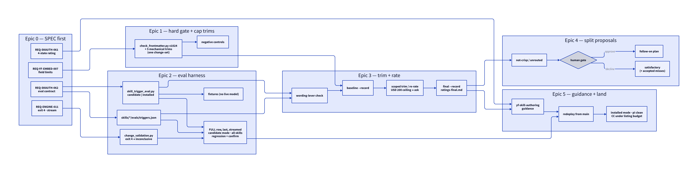

# Plan: Enforce the Agent Skills 1024-char description cap, add a crisp/satisfactory/unrouted/loose description rating with cross-harness trigger evals, and bring skill descriptions toward 600 chars (#407)

**ID:** plan-072-james-dixson-bae8de
**Author:** james-dixson
**Created:** 2026-09-24
**Status:** executing
**Deliverable-class:** standard
**Epic:** yf-mol-t42s
**Fingerprint:** dcbd16e3cbc5f42f9050deff697c61611005ab4501941a694d7707a3154d5545

## Objective
Make skill `description` size a specified, enforced, and measured property of every
shipped skill:

1. **Hard gate (SPEC-first):** every `skills/*/SKILL.md` `description` is ≤1024 chars, and
   `name` meets the Agent Skills spec (≤64, `[a-z0-9-]`, no leading/trailing/double hyphen,
   equals the parent dir). Enforced mechanically by `scripts/check_frontmatter.py` in the
   FAST and FULL validation tiers.
2. **Rating:** a four-state description rating judged by *measured* trigger behaviour, not
   length alone (D1, revised at pass-1):
   - **crisp**: description ≤600 chars AND triggers correctly on every declared intent;
   - **satisfactory**: description ≤1024 chars AND triggers correctly on every declared intent;
   - **unrouted**: description ≤1024 chars but some intent triggers below 0.5 on some harness;
   - **loose**: description >1024 chars (fails the hard gate).
   New skills target crisp. A not-crisp or unrouted skill goes to a split proposal. If the
   operator declines it, it is accepted as satisfactory, with any missed intents named.
3. **Trigger evals:** a per-skill intent set (should-trigger + near-miss should-not-trigger)
   run against both **pi** and **claude-code**, producing the rating.
4. **Remediation:** trim all five over-cap descriptions below 1024, make a best effort to bring
   every description under 600 without losing trigger fidelity, and treat "cannot reach
   satisfactory/crisp without losing fidelity" as a signal the skill is too broad — a
   split/refactor candidate put to the operator.

## Motivation
Five shipped skills exceed the Agent Skills spec's 1024-char `description` cap (#407):
`yf-drift-check` 1325, `yf-skill-authoring` 1319, `yf-okf` 1209, `yf-beads-upstream` 1183,
`yf-change-validation` 1136. pi v0.87.1 enforces the cap (`MAX_DESCRIPTION_LENGTH = 1024` in
`dist/core/skills.js`) and warns on every startup; Claude Code does not enforce 1024, so the
drift went unnoticed. Nothing in the repo checks field lengths: `check_frontmatter.py` validates
structure only (REQ-YF-EMBED-003).

Length also has a cost where it isn't enforced. Every description is loaded into every
session's system prompt. Claude Code caps each listing entry at 1,536 chars and budgets the
whole listing (~1% of context by default), silently dropping descriptions on overflow. The yf
corpus is ~16.6K chars across 20 skills; 15 of the 20 exceed 600.

But the descriptions are the routing surface — several encode deliberate negative routing
between sibling skills (drift-check / change-validation / optimal-instructions /
skill-authoring; okf / okf-hygiene). Trimming by character count alone risks silent routing
regressions, so the remedy must measure trigger fidelity on both harnesses rather than assume
it. A description that cannot be made short without losing fidelity is evidence of a skill
covering too much, which is a design question for the operator, not a wording one.

Review of #407 (corrections and gaps) is posted as issuecomment-5822003298.

## Upstream Issues
| Issue | Title | Disposition | Notes | Resolved By |
|-------|-------|-------------|-------|-------------|
| #407 | Five skill descriptions exceed the Agent Skills 1024-char cap | include | The plan's subject; scope widened per operator to a rating + evals + ≤600 best effort | 0.3, 1.1, 3.2 |
| #302 | plan NUMBER is count-based and collides | exclude | Hit at init: plan-070 is absent, so `get_next_index()` returned 071, colliding with landed plan-071-james-dixson-d19ce8. Folder renamed by hand to plan-072. Evidence added for #302, not fixed here | |
| #189 | Six shipped scripts have no tests | exclude | Adjacent: this plan adds negative-control tests for the new `check_frontmatter.py` rules, but does not take on #189's list | |

The remaining 38 keyword matches from the triage scan (`upstream-triage.md`) are unrelated and excluded.

## Investigation Findings
**EXP-005 candidate injection (complete)** — [findings/exp-005-candidate-description-injection.md](findings/exp-005-candidate-description-injection.md).
A trim can be rated before deploy. pi: `--no-skills --skill <dir>`. CC: a project
`.claude/skills/` copy **plus `--setting-sources project`**. Without that flag, CC silently
shadows the candidate with the user-scope install, and `--plugin-dir` lists both versions.
The eval must verify the loaded text is the candidate. Isolation drops the operator's other
skills and CC's rules aggregate, so ratings name their **mode**: candidate (isolated, all
20 yf candidates together) vs installed (full config).

**EXP-004 CC listing budget (complete)** — [findings/exp-004-cc-listing-budget.md](findings/exp-004-cc-listing-budget.md).
`--debug-file` shows `Skill listing over budget: 50 skills, 33313 chars > 30000 budget` on
the operator's machine today. yf is 16,898 chars (51%) of it, so the trims bring the listing
under budget. CC eval runs must record whether that WARN fired.

**EXP-003 baseline (complete)** — [findings/exp-003-baseline-trigger-fidelity.md](findings/exp-003-baseline-trigger-fidelity.md).
21 intents × 3 reps × 2 harnesses against the current descriptions of the six sibling
skills: **CC 59/63, pi 57/63, near-misses 18/18, one wrong-sibling activation in 126
runs.** All misses are "agent did the task without a skill" (pi D3, O1; CC O2), not
confusion between siblings, so on this evidence none of the six is a split candidate.
The harnesses load different always-on surfaces: CC's rules aggregate has 9 yf protocol
blocks (including the drift-check / change-validation / instructions triggers), pi's has 4. So a
pi pass is the stricter test of the description alone. "Triggers on all intents" needs a
rate threshold, not 3/3.

**EXP-001 (resolved by EXP-003).** Detector: CC `Skill` tool_use, or tool arguments referencing an
installed `skills/<n>/` path, or `yf skill-dir <n>`. On CC, 39 of 50 passes were a `Skill`
call, 11 were direct script use via `yf skill-dir` (the skill in use without a `Skill`
call). Intents need fixture state.

**EXP-002 (partial)** — [findings/exp-002-eval-cost-and-runtime.md](findings/exp-002-eval-cost-and-runtime.md).
CC 23.6 s/run, about $0.22/run; pi 13.3 s/run on EXP-003's 14%-near-miss mix. The operator first
confirmed D3 on that projection (~2.4 h, ~$55–90). **Corrected at pass-1 C8** for D3's 50/50 mix: CC
31.4 s/run and pi 21.8 s/run, which gives ~3.1 h wall and ~$75–110 CC at list rates per FULL run. The operator
re-confirmed D3 at the corrected cost (see D3).

**EXP-001 pilot (preliminary, superseded)** — [findings/exp-001-pilot-herdr-trigger-observation.md](findings/exp-001-pilot-herdr-trigger-observation.md).
herdr tabs `cc-eval` (claude-code) and `pi-eval` (pi) are live, and their session JSONL is a
reliable activation signal. One drift-check intent: pi read `yf-drift-check/SKILL.md` first.
CC routed toward it but made no `Skill` call because the intent's precondition (a real
SPEC edit) was absent, so **intents need fixture state**. pi warns on the five over-cap skills
and still loads them.

_Experiments identified (pre-investigation checkpoint):_

- **EXP-001 — Headless trigger observation.** Can a skill's activation be observed
  reliably and non-interactively on both harnesses? claude-code 2.1.282: `-p
  --output-format stream-json`, detect a `Skill` tool_use naming the skill. pi 0.87.1: `-p
  --mode json`, detect a read of the skill's `SKILL.md` (pi has no Skill tool). Both under a
  sandboxed `HOME` carrying only the repo's `skills/` tree. Must also decide how to stop a
  run once the routing decision is made (tool denial / turn cap) so the eval measures
  routing rather than doing the task.
- **EXP-002 — Cost and runtime of "FULL tier, always".** Measure seconds and tokens per
  invocation on each harness, then project 20 skills × ~16–20 intents × N runs × 2
  harnesses. Determine whether FULL runs anywhere unattended (CI) where harness credentials
  are absent, and what the eval does there (INCONCLUSIVE vs FAIL).
- **EXP-003 — Baseline fidelity pilot.** On the sibling cluster (drift-check /
  change-validation / optimal-instructions / skill-authoring) and okf / okf-hygiene, run a
  small intent set against the current descriptions. Establishes whether today's
  descriptions already route correctly (so the trims have a baseline to regress from) and
  how noisy the run-to-run measurement is (drives N and the pass threshold).
- **EXP-004 — Claude Code listing budget.** Does the current corpus (~16.6K chars) already
  trigger CC's listing-budget drop under the operator's settings? If it does, the eval
  environment must reproduce the full installed skill set, not the yf tree alone, or it
  measures a best case.

## Approach
### Scoping decisions (operator, 2026-09-24)

| # | Decision | Choice |
| :-- | :-- | :-- |
| D1 | Rating tiers | **Revised after pass-1 C3, operator.** Four states, computed from measured trigger rates: **crisp** (≤600 chars, every intent ≥0.5 on both harnesses); **satisfactory** (≤1024, every intent ≥0.5); **unrouted** (≤1024, some intent <0.5 on some harness); **loose** (>1024). Epic 3 tries TRIGGER-wording fixes on an unrouted skill first. If it's still unrouted, it goes to the split gate. If the operator declines the split, they accept the specific missed intents with a reason, and the skill reports as `satisfactory (accepted misses: <ids>)`, so the misses stay visible |
| D2 | Hard gate | 1024-char description + full Agent Skills `name` rule in `check_frontmatter.py`, FAST+FULL tiers, `SKILL.md` only (not `agents/*.md`) |
| D3 | Eval placement | **FULL tier, always**: every FULL run re-evaluates every skill on both harnesses, 3 reps. Re-confirmed twice by the operator with measured cost: after EXP-002, and **again after pass-1 C8 corrected the projection** to the 50/50 trigger/near-miss mix. Corrected cost: CC 31.4 s/run and pi 21.8 s/run, measured, giving ~3.1 h wall in parallel and ~$75–110 CC at API list rates per FULL run. **Verdict rule revised after pass-1 C2 (operator):** regression plus confirmation. See REQ-SKAUTH-062 in the approach. Runs without harness credentials report INCONCLUSIVE, never PASS |
| D4 | Rating home | per-skill `skills/<name>/evals/triggers.json`: intents + last **recorded** result per harness + description hash + operator acceptances. The rating is derived, never hand-asserted. **Only an explicit `--record` run writes it.** The FULL row is read-only (pass-1 C13) |
| D5 | Trim scope | all 20 skills: five over-cap must reach ≤1024; best effort toward ≤600 for all, each verified by evals |
| D6 | Split handling | a skill that is not crisp after its best-effort trim, or that is unrouted, gets a recorded split proposal at a human gate. Approve → follow-on plan. Decline → satisfactory (or satisfactory-with-accepted-misses, D1), reason recorded |
| D7 | Harnesses | pi and claude-code, both required |
| D8 | Ordering | SPEC-first: `REQ-*` for gate, rating, and evals land before any checker/eval/trim code |
| D9 | Development eval spend | **Added after pass-1 C8 (operator).** Epic 3 re-rates are **scoped**: the edited skill's intents plus every near-miss that names it. One all-skill candidate run at the end. **Ceiling $200 at API list rates, measured, not estimated.** At the ceiling, execution **stops and asks the operator** whether to continue. The operator expects the real cost to be lower: the harnesses run on subscription plans where it isn't known when usage crosses into billed extra usage. So the plan measures actual token usage per run and reports it next to the list-rate figure, and treats the list-rate figure as the cautious upper bound until real usage is measured |

### Chosen approach

1. **SPEC first (Epic 0).** Four requirements, homed where their siblings live:
   - `REQ-YF-EMBED-007` (SPEC.md §3.2, next to `-003`, which already owns the frontmatter
     invariant and names `check_frontmatter.py` as its enforcer). The Agent Skills field
     rules on every `skills/*/SKILL.md`: `description` 1–1024, `name` 1–64, `[a-z0-9-]`, no
     leading/trailing hyphen, no `--`, equal to the parent directory name. **Length unit:
     UTF-16 code units of the parsed YAML scalar**, because pi measures JS `String.length`
     (pass-1 C14; equal to code points for all 20 today). Scoped to `SKILL.md` only (D2).
   - `REQ-SKAUTH-061` (`skills/yf-skill-authoring/SPEC.md`). The **four-state rating** (D1),
     defined over the *recorded* per-intent rates in `triggers.json` (≥3 reps, both
     harnesses, candidate mode), including operator-accepted misses and how they display.
   - `REQ-SKAUTH-062`. The **trigger-eval contract**:
     - *Intent schema:* should-trigger with an optional fixture, and near-miss naming its
       siblings.
     - *Detector:* a CC `Skill` tool call, or tool args touching `<staging-root>/<n>/`, an
       installed `skills/<n>/`, or `yf skill-dir <n>`. The staging root is an explicit
       detector input, and the repo's own `skills/<n>/` is never counted (pass-1 C5).
     - *Stop rule:* stop on activation, or at 6 tool calls, or at 150 s.
     - *Modes:* **candidate** stages every `skills/*/` from the checkout under test into a
       fresh staging dir, and the staging dir is cleared at every reset (C12). pi runs
       `--no-skills --skill <staging>/<n>` for each skill. CC runs with staging at
       `<clone>/.claude/skills/`, `--setting-sources project` and
       `--permission-mode bypassPermissions` and `--debug-file`. **CC load verification
       (revised at pass-2 C1).** CC's init `skills` lists only user-invocable skills, and five
       yf skills are `user-invocable: false`, so it cannot be the check. The harness instead
       requires, from the run's own debug log, the line
       `Loaded <N> unique skills (… user: 0, project: <N> …)` with N = the staged count
       (measured: `user: 0, project: 20` isolated vs `user: 39, project: 20` without
       `--setting-sources project`). It also requires init `permissionMode == bypassPermissions`,
       init `skills` ⊇ the staged user-invocable names, and a sha256 of every staged file taken
       immediately before launch. pi's stream carries each description, so pi is hashed
       directly. Any mismatch is INCONCLUSIVE. **Stated limitation:** on CC this proves the
       staged *files* were loaded and nothing else was, not the literal text the model saw.
       **installed** mode uses full operator config and is used only after deploy.
     - *Cell rate (pass-2 C6):* the fraction of reps with the **correct** outcome. For a
       should-trigger intent, the expected skill activated. For a near-miss, none of its named
       siblings activated.
     - *Spend (pass-2 C4, C8; source fixed at pass-3 C5):* every run appends to a persisted
       **spend ledger** (`--ledger <path>`, one JSON line per run) with harness, tokens (input /
       cache-write / cache-read / output) and `cc_usd` (a number, `0` for pi rows, never
       null). **CC token source:** the session **transcript**
       `~/.claude/projects/<cwd-slug>/<session-id>.jsonl` **plus every
       `<session-id>/subagents/*.jsonl`** (pass-4 C1: a run that calls `Agent` puts those
       tokens there; measured: main-only priced $0.288 against a recorded $0.673). The run is
       started as `--session-id <uuid>` and read after the process exits, each file
       **deduplicated by `message.id`** (the last usage per id wins). It is **never** the stream's `result`
       event, because a run killed at activation emits no `result` (measured: 50 of 63), and it
       is never the raw stream sum, because stream `usage` repeats per content block and
       carries placeholder output counts (measured: stream 8 output tokens vs transcript 204
       for the same message). **CC USD** = tokens × per-class rates for `claude-opus-5-5`: input $4.00/Mtok, cache-write
       **1h** $8.00, cache-write **5m** $5.00 (priced from `usage.cache_creation.ephemeral_{1h,5m}_input_tokens`),
       cache-read $0.20, output $20.00. measured at pass-4: these reproduce all 13 completed
       EXP-003 runs' `modelUsage.costUSD` (max abs error 5.6e-17) and the subagent run
       (main + subagents, $0.6732 = recorded $0.6732). The rates are stored in
       `scripts/checks/trigger_eval_rates.json` keyed by model, and a model not in the table
       is INCONCLUSIVE, never $0. pi reports tokens only, because its provider returns
       `cost: 0`. `--budget-usd` reads the ledger's cumulative CC total, so the ceiling holds
       across invocations. The listing-budget WARN (EXP-004) is recorded **in
       installed mode only**, because a 20-skill candidate listing cannot reach the 30K budget
       (pass-2 C9).
     - **FULL-row verdict (D3, C2):** evaluate every cell (skill × intent × harness) at 3
       reps, then re-run 3 more reps for any cell below 0.5 **whose recorded rate was
       ≥0.5**. FAIL only if the pooled 6-rep rate is still <0.5, which is a regression.
       Cells recorded as operator-accepted misses never FAIL. **Stated false-FAIL rate, as a
       function of the cell count N** (pass-3 C7, formula corrected at pass-4 C2): a cell
       false-FAILs when its first 3 reps have ≤1 correct (a) **and** the pooled 6 have ≤2
       correct (a + c ≤ 2), so q = Σ_{a≤1} Σ_{c≤2−a} Bin(3,p)(a)·Bin(3,p)(c) and the rate is
       1 − (1 − q)^N. That is ≈1.65% at N=240 and p=0.95, ≈21.9% at N=240 and p=0.90. `--report` prints the actual N
       and the implied rate at the measured per-run reliability.
     - *Other verdicts:* INCONCLUSIVE when a harness binary or its auth is missing, or on a
       staging mismatch. PASS only on a completed run.
   - `REQ-ENGINE-011` (`skills/yf-change-validation/spec/engine.md`, pass-1 C7, revised at
     pass-2 C2/C3). Two **per-row, opt-in** attributes in a new fifth §1 column `flags`
     (REQ-SCHEMA-002 amended; an absent column means no flags):
     - `inconclusive-exit=4` maps that row's exit 4 to `inconclusive`. **Only the eval row
       sets it.** Every other row keeps exit 4 = `fail`, which preserves plan-046's rule
       that pytest's exit 4 on a moved target is a loud failure.
     - `stream` tees the row's output live to the engine's **stderr only**. `--json` stdout
       remains exactly one JSON document, which protects `_validate_merged`'s
       `json.loads(stdout)`. Measured at pass-2: a progress line on stdout made an engine
       FAIL parse as unparseable, fall through to tier 3, and land as `pass`.
     `_validate_merged` is **unchanged**, and an INCONCLUSIVE tier still halts L3. **Stated
     limitation (R1):** `_validate_merged` captures the engine's output, so live progress is
     visible when the operator runs the FULL tier directly (Issue 5.2), not at L3. The
     tier-3 fall-through on unparseable output is filed as a follow-on (Issue 5.6).
2. **Hard gate + the five cap trims, one change-set (Epic 1, pass-1 C10).** Extend
   `check_frontmatter.py` and trim the five over-cap descriptions to ≤1024 in the same
   issue, so no commit leaves the tree red. This first trim is a mechanical cut
   (redundancy, restated axes, rationale moved into the SKILL.md body). It is **rated
   later** in Epic 3, which can still revise it. Negative controls for every rule.
3. **Eval harness (Epic 2).** Promote the EXP-003 tooling to `scripts/checks/skill_trigger_eval.py`
   with committed, trimmed fixtures (tool-call events only, ~115 KB for all 126 runs) so its
   tests need no live model and no `~/.cache` (pass-1 C4). Author
   `skills/*/evals/triggers.json` for all 20 skills. Wire the FULL row as **candidate mode**
   against the checkout under test (pass-1 C1). It goes **last** in the FULL list, with
   `stream: yes` and an explicit `timeout`.
4. **Trim + rate (Epic 3).** First, the check EXP-003 recommended: re-run the three known
   misses (pi D3, pi O1, CC O2) with only TRIGGER wording changed, to confirm wording is the
   lever. Then the baseline `--record`, then scoped trim/re-rate loops under the D9 ceiling,
   then one all-skill final `--record`.
5. **Split gate (Epic 4).** For not-crisp and unrouted skills (D6).
6. **Guidance + land (Epic 5).** `yf-skill-authoring` guidance; redeploy from `main`;
   installed-mode verification on the operator's machine (pi: no `[Skill conflicts]`; CC:
   no `Skill listing over budget`).

**Deliberately out of scope:** closing the pi-vs-CC rules-aggregate asymmetry (EXP-003
implication 3). It changes what the evals measure, so it is filed as a follow-on (Issue 5.4).
Skill splits themselves go to follow-on plans (D6).

D3 is settled. Its cost is an accepted property of the FULL tier, not a risk to scope down.
The plan makes it *bearable*: the two harnesses run in parallel, sessions stop on activation,
output streams live, and confirmation re-runs happen only for regressions. It must not
silently weaken the tier.

## Epics

> **Execution mode is in-place** (`.yf/plan/config.local.json` → `execute.worktree: false`),
> so Issue 0.1 cuts and checks out the execute branch before any SPEC commit (precedent:
> plan-068 Issue 0.1). Scratch eval clones live under `~/.cache/yf-trigger-eval/`, outside the
> repo, with the origin remote removed.

> **Declared REQ exemptions** (pass-3 C1): `no-req-required` {5.5}. Each member carries its reason in its own body.

### Epic 0: SPEC-first
- Issue 0.1: Cut and check out `plan-072-james-dixson-bae8de-execute` from `main` in the primary checkout, and record the base SHA to `assets/execute-base.txt`. First, before every SPEC edit: in-place mode has one address space, so an earlier commit would land on `main`.
- Issue 0.2: Confirm the four allocated ids are free (`REQ-YF-EMBED-007`, `REQ-SKAUTH-061`, `REQ-SKAUTH-062`, `REQ-ENGINE-011`) and record them in `assets/req-allocation.md`. If any is taken, allocate the next free one and record it. SC1 reads this file.
  - depends-on: 0.1
- Issue 0.3: SPEC.md §3.2: add `REQ-YF-EMBED-007` (Agent Skills field rules on `skills/*/SKILL.md`; UTF-16 length unit; enforced by `scripts/check_frontmatter.py` in FAST+FULL; `agents/*.md` excluded, with the reason). Open the root `SPEC.md` **plan-072 amendment-log entry** citing #407, carrying **one bullet per Epic-0 id**: `REQ-YF-EMBED-007` (here), plus `REQ-SKAUTH-061`, `REQ-SKAUTH-062`, `REQ-ENGINE-011` and `REQ-SCHEMA-002` pointing to the skill SPEC that owns each one's text (0.4–0.6 add them). `check_amendment_log.py` reads only the root entry (pass-3 C2; precedent: the plan-06x root entries name skill-SPEC ids the same way). Add the recipe rows `gate-plan072-amendment` (`uv run scripts/check_amendment_log.py --plan plan-072-james-dixson-bae8de`) and `gate-plan072-reqcoverage` (`uv run scripts/checks/check-req-coverage.py --min-issues 20 docs/plans/plan-072-james-dixson-bae8de`) to FAST+FULL, with §3 rows for `SPEC.md`, `skills/yf-skill-authoring/SPEC.md`, `skills/yf-change-validation/spec/*.md` and `docs/plans/plan-072-james-dixson-bae8de/**`. These rows read the in-flight plan folder, so they are satisfiable only because this repo executes **in place** (`execute.worktree: false`), not from an execute worktree (CHANGE-VALIDATION §1; pass-4 Missing). Remove them after landing, as the plan-06x rows were.
  - depends-on: 0.2
  - resolves-upstream: #407 (include)
- Issue 0.4: `skills/yf-skill-authoring/SPEC.md`: add `REQ-SKAUTH-061`, the four-state rating (D1): crisp / satisfactory / unrouted / loose over recorded rates; operator-accepted misses and their display; new skills target crisp. Living-amendment entry.
  - depends-on: 0.2
- Issue 0.5: `skills/yf-skill-authoring/SPEC.md`: add `REQ-SKAUTH-062`, the eval contract exactly as the Approach states it (schema; detector with explicit staging root; stop rule; correct-outcome cell rate; candidate/installed modes with CC `--setting-sources project` + `--permission-mode bypassPermissions` + the debug-log `user: 0, project: N` load check, the stated limitation, and pi description hashing; the spend ledger; the listing WARN in installed mode only; the FULL regression-with-confirmation verdict and its stated false-FAIL rate; INCONCLUSIVE cases; `--record` as the only writer). Plus the SPEC.md amendment-log line that the FULL tier carries the eval row (D3).
  - depends-on: 0.2
- Issue 0.6: `skills/yf-change-validation/spec/engine.md`: add `REQ-ENGINE-011` (per-row opt-in `flags` column: `inconclusive-exit=4` and `stream`, which goes to stderr only with `--json` stdout staying one document). Amend `REQ-SCHEMA-002` in `spec/schema.md` for the fifth column. Amendment entry in that skill's SPEC.
  - depends-on: 0.2

### Epic 1: Hard gate and the five cap trims
- Issue 1.1: In one change-set: (a) extend `scripts/check_frontmatter.py` to enforce `REQ-YF-EMBED-007` on `skills/*/SKILL.md` only, measuring the parsed scalar in UTF-16 units, reporting `description 1325 > 1024 (over by 301)`-style lines, and tagged with the REQ id; (b) trim `yf-drift-check`, `yf-skill-authoring`, `yf-okf`, `yf-beads-upstream` and `yf-change-validation` to ≤1024 by mechanical cuts only (restated axes, parentheticals, rationale moved into the SKILL.md body; no TRIGGER/SKIP clause deleted outright). The tree stays green at every commit.
  - depends-on: 0.3
- Issue 1.2: Negative controls: `scripts/test_check_frontmatter.py` with one fixture per rule (description >1024 in UTF-16 units, including an astral-character case; empty description; name >64; bad charset; leading hyphen; `--`; name ≠ dir) that the check must FAIL, plus an `agents/*.md` with a 2000-char description that it must PASS. FAST+FULL recipe row `frontmatter-tests` and a §3 glob for the test file.
  - depends-on: 1.1

### Epic 2: Trigger-eval harness
- Issue 2.1: `skills/yf-change-validation/scripts/change_validation.py`: implement `REQ-ENGINE-011` + the `REQ-SCHEMA-002` fifth column, with tests in `test_change_validation.py`. The tests cover: a row flagged `inconclusive-exit=4` exiting 4 → tier `inconclusive`; an **unflagged** row exiting 4 → `fail` (the pytest moved-target case); a `stream` row whose output reaches **stderr** before the row finishes; and `run --tier full --json` with a streamed row whose stdout still parses as exactly one JSON document.
  - depends-on: 0.6
- Issue 2.2: Ship `scripts/checks/skill_trigger_eval.py` implementing `REQ-SKAUTH-062`, promoted from `assets/exp-003/runner.py` + `rescore.py`. It takes `--mode candidate|installed`, `--harness pi|cc|both` (run in parallel), `--skills <csv>|all`, `--reps N`, `--record`, `--ledger PATH`, `--budget-usd N`, `--json`, and these **offline** (no model call) verbs:
  - `--validate-intents --min-trigger N --min-nearmiss N`: schema + count check over every `triggers.json`;
  - `--report`: computes each skill's four-state rating from `triggers.json`, plus the cell count N and the implied false-FAIL rate;
  - `--require-rated`: `--report` exits 1 if any skill lacks a recorded rating;
  - `--forbid <ratings csv>`: `--report` exits 1 if any skill's rating is in the set;
  - `--require-decision-for-noncrisp`: `--report` exits 1 if a not-crisp skill has no recorded operator decision. Exit codes: 0 PASS, 1 FAIL, 4 INCONCLUSIVE. Scratch clones and staging go under `~/.cache/yf-trigger-eval/`, with origin removed and staging cleared on every reset. Progress goes to stderr; stdout carries only the result. Every run appends tokens and CC list-rate USD to the ledger. When the ledger's cumulative CC total reaches `--budget-usd`, the harness stops and exits 4 with the spend so far.
  - depends-on: 0.5
- Issue 2.3: Tests that need no live model, in **`scripts/checks/test_skill_trigger_eval.py`**. Commit trimmed EXP-003 fixtures to `scripts/checks/fixtures/trigger-eval/` (tool-call events only, first 8 per run). Rewrite absolute paths to `$HOME`/`$STAGING`/`$CLONE` placeholders so the detector is tested with injected roots (pass-2 Missing). Assert per-intent totals CC 59/63 and pi 57/63. Also test:
  - a pi stream reading `<staging>/<n>/SKILL.md` counts as activation, and `skills/<n>/SKILL.md` does not;
  - staging is cleared on reset;
  - INCONCLUSIVE on a missing binary, on auth-failure text, on a CC init with `permissionMode != bypassPermissions`, on a CC debug log without `user: 0, project: <N>`, and on a pi description hash mismatch;
  - a **real** CC init event (captured at pass-2: 15 yf names with 20 staged) passes the user-invocable subset check;
  - confirmation re-runs happen only for regressed cells;
  - the near-miss cell rate is the correct-outcome rate;
  - the ledger accumulates across invocations and `--budget-usd` trips on the cumulative total;
  - CC spend comes from a transcript fixture with a **killed run** (no `result`) and **duplicated `message.id`s**, and equals the deduplicated total;
  - a **main + `subagents/`** transcript-pair fixture (from the pass-4 D1-manual run) prices to $0.6732, using the 5m and 1h cache-write classes;
  - the per-class rates reproduce the 13 recorded `modelUsage.costUSD` values to within 1e-9;
  - `--report`'s false-FAIL rate at N=240, p=0.95 is 0.0165 ± 0.0005, which is the two-stage formula;
  - a model missing from the rate table is INCONCLUSIVE;
  - the offline verbs `--validate-intents`, `--report`, `--require-rated`, `--forbid` and `--require-decision-for-noncrisp` each exit 1 on a fixture that violates them;
  - `--record` is the only writer.

  FAST+FULL recipe row `trigger-eval-tests`.
  - depends-on: 2.2
- Issue 2.4: Author `skills/<n>/evals/triggers.json` for all 20 skills. Each has ≥3 should-trigger intents (with fixtures where a precondition matters) and ≥3 near-miss intents naming siblings. The six from EXP-003 are seeded verbatim. Update each skill README's layout fence for `evals/` (the `e-readme-layout` check requires it).
  - depends-on: 0.5
- Issue 2.5: Wire the FULL-tier row, **last**, after every other FULL row this plan adds (`gate-plan072-*` from 0.3, `frontmatter-tests` from 1.2, `trigger-eval-tests` from 2.3; pass-4 C3). The row is `uv run scripts/checks/skill_trigger_eval.py --mode candidate --skills all --harness both --reps 3`, with `flags` `inconclusive-exit=4,stream` and `timeout` 21600 (6 h, about 2× the corrected projection). No FAST row. The FULL row writes no ledger and has no budget; D3's accepted cost governs it, not D9.
  - depends-on: 0.3, 1.2, 2.1, 2.2, 2.3, 2.4

### Epic 3: Trim and rate
- Issue 3.0: Create the development spend ledger `assets/spend.jsonl`, used by every Epic 3 invocation via `--ledger`. **3.1, 3.2, 3.3 and 3.4 all count against D9's $200 CC list-rate ceiling.** Projected, 3.2 and 3.4 are the large items (two all-skill records), so the operator is likely to be asked at the ceiling during 3.3 (pass-2 C4). That is expected, not a failure.
  - depends-on: 2.2
- Issue 3.1: Wording-lever check (EXP-003's recommendation): re-run pi D3, pi O1 and CC O2 in candidate mode with **only** TRIGGER wording changed on `yf-drift-check` / `yf-optimal-instructions`, 3 reps each. Record in `assets/wording-lever.md` whether the misses respond. If they don't, record that the lever is the rules aggregate (Issue 5.4), not the description.
  - depends-on: 2.4, 3.0
- Issue 3.2: Baseline `--record`: candidate mode, all 20 skills (post-1.1 text), both harnesses, 3 reps. Snapshot to `assets/ratings-baseline.json` with token usage and list-rate cost. This is the first spend against D9's ceiling.
  - depends-on: 1.1, 2.2, 2.4, 3.1
- Issue 3.3: Best-effort trim of all 20 toward ≤600, unrouted skills first (TRIGGER wording before length). Each attempt re-rates the edited skill's intents, every near-miss that names it, **and every intent of each skill that lists it as a sibling** (pass-2 C6: catches a trim that takes over a neighbour's intents). Accept a text only if no cell drops below 0.5 on either harness versus the baseline. Record the shortest accepted text per skill. **When the ledger reaches $200 CC list-rate, the harness exits 4**, the spend-ceiling gate asks the operator, and 3.3 resumes on approval (D9).
  - depends-on: 3.2
- Issue 3.4: Final all-skill candidate `--record` of the accepted texts. **If any cell regresses against the baseline** (pass-2 C6), revert that skill to its last accepted text and re-record that skill and its siblings, at most twice. If it still regresses, it goes to the split gate as unrouted. Then write `assets/ratings-final.md`: before/after chars and the four-state rating per harness for all 20, the list of not-crisp and unrouted skills with the measured reason (intent, harness, rate), and the ledger totals (CC tokens + list-rate USD, pi tokens).
  - depends-on: 3.3

### Epic 4: Split proposals
- Issue 4.1: For each not-crisp or unrouted skill in 3.4, write `assets/split-proposals/<skill>.md`: what the description carries that won't fit, the proposed split lines, and which intents each half would own. If 3.4 lists none, record that and close.
  - depends-on: 3.4
- Issue 4.2: Apply the operator's decisions from the split gate. **Approve** → file a follow-on upstream issue via `/yf-beads-upstream`. **Decline** → record `accepted` (+ accepted-miss intent ids for an unrouted skill) + reason + date in the skill's `triggers.json`.
  - depends-on: 4.1

### Epic 5: Guidance, follow-ons and landing
- Issue 5.1: `skills/yf-skill-authoring/SKILL.md` + reference: the length rules (`REQ-YF-EMBED-007`), the four-state rating (`REQ-SKAUTH-061`), how to run and `--record` the eval for a new or edited skill (`REQ-SKAUTH-062`), and the point that the description is routing, not documentation. Keep its own description within its rating.
  - depends-on: 0.4, 0.5, 3.4
- Issue 5.2: README/docs updates the drift manifest requires for the new script, the new recipe rows, `REQ-ENGINE-011`, and the `evals/` convention. Run the FULL tier on the execute branch before landing, **directly** (`change_validation.py run --tier full`), so the operator sees the streamed eval progress. This is the rehearsal of L3's run. A landing therefore pays for FULL **twice** (~6 h, ~$150–220 CC list-rate). That is stated and accepted under D3, not avoided by skipping the rehearsal (pass-2 C10).
  - depends-on: 1.2, 2.3, 2.5, 3.4, 5.1
- Issue 5.3: After landing and redeploy from clean `main` (the AGENTS.md preconditions), verify on the operator's machine: pi startup shows no `[Skill conflicts]`, the CC `--debug-file` log has no `Skill listing over budget` line, and an **installed-mode** eval run passes. Record the outputs in `assets/post-deploy.md`.
  - depends-on: 5.2
- Issue 5.4: File a follow-on upstream issue for the rules-aggregate asymmetry (pi carries 4 yf protocol blocks, CC carries 9; EXP-003), with the 3.1 wording-lever result as evidence. Via `/yf-beads-upstream`.
  - depends-on: 3.1
- Issue 5.6: File a follow-on upstream issue against yf-plan: `_validate_merged` falls through to tier 3 (`pass`, with a notice) when an **approved** manifest's engine output doesn't parse as JSON. Measured at pass-2: a red FULL can land green. It should be `fail`. Via `/yf-beads-upstream`.
  - depends-on: 2.1
- Issue 5.5: Post the #302 evidence (plan-070 is absent, so `get_next_index()` returned 071 and collided with the landed plan-071-james-dixson-d19ce8 at this plan's init) as a comment on #302. **No new REQ**: an upstream evidence comment changes no behavior in this repository (no-req-required).
  - depends-on: 0.1

## Gates
### Start Gate (mandatory)
- Type: human
- Approvers: operator

### Capability Gate: both harnesses are authenticated and runnable headless
- Type: auto
- Condition: `claude -p` and `pi -p` each complete a trivial prompt non-interactively on this machine
- Test: claude -p "Reply ok." >/dev/null 2>&1 && pi -p --no-session "Reply ok." >/dev/null 2>&1
- Blocks: 3.1, 3.2, 2.5
- Instructions: Frontloaded to execute start: every live eval depends on it, and it is decidable before any code runs. On failure, log in to the failing harness (`claude` → `/login`, `pi` → provider auth) and re-run.
- test_class: probe
- cwd: repo-root

### Capability Gate: development eval spend ceiling
- Type: auto
- Condition: The development spend ledger's cumulative CC list-rate total is below the current ceiling ($200 per D9, or a higher ceiling the operator has approved and recorded in `assets/spend-ceiling.txt`)
- Test: python3 -c "import json,pathlib as P;d=P.Path('docs/plans/plan-072-james-dixson-bae8de/assets');c=float((d/'spend-ceiling.txt').read_text()) if (d/'spend-ceiling.txt').exists() else 200.0;s=sum(float(json.loads(l).get('cc_usd') or 0) for l in (d/'spend.jsonl').read_text().splitlines() if l.strip()) if (d/'spend.jsonl').exists() else 0.0;raise SystemExit(0 if s<c else 1)"
- Blocks: 3.4
- Instructions: Auto while under the ceiling, so it normally never reaches the operator. When 3.3's harness exits 4 at the ceiling, this Test goes red. The operator then reviews the ledger's measured tokens next to the list-rate figure (D9: the subscription-plan cost may be much lower) and either writes a new ceiling to `assets/spend-ceiling.txt` (3.3 resumes) or stops. If they stop, the final record rates the texts accepted so far. Because of the ledger, this gate is decidable at any point in Epic 3.
- test_class: probe
- cwd: repo-root

### Capability Gate: split decisions
- Type: human
- Approvers: operator
- Condition: The operator has decided approve or decline for every proposal in `assets/split-proposals/`, and for each unrouted skill declined, which missed intents are accepted
- Test:
  (none — consent gate; authorization has no runnable test, so the resolver treats an empty Test as INCONCLUSIVE and waits for the operator)
- Blocks: 4.2
- Instructions: Mid-DAG by necessity: which skills need proposals is only known after Epic 3 measures the trims. Approve (a follow-on plan is filed) or decline with a reason (satisfactory, or satisfactory with named accepted misses for an unrouted skill). If 4.1 recorded no proposals, answer "none".
- test_class: consent
- cwd: repo-root

### Capability Gate: upstream writes
- Type: human
- Approvers: operator
- Condition: The operator authorizes three classes of outward-facing GitHub write on dixson3/yoshiko-flow: filing follow-on issues for approved skill splits, filing the rules-aggregate asymmetry issue, filing the validate_merged unparseable-output issue, and commenting the plan-number collision evidence on #302
- Test:
  (none — consent gate; authorization has no runnable test, so the resolver treats an empty Test as INCONCLUSIVE and waits for the operator)
- Blocks: 4.2, 5.4, 5.5, 5.6
- Instructions: Consent class, decidable at execute start because it authorizes the classes of write, not specific issue text. Answer it with the Start Gate. Each write then goes through `/yf-beads-upstream`'s previewed push, or `gh issue comment` with a quoted-heredoc body, read back after posting.
- test_class: consent
- cwd: repo-root

### Reconcile Gate
- Type: auto (all execution beads closed)
- Blocks: reconcile step

## Risks & Mitigations
| # | Risk | Severity | Mitigation |
| :-- | :-- | :-- | :-- |
| R1 | **FULL-tier cost and time (D3).** ~3.1 h wall and ~$75–110 CC at list rates per FULL run (corrected, pass-1 C8), every land-the-plane. | high | Accepted by the operator twice with measured numbers. Made bearable, not reduced: parallel harnesses, stop-on-activation, confirmation re-runs only for regressed cells, streamed stderr output (`REQ-ENGINE-011`) visible on direct runs (5.2) but **not at L3**, which captures the engine's output. Row placed last. Landing pays for FULL twice (rehearsal + L3), stated in 5.2. Each run reports token usage next to list-rate cost, so the real subscription-plan cost can be measured (D9). |
| R2 | **A trim is "verified" against the old text.** CC silently shadows a project skill copy with the user-scope install (EXP-005), and the FULL row would read installed skills at L3, before redeploy (pass-1 C1). | high | The FULL row runs **candidate** mode, staged from the checkout under test. Before scoring, the harness verifies CC's init (`permissionMode`, `skills` ⊇ staged) and pi's description hash; a mismatch is INCONCLUSIVE. Installed mode runs only after deploy (5.3). Issue 2.3 tests each path. |
| R3 | **Nondeterministic evals flap the FULL tier** (pass-1 C2: ~0.17 all-pass at 95%). | high | Regression-with-confirmation verdict (REQ-SKAUTH-062): stated false-FAIL rate ≈1.65% at 240 cells and 95% per-run reliability, ≈21.9% at 90% (the two-stage formula in REQ-SKAUTH-062, a function of N, printed by `--report`). Accepted misses never FAIL. |
| R4 | **Candidate mode ≠ what users get.** It drops other skills and the CC rules aggregate (EXP-005). | med | Every rating records its mode. Installed mode verifies the shipped result on the operator's machine (5.3). |
| R5 | **Runs without harness auth.** | med | Exit 4 → INCONCLUSIVE through `REQ-ENGINE-011`, and `_validate_merged` halts L3 on INCONCLUSIVE, so a FULL run whose evals could not run cannot land. CI (`ci.yml`) calls checkers by name and does not run the FULL tier, so it is unaffected. |
| R6 | **The hard gate turns red when it lands.** | low | Resolved structurally (pass-1 C10): Issue 1.1 carries the checker and the five cap trims in one change-set. SC2 is checked on the merged tree. |
| R7 | **Trims drop deliberate negative routing.** | med | Measured accept rule (no intent below 0.5 versus the baseline, on either harness); near-miss intents name siblings; 1.1's mechanical cut moves SKIP rationale into the SKILL.md body instead of deleting it; Epic 3 re-rates 1.1's text. |
| R8 | **Self-modification.** | low | AGENTS.md three-artifacts rule: no `yf skills install` / `yf self install` mid-execution. Redeploy only in 5.3, from clean `main`. |
| R9 | **Development spend runs away.** | med | D9: scoped re-rates, a persisted ledger, a $200 CC list-rate ceiling enforced cumulatively by `--budget-usd`, and an auto gate that reaches the operator only at the ceiling. The ledger reports measured tokens for both harnesses. |
| R11 | **CC candidate verification proves which files loaded, not the text the model saw** (pass-2 C1). | low | Stated as a limitation in REQ-SKAUTH-062. The `user: 0, project: N` debug-log line plus pre-launch hashes rule out the measured failure (shadowing by the user-scope install). pi hashes the text itself, so the stricter harness covers the gap. |
| R12 | **A new per-row `flags` column changes the manifest schema** for every consumer. | low | Optional fifth column; absent = no flags. REQ-SCHEMA-002 amended SPEC-first (0.6). The unflagged-exit-4 test (2.1) guards the existing rows. |
| R10 | **Candidate-mode CC runs with `bypassPermissions`** outside the operator's settings. | med | Only inside scratch clones under `~/.cache/yf-trigger-eval/` with origin removed, and sessions are killed at activation or 6 tool calls. Recorded in context.md Runtime assumptions. |

## Success Criteria
| # | Criterion | Verification | Discharged-by |
| :-- | :-- | :-- | :-- |
| SC1 | The four REQs are in their SPECs, as recorded in the allocation file | `test -r docs/plans/plan-072-james-dixson-bae8de/assets/req-allocation.md && grep -q 'REQ-YF-EMBED-007' SPEC.md && grep -q 'REQ-SKAUTH-061' skills/yf-skill-authoring/SPEC.md && grep -q 'REQ-SKAUTH-062' skills/yf-skill-authoring/SPEC.md && grep -q 'REQ-ENGINE-011' skills/yf-change-validation/spec/engine.md` -> exit 0 | 0.2, 0.3, 0.4, 0.5, 0.6 |
| SC1b | SPEC commits precede code commits on the execute branch | `B=$(cat docs/plans/plan-072-james-dixson-bae8de/assets/execute-base.txt); fs=$(git log --format=%H --reverse "$B..HEAD" -- SPEC.md skills/yf-skill-authoring/SPEC.md skills/yf-change-validation/spec/engine.md \| head -1); fc=$(git log --format=%H --reverse "$B..HEAD" -- scripts/check_frontmatter.py scripts/checks/skill_trigger_eval.py skills/yf-change-validation/scripts/change_validation.py \| head -1); test -n "$fs" && { test -z "$fc" \|\| git merge-base --is-ancestor "$fs" "$fc"; }` -> exit 0 | 0.1, 0.3, 0.5, 0.6 |
| SC2 | Every skill is within the hard limits, and the check enforces the tagged rule (pass-1 C9: not vacuously green) | `grep -q 'REQ-YF-EMBED-007' scripts/check_frontmatter.py && uv run scripts/check_frontmatter.py` -> exit 0 | 1.1 |
| SC3 | The hard gate is observed to fail on each rule | `test -f scripts/test_check_frontmatter.py && uv run scripts/test_check_frontmatter.py` -> exit 0 | 1.2 |
| SC4 | The engine maps a flagged row's exit 4 to inconclusive and streams opted-in rows, tested (pass-3 C3: not pre-green) | `grep -q 'REQ-ENGINE-011' skills/yf-change-validation/scripts/change_validation.py && grep -q 'inconclusive-exit' skills/yf-change-validation/scripts/test_change_validation.py && uv run skills/yf-change-validation/scripts/test_change_validation.py` -> exit 0 | 2.1 |
| SC5 | The eval harness is tested without live models and reproduces the EXP-003 scoring from committed fixtures | `test -f scripts/checks/test_skill_trigger_eval.py && uv run scripts/checks/test_skill_trigger_eval.py` -> exit 0 | 2.2, 2.3 |
| SC6 | Every skill has an intent set with ≥3 trigger and ≥3 near-miss intents | `test -f scripts/checks/skill_trigger_eval.py && uv run scripts/checks/skill_trigger_eval.py --validate-intents --min-trigger 3 --min-nearmiss 3` -> exit 0 | 2.4 |
| SC7 | The FULL tier's **last** row is the candidate-mode eval row, flagged and with its timeout (pass-3 C8) | `python3 -c "import sys;P=chr(124);t=open('CHANGE-VALIDATION.md').read();b=t.split('### full',1)[1].split(chr(10)+'## ',1)[0];r=[l for l in b.splitlines() if l.startswith(P+' ') and chr(96) in l];x=r[-1] if r else '';sys.exit(0 if all(s in x for s in ('skill_trigger_eval.py --mode candidate --skills all --harness both --reps 3','inconclusive-exit=4','stream','21600')) else 1)"` -> exit 0 | 2.5 |
| SC8 | The wording-lever check is recorded | `test -s docs/plans/plan-072-james-dixson-bae8de/assets/wording-lever.md` -> exit 0 | 3.1 |
| SC9 | No skill is loose or unaccepted-unrouted, and every skill has a recorded rating | `test -f scripts/checks/skill_trigger_eval.py && uv run scripts/checks/skill_trigger_eval.py --report --require-rated --forbid loose,unrouted` -> exit 0 | 3.2, 3.3, 3.4 |
| SC10 | Every not-crisp skill carries an operator decision | `test -f scripts/checks/skill_trigger_eval.py && uv run scripts/checks/skill_trigger_eval.py --report --require-decision-for-noncrisp` -> exit 0 | 4.1, 4.2 |
| SC11 | Aggregate description size fell, and spend is reported | manual: assets/ratings-final.md shows the corpus description total below the 16,898-char baseline with a per-skill before/after table, plus total eval spend as tokens and list-rate USD | 3.4 |
| SC12 | pi and CC start clean on the operator's machine after redeploy, and installed mode passes | manual: assets/post-deploy.md shows pi startup with no [Skill conflicts] block, a CC --debug-file log with no "Skill listing over budget" line, and an installed-mode eval PASS, all captured after the Issue 5.3 redeploy | 5.3 |
| SC13 | The authoring guidance is in the conventions skill | `grep -q 'REQ-SKAUTH-061' skills/yf-skill-authoring/SKILL.md && grep -q 'skill_trigger_eval' skills/yf-skill-authoring/SKILL.md` -> exit 0 | 5.1 |
| SC14 | FULL tier green on the merged tree | manual: land's L3 validate-merged reports PASS for the FULL tier, including the eval row, which is a ~3 h run and so is not smoke-runnable by ready-check | 5.2 |
| SC15 | The follow-ons are filed | manual: the rules-asymmetry issue (5.4) and the unparseable-output fall-through issue (5.6) exist, and #302 carries the collision evidence comment (5.5), all read back after posting | 5.4, 5.5, 5.6 |
| SC16 | Development spend is ledgered and stayed within the approved ceiling (pass-3 C6) | `test -s docs/plans/plan-072-james-dixson-bae8de/assets/spend.jsonl && python3 -c "import json,pathlib as P;d=P.Path('docs/plans/plan-072-james-dixson-bae8de/assets');c=float((d/'spend-ceiling.txt').read_text()) if (d/'spend-ceiling.txt').exists() else 200.0;s=sum(float(json.loads(l).get('cc_usd') or 0) for l in (d/'spend.jsonl').read_text().splitlines() if l.strip());raise SystemExit(0 if s<=c else 1)"` -> exit 0 | 3.0, 3.3 |
