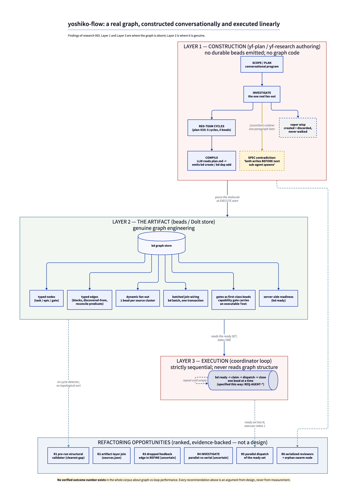

# Graph engineering as an emerging practice, and yoshiko-flow's implicit graph-engineering

Research project `003-graph-engineering-hypothesis`. Draft synthesis for bead `yf-mol-wpq`.
Evidence base: **47 external sources plus 43 single-observer reads of the repository under
audit** (90 entries in total), across four clusters, triangulated in
[artifacts/triangulation.md](artifacts/triangulation.md). The two figures are kept apart
throughout, because they carry very different weight: the 43 `YF-*` entries are one agent reading
one repository once. Repo observations are pinned to commit `efd2317`.

**This report was revised after red-team review** ([artifacts/critique.md](artifacts/critique.md)).
One factual claim about the chronology of `REQ-AGENT-046` was **false and has been removed**; the
framing of `REQ-AGENT-047`, the convergence count in Q1, the graph-shape reading behind Rank 5, and
the credibility disclosure were corrected. Two gap-fill retrievals were run at this stage
([FW-19](sources.md#fw-19) added, [FW-13](sources.md#fw-13) re-fetched). Per the d7 finding below,
evidence entering at REFINE is never re-triangulated and never re-critiqued, so both are flagged as
late arrivals wherever they are used.

**Declared deliverable:** an evidence-backed refactoring *opportunity assessment*. This report
surfaces opportunities with their supporting evidence and their evidentiary limits. It does
**not** propose a target architecture, and no recommendation below should be read as a design.

---

## Executive summary

"Graph engineering" is a label roughly four weeks old at retrieval measured from virality
(~2026-07-18), six weeks from its first recorded use (2026-07-04,
[PT-7](sources.md#pt-7)); retrieval was 2026-08-16
([artifacts/cluster-practitioner-trend.md](artifacts/cluster-practitioner-trend.md), Chronology).
It was applied backwards onto work that already existed — but the thing it names is not empty. The practitioner corpus has no
consensus definition and no two sources name the same primitive set, while the shipped-framework
corpus shows a small converged *implementation* vocabulary (typed node, declared edge, conditional
edge, run-scoped state) across the **six graph-native systems** among the eight surveyed — and even
inside that six there are named exceptions (see Q1). Those two facts are compatible: an agreed
API surface with an unsettled discourse. The single most important property of the corpus is what
it does **not** contain — after quarantining every unsourced or second-hand statistic, there is no
verified outcome number of any kind about graph-versus-loop performance
([PT-8](sources.md#pt-8), and § 1 C6 of triangulation). Every topology recommendation here is
therefore an argument from design, never from measurement.

On the yoshiko-flow question the answer is asymmetric and can be stated precisely. yf **constructs**
a real dependency graph in a real graph store, with typed nodes, typed edges, transactionally
batched fan-out and join wiring, gates as first-class beads, and server-side readiness computation
([YF-8](sources.md#yf-8), [YF-9](sources.md#yf-9), [YF-20](sources.md#yf-20),
[YF-22](sources.md#yf-22)). It then **executes** that graph with a strictly sequential,
one-bead-at-a-time `bd ready` -> claim -> dispatch -> close loop that never reads graph structure
and is specified that way as a SPEC requirement ([YF-29](sources.md#yf-29),
[YF-30](sources.md#yf-30), [YF-31](sources.md#yf-31)). The construction phases that contain yf's
richest control flow — five red-team cycles, the whole SCOPE/PLAN program, and the only genuine
parallel fan-out (INVESTIGATE) — happen entirely outside any graph representation
([YF-1](sources.md#yf-1), [YF-2](sources.md#yf-2), [YF-5](sources.md#yf-5)).

The most actionable single finding is not about parallelism. It concerns `REQ-AGENT-047` — the
requirement in which yf rejected a DAG walk. Read at `skills/yf-plan/spec/agents.md:74-77`, that
requirement governs the **red-team review agent**, and what it rejects is one thing, not two: an
authoring-time / review-time structural check of the plan graph ("a `requires:` key plus a walk
engine"). Nothing in it concerns a runtime executor. On that single axis, three independent shipped
systems — LangGraph, LlamaIndex, AutoGen — ship a pre-run structural validator, including the one
that most emphatically rejected DAGs as an *execution* model
([FW-1](sources.md#fw-1), [FW-12](sources.md#fw-12), [FW-19](sources.md#fw-19)); and yf's own SPEC
records the exact defect class such a validator catches occurring twice, in two separate plans, at a
time when **no reachability check of any kind existed** ([YF-42](sources.md#yf-42),
`skills/yf-plan/spec/agents.md:72`). The corrective written in response — `REQ-AGENT-046`
([YF-43](sources.md#yf-43)) — is itself a prose contract whose Verification clause is a
documentation check, and no test asserts that it fires.

One caution travels with that finding and cannot be removed from this corpus: the three peer
validators check a **runtime graph program** immediately before executing it; yf's analogue would
check a `plan.md`/bead DAG at **review time**, in a different substrate tier. No source in this
corpus makes that transfer, and this report does not establish it.

### Figure 1 — the three layers

The report's central structural claim in one view: the graph is genuine at Layer 2, and absent at
Layers 1 and 3. The ranked opportunities at the bottom are attached to the layer whose evidence
raises them. The figure is a rendering of findings argued and cited below — it introduces no claim
of its own, and the `[uncertain]` tags it carries are the same ones carried in the prose.



---

## Primary question 1 — Is "graph engineering" a coherent, converging practice with identifiable primitives, or a loose label applied post-hoc to existing orchestration ideas?

**Answer: both, on two different axes — and the axes must not be collapsed.** The *implementation*
vocabulary is converged and mechanically checkable. The *discursive* definition is not converged
and the label is demonstrably post-hoc.

### The label is post-hoc; the content predates it

The practitioner cluster's chronology, with a source id per event: a formal treatment on
2026-04-13 (arXiv 2604.11378, [PT-13](sources.md#pt-13)); an unnoticed naming of the phase on
2026-07-04, two weeks before virality ([PT-7](sources.md#pt-7)); the meme converted to an argument
on 2026-07-18 ([PT-5](sources.md#pt-5)); then a two-week burst of analysis — 07-20
[PT-9](sources.md#pt-9), 07-22 [PT-6](sources.md#pt-6), 07-24 [PT-10](sources.md#pt-10) /
[PT-11](sources.md#pt-11), 07-27 [PT-8](sources.md#pt-8) — followed by a tail of engagement content
that recycles the vocabulary without adding artifacts (08-10 [PT-1](sources.md#pt-1); 08-11 / 08-14
[PT-3](sources.md#pt-3) / [PT-2](sources.md#pt-2)), with one further field test on 08-12
([PT-12](sources.md#pt-12)). The credited origin post itself
([PT-4](sources.md#pt-4), ~07-18) was never retrieved and is quarantined. Full table:
[artifacts/cluster-practitioner-trend.md](artifacts/cluster-practitioner-trend.md), Chronology.
The incumbent vendor says so directly:

> "Graph engineering isn't a new idea. It's the latest name for a well established approach to
> building reliable agents." [PT-6](sources.md#pt-6)

> "It's the latest term to come out of X's AI content factory, joining prompt engineering, context
> engineering, harness engineering, and loop engineering." [PT-6](sources.md#pt-6)

Note the source's position: [PT-6](sources.md#pt-6) is LangChain's own blog, i.e. the incumbent
graph vendor arguing the label adds nothing new. That is a claim against the promotional interest
of a *label*, but for the commercial interest of the *product*.

Absence, scoped to where it was looked for: `plan.yaml` lists conference talks as a cluster target,
and **no talk, keynote, or recorded session on "graph engineering" surfaced in the practitioner
retrieval**. Search surface as disclosed by the cluster: providers exa `web_search_exa`,
`web_search_advanced_exa` and `crawling_exa`; the cluster records the target and the null result but
**not the individual query strings**, so the surface is only partly disclosed
([artifacts/cluster-practitioner-trend.md](artifacts/cluster-practitioner-trend.md), gap 3). The
supportable form is therefore "no talk surfaced in the practitioner retrieval", not "none exist".
[PT-7](sources.md#pt-7)'s "Nobody held a keynote for it" is *consistent with* that null result, but
it is a second assertion, not independent corroboration of a retrieval. Expected for a label this
young; recorded as a finding, not a gap.

### The discursive definition is not converged

The practitioner cluster's own summary is blunt: **no two sources name the same primitive set**
(9 sources tabulated). Three specific fractures:

| Fracture | Positions | Status |
|:---------|:----------|:-------|
| Acyclicity | "agent graphs are usually **not** DAGs" [PT-6](sources.md#pt-6) vs. "an **explicit static DAG**" [PT-13](sources.md#pt-13) | Substrate-correlated, see below |
| Novelty | Nothing new [PT-6](sources.md#pt-6) / the *authoring step* is new [PT-8](sources.md#pt-8) / a genuine phase change [PT-7](sources.md#pt-7) | Unresolved |
| Scope | Knowledge graphs are half the practice [PT-11](sources.md#pt-11) | **Uncorroborated** by the other 89 entries |

The scope fork deserves its label: [PT-11](sources.md#pt-11) is a single `questionable`-tier
(55/100) project README asserting a definitional half — knowledge graphs, ontology, fusion — for
which zero material appears in the 18-source framework cluster, the 15-source comparative cluster,
or the other 12 practitioner sources. Single-source claim, uncorroborated.

[PT-8](sources.md#pt-8)'s "the authoring step is new" claim is likewise **uncorroborated across all
90 entries**: nothing in the corpus documents a drawing-to-graph compiler. Single-source claim.

### The implementation vocabulary *is* converged

The framework cluster inventoried **8 systems'** shipped API surfaces and found a small converged
core — typed node, declared edge, conditional edge, run-scoped state — but that convergence holds
over the **graph-native** subset, not over all eight. The cluster's own wording carries the hedge:
"Four primitives appear, independently named, in every **graph-native** system surveyed". The
exceptions are in the cluster's own primitive table and are named here rather than averaged away:

| Primitive | Systems with a named API surface | Exceptions |
|:----------|:---------------------------------|:-----------|
| Typed node / step unit | 8 of 8 | — |
| Static (declared) edge | 6 of 8 | DSPy: `none`. LlamaIndex: *inferred* from event types, not declared |
| Conditional edge / router | 6 of 8 | DSPy and LlamaIndex express it as ordinary host-language control flow |
| Run-scoped shared state | 7 of 8 | AutoGen GraphFlow: **no evidence found** in the retrieved material |

The two systems missing the declared edge — LlamaIndex and DSPy — are exactly the two the cluster
elsewhere calls "the two that reject graphs". **The defensible headline is a converged
four-primitive core across the six graph-native systems of the eight surveyed, with run-scoped state
unattested in one of those six.** It is not "eight independent systems", and it is not "under 8
different names". The reference statement:

> "You define the behavior of your agents using three key components: 1. `State` ... 2. `Nodes` ...
> 3. `Edges` ... In short: *nodes do the work, edges tell what to do next*."
> [FW-1](sources.md#fw-1)

Conditional routing in particular is mature enough to have grown predicate DSLs — six independent
systems implement it (triangulation § 1 C4, **Strong**):

> "Conditions are evaluated in the order they are specified, and the first one that evaluates to
> True will be the transition that is selected" — plus a shipped DSL (`when(age__gte=18)`,
> `expr('epochs>100')`, `default`, `~`) [FW-10](sources.md#fw-10)

> "| Conditional | `.branch([[cond, step]])` | Execute first step whose condition is true |"
> [CE-7](sources.md#ce-7)

[FW-10](sources.md#fw-10) is first-party Burr documentation and is what carries this finding.
[CE-7](sources.md#ce-7) is DeepWiki — machine-generated documentation, scored 58 (`questionable`) —
and is reproduced only to show a second vendor's spelling of the same primitive. A **Strong** label
on C4 rests on the first-party legs, not on it.

**Two caveats that reduce the apparent strength of the cross-cluster agreement.** First, part of the
node/edge/state agreement is a single vendor talking to itself: [PT-6](sources.md#pt-6) is
LangChain's blog and [FW-1](sources.md#fw-1) through [FW-7](sources.md#fw-7) are LangChain's docs.
LangChain appears in **all three** web clusters and is the corpus's most over-represented voice;
agreement between those legs is not independent corroboration (triangulation § 0). After removing
it, the independent practitioner legs are [PT-7](sources.md#pt-7), [PT-8](sources.md#pt-8),
[PT-12](sources.md#pt-12), [PT-13](sources.md#pt-13) and the independent framework legs are
[FW-8](sources.md#fw-8), [FW-10](sources.md#fw-10), [FW-12](sources.md#fw-12),
[FW-15](sources.md#fw-15) — both at least 3, so the finding survives, but not at the apparent
strength. Second, the practitioner corpus does **not** independently converge on the fourth
primitive (conditional edge / router): three of nine sources do not distinguish it from an ordinary
edge. Third, a structural residual that survives both of the above: the cluster's primitive table
uses **LangGraph's vocabulary as its reference column**, and LangGraph supplies 7 of the framework
cluster's 19 sources. To that extent the "converged core" is partly a measurement of how much of
LangGraph's API the other systems reimplement — a weaker claim than independent convergence.

### The acyclicity fracture resolves into a substrate distinction

This is the triangulation's genuinely new arrangement, and it matters for yf. Six independent
systems ship cycle-with-exit-condition, which settles the general case against
[PT-13](sources.md#pt-13)'s static-DAG proposal — but the systems that ship cycles are all
**in-process runtimes**, and the systems that stay acyclic are all **tracker-as-store**:

> "the graph is static and acyclic; all conditional/computed structure happens in the *generator*"
> — clu [CE-13](sources.md#ce-13)

yf is the same shape by construction ([YF-12](sources.md#yf-12)). So [PT-6](sources.md#pt-6)'s
"agent graphs are usually not DAGs" is a claim about in-process runtimes; yf and clu are not
counter-examples to it, they are a different substrate. `[uncertain]` — four systems is a small
sample, and yf and clu may share an ancestor rather than have converged (triangulation § 6.4).

**Verdict on Q1.** Coherent as an implementation vocabulary (mechanically checkable across the six
graph-native systems of the eight surveyed, with the exceptions named above). Not coherent as a defined practice (no consensus definition, three live fractures,
one of them uncorroborated). The label itself is post-hoc, on the incumbent's own testimony.
The corpus's own most defensible characterization:

> "Treat graph engineering as convergent practice with a sound theoretical basis rather than as a
> proven method, and you will make better decisions than the people treating it as either
> revelation or hype." [PT-8](sources.md#pt-8)

---

## Primary question 2 — Do yf-plan and yf-research CONSTRUCT their programs via graph-engineering procedures?

**Answer: partially, and the split is sharp. The construction *procedures* are largely
conversational; the constructed *artifact* is a real graph. Where the skills do build graph
structure, they build it correctly.**

### What is genuinely constructed as a graph

yf-research's RETRIEVE phase performs a real dynamic fan-out — one bead per source cluster, emitted
from a shell loop — and then wires a real join through a single batched transaction:

```bash
DEP_OPS=""
for rid in "${RETRIEVE_IDS[@]}"; do
  DEP_OPS+="dep add ${TRIANG_ID} ${rid}\n"
done
[ -n "$DEP_OPS" ] && printf '%b' "$DEP_OPS" | bd batch -m "yf-research ${EPIC} retrieve wiring"
```

[YF-9](sources.md#yf-9), spec'd as REQ-PHASE-003/004 [YF-10](sources.md#yf-10). Runtime DAG
extension exists as a declared capability:

> "REQ-PHASE-005: REFINE may extend the DAG at runtime by spawning new RETRIEVE beads via
> `--deps discovered-from:<refine-id>` when the red-team identifies gaps." [YF-11](sources.md#yf-11)

Gates are first-class node types with a two-bead compile artifact [YF-23](sources.md#yf-23),
including capability gates that carry an executable `Test:` command
[YF-24](sources.md#yf-24) and a reconcile gate that auto-resolves as a predicate edge
[YF-25](sources.md#yf-25).

This places yf on the majority side of a genuinely independent 4-artifact consensus on gate
placement (triangulation § 1 C2, **Strong**) — the store-backed placement, in which the store
refuses to advance rather than a runtime raising an interrupt:

> "The enforcement happens at the tool level: if a required design note isn't filled,
> `advance_item` returns an error. If a dependency isn't satisfied, the transition is blocked. ...
> Dependency ordering is enforced by the server — structurally, not by convention."
> [CE-14](sources.md#ce-14)

The practitioner corpus independently prescribes exactly this placement:

> "Treat humans as nodes. Approval deserves the same design attention as any other capability: an
> edge in, an edge out, a person in the middle. Bolting it onto the outside as an exception handler
> is how you get systems that technically have oversight and practically have none."
> [PT-7](sources.md#pt-7)

yf's capability gate with an executable test is *stronger* than clu's or task-orchestrator's, which
gate on human approval only ([CE-13](sources.md#ce-13), [CE-14](sources.md#ce-14)). This is an
existing strength, evidenced, and worth naming as such.

### What is not constructed as a graph

**The construction program itself contains no graph.** Both skills' authoring phases produce zero
durable beads:

> "PLAN-approval and EXECUTE are separated by a session boundary. Under the **intake-at-execute**
> model the molecule is **not** poured during INTAKE ... The `bd mol pour` and its human start gate
> are created at **EXECUTE start**" [YF-1](sources.md#yf-1)

Evidence from a completed bundle: plan-033 ran **five** red-team cycles, none of them a bead, a
gate, or a formula step — recorded only as `log.md` prose after the fact
[YF-2](sources.md#yf-2). The plan's poured epic contains 40 issues, all of them *execution* issues
[YF-3](sources.md#yf-3).

**There is no graph code.** `plan_manager.py` is 3525 lines containing no `bd create`, no
`bd dep add`, and no `bd mol pour`; its only `bd` subprocess calls are read-only or an
external-ref write ([YF-13](sources.md#yf-13), [YF-14](sources.md#yf-14)).
`research_manager.py` is 164 lines with two verbs [YF-15](sources.md#yf-15), by design:

> "`research_manager.py` is intentionally narrow — a defensive `json-get`."
> [YF-16](sources.md#yf-16)

The `plan.md`-DAG to bead-DAG translation is an LLM reading markdown and emitting `bd create` calls
[YF-18](sources.md#yf-18). **Absence confirmed** (a checkable `grep`): no graph builder, no
edge-list model, no topological sort, no cycle detector exists in either manager script
[YF-17](sources.md#yf-17).

**The one real fan-out is undone one paragraph later.** yf-plan INVESTIGATE is the only place the
skill dispatches N agents at once ([YF-5](sources.md#yf-5): "Independent experiments run in
parallel"), and the same file then imposes:

> "After each sub-agent returns: 1. Write finding ... 2. Update plan.md ... 3. **Both writes BEFORE
> next sub-agent spawns**" [YF-35](sources.md#yf-35)

These are in direct tension in the same phase of the same file. `[uncertain]` — which one an
executing agent honours is not determined; the repo carries no test asserting either
(triangulation § 2 X6). This is a **specification defect, not an evidentiary conflict**, and it
remains open.

Additionally, the fan-out's own graph representation is deliberately disposable: a `vapor`-phase
wisp burned at intake with output discarded ([YF-6](sources.md#yf-6), [YF-7](sources.md#yf-7)) —
i.e. created and destroyed without ever being walked.

**Verdict on Q2.** yf constructs a correct graph *artifact* through largely non-graph *procedures*.
The fan-out/join wiring and the gate model are real graph engineering and are on the majority side
of the corpus's strongest consensus findings. The authoring program around them — investigation
fan-out, five-cycle review loops, the whole PLAN phase — is a conversational program with a
disposable or absent graph representation.

---

## Primary question 3 — Are the produced artifacts themselves executable graphs, or graph-shaped data executed linearly?

**Answer: graph-shaped data in a real graph store, executed linearly. The graph is genuine; the
executor is not a graph executor.** This is the yf-codebase cluster's own verdict
(triangulation § 3.3). It gets **no credibility bonus for being unfavourable to the repo it
audits**: "evidence against interest" is a heuristic about human or commercial incentives, and a
subagent auditing a repository has no stake in the outcome. The verdict stands or falls on its
component absence findings, each of which is an independently checkable `grep`.

### The evidence that it is a real graph

A real graph store with typed nodes (`task` / `epic` / `gate` / `molecule`), typed edges (blocking,
parent, `discovered-from`), and **server-side readiness computation**
([YF-20](sources.md#yf-20), [YF-22](sources.md#yf-22)); durable resume pointers and a stuck-bead
sweep [YF-28](sources.md#yf-28) — the graph survives process death, which is the property that
distinguishes a program-graph from a diagram.

The readiness property is worth isolating, because it is a comparative strength. Systems that
recompute readiness from edges per query — `tk ready` [CE-12](sources.md#ce-12), `clu ready`
[CE-13](sources.md#ce-13), `bd ready` [YF-22](sources.md#yf-22) — are structurally immune to the
corruption class that hit AutoGen:

> "The GraphFlow coordination mechanism is interrupted before it can enqueue the next agent,
> leaving the system in an inconsistent state: Remaining work exists, No agents are enqueued, The
> workflow appears 'complete' but is actually stuck." [CE-6](sources.md#ce-6)

[CE-6](sources.md#ce-6) is a reproducible bug report against the vendor's own product with linked
fix PRs — evidence against interest, and the single most independent artifact in the comparative
cluster (adjusted to 75/100, triangulation § 3.2). Note the strength cap: the *prescription*
("store the edges, derive the readiness") has four supporting artifacts, but the *failure mode*
that motivates it has exactly one, so triangulation rates C8 **Moderate**, not Strong.

### The evidence that it is executed linearly

The consumer is a strictly sequential loop, quoted complete:

> "Repeat until `bd ready --json` returns no beads for this epic: 1. **Find ready work:**
> `bd ready --json` ... 2. **Claim the bead:** ... 4. **Dispatch the agent:** ... 6. **Close the
> bead:** ... 7. **Repeat** from step 1." [YF-29](sources.md#yf-29)

Every noun is singular. `bd ready` may return a set; the loop consumes one element and discards the
rest until the next iteration. yf-plan's coordinator is the same six-step cycle with gate handling
spliced in [YF-30](sources.md#yf-30). This is normative:

> "REQ-AGENT-010: The coordinator drives the bead DAG via a `bd ready` -> claim -> execute -> close
> loop. ... Verification: coordinator.md Loop section describes the **6-step cycle**."
> [YF-31](sources.md#yf-31)

What the walk does not do (each an absence confirmed by `grep`, i.e. `high_trust` per
triangulation § 3.3): no `bd graph` or `bd dep` read in either coordinator; no batching of a
ready-set into concurrent dispatches; no join/barrier logic; no retry, backoff, or per-node failure
policy ([YF-29](sources.md#yf-29), [YF-30](sources.md#yf-30)). The apparent parallelism in
`REQ-AGENT-011` is scheduling prose — "drain" means keep iterating the serial loop
[YF-32](sources.md#yf-32).

### Measured shape of the emitted graphs

| Epic | Bundle | Nodes | Edges | Layers | Layer widths (raw) | Max width, layer 0 excluded |
|:-----|:-------|--:|--:|--:|:-------------------|--:|
| `yf-mol-62k` | `docs/research/003-graph-engineering-hypothesis` (**this project**) | 14 | 15 | 9 | `[3,1,1,4,1,1,1,1,1]` | 4 |
| `yf-mol-3py` | `docs/research/002-harness-global-rule-minimization` | 15 | 17 | 9 | `[3,1,1,5,1,1,1,1,1]` | 5 |
| `yf-mol-y7f` | `docs/plans/plan-033-james-dixson-46aca2` | 40 | 38 | 16 | `[13,1,1,4,4,3,4,1,1,1,2,1,1,1,1,1]` | 4 |
| `yf-mol-e9q` | `docs/plans/plan-031-james-dixson-62a375` | 36 | 32 | 9 | `[11,2,2,6,10,1,1,2,1]` | 10 |

[YF-20](sources.md#yf-20); bundle paths resolved from each molecule's `bd` metadata. Layer 0 is
inflated by *container* epics, which carry no dependency edges at all
[YF-21](sources.md#yf-21) — hence the final column, which excludes it. The full widths vector is
published so that both readings below rest on the same disclosed data.

**Sample disclosure (n=4, and not four independent shapes).** Two of the four are research epics
poured from the *same formula*, so they are one shape sampled twice; and one of those two,
`yf-mol-62k`, is **this research project's own epic** — [YF-22](sources.md#yf-22) quotes its live
graph, which even contains the orphan `Swarm: yf-research` node this report reports below as defect
d8. The two plan epics are the only independent shapes in the sample.

Two readings, restated against the disclosed widths. Research epics are **a chain with one bulge**
(7 of 9 layers width 1; the bulge is the retrieve fan-out — the formula shape
[YF-4](sources.md#yf-4) realized verbatim). Plan epics have `|E| ~= |V|`, i.e. essentially a
**spanning forest** — near-tree, with only a handful of multi-parent joins. But *near-tree does not
imply narrow*, and the two sampled plan epics differ sharply from each other: excluding the
container layer, `yf-mol-y7f` never exceeds width 4, whereas `yf-mol-e9q` has **mid-graph layers of
width 6 and 10** (layers 3 and 4). **This corpus therefore does not bound the concurrency ceiling
for plan epics in either direction** — it shows one narrow plan epic and one with a ten-wide
concurrently-available layer. `[uncertain]` on interpretation — these are `verify`-tier interpretive
claims from a single observer (triangulation § 3.3).

The formula language as used expresses only single-predecessor chains: every `needs` array in
`yf-research.formula.toml` has exactly one element [YF-4](sources.md#yf-4), and
`plan-execute.formula.toml` contributes exactly **one** node, the start gate — 100% of the plan DAG
is dynamically injected by the model [YF-19](sources.md#yf-19).

### The ten linear-execution points

The cluster enumerated every place a graph-shaped artifact is executed linearly
([YF-29](sources.md#yf-29) d1, [YF-30](sources.md#yf-30) / [YF-31](sources.md#yf-31) d2,
[YF-33](sources.md#yf-33) / [YF-18](sources.md#yf-18) d3, [YF-6](sources.md#yf-6) /
[YF-7](sources.md#yf-7) d4, [YF-34](sources.md#yf-34) d5, [YF-2](sources.md#yf-2) d6,
[YF-12](sources.md#yf-12) d7, [YF-26](sources.md#yf-26) / [YF-22](sources.md#yf-22) d8,
[YF-35](sources.md#yf-35) d9, [YF-36](sources.md#yf-36) d10). Four are load-bearing for the
assessment below:

- **d5 — the two-pass review is serialized despite being structurally independent.** The two
  reviewers have disjoint context and disjoint verdict vocabularies by spec
  ([YF-37](sources.md#yf-37)) yet run "Two passes, **in order**", conformance before red-team
  [YF-34](sources.md#yf-34).
- **d7 — the REFINE feedback edge is cut.** The gap-fill retrieve is wired forward to `package`,
  not back to triangulate/synthesize/critique, so evidence retrieved by a gap-fill is never
  re-triangulated and never re-critiqued [YF-12](sources.md#yf-12). `[uncertain]` whether this is
  intentional; neither `spec/phases.md` nor `refiner.md` states a rationale.
- **d8 — `bd swarm` is constructed and never read.** `grep -rn "swarm" skills/` returns two lines
  and nothing else; in the live graph the swarm node is a disconnected orphan with zero in-edges
  and zero out-edges ([YF-26](sources.md#yf-26), [YF-22](sources.md#yf-22)).
- **d10 — the shared `sources.json` join has no merge semantics.** `retriever.md` instructs every
  cluster agent: "4. For each source found, record in `${research_dir}/sources.json`"
  [YF-36](sources.md#yf-36). With `mode: deep` and 4 clusters that is 4 writers to one file with no
  shard, lock, or merge strategy. The *hazard* is cited; the claim that it was patched by hand at
  dispatch time is **`[uncited]`** (it lives in an agent's dispatch prompt, not a repo file) and
  must not propagate as a repo fact.

Related: `discovered-from` is written but unreadable as a signal — the resilience contract declares
it unclassifiable ("there is no reliable bd-state signal separating disposable scratch from real
`discovered-from` work ... **No bead is ever auto-closed.**" [YF-28](sources.md#yf-28)), so it
functions as a write-only annotation.

### The one real graph algorithm

`close_cascade.py` is a genuine post-order DFS ([YF-38](sources.md#yf-38),
[YF-39](sources.md#yf-39)) — but it walks the **containment tree** (`bd children` / `--parent`),
not the dependency DAG, and it runs once, at teardown, after all execution is over. It is 241 lines
against `plan_manager.py`'s 3525 [YF-13](sources.md#yf-13).

**Verdict on Q3.** Graph-shaped data in a real graph store, walked by a linear scheduler: a
persisted, resumable, human-auditable task DAG — not an executable graph program. The degeneration
point is precisely one file per skill: `agents/coordinator.md`. This is a `verify`-tier interpretive
claim from a single observer, though its component absence findings are individually checkable.

---

## Secondary question 1 — Where and why does yf execution degenerate to a linear walk of a DAG?

**Where — one file per skill.** `skills/yf-research/agents/coordinator.md`
[YF-29](sources.md#yf-29) and `skills/yf-plan/agents/coordinator.md` [YF-30](sources.md#yf-30).
The graph store, the edges, the gates, and the readiness computation are all upstream of that file
and are all intact; the linearization is entirely in the consumer.

**Why — three distinguishable reasons, of differing evidentiary strength.**

1. **It is specified.** `REQ-AGENT-010` normatively requires the 6-step cycle and verifies against
   the prose describing it [YF-31](sources.md#yf-31). The linearity is chosen, not accidental — the
   strongest single piece of evidence being that a DAG-walk engine was explicitly considered and
   rejected ([YF-40](sources.md#yf-40), recorded again at project scope in the root SPEC's
   amendment log [YF-41](sources.md#yf-41)).
2. **The substrate constrains it.** yf sits in the tracker-as-store tier
   ([CE-12](sources.md#ce-12) through [CE-15](sources.md#ce-15)). *Tier definitions, used
   throughout this report and taken from the comparative cluster's own taxonomy:* **Tier A** =
   agent-graph runtimes (LangGraph, AutoGen GraphFlow, Mastra); **Tier B** = durable-execution
   engines (Temporal, DBOS, Restate); **Tier C** = tracker-as-execution-store systems (ticks, clu,
   task-orchestrator, yolo-runner — and yf). The tiers are a *substrate* classification, not an
   evidence-strength scale. In Tier C the corpus records a
   possible tier-wide boundary: no in-graph conditionals, no retry. **This must not be asserted as
   established** — it rests on one explicit statement ([CE-13](sources.md#ce-13)) and three
   silences, and silence in a README is weak evidence of absence (triangulation § 6.2).
3. **Conditionality is hoisted to generation time.** yf follows clu's "generation / instantiation
   split" — the graph stays static and acyclic and any language emits it
   ([CE-13](sources.md#ce-13), [YF-12](sources.md#yf-12), [YF-18](sources.md#yf-18)). Under this
   model a linear walk is *sufficient* for correctness, because all branching was already resolved
   before the pour. It is not sufficient for *throughput*, which is a different property.
   `[uncertain]`, carried forward from Q1: the generation/instantiation split rests on **one
   `questionable`-tier (55/100) project README** ([CE-13](sources.md#ce-13)). yf
   ([YF-12](sources.md#yf-12), [YF-18](sources.md#yf-18)) is a second *instance* of the pattern, not
   a second source for clu's claim — the same reasoning this report applies in Rank 2.

The distinction in (3) is the analytically important one: linear execution of a correctly-derived
readiness set is **correct**. What it forfeits is concurrency, per-node failure policy, and any
structural check of the graph before it runs.

---

## Secondary question 2 — What do comparable systems do at the graph layer that yf does not?

Presented as a gap inventory with the evidence and its strength attached. Every row is "not present
in yf per the cited repo reads" — an absence-in-this-repo claim, which is the yf cluster's
`high_trust` category.

| Capability | Comparable systems | yf status | Evidence strength |
|:-----------|:-------------------|:----------|:------------------|
| Parallel dispatch of a ready set | ticks (dependency waves), yolo-runner (concurrency from graph), Mastra `.parallel`, LangGraph super-step | Absent — one bead per iteration | Capability well attested (Tier A docs); Tier C legs are self-descriptions. **No outcome evidence at all** |
| Pre-run structural validation | LangGraph `.compile()`, LlamaIndex event-graph validation, AutoGen `graph_validate()` | Absent (rejected, see below) | 3 independent vendors; the third leg resolved at REFINE |
| Per-node retry / timeout / error handler | LangGraph `retry_policy` only | Absent | Rare everywhere — C7 Moderate-strong |
| Conditional edge evaluated at runtime | 6 systems, 6 names | One instance (reconcile gate) | C4 **Strong** |
| Loop / cycle with exit condition | 6 in-process runtimes | Absent by construction | Settled for in-process substrate only |
| Fork / time travel from a checkpoint | LangGraph, Burr | Absent | `[insufficient evidence]` — n=2, one cluster |
| Named join / barrier primitive | ADK `AddFanIn`, LlamaIndex `ctx.collect_events` | Present, via `bd ready` | yf is arguably ahead here |
| Sub-node resume | **None in this corpus** | Absent | C3 **Strong**, as an absence |

Three of these need their evidence stated carefully.

### Pre-run structural validation — the clearest gap

> "Compiling ... provides a few basic checks on the structure of your graph (no orphaned nodes,
> etc). ... You **MUST** compile your graph before you can use it." [FW-1](sources.md#fw-1)

> "Before a workflow runs, Workflows validates the event graph described by your step signatures.
> It checks that start and stop events are present, produced events have consumers, consumed events
> have producers" [FW-12](sources.md#fw-12)

The third leg — AutoGen's `Cycle detected without exit condition` — was **provisional at critique
time**: the framework retriever had surfaced the issue title only and never fetched the body
(triangulation § 4). A gap-fill retrieval at REFINE fetched it, and it resolves *in favour* of the
finding. The traceback in [FW-19](sources.md#fw-19) shows the check running inside `build()`,
before any execution begins:

```text
    graph = builder.build()
  ... _graph_builder.py", line 175, in build
    graph.graph_validate()
  ... _digraph_group_chat.py", line 206, in graph_validate
    self._has_cycles = self.has_cycles_with_exit()
ValueError: Cycle detected without exit condition: generator -> reviewer -> generator
```

That makes **three independent vendors** — LangGraph, LlamaIndex, AutoGen — each shipping a pre-run
structural check, which clears this report's own 3-artifact consensus bar. Two qualifications
travel with it. (a) [FW-19](sources.md#fw-19) entered at REFINE and therefore passed neither
triangulation nor critique — the d7 defect this report identifies, applied to itself. (b) It is a
third-party bug report, not vendor documentation: its evidentiary value is the verbatim traceback
naming shipped source paths and line numbers, which is mechanically checkable, not the reporter's
authority.

The load-bearing observation: **LlamaIndex, the system that most emphatically rejected DAGs as an
execution model, still ships a structural pre-run validator.** Rejecting the graph as an executor
and rejecting it as a validator are independent decisions everywhere else in the corpus.

**The transfer to yf is an argument by analogy that no source in this corpus makes.** All three peer
validators check a *runtime graph program* in-process, immediately before executing it, against a
typed API. yf's analogue would check a `plan.md` / bead DAG at *review* time, in a different
substrate tier. Whether such a check transfers across that gap — and whether its catch rate survives
the move — is not established here, and the argument for it is structural, not evidential.

### Sub-node resume — an absence, precisely scoped

Every system surveyed resumes at node/task granularity or coarser:

> "The node restarts from the beginning of the node where the `interrupt` was called when resumed,
> so any code before the `interrupt` runs again." [FW-5](sources.md#fw-5)

> "As the workflow re-executes, it checks before each step if that step's output is checkpointed in
> Postgres. If there is a checkpoint, the step returns the checkpointed output instead of
> executing." [CE-10](sources.md#ce-10)

The precise supportable form: **no system in this corpus documents finer-than-node resume.** The over-stated form — "no shipped system does" — is not supported; this is an absence
claim drawn from documentation, and a doc that does not describe statement-level resume is not proof
that no system has it. Note also that the LangGraph leg is literally one artifact quoted by two
clusters ([CE-2](sources.md#ce-2) = [FW-4](sources.md#fw-4)); the claim clears the bar on the four
remaining independent legs without it.

For yf this cuts both ways: a long agent task that dies mid-bead re-runs whole, which the
comparative cluster calls "the most expensive gap" for Tier C
([artifacts/cluster-comparative-execution.md](artifacts/cluster-comparative-execution.md),
cross-cutting observation 5 — an artifact-level judgement, not a quotation from a numbered source) —
but yf is not behind the field here, it is level with it.

### Fan-in / join — where yf is ahead, not behind

The corpus's strongest execution-layer finding is that fan-out is universal and **join is where
systems break** (C1, **Strong**, reached independently by two clusters through non-shared sources).
The **Strong** label is carried by the first-party evidence, so that is stated first. The framework
cluster's absence census finds that of the eight systems surveyed only two name a join primitive at
all — LangGraph has no join node (fan-in is a reducer on a state channel), Burr has none in the
retrieved material, and DSPy, pydantic-graph and CrewAI Flows show none:

> "The builder's `Add`, `AddFanOut`, and `AddFanIn` methods express the same topology with less
> repetition." [FW-15](sources.md#fw-15)

The second is LlamaIndex's `ctx.collect_events` ([FW-12](sources.md#fw-12), framework-cluster
primitive table, row "Join / fan-in / barrier"). The cluster draws the consequence directly: "If yf
needs a real barrier / join, there is no dominant industry spelling to copy."

The *failure framing* — as distinct from the API census — comes from a weaker source and is
presented as framing only:

> "A normal edge marks its target eligible the moment any single upstream task reaches it. With
> parallel branches — or worse, branches of unequal length ... the aggregator fires early, on
> whichever branch arrives first, and reduces over partial data." [CE-4](sources.md#ce-4)

> "`defer=True` is not a dependency resolver. ... It is a scheduling barrier on the super-step
> queue — its entire semantics are 'run me when nothing else is left to run.'"
> [CE-4](sources.md#ce-4)

[CE-4](sources.md#ce-4) is scored 54 (`questionable`, LLM-authored blog with a human editor): its
API facts are corroborated by [CE-1](sources.md#ce-1) / [CE-2](sources.md#ce-2), but its framing
should be read as hypothesis, not fact. It **illustrates** the finding; it does not carry it.

Against that field, yf's join is the one in the corpus that is neither weak nor buggy — it is
delegated to `bd`'s server-side readiness computation. **But yf then bypasses its own strength at
the artifact layer**: 4 parallel retrievers writing one `sources.json` with no merge semantics
[YF-36](sources.md#yf-36). The bead-layer join is correct; the artifact-layer join does not exist.

---

## Secondary question 3 — Which refactoring opportunities would streamline or robustify plan+research creation and execution?

Ranked by **strength of supporting evidence**, not by expected value — because no expected value can
be computed from this corpus (see "What is NOT established"). Each opportunity states what the
evidence does and does not license. **No target design is proposed.**

### Rank 1 — What `REQ-AGENT-047` actually rejected: a pre-run structural validator

Evidence: **strongest in the assessment** — three independent vendors clearing the report's own
3-artifact consensus bar, plus a checkable internal record. This ranking was *re-derived* after
critique: the recurrence claim that previously supported it was false (below), and the ranking now
rests on the external legs and on the corrected internal record.

**First, what the requirement says.** Read at `skills/yf-plan/spec/agents.md:74-77`,
`REQ-AGENT-047` is a requirement on the **red-team review agent**: "for each issue, the artifacts,
tools, and capabilities its text assumes are either produced by a declared `depends-on` predecessor
or established by a gate." The alternative it rejects — "a `requires:` key plus a walk engine"
[YF-40](sources.md#yf-40) — is an *authoring-time / review-time* structural check of the plan
graph. Nothing in the requirement, its Rationale, or its Verification clause concerns a runtime
executor. This report previously described `REQ-AGENT-047` as bundling a runtime-executor decision
with a validator decision; **that framing was invented and has been removed.** One decision was
made, not two. The genuine runtime-executor question is real but separate, and is treated in its own
subsection below.

**The external evidence on the one axis that was decided: it runs against the field's practice.**
[FW-1](sources.md#fw-1) (LangGraph `.compile()`), [FW-12](sources.md#fw-12) (LlamaIndex event-graph
validation) and [FW-19](sources.md#fw-19) (AutoGen `graph_validate()`, resolved by a REFINE gap-fill
— see "Pre-run structural validation") are three independent vendors shipping a pre-run structural
check. **"Runs against the field's practice" is the strongest form this supports — not
"contradicted".** Three peers shipping a validator does not contradict a fourth's decision not to;
it shows the decision is not universal practice. The report cannot both invoke substrate difference
to explain yf's linearity (SQ1 reason 2) and ignore substrate difference here. On this axis the
substrate argument is *weaker* than on the executor axis — a structural check of a declared graph
needs no in-process runtime, and could in principle run over a `plan.md` / bead DAG — but it is not
absent: no source in this corpus performs such a check on a tracker-as-store graph, so the transfer
is an argument by analogy that the corpus does not make.

**yf's own record on the validator axis** does not depend on any external source:

> "in d3-pxe plan-013 a capability gate whose condition required a preview of the output of the very
> issue it blocked survived conformance and **two** red-team cycles, because every pass checked that
> the gate declared a type, approvers, a condition, and a test — none checked whether the condition
> could ever become true." [YF-42](sources.md#yf-42)

That is a cycle in the gate/dependency graph — exactly the class [FW-1](sources.md#fw-1) /
[FW-12](sources.md#fw-12) / [FW-19](sources.md#fw-19)-style validation catches structurally. The
same source records that "The same cycle was independently reproduced in this skill's own plan-039
draft".

**Correction — a chronology claim in the previous draft was false.** That draft asserted the defect
class "recurred *after* the prose corrective was written", and called `REQ-AGENT-046` a contract
"that already failed twice". `git log -L 70,74:skills/yf-plan/spec/agents.md` shows
`REQ-AGENT-046` — its requirement line, its Rationale, **and the plan-039 sentence itself** — all
introduced by a single commit, `d2b4a10` ("plan-039 Epics 1,2,4.1: SPEC amendments ..."). The
plan-039 reproduction is the event that *motivated* the corrective; it did not postdate it, and no
prose reachability corrective existed at the time of either plan-013 or plan-039. The two red-team
cycles plan-013's bad gate survived were ordinary review cycles containing no reachability check at
all — not failures of a reachability contract. The supportable statement, which replaces it: **the
same defect class was observed twice, in two separate plans, before any reachability contract
existed; `REQ-AGENT-046` is the contract written in response; its Verification clause is a
documentation check ("red-team.md Evaluate -> Gates carries a 'Gate reachability' item"), not a
behavioural one; and it has never been tested against a recurrence** [YF-43](sources.md#yf-43).

**The measurement underneath the rejection is the weakest link in the whole assessment.**
[YF-40](sources.md#yf-40) says the walk engine "was measured against the same corpus and found to
buy nothing". Per C6, this is the *only* measurement claim in the entire corpus; its corpus is five
defects in one plan; and no measurement artifact is cited. Two further readings matter. First, the
spec sentence is **comparative, not absolute**: the walk engine bought nothing *over the prose
cross-check the same requirement adopts* — a marginal-value claim, not a claim that structural
validation finds nothing. Second, the requirement's own hedge — "2 of the 5 defects are not
reachability failures a graph walk would find at all" — concedes that up to 3 of 5 *are*, and under
the comparative reading that licenses only "the prose check also caught those 3", not "a walk would
have caught nothing". `[uncertain]` — no artifact in this corpus verifies the measurement, and none
can (triangulation § 6.1).

Open question this cannot close: does `REQ-AGENT-046`'s prose reachability check actually fire? No
test exists [YF-43](sources.md#yf-43).

#### The runtime-executor axis, separately — unresolved, and no recommendation follows

This axis is **not** part of `REQ-AGENT-047` and is reported here on its own. The field is moving in
both directions. Away from graphs: [PT-6](sources.md#pt-6) (LangChain moved deep research off graphs
to an agentic core loop), [FW-8](sources.md#fw-8) (a graph library opening its own docs with "Please
consider other multi-agent approaches before proceeding"), [FW-12](sources.md#fw-12) (LlamaIndex
removed DAGs and stated why). Toward graphs: [FW-14](sources.md#fw-14) / [FW-18](sources.md#fw-18)
(ADK 2.0 superseded template workflow agents *with* graphs) and [FW-9](sources.md#fw-9) (AutoGen
added GraphFlow on top of unstructured group chat). **Unresolved (X3); no recommendation follows.**
A scope note: [PT-6](sources.md#pt-6)'s move-off-graphs case is *generic, open-ended* deep research,
whereas yf-research's pipeline is a fixed 7-step chain with one fan-out bulge
([YF-4](sources.md#yf-4), [YF-20](sources.md#yf-20)), which by [PT-8](sources.md#pt-8)'s own sketch
test ("If you can sketch the whole thing on paper before executing anything, you have a graph") sits
on the graph side — so that precedent does not transfer.

### Rank 2 — The artifact-layer join (`sources.json` and equivalents)

Evidence: **C1 Strong** (join is where systems break) plus a directly cited repo hazard
[YF-36](sources.md#yf-36). The bead-layer join is correct and batched
[YF-9](sources.md#yf-9); the artifact-layer join for N parallel writers is unspecified. The corpus
also converges — from two different cost models — on moving *references* rather than payloads
between nodes ([PT-1](sources.md#pt-1), token cost; [CE-10](sources.md#ce-10), database write size),
which yf already implements at the bead layer. **But that convergence is `[insufficient evidence]`
for consensus** (n=2 external, and yf is a third *instance*, not a third source) and is recorded as
convergent, not established.

### Rank 3 — The dropped feedback edge in REFINE

Evidence: single-observer repo read, but a checkable one [YF-12](sources.md#yf-12). Gap-fill
evidence bypasses triangulation and critique entirely. `[uncertain]` whether intentional — no
rationale is recorded anywhere in the repo. This is at minimum a **documentation gap**: the SPEC
declares a runtime DAG extension [YF-11](sources.md#yf-11) whose actual wiring produces a
one-shot extension with the feedback edge dropped.

### Rank 4 — The INVESTIGATE parallel-vs-serial contradiction

Evidence: two verbatim repo quotes in direct tension in the same file
([YF-5](sources.md#yf-5), [YF-35](sources.md#yf-35)), with no test asserting either. This is a
specification defect independent of any external evidence: whichever behaviour is intended, the
file currently specifies both.

### Rank 5 — Parallel dispatch of the ready set

Evidence: **weakest of the actionable items, and deliberately ranked low.** The capability is
attested in comparable systems (ticks' dependency waves, yolo-runner's graph-derived concurrency —
[CE-12](sources.md#ce-12), [CE-15](sources.md#ce-15)) — but those are Tier C *self-descriptions* of
small unproven projects, which triangulation says to weigh **against** for capability claims
(§ 3.4). More importantly, no source anywhere establishes that parallel dispatch improves any
outcome; the practitioner claim that "parallelism is the cheapest lever left"
[PT-7](sources.md#pt-7) is a design argument with no measurement behind it. **That absence is the
whole of the reason this item ranks low**, and it is sufficient on its own.

**Correction — the measured shapes do not bound the ceiling.** The previous draft argued they did
("research epics have exactly one wide layer of width 4-5, and plan epics are near-trees"). The
disclosed widths contradict the plan half of that: excluding the container layer, `yf-mol-e9q` has
mid-graph layers of width 6 and 10 [YF-20](sources.md#yf-20). The honest reading is that research
epics do have a low ceiling (one bulge of width 4-5, fixed by the formula) while the two sampled
plan epics differ sharply from one another — max non-container widths of 4 and 10 — so **the corpus
does not bound the ceiling for plan epics at all**, and headroom demonstrably exists in at least
one. That correction removes a leg that argued *against* this item; it adds none in favour, because
headroom is a precondition for a benefit, not evidence of one. The rank is unchanged.

### Rank 6 — Serialized independent reviewers, and the orphan `swarm` node

Two clean-up-grade observations. The two review passes are structurally independent by spec
[YF-37](sources.md#yf-37) yet serialized [YF-34](sources.md#yf-34); `bd swarm create` emits a node
with zero in-edges and zero out-edges that nothing reads
([YF-26](sources.md#yf-26), [YF-22](sources.md#yf-22)). Both are cited absences. Neither has any
outcome evidence attached.

### Explicitly *not* an opportunity from this corpus

- **Per-node retry policy.** It is rare everywhere — present in exactly one system surveyed, and
  even there gated at `langgraph>=1.2`, i.e. it arrived late ([FW-6](sources.md#fw-6), C7).
  yf having none puts it with the field, not behind it.
- **Sub-node resume.** No system in the corpus documents it (C3).
- **Fork / time travel.** `[insufficient evidence]` — n=2, both first-party vendor docs, one
  cluster, and no source in either other web cluster mentions forking at all
  ([FW-4](sources.md#fw-4), [FW-11](sources.md#fw-11)).
- **Adding cycles to the yf graph.** `[uncertain]`, and the tag is load-bearing here. The
  acyclicity evidence settles the *in-process runtime* case only; the claim that yf's substrate is
  the one where staying acyclic is the attested norm rests on **a single `questionable`-tier
  (55/100) project README** ([CE-13](sources.md#ce-13)), a four-system sample, and the possibility
  that yf and clu share an ancestor rather than converged (triangulation § 6.4). yf itself
  ([YF-12](sources.md#yf-12)) is a second *instance*, not a second source. Read this as "the corpus
  gives no positive reason to add cycles", not as "the corpus settles that they would be wrong".

---

## What is NOT established

Stated separately so no reader mistakes an argument from design for a result.

1. **No measured benefit of any graph topology exists in this corpus.** All four clusters report
   this absence by four different routes (C6, **Strong**).

   > "What is not established is the recipe. There is no controlled comparison of a drawn graph
   > against a disciplined loop on the same task, measuring cost and quality together. What exists
   > is field reports, a viral post, and a lot of people agreeing with each other quickly."
   > [PT-8](sources.md#pt-8)

   The corpus's shipped artifacts confirm rather than fill the hole: [PT-9](sources.md#pt-9) is
   seven days old with its central mechanism deliberately disabled ("the calibration loop — the
   crown jewel of the whole graph — is running in report-only mode"); [PT-12](sources.md#pt-12)
   states "I cannot say that this Skill would have prevented the 16-hour UI failure";
   [PT-13](sources.md#pt-13) "supplies only an outline without implementation or results".

2. **Six claims are quarantined and appear nowhere above as fact.** Both Anthropic-attributed
   statistics from the two video seeds (which contradict each other, are unsourced, and live in
   untranscribed MP4s); the two relayed Anthropic figures in [PT-10](sources.md#pt-10); the origin
   attribution in [PT-4](sources.md#pt-4); and a paper misattribution in
   [PT-7](sources.md#pt-7). **After quarantine the corpus contains no verified outcome number of
   any kind.** Two further items were provisional at critique time — the CrewAI decorators
   [FW-13](sources.md#fw-13) and the AutoGen cycle-detection issue bodies — and **both were resolved
   by gap-fill retrieval at REFINE** ([FW-13](sources.md#fw-13) re-fetched, confirming `@router`,
   `and_`, `or_` and `@persist` verbatim; [FW-19](sources.md#fw-19) added). Neither passed
   triangulation or critique, and both are marked as REFINE arrivals wherever used.

3. **yf's own measurement claim cannot be checked.** [YF-40](sources.md#yf-40)'s "measured against
   the same corpus and found to buy nothing" is the single load-bearing justification for
   `REQ-AGENT-047` and no artifact in this corpus verifies it. Note also that the claim is
   *comparative* — the walk engine bought nothing over the prose cross-check the requirement
   adopts — not an absolute finding that structural validation catches nothing.

4. **No `YF-*` claim has a second observer.** 43 of 90 entries are single-pass, single-observer
   repo reads. They are `high_trust` for existence/absence (a `grep` is checkable) and `verify`-tier
   for interpretive claims such as "the degeneration point is precisely one file per skill"
   (triangulation § 3.3).

5. **Two findings are below the consensus bar and are not upgraded here:** references-not-payloads
   (C9, n=2 external) and fork/time-travel (C10, n=2, same cluster, both first-party vendor docs).

6. **The Tier C boundary is not established.** "Tracker-as-store systems have no in-graph
   conditionals or retry" rests on one explicit statement and three README silences.

7. **Two internal questions stay open:** which of [YF-5](sources.md#yf-5) / [YF-35](sources.md#yf-35)
   an executing agent honours, and whether `REQ-AGENT-046`'s prose check ever fires. No test exists
   for either.

8. **The concurrency ceiling of a yf plan epic is not bounded by this corpus.** The four measured
   epics ([YF-20](sources.md#yf-20)) include one narrow plan epic and one with a ten-wide
   non-container layer; n=4, of which only two are independent shapes. Neither a high nor a low
   ceiling is established.

9. **That a pre-run structural validator would transfer to yf is not established.** Three vendors
   ship one, but all three validate an in-process runtime graph program; yf's analogue would
   validate a plan/bead DAG at review time. No source in this corpus bridges that gap.

---

## Limitations and scope holes

### The largest scope hole: the workflow-DAG lineage was excluded

`plan.yaml` excluded "Academic / scientific workflow-DAG literature (Airflow, Dagster, Pegasus
lineage)", and **both** external clusters honoured that exclusion. That lineage is where topological
execution, backfill, and mid-run recovery were solved decades ago, so **the corpus is structurally
blind to the most mature prior art on its central question** (triangulation § 6.3).

This limits *every* comparative claim in this report. Specifically: the C3 absence finding on
sub-node resume, the "join is where systems break" finding (C1), the pre-run-validation gap, and the
Rank 5 parallel-dispatch discussion are all scoped to a corpus that excluded the field with the
deepest experience of exactly those problems. Read every "no system does X" as "no system *in this
corpus* does X". Also not searched: Prefect, Inngest, CrewAI Flows beyond its Flows concept page
([FW-13](sources.md#fw-13), re-fetched at REFINE), OpenAI Agents SDK.

### Independence limits

Three literal duplicate URLs span the framework and comparative clusters
([CE-1](sources.md#ce-1) = [FW-1](sources.md#fw-1), [CE-2](sources.md#ce-2) =
[FW-4](sources.md#fw-4), [CE-5](sources.md#ce-5) = [FW-9](sources.md#fw-9)), plus a vendor mirror
([CE-3](sources.md#ce-3) / [FW-5](sources.md#fw-5)). Consequences applied throughout this report:
every claim resting on LangGraph super-step, checkpointer, or interrupt evidence is
**single-sourced across two clusters, not double-sourced**; AutoGen GraphFlow's capability list is
one artifact quoted twice. LangChain appears in all three web clusters and is the corpus's most
over-represented voice, so agreement between [PT-6](sources.md#pt-6) and
[FW-1](sources.md#fw-1) through [FW-7](sources.md#fw-7) is not independent corroboration.

### Credibility skew by cluster

| Cluster | Entries | Median | Weight it *for* | Weight it *against* |
|:--------|--:|--:|:----------------|:--------------------|
| framework-evidence | 19 | 68 | Each system's own semantics | Cross-system comparison |
| comparative-execution | 15 | 68 | Tier A/B semantics; the [CE-6](sources.md#ce-6) negative finding | Tier C capability self-claims |
| practitioner-trend | 13 | 55 | Framings and diagnostics | Any factual or numeric claim |
| yf-codebase | 43 | n/a (class) | Existence / absence in this repo | Generalization beyond this repo |

Medians recomputed after the § 3.2 manual adjustments and the REFINE addition of
[FW-19](sources.md#fw-19). (The previous draft reported comparative-execution as 67; the 15 CE
scores are `[80,80,68,54,68,75,58,80,80,80,80,55,55,55,55]` and the median is **68**, both before
and after the [CE-6](sources.md#ce-6) adjustment.)

**Domain authority is deflated systemically, not in two isolated cases.** The scorer is a URL-shape
heuristic: it awards a high `domain_authority` to `docs.<vendor>.com` hostnames and floors
essentially everything else at **30**. In `sources.json`, 31 of 90 entries carry
`domain_authority: 30`, and roughly twenty of those are **first-party vendor documentation or the
vendor's own repository**:

| Sources | Host | Assigned DA | Rubric tier for official docs |
|:--------|:-----|--:|:------------------------------|
| FW-10, FW-11 | `burr.apache.org` | 30 | Tier 2 (70-84) |
| FW-12 | `developers.llamaindex.ai` | 30 | Tier 2 |
| FW-14, FW-15, FW-18 | `google.github.io` / `raw.githubusercontent.com/google` | 30 | Tier 2 |
| FW-8 | `ai.pydantic.dev` | 30 | Tier 2 |
| FW-2, FW-3 | `reference.langchain.com` | 30 | Tier 2 |
| CE-3, CE-5, FW-9 | `langchain-ai.github.io`, `microsoft.github.io` | 30 | Tier 2 |
| FW-16, FW-17 | `dspy.ai` | 30 | Tier 2 |

The rubric's `0-34` band is Tier 5 — "anonymous sources, content farms, social media posts,
unattributed content". Twenty-odd first-party vendor docs were scored in that band **purely on
hostname shape**: a ~40-point deflation on a 35%-weighted axis, i.e. roughly 14 points of overall
score each. The artifact is visible *within a single publisher*: LangChain scores 77 on
`docs.langchain.com` ([FW-1](sources.md#fw-1)) and 30 on `reference.langchain.com`
([FW-2](sources.md#fw-2)). It also inverts across kinds — [PT-5](sources.md#pt-5), a Medium repost,
outscores [PT-6](sources.md#pt-6), a company engineering blog, 47 to 30.

**Consequence, stated plainly:** this report ranks its findings by evidence strength and publishes
per-cluster medians, so **the framework-cluster and comparative-cluster medians (both 68) are
understated**, and every `verify`-tier label attached to a first-party vendor doc is at least partly
an artifact of this deflation rather than a judgement about the source. The scores were not
re-derived here — doing so would silently re-rank the whole corpus after critique — so the reader
should treat the DA axis as unreliable in the deflating direction and rely on the per-source
`credibility_notes` instead.

Two further scoring artifacts, and the three manual corrections:

- Living vendor docs were dated to retrieval, inflating every vendor-doc currency score by up to
  ~9 points.
- [FW-13](sources.md#fw-13) (CrewAI) was machine-scored 80 largely on its `docs.crewai.com`
  hostname, while its claims were `[uncertain]` and the source had never been fetched — adjusted to
  64. The REFINE gap-fill has since fetched it and confirmed the four decorators verbatim, which
  clears the `[uncertain]` tags; the hostname inflation remains, so the adjusted score stands.
- [PT-13](sources.md#pt-13) was lifted to 76 by `arxiv.org`'s Tier-1 weighting despite being an
  un-peer-reviewed preprint with zero citations, no implementation and no results — adjusted to 52,
  cite for framing only.
- [CE-6](sources.md#ce-6) was adjusted *up* to 75: a reproducible bug report against the vendor's
  own product with linked fix PRs. Here "evidence against interest" applies in its proper sense — a
  commercial publisher documenting its own defect.

### Retrieval limits

exa returned `SOURCE_NOT_AVAILABLE` for all three X seeds, so the citation network was reconstructed
from blogs citing X — biasing the corpus toward long-form practitioners. The seed posts' text was
recovered via `api.fxtwitter.com`, but the two video seeds' substantive content lives in
untranscribed MP4s and is permanently unavailable to this corpus.

---

## Sources

Full metadata, quotes, and per-source credibility notes are in `sources.json` (90 entries) and its
rendered form `sources.md`. Scores below are the triangulated values (machine score, with the manual
adjustments from triangulation § 3.2 applied). **`sources.json` now carries those adjusted values**
for [PT-13](sources.md#pt-13), [FW-13](sources.md#fw-13) and [CE-6](sources.md#ce-6), with the
original machine score preserved under `credibility_inputs.machine_score` and the reason under
`credibility_inputs.manual_adjustment` — the previous draft's prose and the JSON disagreed, which
was the exact misreading the adjustments exist to prevent.

### Practitioner-trend (13 entries, median 55)

- `[67/100]` [PT-8](sources.md#pt-8) — Sangam Pandey, "Graph Engineering: When an Agent Loop Should Be a Graph"
- `[67/100]` [PT-12](sources.md#pt-12) — Hyuk Min, "I Tried Applying Graph Engineering to Codex" (n=1 field test)
- `[64/100]` [PT-5](sources.md#pt-5) — Carlos E. Perez, "From Loop Engineering to Graph Engineering?"
- `[64/100]` [PT-6](sources.md#pt-6) — Runkle and Chase (LangChain), "3 Years of Graph Engineering with LangGraph"
- `[63/100]` [PT-7](sources.md#pt-7) — Josh C. Simmons, "We Are Entering the Graph Engineering Phase"
- `[63/100]` [PT-9](sources.md#pt-9) — Chris Lema, "What 'Loops to Graphs' Looks Like in Production"
- `[55/100]` [PT-11](sources.md#pt-11) — codejunkie99/graph-engineering (skill repo)
- `[54/100]` [PT-10](sources.md#pt-10) — AI Builder Club (two relayed figures **quarantined**)
- `[52/100]` [PT-13](sources.md#pt-13) — arXiv 2604.11378 (adjusted down; cite for framing only)
- `[40/100]` [PT-1](sources.md#pt-1) — `@0xwhrrari` X Article (quote-only; establishes no fact)
- `[36/100]` [PT-4](sources.md#pt-4) — `@steipete` origin post (**quarantined**, never retrieved)
- `[34/100]` [PT-2](sources.md#pt-2) — `@reiraxbt` video card (**quarantined**, unsourced)
- `[34/100]` [PT-3](sources.md#pt-3) — `@norvex1029` video card (**quarantined**, unsourced)

### Framework-evidence (19 entries, median 68)

- `[87/100]` [FW-8](sources.md#fw-8) — pydantic-graph docs
- `[84/100]` [FW-5](sources.md#fw-5) — LangGraph interrupts; `[84/100]` [FW-6](sources.md#fw-6) — LangGraph fault tolerance
- `[80/100]` [FW-1](sources.md#fw-1) — LangGraph Graph API (= [CE-1](sources.md#ce-1)); `[80/100]` [FW-4](sources.md#fw-4) — checkpointers (= [CE-2](sources.md#ce-2)); `[80/100]` [FW-7](sources.md#fw-7) — persistence
- `[68/100]` [FW-2](sources.md#fw-2), [FW-3](sources.md#fw-3), [FW-9](sources.md#fw-9), [FW-10](sources.md#fw-10), [FW-11](sources.md#fw-11), [FW-16](sources.md#fw-16), [FW-17](sources.md#fw-17)
- `[75/100]` [FW-19](sources.md#fw-19) — AutoGen issue #6628, `graph_validate()` traceback (**added at REFINE**; never triangulated or critiqued)
- `[64/100]` [FW-12](sources.md#fw-12), [FW-13](sources.md#fw-13) (adjusted down; re-fetched at REFINE), [FW-14](sources.md#fw-14), [FW-15](sources.md#fw-15), [FW-18](sources.md#fw-18)

### Comparative-execution (15 entries, median 68)

- `[80/100]` [CE-1](sources.md#ce-1), [CE-2](sources.md#ce-2), [CE-8](sources.md#ce-8), [CE-9](sources.md#ce-9), [CE-10](sources.md#ce-10), [CE-11](sources.md#ce-11)
- `[75/100]` [CE-6](sources.md#ce-6) — AutoGen issue #7043 (adjusted up; evidence against interest)
- `[68/100]` [CE-3](sources.md#ce-3), [CE-5](sources.md#ce-5)
- `[58/100]` [CE-7](sources.md#ce-7) — Mastra control flow (DeepWiki)
- `[55/100]` [CE-12](sources.md#ce-12), [CE-13](sources.md#ce-13), [CE-14](sources.md#ce-14), [CE-15](sources.md#ce-15) — Tier C project READMEs
- `[54/100]` [CE-4](sources.md#ce-4) — `defer` analysis (load-bearing but framing unconfirmed)

### yf-codebase (43 entries, scored as a class)

[YF-1](sources.md#yf-1) through [YF-43](sources.md#yf-43) — direct repo reads at `path:line` at
`efd2317`, plus reproducible `bd ... --json` output. **Highest verifiability, lowest independence**
in the corpus: single observer, single pass, no `YF-*` claim corroborated by any other cluster.
Effective category `high_trust` for existence/absence claims, `verify` for interpretive ones.
