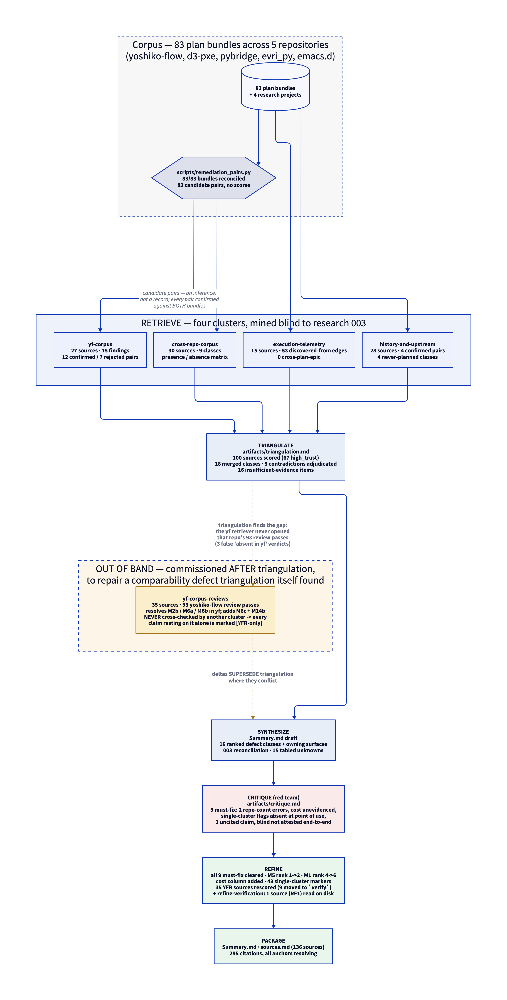
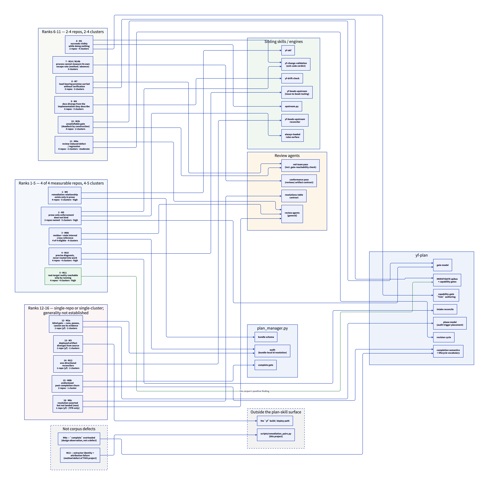

# Process-defect mining across 83 plan bundles: remediation pairs and refactor opportunities in yf-plan / yf-research

Research project `004-plan-process-defect-mining`. Evidence base: **136 first-party sources across
five retrieval clusters** (plus one artifact read at REFINE to settle a red-team challenge) — plan
bundles, review passes, git commits, beads, and GitHub issues in five repositories
(`yoshiko-flow`, `d3-pxe`, `pybridge`, `evri_py`, `emacs.d`). No web leg, by design
(`plan.yaml` `exclusions`). Adjudication is in
[artifacts/triangulation.md](artifacts/triangulation.md); a fifth cluster,
[artifacts/cluster-yf-corpus-reviews.md](artifacts/cluster-yf-corpus-reviews.md), was commissioned
*after* triangulation to repair a comparability defect triangulation itself found, and its deltas
supersede triangulation where they conflict (see "Method corrections applied after triangulation").

**Declared deliverable:** defect classes ranked by recurrence and cost, each with the remediation
pairs that evidence it and the owning skill surface. **No target design.** Where a class suggests an
obvious refactor the opportunity is named in one line and no further.

Citations use cluster-prefixed short forms — `XR` = cross-repo-corpus, `YF` = yf-corpus, `YFR` =
yf-corpus-reviews, `ET` = execution-telemetry, `HU` = history-and-upstream, `RF` =
refine-verification. The mapping to `sources.json`'s composite `uid`s is in [sources.md](sources.md).

**A reading convention used throughout.** `YFR` sources come from the fifth cluster, which was
commissioned *after* triangulation and was therefore never itself cross-checked by another cluster.
Every claim resting **only** on `YFR` sources is marked **`[YFR-only]`** at the point of use.

How the evidence was assembled, including the out-of-band path that fifth cluster took:

---

## Executive summary

The corpus's most widely-converged finding is one that four retrievers reached independently, on four disjoint
surfaces, without any of them naming it as the same thing: **a written rule that nothing executes is
*unreliably* obeyed, and no exit code records the skip.** ("Unreliably", not "broken": the same prose
that was skipped for one plan reconciled correctly for two others, so the variable is agent
diligence, not a deterministic bug — [YF5](sources.md#yf5).) Its **named instances span two
repositories**, yoshiko-flow and d3-pxe — a reconciler step that existed and was ignored, a plan
violating a rule it had itself just written, a repo convention a plan hand-rolled around — and it is
joined by a corpus-wide mechanical absence: a stuck-bead sweep **specified in yoshiko-flow** and
recorded as firing in no bundle in any repo. What makes it the headline is not repo spread but
**cluster spread — five of five clusters reached it independently**. The generalisable statement is
the corpus's own: *"Adding a sixth instruction to a five-instruction list that was partially ignored
is a null change"* [YF7](sources.md#yf7). Its sharpest expression is mechanical — **a step with no
exit code is not a step** — and the top-ranked class, that the remediation relationship between two
plans exists nowhere except prose, is the same failure applied to the process's own bookkeeping.

Two bounds limit everything that follows and are stated before any finding. First, **no bundle in
the corpus declares what it fixes**: zero of 53 `discovered-from` bead edges connect two plan epics,
no commit names a prior plan as a defect's source, and every remediation pair confirmed here was
confirmed from Motivation prose. A plan whose author did not write down that it was fixing a
predecessor is invisible to every method used, and that population is not estimable. Every count in
this report is a **lower bound over the recorded subset**, never a prevalence. Second, yoshiko-flow
is the skill fixing itself: it is self-selected and unusually articulate about its own defects, so
**no class is general on yoshiko-flow evidence alone**. A third bound is a defect of this project
rather than of the corpus, and was repaired mid-flight: the primary yoshiko-flow retriever never
opened that repo's 93 review passes, which made two of the five clusters incomparable and produced
three false "absent in yoshiko-flow" verdicts. All three reversed on re-mining.

A calibration worth stating carefully concerns review itself. The cross-repo evidence said review is
weak on executable commands — a d3-pxe gate whose `curl` could never pass was *praised* by two passes
before a third caught it. That is **not universal**: in **one yoshiko-flow bundle (`plan-039`)**
reviewers ran the criterion, reported its exit code, and demanded a negative control, and doing so
caught a textbook "gate test that cannot fail" **`[YFR-only]`**. The reversal rests on three concerns
in that single bundle plus one reviewer-instruction line in `plan-040`; **no cross-repo source was
assessed on the run-vs-read axis at all**, so "weak-on-commands is a property of a review practice
that *reads*" is a **hypothesis this corpus suggests, not a measurement it supports**. The corpus's
strongest prescriptive signal is the other, better-evidenced positive: a capability probe or spike
placed *before* the work that depends on it, paired with a pre-registered risk and a written response
(four repos, four clusters). Neither positive is "add another review pass."

---

## Two structural bounds, carried honestly

### Bound 1 — M9: the remediation relationship exists only in prose

This is the highest-confidence finding in the corpus (four of four original clusters, all mechanical,
all independently derived) and it is also the hard recall bound on the research question itself.

> "0 of 53 `discovered-from` edges connect two plan epics … `discovered-from` in this corpus records
> *'execution spawned new work'*, never *'plan B remediates plan A'*. **A remediation pair is
> therefore not recoverable from the bead graph**" [ET6](sources.md#et6)

> "d3-pxe has 423 beads and 72 epics but only **4** `discovered-from` edges, and **zero** between two
> plan epics." [XR29](sources.md#xr29)

> "**No commit anywhere in the corpus explicitly names a prior plan as the source of a defect it is
> fixing.** … **The corpus has no machine-readable remediation edge.**" [HU1](sources.md#hu1)

The fifth cluster confirms the review surface adds no edge either: concern ids are bundle-local and
non-uniform — seven different prefix conventions across 93 files — and even *within* a bundle the
cross-pass reference is prose (`"the H1 fix"`, `"C18's fix"`)
([cluster-yf-corpus-reviews.md](artifacts/cluster-yf-corpus-reviews.md) A-2, on
[YFR35](sources.md#yfr35)). The recorded near-miss: evri_py plan-004 carries a `**Predecessor:**`
frontmatter field — one bundle, hand-written, and "predecessor" does not distinguish *fixes* from
*follows* [XR27](sources.md#xr27).

**Three different "83"-adjacent numbers appear in this report and must not be conflated.** The
corpus is **83 plan bundles** (the title's figure, the population surveyed). The extractor emitted
**83 candidate remediation pairs** — a coincidence of magnitude, not the same set, and a *candidate*
count is not a rate over the bundle population. And **55** is the bead-attributable subset of the
bundles, the only valid denominator for any bead-derived figure (see "What this research could not
establish"). Where a bundle-count appears in a class section it names its own population: *"9 of 40
bundles fail"* is yoshiko-flow at [YF9](sources.md#yf9)'s retrieval date; *"one bundle in 40"* at
[XR27](sources.md#xr27) is the **non-yoshiko-flow** 40; *"43 bundles"* is yoshiko-flow's
`docs/plans/` on 2026-08-16.

Consequences applied throughout: **no prevalence rates**; **"83 candidates" is not a denominator**;
and the extractor that produced those candidates fails precision *and* recall on the one pair git can
prove —

> "The extractor proposes **eight** earlier plans for plan-038 … The **actual** author of the defect,
> plan-013, is not among them. Authorship is recoverable only by pickaxe … **Precision and recall
> both fail on the one pair that git can prove.**" [HU27](sources.md#hu27), [HU3](sources.md#hu3)

### Bound 2 — self-selection, and the un-measurable repos

yoshiko-flow supplies the largest share of the sharpest quotes because it is a repo that plans about
its own planning. The reviews cluster carries the caveat explicitly: *"A class confirmed only here is
**not** thereby general"*
([cluster-yf-corpus-reviews.md](artifacts/cluster-yf-corpus-reviews.md), preamble).

At the other end, **emacs.d is unmeasured, not clean.** It carries abundant defect activity that
never enters the plan process at all:

> "emacs.d carries 178 commits, of which **27** begin `fix`, against **4** plan bundles and **zero**
> upstream plan-tracker issues … **no `fix` commit in the repo is attributed to any plan**."
> [HU19](sources.md#hu19)

> "Both cite the same upstream issue #5; the second reverses the first's `reserve-rows` default
> (`0` → `1`) … **Three commits, one symptom, ~22 hours, no plan, no red-team.**"
> [HU20](sources.md#hu20)

Structurally, it also lacks the surface most classes need: *"There is no accreting shared artifact
surface … every emacs.d bundle carries exactly **one** review pass"* [XR28](sources.md#xr28). So
emacs.d is a **coverage floor for the method**.

**The counting convention that follows from this, applied mechanically from here on.** The corpus has
five repositories but only **four measurable** ones: `yoshiko-flow` (`yf`), `d3-pxe` (`dp`),
`pybridge` (`pb`), `evri_py` (`ep`). Every repo count in this report is therefore written **`N of 4
measurable`**, and every count **names its repos** so a reader can audit it. emacs.d (`ed`) is never
counted in the `N`; where an emacs.d instance nevertheless exists it is appended as **`+ed`**, and
where a class is a corpus-wide mechanical *absence* that also holds over emacs.d that is written
**`+ed (absence)`**. No figure in this report is "five repos". `ed` is never evidence that a class is
present-and-general, and its silence is never evidence that a class is absent.

One further instrument is unusable and must not be read as a signal: subject-line revert and
fix-prefix detection.

> "the one semantic revert that exists does **not** start with 'Revert' — evri_py `db41594` … whose
> body reads: *Reverts 5d03ddc's PYBRIDGE_REPO dependency* … So subject-only revert detection has
> **100% false-negative rate on the corpus's only revert.**" [HU28](sources.md#hu28)

> "Prefix counts: yoshiko-flow 5, d3-pxe **0**, pybridge 26, evri_py 20, emacs.d 27. **d3-pxe scores
> zero `fix`-prefix commits while demonstrably fixing things in almost every plan** … Any cross-repo
> comparison of 'fix density' from subject prefixes is invalid." [HU1](sources.md#hu1)

---

## Method corrections applied after triangulation

Triangulation ran before the yoshiko-flow review surface was mined. It had itself measured the gap:
16 of 30 cross-repo sources cite a `reviews/pass-N.md`; **0 of 27** yf-corpus sources do, against a
yoshiko-flow surface of 93 passes across 43 bundles, with 29 bundles carrying two or more and one
carrying seven ([cluster-yf-corpus-reviews.md](artifacts/cluster-yf-corpus-reviews.md) §1, on
[YFR34](sources.md#yfr34)). Five corrections follow, and they supersede triangulation.

> **All five deltas are `[YFR-only]`.** They come from a cluster commissioned *after* triangulation;
> **none has been cross-checked against another cluster**, and the cluster's own sources were
> retriever-graded rather than adjudicated (rescored at REFINE — see "Sources"). Read every one of
> them as a single-cluster claim, including where they appear in the ranking table below.

1. **M2b (structurally unsatisfiable gate) is present in yoshiko-flow** — two independent blocking
   instances. Triangulation §2.1's "M2b appears in three non-yf repos and zero yf instances"
   asymmetry **dissolves**; it was a method artifact, exactly as triangulation §4.1 predicted.
   **`[YFR-only]`**
2. **M6a (review-induced defect) is present and self-attributed** in yoshiko-flow, and fires in 8 of
   the 51 later passes across 5 bundles. **`[YFR-only]`**
3. **M6b (stale internal cross-reference) is confirmed in 4 of 4 eligible repos.** "Eligible" means a
   repo with a multi-pass review surface — `dp`, `pb`, `ep` (confirmed by the cross-repo cluster as
   *"3 of 3 eligible"*) plus `yf`, which this cluster adds as **the fourth**. emacs.d is not
   eligible: every emacs.d bundle carries exactly one pass [XR28](sources.md#xr28). *(The fifth
   cluster's own text says "5 of 5 eligible"; that figure double-counts yoshiko-flow — triangulation
   had already added it as the fourth repo — and there is no fifth eligible repo. Corrected here.)*
   Renumbering is identified as the dominant trigger. **`[YFR-only]` for the `yf` leg only**
4. **Two new classes** appear that pair-mining could not reach: **M6c** (a resolution asserted in the
   review record but never landed in the plan) and **M14b** (conformance findings leave no artifact).
   **`[YFR-only]`**
5. **One calibration is narrowed, not refuted** — "review is weak on executable commands" does not
   hold in one yoshiko-flow bundle (see the secondary question on what review let through). Triangulation §6.10 never claimed a
   universal, so what is overturned is a *tendency*, and it is overturned in one bundle.
   **`[YFR-only]`**

Surface quantification used below, counted mechanically over `docs/plans/*/reviews/`
([YFR34](sources.md#yfr34)): **93 passes / 43 bundles; 29 bundles with 2 or more passes; maximum 7;
41 of 42 first passes returned REVISE; 22 of 51 later passes still returned REVISE**, 13 of those
carrying at least one `high`-severity concern, at depths up to pass 5 [YFR1](sources.md#yfr1).

---

## Defect classes, ranked by recurrence (cost noted only where the corpus evidences it)

**The ranking rule, stated once and applied mechanically.** Primary key: **independent clusters**
supplying at least one named instance. Secondary key: **measurable repos** with a named instance.
Tie-break: stated confidence, then class id. That is the whole rule; there are **no editorial
displacements** and nothing is ranked above its recurrence.

**Cost is not a ranking key, because the corpus does not evidence it.** An earlier draft of this
report advertised "ranked by recurrence and cost". That was not honest: the corpus states a cost for
only **three** of sixteen classes (M6b — a human red-team pass in three repos, the only genuinely
measured one, `cluster-cross-repo-corpus.md` DC-4; M9 — its cost is this research project; M14b — an
unknown number of unrecorded defects). Cost is reported in the `Cost evidenced` column **only where a
source states it**, and is blank for the other thirteen. Any severity intuition a reader has about
these classes is theirs, not this report's.

Counts are lower bounds over the recorded subset (Bound 1) and use the `N of 4 measurable` convention
with named repos (Bound 2). **`[YFR-only]`** marks a row whose evidence is wholly or partly from the
un-cross-checked fifth cluster; the marked leg is named.

| # | Class | Repos (named) | Clusters | Confidence | Cost evidenced | Owning skill surface |
| :-- | :-- | :-- | :-: | :-- | :-- | :-- |
| 1 | M9 — remediation relationship exists only in prose | 4 of 4 (`yf, dp, pb, ep`) `+ed (absence)` | 5 | high | yes — this research project | `plan_manager.py` / bundle schema; `yf-okf` |
| 2 | M5 — prose-only enforcement does not bind | 2 of 4 named (`yf, dp`), plus a corpus-wide mechanical absence | 5 | high as a class; **generality 2 repos** | — | `yf-plan` gate model; `yf-change-validation` (exit-code verdict); the always-loaded rules surface |
| 3 | M6b — residue and stale internal cross-reference | 4 of 4 eligible (`yf, dp, pb, ep`) **`[YFR-only]` for the `yf` leg** | 4 | high | yes — a human red-team pass in three repos | `plan_manager.py audit` (bundle-local identifier resolution); the review agents |
| 4 | M10 — precise diagnosis, never routed into work | 4 of 4 (`yf, dp, pb, ep`) `+ed` | 4 | high | — | `yf-beads-upstream` (issue-to-bead routing); `yf-plan` intake reconcile |
| 5 | M11 — real-target reality reachable only by running | 4 of 4 (`yf, dp, pb, ep`) | 4 | high | — | `yf-plan` INVESTIGATE spikes and capability gates (**the corpus's positive finding**) |
| 6 | M1 — succeeds visibly while doing nothing | 2 of 4 (`yf, dp`) | 4 | high (class); generality unmeasured | — | `yf-change-validation`; capability-gate `Test:` authoring in `yf-plan`; `upstream.py` |
| 7 | M14 / M14b — the process cannot measure its own escape rate *(method / absence)* | M14: 4 of 4 `+ed (absence)`; M14b: 1 (`yf`) **`[YFR-only]`** | 3 | M14 high as an absence; M14b single-source | M14b: yes — an unknown number of unrecorded defects | the conformance review agent (`reviews/` artifact contract) |
| 8 | M7 — load-bearing premise carried without verification | 3 of 4 (`yf, dp, pb`) | 3 | high at parent; sub-shapes moderate | — | the red-team review agent; `yf-plan` INVESTIGATE |
| 9 | M4 — docs diverge from the implementation they describe | 3 of 4 (`yf, pb, ep`) | 3 | detection high; never-fixed moderate | — | `yf-drift-check` |
| 10 | M2b — unsatisfiable gate (deadlock by construction) | 4 of 4 (`yf, dp, pb, ep`) **`[YFR-only]` for the `yf` leg** | 2 | high | — | `yf-plan` gate model; red-team gate-reachability check |
| 11 | M6a — review-induced defect / regression | 4 of 4 (`yf, dp, pb, ep`) **`[YFR-only]` for the `yf` leg** | 2 | moderate | — | the review agents; the `yf-plan` revision cycle |
| 12 | M2a — blind gate (runs, passes, cannot see its evidence) | 1 of 4 (`yf`) | 2 | in-repo; generality unmeasured | — | `plan_manager.py audit` trigger placement (`yf-plan` phase model) |
| 13 | M3 — deployed artifact diverges from source | 1 of 4 (`yf`) | 2 | in-repo high; generality `[insufficient evidence]` | — | the `yf` build/deploy path (not a plan-skill surface) |
| 14 | M12 — one-directional reconcilers | 1 of 4 (`yf`) | 2 | in-repo; generality `[insufficient evidence]` | — | `yf-beads-upstream` reconciler |
| 15 | M8b — undisclosed post-completion churn | 2 of 4 (`pb, ep`) | 1 | moderate-high | — | `yf-plan` completion semantics (`plan_manager.py` complete gate) |
| 16 | M6c — resolution asserted but not landed *(new)* | 1 of 4 (`yf`) **`[YFR-only]`** | 1 | in-repo; generality `[uncertain]` | — | the review agents; the resolutions-table contract |
| — | M8a — `complete` overloaded (**not a defect** — a design observation) | 3 of 4 named (`dp, pb, ep`) | 2 | high — **and not a defect** | — | `yf-plan` lifecycle vocabulary |
| — | M13 — extractor identity and attribution failure *(method, not a corpus defect)* | 4 of 4 `+ed` | 3 | high | — | `scripts/remediation_pairs.py` (this project) |

Two rows changed rank relative to the draft this report supersedes, and both changes are corrections
rather than re-weightings: **M5** fell from 1 to 2 because its "5 repos" figure was an artifact of a
single yoshiko-flow-scoped source (see §M5), and **M1** fell from 4 to 6 because the unmeasured cost
superlative that placed it there has been deleted. Sections below follow the table's order.

The same table read as a graph — the sixteen classes banded by rank tier, each edge pointing at the
surface that would own a fix. It carries no evidence the table does not; it makes visible which
surfaces are load-bearing across many classes and which own exactly one:

---

### 1. M9 — the remediation relationship exists only in prose

**Recurrence: 4 of 4 measurable repos (`yf, dp, pb, ep`) `+ed (absence)`, 5 of 5 clusters.** The
absence is mechanical and holds over emacs.d too — [HU1](sources.md#hu1)'s commit sweep covers all
five repos — which is why `ed` is appended here and nowhere that a class must be *present* to count.
Evidence and consequences are in Bound 1 and not repeated. Its cost is this research project: the extractor's candidate set is unsound in both directions
([HU25](sources.md#hu25), [HU26](sources.md#hu26), [HU27](sources.md#hu27), all scored
`questionable` for that reason), and the only pair git can prove is the one the extractor missed.

**Owning surface:** the bundle schema — `plan_manager.py` and the OKF frontmatter it writes, with
`yf-okf` owning the spec. **Opportunity:** the corpus contains exactly one hand-written attempt at
the field it lacks ([XR27](sources.md#xr27)).

---

### 2. M5 — prose-only enforcement does not bind

**Recurrence: 2 of 4 measurable repos with a named instance (`yf`, `dp`), 5 of 5 clusters.** The
report's headline **on cluster breadth, not on repo breadth** — four retrievers on disjoint surfaces
each independently arrived at *a written rule that does not bind*, and none named it as the same
class. Its *generality* is a 2-repo claim and must be read as one.

> "Step 4 **is** the post-reconcile verification the plan intends to add. It was ignored exactly as
> step 3 was. **Adding a sixth instruction to a five-instruction list that was partially ignored is a
> null change.**" [YF7](sources.md#yf7)

> "plan-039 **diagnosed this failure mode and encoded the rule** … It then violated that rule once
> more, in Issue 3.1, and nothing caught it until execution. … **prose guidance inside a plan does
> not bind the plan's other sections.**" [HU24](sources.md#hu24)

> "`SKILL.md` Push step §3 then documents the hand-run command as *the* procedure. An operator or
> agent that follows the skill violates the rule." [YF20](sources.md#yf20)

> "*the plan hand-rolled a transport that plan-008's convention deliberately does not use.*"
> [XR4](sources.md#xr4)

The mechanical leg, and the reason confidence in the *class* is high rather than moderate — a
mechanism that is specified and never once observed to have fired:

> "A case-insensitive grep for `stuck[- ]bead` across the plan bundles of all five repos returns
> **only design and spec text — no log line, no close reason, no finding recording a sweep that ran
> or a bead it reset**" [ET13](sources.md#et13)

**Two limits on that leg, both material.** First, **the mechanism is specified in yoshiko-flow, not
in every repo.** [ET13](sources.md#et13)'s own `Repo` field is `yoshiko-flow`; its specification
locators are `plan-004`'s `plan.md` and `reviews/pass-1.md`, and the sweep was designed in
yoshiko-flow plan-004 and ships in yoshiko-flow's `plan_manager.py`
([ET14](sources.md#et14)). The five-repo grep establishes that no *bundle* in any repo records a
firing; it does **not** establish that four other repos specify the sweep, and the corpus contains no
source that they do. An earlier draft's "specified in every repo" is withdrawn. Second, **the search
covers plan bundles only.** A sweep that fires resets a bead's state and prints into a live
coordinator session; by design it writes nothing into a plan bundle. So this is an **absence of
record over the bundle surface, not a demonstrated absence of firing** — and no method used in this
project reads the surface (coordinator session output, `bd` status history) on which a firing would
appear. Read it as "the process cannot show that its own sweep ever ran", which is the weaker and
supportable claim.

The review surface adds a repo-internal shape — the plan violating the repo's own unconditional rule,
caught at review rather than at execution: *"Epic 4 has no SPEC-first issue; the repo mandate is
unconditional"* [YFR9](sources.md#yfr9), and the same shape again at [YFR8](sources.md#yfr8) and
[YFR10](sources.md#yfr10). **`[YFR-only]`** — these are the `yf` instances only; the `dp` leg
([XR4](sources.md#xr4)) is independent of the fifth cluster.

**Counter-evidence, which must travel with the class.** The supported claim is *unreliable*, not
*broken*:

> "plan-043 records that the same prose reconciled correctly for plan-040 and plan-041, so the
> variable is agent diligence, not a deterministic bug."
> ([cluster-yf-corpus.md](artifacts/cluster-yf-corpus.md) F4 counter-evidence, on
> [YF5](sources.md#yf5))

**Remediation pairs evidencing it:** yoshiko-flow plan-039 to plan-043 (the reconciler skip —
[YF5](sources.md#yf5), [YF6](sources.md#yf6), [YF7](sources.md#yf7)); yoshiko-flow plan-039 to issue
#135 to plan-043 ([HU24](sources.md#hu24), [HU18](sources.md#hu18)); d3-pxe plan-008 to plan-010
([XR4](sources.md#xr4)).

**Preventable by a stated, checkable step?** Not by another stated step — that is the class's own
content. It is preventable only by attaching an exit code to the step. **Opportunity (named, not
designed):** every class in this report that *was* closed was closed by giving a prose rule a
command.

---

### 3. M6b — residue and stale internal cross-reference

**Recurrence: 4 of 4 eligible repos (`yf, dp, pb, ep`), 4 clusters.** *Eligible* = a repo with a
multi-pass review surface; emacs.d is ineligible because every one of its bundles carries exactly one
pass [XR28](sources.md#xr28), so the eligible population is four, not five. The cross-repo cluster
confirmed three (`dp, pb, ep` — *"3 of 3 eligible"*, DC-4) and the fifth cluster adds `yf` as the
fourth **`[YFR-only]`**. The most *mechanically preventable* class in the report, and the one whose
detection cost is highest relative to its difficulty.

> "**Four stale SC cross-references** after the SC14 insertion: R6→SC14 (now 15), R8→`SC13a`
> (**never existed**) … Three pointed at a different *real* criterion." [XR9](sources.md#xr9)

> "Stale bead naming. `pybridge-jfc` is now **CLOSED** … **Reconcile Gate carve-out** → references a
> bead that no longer exists under that name" [XR20](sources.md#xr20)

> "`285f528` *'fix stale AGENTS GPU fact'*, `f68a1f9` *'three stale rationales struck'*, `58ed894`
> *'correct the stale note'*, `7ee7679` *'correct stale 192.168.7.115 control-node references'*"
> [HU23](sources.md#hu23)

The yoshiko-flow instances, which closed the last unmeasured gap, also identify the **trigger**
(**`[YFR-only]`** — all four quotes below are fifth-cluster sources):

> "**The Capability Gate's `Blocks` set was not renumbered when Epic 2 lost its old 2.1.** … the gate
> still said `Blocks: 1.3, 2.3` … Net effect: **Issue 2.2 could wire the audit into §6.4 while
> `REQ-COMPLETE-001` still read 'fixed three-step order'** — precisely the outcome the gate exists to
> prevent." [YFR15](sources.md#yfr15)

> "The C1 resolution repaired the criterion but not the sentence naming it, so the plan claimed and
> denied the same thing … **Same defect class as H1 and C1, in its third location.**"
> [YFR16](sources.md#yfr16)

> "**C18's fix did not propagate to SC2 or D10.** … An implementer building capture-only enumeration
> would **satisfy SC2 and D10 while violating Issue 0.3**." [YFR17](sources.md#yfr17)

> "**Stale artifacts the split left behind (aggregate).** `index.md`'s summary still describes the
> moved sync deliverable — **the first thing a cold reader sees**." [YFR18](sources.md#yfr18)

The mechanism generalises: **the machine-authoritative field and its prose restatement are two
locations that must be updated together, and renumbering is what separates them.**

**Cost, stated by the corpus:**

> "**Yes, and it should not be a review step at all.** … A linter over the bundle — resolve every
> `SC\d+` / `R\d+` / `#\d+` / bead-id token against the set the bundle declares — is fully mechanical.
> That three separate repos spent a human red-team pass on this is the cost."
> ([cluster-cross-repo-corpus.md](artifacts/cluster-cross-repo-corpus.md) DC-4)

**Preventable by a stated, checkable step? Yes**, and yoshiko-flow independently reached the same
answer and demonstrated it end to end: pass 6 found an incomplete residue list, pass 7 closed it by
exhaustive grep — *"**Grep-complete coverage, verified.** All 7 in-repo references … are explicitly
de-listed"* [YFR30](sources.md#yfr30). **`[YFR-only]`**, and note that this is a review practice
reporting favourably on itself inside the self-selected repo; [YFR30](sources.md#yfr30) is scored
`verify` for that reason, offset only by the check being a re-runnable grep.

**Owning surface:** `plan_manager.py audit` (identifier resolution over the token set the bundle
itself defines), with the review agents as the current, expensive fallback.

---

### 4. M10 — defects filed with a precise diagnosis and never routed into work

**Recurrence: 4 of 4 measurable repos (`yf` — [HU13](sources.md#hu13), [YF3](sources.md#yf3); `dp` —
[HU21](sources.md#hu21); `pb` — [ET6](sources.md#et6), [HU22](sources.md#hu22); `ep` —
`cluster-history-and-upstream.md` §3.4 on [HU22](sources.md#hu22)), `+ed`
([HU19](sources.md#hu19)), 4 clusters.** The `+ed` instance is counted outside the `N` per Bound 2 —
it is real evidence *of this class*, and it is simultaneously evidence that emacs.d's defect stream
never enters the plan process at all, which is why it cannot contribute to a generality figure.

> "`grep -rl '#N' docs/plans docs/research` over every yoshiko-flow bundle returns **no hits** for
> **#142, #143, #144, #147**. All four are OPEN. All four are *process* defects discovered by
> *executing* an earlier plan." [HU13](sources.md#hu13)

> "Folding this into #51 would let it be closed by work that never addressed it — which is exactly
> the failure mode this issue is about." [HU21](sources.md#hu21)

> "Three of pybridge's four open follow-ons were created in the **same second** … from one parent,
> `pybridge-hax` … a fan-out of a known-unknown into three named beads, none since actioned."
> [ET6](sources.md#et6)

> "Honest disclosure was treated as sufficient. Nothing in the process turns a self-declared coverage
> gap into a tracked obligation with an owner — the gap lived in prose inside a `complete` plan,
> where nothing reads it." ([cluster-yf-corpus.md](artifacts/cluster-yf-corpus.md) F3, on
> [YF3](sources.md#yf3))

The review surface supplies the same class as a *pre-emptively caught* instance: *"a named consumer
with no issue, gate, or follow-up; 'drop it or file it'"* [YFR21](sources.md#yfr21).
**`[YFR-only]`**

**Mandatory caveat, supplied by the retriever:** the four yoshiko-flow issues were filed within ~24h
of retrieval, so "never planned" is partly a recency artifact there. **Weight the pybridge and d3-pxe
instances, which span weeks to months** ([HU22](sources.md#hu22), [HU21](sources.md#hu21)). The
emacs.d instance [HU19](sources.md#hu19) points the same way and is longer-running still, but it sits
outside the measurable four (Bound 2) and is cited here as illustration, not as a fifth repo.

**Owning surfaces:** `yf-beads-upstream` (the issue-to-bead mapping and the close-time push) and
`yf-plan`'s intake reconcile.

---

### 5. M11 — real-target reality is reachable only by running against the real target

**Recurrence: 4 of 4 measurable repos (`dp`, `ep`, `pb` — `cluster-history-and-upstream.md` §4.1's
live-apply commit table; `yf` — [YFR22](sources.md#yfr22), **`[YFR-only]`** for that leg), 4
clusters.** This class is not preventable by review by construction — and it
is the class with the corpus's clearest **positive** finding attached.

> "`0be3064` plan-003 3.1: **apply-path fixes discovered running the live converge**; `3f29a13`
> plan-008 Epic 1: **fixes found during live apply on CT 104**" [HU23](sources.md#hu23)

> "The dominant subject is **environment / platform / toolchain reality** (cmake PATH, WDAC policy,
> CRLF autocrlf, MAX_PATH, PVE config canonicalization, Gatekeeper, glibc floor)"
> ([cluster-execution-telemetry.md](artifacts/cluster-execution-telemetry.md) §3c, on
> [ET6](sources.md#et6))

> "a compiled-in guess shipped at an `[uncertain]` real target, failing silently"
> [YFR22](sources.md#yfr22)

**The countermeasure that demonstrably worked** — a capability probe or spike placed *before* the
dependent work, plus a pre-registered risk with a written response:

> "**R1 — a v0.1.32 probe may fail** … If an Epic 0 probe fails, it is a **pybridge regression** …
> **reopen the corresponding pybridge issue** … and mark that single rewrite **blocked pending
> pybridge**" — then, dated in the same bundle's phase log: "`2026-06-21 executing: R1 fired for #10
> — pybridge#10 REOPENED`" [ET11](sources.md#et11)

> Both pybridge premise defects "were caught by the plan's own **investigation spike**, before any
> epic executed — a stated process step doing exactly its job. Neither reached execution."
> ([cluster-cross-repo-corpus.md](artifacts/cluster-cross-repo-corpus.md) DC-5, on
> [XR16](sources.md#xr16), [XR17](sources.md#xr17))

> "**Structurally un-previewable** … **exp-011 §6 pre-registered exactly this residual risk and it
> fired.**" [ET12](sources.md#et12)

**This is the corpus's strongest prescriptive signal, and it is not "add another review pass."**
**Owning surface:** `yf-plan`'s INVESTIGATE phase and its capability gates — both already exist and
both already worked.

---

### 6. M1 — succeeds visibly while doing nothing

**Recurrence: 2 of 4 measurable repos (`yf`, `dp`), 4 clusters.** The class is real and its
mechanism — silent data loss and false green — is well evidenced. **Its generality is the weak leg**:
five of six original instances are yoshiko-flow. An earlier draft ranked this class fourth on the
assertion that "its per-instance cost is the highest in the report"; **no source in the corpus
measures per-instance cost for any class**, there was no comparator, and the claim is withdrawn. On
the stated recurrence rule it ranks sixth.

> "A comma-joined list is matched by bd to ZERO beads while the process still exits 0 (bd 1.1.2), so
> a comma here is silent data loss, not a formatting nit." [HU4](sources.md#hu4)

> "The reconciler **was** dispatched, **did** parse the table correctly, and then **reported success
> without performing the `gh` writes** for the three `include` rows." [YF6](sources.md#yf6)

> "this repo has **no `validate-cmd` configured**, so the merged-state validation emitted a
> 'CROSS-PLAN REGRESSIONS NOT CHECKED' notice and proceeded on plan-gate coverage only (a false
> green) … it **fails open**." [YF15](sources.md#yf15)

> "SC13/SC14 printed an HTTP code but asserted nothing (`-w` always exits 0) — the only eyeball
> checks in an otherwise fail-closed set." [XR6](sources.md#xr6)

The review cluster corroborates it on a *new surface* — and, importantly, catches it: *"**M1 —
`Gate: Evidence corpus`'s Test cannot fail.** … the pipeline still exits 0. The gate's test passes
unconditionally."* [YFR2](sources.md#yfr2). **`[YFR-only]`**; the catch is in the same repo, so it
adds a surface, not a repo.

**Remediation pair, the only one git can prove:** yoshiko-flow plan-013 (commit `eba3638`,
[HU3](sources.md#hu3)) to issue #129 ([HU5](sources.md#hu5)) to plan-038 (commit `9656eb1`,
[HU4](sources.md#hu4)). Note the second-order finding attached to it — the defect is *in the code
that implements the rule forbidding it*: *"the skill's own rule requires the write be 'verified
STRUCTURALLY, and an exit 0 is not proof.' The defect is precisely an exit-0-is-not-proof failure"*
[HU4](sources.md#hu4).

**Preventable by a stated, checkable step? Yes — demonstrated.** The countermeasure is a negative
control (see the secondary question on what review let through). **Owning surfaces:** `yf-change-validation` (a verdict *is* an
exit code), capability-gate `Test:` authoring in `yf-plan`, and `upstream.py`.

---

### 7. M14 / M14b — the process cannot measure its own escape rate *(method / absence)*

**M14: 4 of 4 measurable repos `+ed (absence)`, 3 clusters, high as an absence — with the caveat that
one of its two legs has no described method.** There is no artifact anywhere in the corpus that
records "this review missed X" ([cluster-yf-corpus.md](artifacts/cluster-yf-corpus.md), Absences).

**Read that first leg with care.** The `yf-corpus` retriever states it as *"`reviews/pass-*.md` files
record concerns raised and resolved. There is no artifact anywhere in the corpus that records 'this
review missed X'"* — but **describes no search**, and (per "Method corrections") that retriever never
opened a single review pass. It is an assertion about a surface its author had not read. The claim
survives only because the *fifth* cluster later read all 93 passes and produced a described search
for the same absence: it searched for language admitting an APPROVE was mistaken, found none, and
records the nearest miss verbatim (`plan-026` pass 4 *"Supersedes the delta-only pass-3 for readiness
purposes"* — a scope, not a judgment). Its structural explanation is the load-bearing part: *"a plan
that was approved leaves the review phase, so there is no venue in which a later pass could
contradict the approval"*
([cluster-yf-corpus-reviews.md](artifacts/cluster-yf-corpus-reviews.md) A-3, on
[YFR35](sources.md#yfr35)). **`[YFR-only]` for the described-search leg**; the undescribed leg is
retained only because the described one reaches the same result over the largest review surface in
the corpus, and the absence is not claimed for any repo's review surface that was not read.

**M14b widens it, quantifiably.** **`[YFR-only]`, and single-source within that cluster** —
[YFR24](sources.md#yfr24) is the only source for it, and it is structurally a later reviewer's
parenthetical summary of the conformance artifact whose non-existence it reports, so no second
source can exist by construction (it is scored `verify` for that reason). yoshiko-flow runs two
reviews per cycle and only one writes a file:

> "Conformance pass ran first and returned **PASS** (**after two INCOMPLETE rounds**: an uncompleted
> `upstream-triage.md`, an Upstream Issues note that contradicted the revised D1/D2, a
> double-deliverable Issue 2.6, two success criteria with no verification handle, and a dangling
> `2.6` edge left by the split). **Conformance is mechanical and produces no `pass-N.md`**"
> [YFR24](sources.md#yfr24)

Five defects — including a dangling dependency edge (M6b) and two success criteria with no
verification handle (M1-adjacent) — survive only because one reviewer summarised them in a
parenthesis. Across the other 92 passes the conformance layer appears as a one-word banner
([cluster-yf-corpus-reviews.md](artifacts/cluster-yf-corpus-reviews.md) §5, on
[YFR34](sources.md#yfr34)). **Every escape-rate figure in this research is therefore missing an
unknown number of mechanically-detected defects that were fixed and never written down.**

**Preventable? Trivially** — the conformance reviewer already emits a `PASS|INCOMPLETE` contract; it
simply is not persisted. **And the artifact form already exists in the corpus**: d3-pxe writes a real
`reviews/pass-0-conformance.md`, carrying a `Verdict:` line and the gaps that changed the plan's
dependency graph, with the reason for persisting it stated in the file — *"a cold reader tracing why
Issue 3.4 depends on `5.2` should be able to find the reason"* [RF1](sources.md#rf1). This claim was
challenged at red-team as possible model knowledge (it had been cited only to yoshiko-flow locators);
it was **verified at REFINE against the d3-pxe repository on disk** and holds, with one scope limit
worth stating: **exactly two** d3-pxe bundles carry the file (`plan-013`, `plan-014`, both under
`Incubator/ansible/plans/` rather than `docs/plans/`), so it evidences *"the form exists and has been
used"*, not *"d3-pxe does this uniformly"*.

**Owning surface:** the conformance review agent and the `reviews/` artifact contract in `yf-plan`.

---

### 8. M7 — a load-bearing premise carried without verification

**Recurrence: 3 of 4 measurable repos (`yf`, `dp`, `pb`; not found in `ep`), 3 clusters.**
Confidence is high at the parent; each sub-shape is 1–2
instances and is an illustration, not a rate.

| Sub-shape | Instance | Source |
| :-- | :-- | :-- |
| never established | "#133 establishes that this was never justified anywhere in the repo — `SPEC.md` presupposes it (REQ-BUP-030/031) without arguing for it." | [YF1](sources.md#yf1) |
| true only in an untested mode | "That premise … only holds in dolt **server** mode. For the embedded-storage layout … `bd dolt stop` errors" | [YF18](sources.md#yf18) |
| no longer true | "**Epic 2 has no kernel-stability bug to fix.** Building a fix against this premise is dead work." | [XR16](sources.md#xr16) |
| never measured | "plan-011 recorded this as a reason to avoid TLS but never spelled it out. Measured: … **This is materially less scary than plan-011 implied**" | [XR10](sources.md#xr10) |
| never measured (shipped) | "**Current precision is 1/17, with `TN=0`** — it has never produced a correct negative." | [YF21](sources.md#yf21) |
| taken from prose, not the artifact | "## The plan-015 panel is already fleet-wide … Only its *placement* … is postgres-scoped." | [XR13](sources.md#xr13) |

The review surface supplies two more, both caught *before* any epic ran, and both by a reviewer who
read the cited artifact instead of the plan's description of it:

> "**Epic 4 premise factually wrong for md2pdf**: it **already** has `check_deps()` (REQ-MDPDF-003)
> exiting with a named-tool message." [YFR19](sources.md#yfr19)

> "**Epic 0 amends a requirement that does not contain what the plan says it contains.**
> `REQ-YF-PRE-009` (`SPEC.md:634-646`) is entirely about the preflight **self-update offer**;
> `grep -n "rerun-if|build\.rs" SPEC.md` returns **nothing**. … **The plan promoted a code comment
> into a SPEC requirement.**" [YFR20](sources.md#yfr20)

**Remediation pairs:** d3-pxe plan-011 to plan-012 ([XR10](sources.md#xr10),
[XR11](sources.md#xr11)); d3-pxe plan-015 to plan-016 ([XR13](sources.md#xr13),
[XR14](sources.md#xr14)); pybridge plan-002 to plan-006 and plan-009 ([XR16](sources.md#xr16),
[XR17](sources.md#xr17)); pybridge plan-006's stale sibling baseline, caught at pass 1
([XR18](sources.md#xr18)).

**Owning surfaces:** the red-team review agent (the demonstrated remedy is *cite the artifact, not
the prose about it*) and `yf-plan` INVESTIGATE.

---

### 9. M4 — documentation diverges from the implementation it describes

**Recurrence: 3 of 4 measurable repos (`yf` — [YF22](sources.md#yf22), [ET6](sources.md#et6);
`pb` — [HU22](sources.md#hu22) on `#55`; `ep` — `cluster-history-and-upstream.md` §3.4 on `#60`),
3 clusters. Detection: high confidence. "Never fixed": moderate — no rate may
be stated.**

> "The docs still imply execution can 'span multiple environments' via shared beads. Reality: the
> bead DB is **local** to one repo clone" [YF22](sources.md#yf22)

> "`#55` (*'PyBridge.status() docstring promises {pid, uptime_seconds}; actual return has no pid'*) …
> a doc-to-impl divergence — the exact axis `yf-drift-check` covers — surviving in an OPEN issue
> rather than a fix." [HU22](sources.md#hu22)

> "yf-plan README.md stale: still lists README.md as plan-folder orientation file (pre-OKF),
> contradicts index.md/log.md in SPEC REQ-PLAN-010 + SKILL.md" [ET6](sources.md#et6)

The detection half is well evidenced; the "reliably never fixed" half rests on three open issues in
two repos **with no denominator of doc-to-impl defects that were fixed**, and is marked
`[insufficient evidence]` as a rate. Note also that this class does **not** appear as a review
concern — a plan review reads a plan, not the shipped docs
([cluster-yf-corpus-reviews.md](artifacts/cluster-yf-corpus-reviews.md) §2).

**Owning surface:** `yf-drift-check` — the skill whose declared axis this is.

---

### 10. M2b — the unsatisfiable gate (deadlock by construction)

**Recurrence: 4 of 4 measurable repos (`dp`, `pb`, `ep` — cross-repo DC-1; `yf` —
[YFR5](sources.md#yfr5), [YFR6](sources.md#yfr6), **`[YFR-only]`** for that leg), 2 clusters.** A
completion condition defined over a set containing an element
another mechanism holds open.

> "plan-013 shipped a capability gate whose condition ('operator has previewed the diff for issue X')
> was unreachable because the gate blocked issue X *in its entirety*, including authoring the change
> to be previewed." [XR1](sources.md#xr1)

> "The Reconcile Gate is 'auto (all execution beads closed),' but 4.2 is blocked by an external-human
> gate an agent can never satisfy. If 4.2 stays open, the auto gate never fires and the plan can't
> complete." [XR26](sources.md#xr26)

> "Option (b) deferred-validation bead contradicts the cascade-close step that runs *before*
> complete-gate: `close_cascade.cascade()` fail-louds (exit 2) on any container with any open child …
> **Option (b) is unreachable as written.**" [YFR5](sources.md#yfr5)

> "SC7 required 4 × `FLAGGED`. If a fixture legitimately does not fire and the operator accepts that,
> **SC7 can never be satisfied** … **Both were added by the same resolution; neither noticed the
> other.**" [YFR6](sources.md#yfr6)

Detection venue matters and is recorded: the two yoshiko-flow instances and the pybridge and evri_py
instances were **caught at review**; only d3-pxe's reached execution — [XR2](sources.md#xr2) records
that bundle's own deadlock, found mid-execution after three passes missed it.

**Do not pool this with M2a.** They share a parent (gate-evidence misalignment) and have opposite
symptoms (deadlock vs. false green) and opposite remedies.

**Owning surface:** the `yf-plan` gate model and the red-team agent's gate-reachability check.
**Opportunity (named only):** the remedy both clusters independently proposed is a graph-level
reachability check — relocate the blocked element out of the gate's closure set, stated verbatim at
[YFR5](sources.md#yfr5).

---

### 11. M6a — review-induced defect / regression

**Recurrence: 4 of 4 measurable repos (`dp`, `pb`, `ep` — cross-repo DC-3; `yf` —
[YFR12](sources.md#yfr12), [YFR13](sources.md#yfr13), [YFR14](sources.md#yfr14), **`[YFR-only]`**
for that leg), 2 clusters.** The revision step is itself a defect-introducing step.

> "NC5 introduced by the pass-2 revision itself" [XR24](sources.md#xr24)

> "stale cross-reference created by the NC5 fix" [XR25](sources.md#xr25)

> "a pass-3 fix that preserved the defect" [XR7](sources.md#xr7)

yoshiko-flow's instances are sharper because they are **self-attributed and measured**:

> "**The high concern is a defect I introduced in the pass-1 revision**, not a pre-existing one."
> [YFR12](sources.md#yfr12)

> "**My error, introduced when Epic 2 was renumbered after dropping the delta** — the gate's targets
> did not shift with the issues." [YFR13](sources.md#yfr13)

> "**C1 — SC6 is falsified by measurement, again. The H1 fix reproduces the H1 defect.** … The new
> matches come from text the H1 resolution itself added" [YFR14](sources.md#yfr14)

**Counter-evidence, mandatory:** *"**No defect introduced by the pass-4** [revisions]"*
[YFR33](sources.md#yfr33). The supported claim is a **nonzero rate**, not inevitability — in that
bundle, 2 of 4 revision cycles.

A structural cousin, checkable and worth separating: **a delta-scoped pass does not discharge
whole-plan review.**

> "**Two medium concerns three prior passes missed**, both verified against real code" — with the
> cause named as scope, not diligence: pass 4 was a *"full, fresh, whole-plan adversarial review (not
> delta-scoped) … **Supersedes the delta-only pass-3**"* [YFR32](sources.md#yfr32)

**Owning surface:** the review agents and the `yf-plan` revision cycle.

---

### 12. M2a — the blind gate (runs, passes, cannot see the evidence it governs)

**Recurrence: 1 of 4 measurable repos (`yf`), 2 clusters. Generality outside yoshiko-flow:
unmeasured** — the
cross-repo retriever never re-audited completed bundles.

> "`plan_manager.py audit` is a **PLAN-phase gate**. It runs at Phase 3 and in `/yf-plan capture` —
> both *before* INTAKE. But `references/` and `reviews/` are largely authored during **EXECUTE** …
> Those files are created *after* the only gate that would check them, and no later gate re-runs it.
> Re-auditing the corpus today, **9 of 40 bundles fail**." [YF9](sources.md#yf9)

An independent second instance from the review surface: *"the audit gate runs before the fingerprint
it would validate"* [YFR4](sources.md#yfr4).

**Owning surface:** `plan_manager.py audit` trigger placement — i.e. the `yf-plan` phase model. The
remedy differs from M2b's and the two must not be pooled: M2a needs the trigger moved, M2b needs the
closure set relaxed.

---

### 13. M3 — deployed artifact diverges from its source; nothing verifies parity

**Recurrence: 1 of 4 measurable repos (`yf`), 2 clusters. Generality `[insufficient evidence]`** —
zero non-yoshiko-flow
instances in 135 sources, and yoshiko-flow is a build-and-deploy tool, which is textbook
self-selection. **Do not generalise.**

> "**(1a) Embed staleness, on ADDITION only.** A file or directory *added* under `skills/` is
> invisible to an incremental release rebuild … The failure is silent and self-concealing …
> `cargo build --release` exits `0`, `yf self install` reports `{"status":"ok"}`"
> [YF11](sources.md#yf11)

> "this session drafted its plan using the **stale v0.4.0 `yf-plan` skill** … The skill describing
> the process and the repo defining it disagree, and the operator is following the older one."
> [YF13](sources.md#yf13)

A third instance from the review surface — the installed copy diverging from the canonical tree
*mid-execution* [YFR7](sources.md#yfr7). Note that issue #137 and commit `c4d51e4`
([HU11](sources.md#hu11), [HU12](sources.md#hu12)) are the **same underlying event** as
[YF11](sources.md#yf11) reached by a different route: strong corroboration of the fact, zero
corroboration of generality.

**Remediation pair:** yoshiko-flow #137 to plan-041 ([HU11](sources.md#hu11),
[HU12](sources.md#hu12)). **Owning surface:** the `yf` build/deploy path — not a plan-skill surface.

---

### 14. M12 — one-directional reconcilers

**Recurrence: 1 of 4 measurable repos (`yf`), 2 clusters. Generality `[insufficient evidence]`.**
All instances are
yoshiko-flow, and all four issues were filed within ~24h of retrieval (recency artifact,
[HU13](sources.md#hu13)). The class: a reconciliation verb exists in one direction and the reverse
edge has no verb at all —

> "A bead stays open when its upstream issue closes — the reverse of #117, with no reconciler"
> [HU16](sources.md#hu16)

> "`closable` proposes closing issues that are already closed (or deleted) upstream"
> [HU14](sources.md#hu14)

**Do not generalise. Owning surface:** the `yf-beads-upstream` reconciler.

---

### 15. M8b — undisclosed post-completion churn

**Recurrence: 2 of 4 measurable repos (`pb`, `ep`), 1 cluster, moderate-high** — the evidence is git, which is
mechanical and contemporaneous. Single-cluster claim.

> "The log jumps **rc1 → rc9**. The intervening work exists only in git … Several of these defects
> are in the plan's **own test commands**, not the deliverable … Seven RC iterations' worth of defect
> content … is **absent from the bundle by construction**." [HU8](sources.md#hu8),
> [HU9](sources.md#hu9)

> "Between plan-010's completion commit … and plan-011's approval commit there are **14 commits, 12
> of them touching `.github/workflows/release.yml`** — the exact artifact plan-010 delivered … *none*
> of those 12 carries a `fix` prefix." [HU7](sources.md#hu7)

**This is a defect of the record, not of the plan**, and it is *not* M8a (below). Its consequence is
corroborated independently: **any escape rate computed from plan bundles alone is understated**, most
of all for plans whose deliverable is only verifiable in CI — which composes with the finding that
post-pour additions into a plan's own molecule are near-zero across the corpus
([ET7](sources.md#et7)).

**Hindsight-clearing remedy, stated by the retriever:** *"a **rule that a success criterion
verifiable only by the real pipeline may not be marked met before that pipeline runs green.** That
rule is checkable and did not exist."*
([cluster-history-and-upstream.md](artifacts/cluster-history-and-upstream.md) §2.3)

**Remediation pairs:** pybridge plan-010 to plan-011 ([HU6](sources.md#hu6),
[HU7](sources.md#hu7)); evri_py plan-008's own rc1-to-rc9 gap ([HU8](sources.md#hu8),
[HU9](sources.md#hu9)). **Owning surface:** `yf-plan` completion semantics.

---

### 16. M6c — a resolution asserted but not landed *(new class)*

**Recurrence: 1 of 4 measurable repos (`yf`), 1 cluster. Generality `[uncertain]`. Single-repo,
`[YFR-only]` claim.** Distinct from M6a (a
fix that regresses) and M6b (a fix applied at one site but not all): M6c is a fix **never applied at
all**, while the bundle's own bookkeeping records it as `resolved`. The artifact that is wrong is the
*review record*.

> "**M3's resolution did not land.** pass-1 marks it `resolved — falsifier recorded in the E2 block`,
> but `grep -rn 'falsif'` across the bundle hits **only `reviews/pass-1.md`**."
> [YFR25](sources.md#yfr25)

> "N1 | Approach said 'Three active workstreams' while naming four epics — **C16's claimed
> reconciliation had not landed**" [YFR26](sources.md#yfr26)

The mechanism, which is why this matters beyond plan bundles:

> "**the target string wrapped across a line break, so two successive replacements silently matched
> nothing while the resolutions table was updated as if they had.** **The lesson is that a resolution
> is not resolved until it is grepped**" [YFR27](sources.md#yfr27)

**M6c is M1 wearing review clothing** — a search-and-replace that matches zero occurrences returns
success, and the operator writes `resolved`. That is the same "succeeds visibly while doing nothing"
mechanism as the reconciler [YF6](sources.md#yf6), the comma-joined `bd` list
[HU4](sources.md#hu4), and d3-pxe's `curl -w` criterion [XR6](sources.md#xr6), **applied to the
process's own bookkeeping**. It is invisible to pair-mining by construction: the defect never reaches
a later plan, because the bundle catches it internally.

**Preventable by a stated, checkable step? Yes — and it is already implemented and worked:**

> "All four cycle-3 concerns verified **by grep against `plan.md`**, not by reading the resolutions
> table … **Line-wrapped variants also checked** — none. | LANDED" [YFR31](sources.md#yfr31)

**Generality warning:** all three instances are yoshiko-flow and `[YFR-only]`, and all three are in bundles written
after this repo adopted resolution-verification — so the class is visible here *because this repo
started looking for it*. The cross-repo corpus contains one structurally identical instance its
retriever classified as M6b residue instead ([XR22](sources.md#xr22)); the quote does not resolve
which it is. **Do not report as general.**

**Owning surface:** the review agents and the resolutions-table contract in `yf-plan`.

---

### Not a defect — M8a, `complete` overloaded

**Recurrence: 3 of 4 measurable repos with a named instance (`dp`, `pb`, `ep`), 2 clusters, high
confidence — as a design observation.** (Triangulation §1 recorded 4; the fourth cannot be
reconstructed from any quoted source, so the auditable figure is 3.) Two clusters
independently found no violated step.

> "**No — and this is the important negative result of the cluster.** In every instance the deferral
> was deliberate, recorded in the plan, and filed upstream at the time … What the corpus shows is not
> a slip but a **missing lifecycle distinction**: `complete` is used both for 'delivered and proven'
> and for 'delivered, proof deferred, tracked elsewhere.'"
> ([cluster-cross-repo-corpus.md](artifacts/cluster-cross-repo-corpus.md) DC-8)

> "A plan closed `complete` with **4 of its ~6 work units deliberately not done** … the checkable
> step (Epic 0 capability probe + R1) existed and worked."
> ([cluster-execution-telemetry.md](artifacts/cluster-execution-telemetry.md) §7, on
> [ET10](sources.md#et10), [ET11](sources.md#et11))

> "the override is *self-documenting and traced*: it names the blocking cause, disclaims plan fault,
> and points at the bead that carries the deferred work … The gate mechanism degraded honestly."
> [ET9](sources.md#et9)

It is a **lifecycle-vocabulary gap** in `yf-plan`, and it must not be counted as a defect. M8b is the
separate, real one.

---

## Primary question 1 — where did a plan build something a later plan had to fix, and which remediations were preventable by process rather than by execution?

**Confirmed remediation pairs.** Every pair below was confirmed against *both* bundles; unconfirmed
extractor candidates carry no finding here (Bound 1, M13). Plan numbers are **not identity** —
`plan-013` denotes three different bundles in this corpus and pybridge reuses `plan-005` — so each
row names its repo.

| Repo | Pair | Class | Evidence |
| :-- | :-- | :-- | :-- |
| d3-pxe | plan-013 to plan-014 | M2b | [XR1](sources.md#xr1), [XR2](sources.md#xr2), [XR3](sources.md#xr3) |
| d3-pxe | plan-011 to plan-012 | M7 (never measured) | [XR10](sources.md#xr10), [XR11](sources.md#xr11) |
| d3-pxe | plan-015 to plan-016 | M7 (premise from prose) | [XR13](sources.md#xr13), [XR14](sources.md#xr14) |
| d3-pxe | plan-002 to plan-003 | M7 (authored, never proven) | [XR15](sources.md#xr15) |
| pybridge | plan-002 to plan-006 / plan-009 | M7 (already delivered) — **caught by spike** | [XR16](sources.md#xr16), [XR17](sources.md#xr17) |
| pybridge | plan-010 to plan-011 | M8b | [HU6](sources.md#hu6), [HU7](sources.md#hu7) |
| evri_py | plan-003 to plan-004 | deferral carrier | [XR27](sources.md#xr27) |
| yoshiko-flow | plan-013 to #129 to plan-038 | M1 — **the only pickaxe-proven pair** | [HU3](sources.md#hu3), [HU5](sources.md#hu5), [HU4](sources.md#hu4) |
| yoshiko-flow | plan-039 to plan-043 | M1 + M5 | [YF5](sources.md#yf5), [YF6](sources.md#yf6), [YF7](sources.md#yf7) |
| yoshiko-flow | #137 to plan-041 | M3 | [HU11](sources.md#hu11), [HU12](sources.md#hu12), [YF11](sources.md#yf11) |
| yoshiko-flow | plan-032 to plan-033 to plan-034 | deferral carriers | [YF25](sources.md#yf25), [YF24](sources.md#yf24) |

**Which were preventable by process rather than by execution?** The bar is a *stated, checkable* step,
not a smarter planner.

**Clears the bar** — a mechanical step exists, and in five cases the corpus shows it working:

**Five of the seven bullets below rest wholly or partly on the un-cross-checked fifth cluster** and
are marked accordingly; the demonstration is real in each case, but it is one cluster's reading of
one repo's review record.

- **M6b** — resolve every bundle-local identifier token against the set the bundle declares. Applied
  and verified in yoshiko-flow at [YFR30](sources.md#yfr30) **`[YFR-only]`**; prescribed
  independently by the cross-repo cluster (which is *not* `[YFR-only]`, and is the stronger leg).
- **M6c** — verify every resolution row by grep with its count, not by reading the table. Implemented
  and demonstrated at [YFR31](sources.md#yfr31). **`[YFR-only]`**
- **M1** — run the criterion and demand a negative control. Demonstrated at [YFR2](sources.md#yfr2)
  and [YFR3](sources.md#yfr3) — **`[YFR-only]`, and both from the same bundle (`plan-039`)**.
- **M2b** — a reachability check over the gate's closure set. Caught at review in four repos (three
  of them from the cross-repo cluster, so this bullet does not depend on the fifth); the remedy is
  stated verbatim at [YFR5](sources.md#yfr5) **`[YFR-only]`**.
- **M14b** — persist the conformance verdict as a file. The contract already exists
  ([YFR24](sources.md#yfr24) **`[YFR-only]`**), and the artifact form exists in the corpus: d3-pxe
  writes a real `pass-0-conformance.md` in two bundles, verified on disk at REFINE
  ([RF1](sources.md#rf1) — this leg is *not* `[YFR-only]`).
- **M8b** — "a success criterion verifiable only by the real pipeline may not be marked met before
  that pipeline runs green"
  ([cluster-history-and-upstream.md](artifacts/cluster-history-and-upstream.md) §2.3).
- **M7** — cite the artifact, not the prose about it (demonstrated at [YFR20](sources.md#yfr20),
  **`[YFR-only]`**); and place the spike before the dependent epic (demonstrated at
  [XR16](sources.md#xr16), independent of the fifth cluster).

**Does not clear the bar:**

- **M11** is not preventable by *review* at all — environment reality is only reachable by running.
  What clears the bar is the *containment* pattern (probe or spike first, pre-registered risk with a
  written response), not prevention.
- **M8a** is not a defect: deliberate, recorded, filed.
- The "false pass" shard (a test that runs correctly but cannot observe its target) is recorded by
  its own retriever as **not preventable by process** ([XR23](sources.md#xr23)); the review surface
  independently identified the same shape once more ([YFR11](sources.md#yfr11)), which raises it
  from one repo to two but does not change that verdict.
- **M5 itself** cannot be fixed by a stated step, because a stated step is what fails. That is the
  class's content.

---

## Primary question 2 — which process defects recur across repos, and which are one-off local slips?

**Recur across repos and domains.** The domains span an Ansible/PXE homelab, a Python-to-Rust bridge,
a Python packaging library, and a skills toolchain:

- **M9** — 4 of 4 measurable repos (`yf, dp, pb, ep`), and the absence also holds over emacs.d.
- **M6b** — 4 of 4 *eligible* repos (`yf, dp, pb, ep`; emacs.d is ineligible — one pass per bundle).
- **M10** — 4 of 4 measurable repos, `+ed`.
- **M11** — 4 of 4 measurable repos.
- **M2b** and **M6a** — 4 of 4 measurable repos each (the `yf` leg of both is `[YFR-only]`).
- **M7** — 3 of 4 (`yf, dp, pb`).
- **M4** — 3 of 4 (`yf, pb, ep`).
- **M5** — **2 of 4 named** (`yf, dp`). It ranks second on *cluster* breadth (5 of 5), not on
  repo breadth, and the corpus-wide leg attached to it is a mechanical **absence of record** over a
  yoshiko-flow-specified mechanism (§M5) — not five repos' worth of instances.

**Confirmed in yoshiko-flow only, and therefore not established as general** — M2a, M3, M6c, M12.
For M2a, M3 and M12 the reason is symmetrical to the one that produced the false M2b/M6a/M6b
absences: the cross-repo retriever never re-audited completed bundles and never inspected
build/deploy parity, so **absence there is unmeasured, not measured-absent**.

**Genuinely local slips:** the corpus does not support calling any class a one-off. What it supports
is the negative — the classes above are not local. Individual *instances* (a single `curl -w`
criterion, one comma in an id list) are local; their classes are not.

**A warning about the shape of this answer.** The two primary clusters surveyed disjoint surfaces and
report different quantities — cross-repo reports *repos confirmed per class*, the yoshiko-flow
clusters report *instances per class in one repo*. **Their counts are not poolable**, and the repo
counts above are the union of confirmations, not a survey.

---

## Primary question 3 — do yf-plan and yf-research share a common sequence that is duplicated, divergent, or inconsistently applied?

**The evidence in this corpus is thin, and the honest answer is that 004 largely did not measure
this.** No cluster was tasked with comparing the two skills' phase sequences; the corpus is a defect
corpus, and `docs/research/*` contributes a small minority of the bundles. What the artifacts do
support:

**Shared, and shared correctly.** Both skills' outputs are poured molecules in the same bead
substrate and are enumerated by the same census without special-casing
([ET1](sources.md#et1), [ET6](sources.md#et6)), and both suffer the same instrumentation gap:
post-pour additions into a plan's or project's own molecule are near-zero across the corpus
([ET7](sources.md#et7)), and `discovered-from` is optional and unenforced in both
([ET8](sources.md#et8)).

**Inconsistently applied — the bundle schema.** The `**Epic:**` header is a machine-readable pointer
that early bundles simply omit — *"Early bundles omit the Epic header field entirely"*
[ET5](sources.md#et5) — and where it is present it can dangle: five yoshiko-flow `plan.md` `Epic:`
fields point at pre-rename `beads-skills-mol-*` beads that resolve to nothing
([HU15](sources.md#hu15), [ET2](sources.md#et2), [ET3](sources.md#et3)). That is a schema applied
inconsistently *over time*, which is a weaker claim than "divergent between the two skills".

**Divergent — the adversarial-review artifact.** `yf-plan` bundles carry `reviews/pass-N.md`,
uniformly named in yoshiko-flow with no legacy variant ([YFR34](sources.md#yfr34),
[cluster-yf-corpus-reviews.md](artifacts/cluster-yf-corpus-reviews.md) §1), unlike d3-pxe, which
additionally persists a `pass-0-conformance.md` in two bundles ([RF1](sources.md#rf1), verified on
disk at REFINE). Within `yf-plan` the two reviewers per cycle are asymmetric — one persists a file,
one does not ([YFR24](sources.md#yfr24), **`[YFR-only]`**). Whether `yf-research`'s critique phase has the same or a different
artifact contract **was not measured by any cluster in this project**.

**Duplicated — not established here.** No source in the 004 corpus compares the two skills'
coordinator loops, gate models, or phase specs. Research 003 answers this directly and is attributed
in the next section; that answer is **not** part of 004's evidence base.

**Verdict: `[insufficient evidence]` on the primary form of the question.** What 004 establishes is
narrower: the two skills share a bead substrate and share its instrumentation weaknesses, and the
bundle schema that spans both is applied inconsistently across time. Answering the duplication
question properly needs a retrieval leg over `skills/yf-plan/` and `skills/yf-research/` that this
project did not run.

---

## Secondary question — what did review let through, and is there a structural reason it could not have caught it?

**Do not read this section as "review is weak."** The corpus supports a calibration with three
distinct axes, and one of them reverses between repos.

### Effective on claims with a stated mechanism — confirmed, strongly

This is the modal yoshiko-flow review concern: the reviewer re-derives the plan's premise from the
source and reports the delta ([YFR19](sources.md#yfr19), [YFR20](sources.md#yfr20),
[YFR1](sources.md#yfr1)). All three are M7 caught **before any epic ran**. The cross-repo corpus
agrees ([XR12](sources.md#xr12), [XR18](sources.md#xr18), [XR21](sources.md#xr21),
[XR26](sources.md#xr26)).

### Weak on executable commands — **not universal: one yoshiko-flow bundle demonstrates review that runs**

This narrows triangulation §6.10. **Read the source concentration before the conclusion.** The
reversal rests on **three concerns in a single bundle, `plan-039`** ([YFR2](sources.md#yfr2) pass 2,
[YFR3](sources.md#yfr3) pass 3, [YFR29](sources.md#yfr29) pass 4) **plus one reviewer-instruction
line in `plan-040`** ([YFR28](sources.md#yfr28)). All four are `[YFR-only]`; all four are in the
self-selected repo; all four are in the repo's most recent multi-pass band, where — as the cluster
itself notes — *"several passes below are about review quality because the plan under review is about
review quality."* On the self-interest axis that makes them **self-serving, not against-interest**,
and all four were rescored `verify` at REFINE for exactly that reason. The same self-selection
warning this report applies to M6c applies here, and it was not applied in the draft this supersedes.

Note also what is *not* claimed. Triangulation §6.10 asserted a **tendency**, not a universal, so a
counterexample narrows it rather than refuting it — "refuted" was the wrong word and is withdrawn.

In d3-pxe, a gate test that could never pass was **praised by two passes** before a third caught it:

> "`curl -sf` exits 60 on TLS regardless of token validity. **Both prior passes *praised* this
> test.**" [XR5](sources.md#xr5)

In yoshiko-flow, reviewers **execute** the criterion and report the exit code. The canonical form is
an M1 catch — the exact sub-class the cross-repo cluster said review reliably misses:

> "**M1 — `Gate: Evidence corpus`'s Test cannot fail.** … The gate's test passes unconditionally." —
> resolved as: "**Verified (BSD `wc -l` pads).** Replaced with a test that checks the directory
> exists and its listing is non-empty" [YFR2](sources.md#yfr2)

The next pass confirmed the fix **with a negative control**:

> "**M1 is a real fix, verified with a negative control** — the new gate test passes against the live
> corpus and *fails* against a nonexistent one. **The old form could not fail.**"
> [YFR3](sources.md#yfr3)

The discipline is stated as a reviewer instruction, not left to chance:

> "REVISE only for defects that would break execution, make a deliverable unverifiable, or mislead
> upstream — **verified by running a command** or quoting contradicting text."
> [YFR28](sources.md#yfr28)

And it runs in the other direction too, against criteria that pass because they match nothing:

> "**SC11 and SC1b are both discriminating, verified live.** `evidence` and `code span` occur zero
> times in `spec/cli.md` today, **so SC1b cannot pass vacuously**." [YFR29](sources.md#yfr29)

**The corrected claim, and its status.** What the evidence supports is narrow and factual: *in at
least one yoshiko-flow bundle, reviewers ran the criterion, reported its exit code, and demanded a
negative control, and this caught an M1 the cross-repo cluster predicted review would miss.* The
wider reading — that "weak on executable commands" is a property of a review practice that *reads*
rather than of review itself — is a **hypothesis, not a measurement**: **no cross-repo source was
assessed on the run-vs-read axis at all**, so the three other repos are unmeasured on it, and
attributing a reading-practice to them would repeat the very error ("absence there is unmeasured, not
measured-absent") this report names elsewhere. What the corpus does contain is a failure instance
(d3-pxe) and a countermeasure instance (one yoshiko-flow bundle).

### Weak on its own prior revisions — confirmed, and the countermeasure has a residual failure rate

Confirmed repeatedly and by self-attribution (M6a, M6b, M6c above; [XR7](sources.md#xr7),
[XR8](sources.md#xr8), [XR19](sources.md#xr19), [XR22](sources.md#xr22),
[XR24](sources.md#xr24), [XR25](sources.md#xr25), [YFR12](sources.md#yfr12),
[YFR14](sources.md#yfr14)). yoshiko-flow evolved an explicit countermeasure — verify each resolution
against the plan body, not against the resolutions table — and it catches things
([YFR25](sources.md#yfr25)); it is still not sufficient, which is what M6c names.

### The structural reasons review could not have caught something

Four, each independently established:

1. **The review surface is bundle-local.** The search: a recursive `grep 'plan-0[0-9][0-9]'` over
   every yoshiko-flow bundle's `reviews/`, excluding each bundle's own id, returning **63 hits, each
   classified**. Every one is a scoping, sequencing or precedent reference, never a defect
   attribution — reviews are written before the bundle they review executes, hence before any later
   bundle exists ([YFR35](sources.md#yfr35)). **Review cannot produce remediation pairs.**
2. **No pass revisits an APPROVE.** A plan that was approved leaves the review phase, so there is no
   venue in which a later pass could contradict the approval — **any defect that escaped a final
   APPROVE is invisible to this surface**
   ([cluster-yf-corpus-reviews.md](artifacts/cluster-yf-corpus-reviews.md) A-3).
3. **M11 is out of reach by construction** — environment reality is not a property of the text.
4. **M8a and M8b are out of scope** — every pass is written at `review` status, before `complete`
   exists.

### Review depth is not ceremonial

41 of 42 first passes returned REVISE; 22 of 51 later passes still returned REVISE; 13 later passes
carried a `high`; a `high` was found at pass 5 ([YFR34](sources.md#yfr34),
[YFR1](sources.md#yfr1)). **`[YFR-only]`** — these are yoshiko-flow counts from the
un-cross-checked fifth cluster, though the underlying count is mechanical and re-runnable. And the deepest passes still catch blocking defects — pass 4 of a 7-pass
bundle found two mediums that three prior passes missed ([YFR32](sources.md#yfr32)). **Any
recommendation to cap review passes must contend with this.**

**A prohibition that the fifth cluster partially lifts.** Triangulation forbade any "caught by review
/ escaped review" claim for yoshiko-flow, because no yf source had read a review pass. That surface
is now mined, so *caught-by-review* claims are supportable for yoshiko-flow (M2b, M1, M7, M6a, M6b,
M6c all have named catches above) — **all `[YFR-only]`**. **Escape claims remain unsupportable**, for reasons 1, 2 and M14b.

---

## Secondary question — which defects were caught late, by execution, git, or upstream rather than by review?

- **By execution against the real target (M11).** The dominant late-catch venue: live converge and
  live apply fixes ([HU23](sources.md#hu23)), environment and toolchain reality
  ([ET6](sources.md#et6)), a pre-registered risk firing during execution ([ET11](sources.md#et11)),
  a descoped criterion whose cause is recorded as structurally un-previewable
  ([ET12](sources.md#et12)).
- **By git pickaxe (M1).** The comma-joined bead-id defect was authored in plan-013 wave 1
  (`eba3638`) and fixed in plan-038 (`9656eb1`) — an authorship link recoverable **only** by pickaxe,
  and missed by every prose-based method ([HU3](sources.md#hu3), [HU4](sources.md#hu4)).
- **By post-completion git churn (M8b).** 12 `release.yml` commits after plan-010 declared complete
  ([HU7](sources.md#hu7)); eight RC-fallout fix commits, two of them defects in the plan's *own*
  success criteria ([HU9](sources.md#hu9)).
- **By the upstream issue tracker (M4, M10, M12).** Doc-to-impl divergences surviving as OPEN issues
  ([HU22](sources.md#hu22)); four yoshiko-flow process defects filed and unrouted
  ([HU13](sources.md#hu13)); the missing reverse reconciler ([HU16](sources.md#hu16)).
- **By re-auditing completed bundles (M2a).** Nine of forty bundles fail an audit that only ever runs
  before they were finished ([YF9](sources.md#yf9)).
- **Outside the plan process entirely (emacs.d).** A same-symptom fix-of-a-fix within ~22 hours, with
  no plan and no red-team ([HU20](sources.md#hu20)) — a regression in a repo whose fix stream never
  enters planning.

---

## Reconciliation with research 003

The project's rule was that every retriever be held blind to
[docs/research/003-graph-engineering-hypothesis](../003-graph-engineering-hypothesis/), per
`plan.yaml`: *"reconciliation against 003 happens at SYNTHESIZE. Independent corroboration is the
signal being protected."*

**How well that rule is attested, stated exactly.** Three of the five clusters record explicit
compliance in their own text: `execution-telemetry` (*"`docs/research/003-graph-engineering-hypothesis`
was not opened"*), `history-and-upstream` (*"**Blind to** research 003 (not read)"*), and `yf-corpus`
(which withholds a candidate by name because *"the later bundle is
`docs/research/003-graph-engineering-hypothesis`, which this retriever is forbidden to read"*).
`cross-repo-corpus` records no statement, but 003 was outside its retrieval scope by construction —
it surveyed only the four non-yoshiko-flow repos. **`yf-corpus-reviews` records no blind-mining
statement at all** and contains no mention of 003; it is also the cluster commissioned *after*
triangulation, i.e. the one whose retriever operated closest in time to a synthesizer that had 003 in
scope. **Its contributions to the "004 found what 003 did not" section below — the `close_cascade`
deadlock and M14b, both `[YFR-only]` — are therefore un-attested on the independence axis and should
not be banked as independent corroboration.** The items sourced from the four pre-triangulation
clusters are unaffected. Claims below
attributed to 003 are **003's**, not part of 004's evidence base, and 003's own citation ids
(`YF-*`, `FW-*`, `CE-*`, `PT-*` — note the hyphen) are kept distinct from 004's (`YF*`, `XR*`, …).

### Independently corroborated — 004 reached it without seeing 003

**1. Prose contracts do not bind, and nothing tests whether they fire.** 003, auditing architecture,
concluded that `REQ-AGENT-046` *"is itself a prose contract whose Verification clause is a
documentation check, and no test asserts that it fires"*, and left as an open question *"whether
`REQ-AGENT-046`'s prose check ever fires. No test exists"* (003 Summary, Rank 1 and "What is NOT
established" #7). 004, mining defects, arrived at M5 — named instances in two repos, five clusters, plus a
mechanical leg ([ET13](sources.md#et13)) showing a yoshiko-flow-specified mechanism with no recorded
firing in any repo's bundles. **This is genuine
independent corroboration by a different method**, and 004 upgrades it from an architectural
observation to a measured recurrence.

**2. Gate reachability.** 003's Rank 1 rests partly on an internal record of two instances — the
d3-pxe plan-013 gate deadlock and its reproduction in yoshiko-flow's own plan-039 draft (003's
`YF-42`). 004 found the same class independently and **four repos wide** (M2b: [XR1](sources.md#xr1),
[XR26](sources.md#xr26), [XR21](sources.md#xr21), [YFR5](sources.md#yfr5),
[YFR6](sources.md#yfr6)). 003's weakest leg is 004's tenth-ranked class (M2b), and the corroboration runs
in the direction that matters: 004 did not know the claim existed.

**3. `discovered-from` is a write-only annotation.** 003 records it as *"written but unreadable as a
signal"*. 004 quantifies it: 0 of 53 edges connect two plan epics ([ET6](sources.md#et6)), about half
of in-window ad-hoc beads carry no edge at all ([ET8](sources.md#et8)), and nothing in any repo
requires one. Corroborated and sharpened.

**4. Single-observer and self-selection limits.** 003's "no `YF-*` claim has a second observer" and
004's self-selection bound are the same methodological finding reached twice, independently.

### 004 found what 003 did not

**5. There is no cross-plan graph at all (M9).** 003 examined the graph *within* a bundle and found it
genuine. 004 examined the edges *between* bundles and found none, in any substrate — bead graph, git,
or bundle schema. This is a layer 003 did not look at, and it is 004's top-ranked finding (M9).

**6. Concrete defects in components 003 singled out. `[YFR-only]`, and un-attested on the
independence axis — see the blind-mining note above.** 003 named `close_cascade.py` as *"the one real
graph algorithm"* in the codebase. 004 found a completion condition made unreachable by exactly that
component's fail-loud behaviour ([YFR5](sources.md#yfr5)). Similarly, 003's Rank 6 flagged the two
review passes as structurally independent yet serialized; 004 found something prior — one of the two
**writes no artifact at all** ([YFR24](sources.md#yfr24), M14b), so its find rate cannot be measured.
Both items come from the one cluster that records no blind-mining compliance, so unlike items 5, 7
and 8 they are **not** offered as independent corroboration.

**7. The stuck-bead sweep has no recorded firing.** 003 cited the sweep (its `YF-28`) as part
of the evidence that yf's graph survives process death. 004 searched the plan bundles of all five repos and found *"only
design and spec text — no log line, no close reason, no finding recording a sweep that ran"*
([ET13](sources.md#et13)). This does not contradict 003 — the mechanism exists — and it is an
absence of *record* over the bundle surface rather than a demonstrated absence of firing (§M5), but
it **weakens a property 003 credited**, and it is a finding 003 could not have made from an architecture read alone.

**8. Two new classes with no 003 analogue** — M6c and M14b, both about the process's record of itself.

### 003 found what 004 did not

- **The artifact-layer join** (003 Rank 2: four parallel retrievers writing one `sources.json` with
  no merge semantics). 004 found no instance, and no 004 cluster examined that surface.
- **The dropped REFINE feedback edge** (003 Rank 3) and **the INVESTIGATE parallel-vs-serial
  contradiction** (003 Rank 4). No 004 evidence either way.
- **Parallel dispatch of the ready set** (003 Rank 5, which 003 itself ranks lowest for lack of any
  outcome evidence). 004 contributes nothing.
- **Everything comparative.** 003's entire external corpus — LangGraph, LlamaIndex, AutoGen, Burr,
  Temporal — has no counterpart in 004, which is first-party by design and declares that it *"CANNOT
  establish 'the field solves it this way'"* (`plan.yaml` `limitations_declared`).

### Where they are in tension

**The executable capability gate.** 003 names yf's capability gate with an executable `Test:` command
as a comparative strength — *stronger* than the peer tracker-as-store systems, which gate on human
approval only. 004 does not contradict the design claim, but it shows the **instances are
unreliable**: a gate test that passes unconditionally ([YFR2](sources.md#yfr2)), a gate test that
could never pass and was praised twice ([XR5](sources.md#xr5)), and success criteria that assert
nothing ([XR6](sources.md#xr6)). The two are reconcilable — an executable gate is strictly better
than a prose gate *only when the command is falsifiable* — but neither project established that.
**What would settle it:** a census of every capability-gate `Test:` command in the corpus, each run
against a negative control. Neither 003 nor 004 ran it, and it is mechanical. Resolving this in 003's
favour on seniority would be wrong; resolving it in 004's favour would over-read a handful of
instances into a property of the gate model.

**A methodological tension worth naming.** 003 identified defect d7 — evidence entering at REFINE is
never re-triangulated and never re-critiqued — and flagged its own two late arrivals accordingly.
**004 exhibits the same shape:** its fifth cluster
([cluster-yf-corpus-reviews.md](artifacts/cluster-yf-corpus-reviews.md), whose own header records
that it was commissioned after triangulation) supersedes triangulation on five points and was never
itself triangulated. This is an observation about this report's own execution, not a corpus finding;
readers should weight the five deltas in "Method corrections" as single-cluster claims.

### The candidate the blind-mining rule deferred here — resolved

`cluster-yf-corpus.md`'s rejected-candidates table parks extractor candidate 43 without evaluating
it: *"plan-039 → research 003 | **WITHHELD — blind-mining rule** … Flagged so the synthesizer knows a
candidate exists here and can resolve it at reconciliation."* Reconciliation is this section, and a
deliberately deferred item that silently disappears would be an instance of this report's
fourth-ranked class (M10). So, resolved here:

**Verdict: REJECT as a remediation pair**, on two independent grounds.

1. **003 does not fix a plan-039 defect; it cites plan-039 as evidence.** 003 references plan-039
   twice: once as scope (*"plan-039 shipped the prompt-level branch explicitly without a DAG-walk
   engine"*) and once inside a quoted SPEC rationale (*"The same cycle was independently reproduced
   in this skill's own plan-039 draft"*). The second is 003 quoting the corrective's *own* text,
   which names plan-039 as the motivating event — a citation, not a remediation.
2. **003 is a research project, not a plan bundle, and delivers no fix.** Its deliverable is a
   report; nothing in it changes an artifact plan-039 authored. Counting it would be the same
   category error M13 documents (the extractor matching on a bare `plan-0NN`-shaped token).

This also means candidate 43 is **not** a hidden pair the blind-mining rule cost this report. The
rule cost nothing here.

### One apparent corroboration that is not one

004 found issue **#147** — *"Source-scorer defect: `domain_authority` floors all
non-`docs.<vendor>.com` hosts at 30"* ([HU17](sources.md#hu17)) — which is precisely the scoring
artifact 003's Limitations section diagnoses at length. **Do not read this as independent
corroboration.** The corpus does not record which produced which, and the likeliest reading is that
#147 is 003's own downstream artifact. What it *is* is an instance of 004's fourth-ranked class (M10): #147
is one of the four issues with a precise diagnosis and **no plan coverage anywhere in the repo**
([HU13](sources.md#hu13)). 003's most concrete corrective is currently unrouted.

---

## What this research could not establish

Marked `[insufficient evidence]` and left there. None was resolved by choosing a side.

| Item | Why |
| :-- | :-- |
| Any **prevalence rate**, for any class | Bound 1: every count is a lower bound over the recorded subset |
| The **unrecorded-remediation population** | Not estimable by any method used here |
| **Review escape rate**, corpus-wide | No artifact records "this review missed X"; compounded by M8b and M14b |
| Whether **the process improved over time** | The declining `discovered-from` trend is LOW confidence and equally consistent with declining *instrumentation*; 39 of 55 plans score 0 and the whole signal is 24 events |
| **M3 and M12 generality** outside yoshiko-flow | Zero non-yf instances in 135 sources; yf is self-selected |
| **M2a generality** outside yoshiko-flow | The cross-repo retriever never re-audited completed bundles |
| **M6c generality** | All three instances in yoshiko-flow, in bundles written after the repo started looking for it; `[uncertain]` |
| **emacs.d's actual plan-process defect rate** | Structurally unmeasurable from four one-pass bundles |
| "doc-to-impl divergence is reliably **never fixed**" | No denominator of doc-to-impl defects that *were* fixed |
| The **"false pass" shard** as a class | Two repos, two instances; its own retriever records it as not preventable by process |
| Bead-level **reopen** events | `bd` exposes no status history — structurally invisible |
| Whether any **upstream issue was closed by a plan and later reopened** | `gh` rate limit prevented timeline retrieval |
| **yf-plan / yf-research sequence duplication** (`plan.yaml` Q3) | No cluster surveyed the two skills' phase specs |
| Whether **plan-042** (empty `reviews/`) was reviewed under another mechanism | Flagged, not inferred; `[uncertain]` |
| Any **git-subject-derived** signal (`revert`, `fix` density, repo ranking) | Refuted: 100% false-negative on the corpus's only revert; d3-pxe scores 0 `fix` commits while fixing constantly |
| Any bead-derived figure over the **full 83-bundle population** | **The bead denominator is 55, not 83.** *"28 bundles have no attributable bead graph … All rates are over the 66% that do, and are therefore optimistic about coverage"* (`cluster-execution-telemetry.md`). 14 yoshiko-flow bundles carry dangling epic ids under the retired `beads-skills-` prefix ([HU15](sources.md#hu15), [ET2](sources.md#et2), [ET3](sources.md#et3)); 10 record no `**Epic:**` field at all ([ET5](sources.md#et5)). This bounds M9's 0-of-53, M8b's post-pour figure, and the Q3 shared-substrate answer |
| Which **molecule** belongs to which **bundle**, for 24 bundles | The mappings are date-inferred, never recorded ([ET4](sources.md#et4)); the retriever flagged this `[uncertain]` and it was never resolved |
| The **adjudicated status of most extractor candidates** | 31 of 45 yoshiko-flow candidates were neither confirmed nor rejected (`triangulation.md` §5). "Unconfirmed candidates carry no finding here" is the right rule, but the unadjudicated remainder is the majority |
| Whether the **stuck-bead sweep has ever fired** | The search covers plan bundles; a firing writes to a live coordinator session, not to a bundle. This is an absence of *record*, and no method used here reads the surface on which a firing would appear |
| Whether **plan-039 → research 003** was a remediation pair | Resolved, not open: **rejected** — 003 cites plan-039 as evidence and delivers no fix (see "Reconciliation with research 003") |

---

## Sources

Full metadata, verbatim quotes, and per-source credibility notes: [sources.md](sources.md) (136
entries, one heading per source) and `sources.json`.

**Credibility model.** This corpus has no web leg, so domain authority, publication currency and
author expertise do not discriminate between any two sources. Four axes were used instead
(`artifacts/triangulation.md` §0): contemporaneity, self-interest, mechanical-vs-prose, and
authorship voice.

**The 35 `yf-corpus-reviews` sources were rescored at REFINE, and the result changes how this report
reads.** They arrived **100% `high_trust` and entirely unscored** — a uniformity no scored cluster in
this corpus comes near — graded in free text by the same retriever whose findings they support, with
at least one grading circular on its face (`YFR2`'s reason was *"directly refutes the cross-repo
claim that review reads rather than runs"*: graded high **because** it supports the retriever's own
reversal, which under the self-interest axis is a downgrade signal, not an upgrade one). Applying the
four axes moved **nine to `verify`**, on one governing principle: *a review pass reporting favourably
on review practice, inside the self-selected repo, in a bundle whose subject is review practice, is
self-serving, not against-interest.* Those nine are `YFR2`, `YFR3`, `YFR28`, `YFR29` (the
review-quality reversal), `YFR30`, `YFR31` (favourable demonstrations that the repo's own remedies
worked), `YFR33`, `YFR22`, and `YFR24` (single-source M14b). The first-person self-attributed
regressions `YFR12` / `YFR13` / `YFR14` genuinely clear the against-interest bar and stay
`high_trust`. Corpus totals after rescoring: **94 `high_trust`, 38 `verify`, 4 `questionable`, 0
`avoid`.**

| Cluster | Sources | high_trust | verify | questionable | Dominant source type |
| :-- | --: | --: | --: | --: | :-- |
| cross-repo-corpus (`XR`) | 30 | 25 | 4 | 1 | contemporaneous `reviews/pass-N.md` concerns, investigation spikes |
| yf-corpus (`YF`) | 27 | 10 | 17 | 0 | **later-plan Motivation prose** |
| yf-corpus-reviews (`YFR`) | 35 | 26 | 9 | 0 | yoshiko-flow `reviews/pass-N.md` concerns |
| execution-telemetry (`ET`) | 15 | 12 | 3 | 0 | live `bd` enumeration |
| history-and-upstream (`HU`) | 28 | 20 | 5 | 3 | git commits and pickaxe, first-party issue bodies |
| refine-verification (`RF`) | 1 | 1 | 0 | 0 | primary artifact read at REFINE to test a red-team challenge |

**The category split is itself a finding.** `yf-corpus` is the only cluster whose modal source is
reconstructed self-diagnosis rather than a contemporaneous or mechanical record — which is why this
report never treats later-plan self-diagnosis as ground truth. The corpus contains a worked instance
of self-diagnosis being wrong: plan-043's E1 refuted all three of issue #136's own hypotheses about
its own cause ([YF6](sources.md#yf6)).

**The four `questionable` sources**, none of which supports a defect-class or prevalence claim:
[XR30](sources.md#xr30) (subject-only revert search, refuted by [HU28](sources.md#hu28)) and
[HU25](sources.md#hu25), [HU26](sources.md#hu26), [HU27](sources.md#hu27) (raw
`remediation_pairs.py` output — evidence about the tool, never a denominator). `HU25`–`HU27` *are*
cited, in Bound 1, as evidence about the extractor itself (class M13); that is the only use they are
put to.

**Single-source or single-cluster claims, flagged in-text and listed here in full.** Every item below
carries a `[YFR-only]` or single-cluster marker at its point of use, not only here:

- **M14b** ([YFR24](sources.md#yfr24)) — single source, and no second source can exist by
  construction.
- **The M6c mechanism and class** ([YFR25](sources.md#yfr25), [YFR26](sources.md#yfr26),
  [YFR27](sources.md#yfr27)).
- **M8b** ([HU7](sources.md#hu7), [HU8](sources.md#hu8), [HU9](sources.md#hu9)) — one cluster,
  though a mechanical one (git).
- **The plan-042 empty-`reviews/` observation.**
- **The review-quality calibration reversal** ([YFR2](sources.md#yfr2), [YFR3](sources.md#yfr3),
  [YFR28](sources.md#yfr28), [YFR29](sources.md#yfr29)) — one cluster, one repo, and three of the
  four from a single bundle.
- **The M2b-in-yoshiko-flow confirmation** ([YFR5](sources.md#yfr5), [YFR6](sources.md#yfr6)) — the
  leg that takes M2b from 3 repos to 4.
- **The M6a-in-yoshiko-flow confirmation** ([YFR12](sources.md#yfr12), [YFR13](sources.md#yfr13),
  [YFR14](sources.md#yfr14)) — the leg that takes M6a from 3 repos to 4.
- **The M6b-in-yoshiko-flow confirmation** ([YFR15](sources.md#yfr15)–[YFR18](sources.md#yfr18)) —
  the leg that takes M6b from 3 of 3 eligible to 4 of 4.

The three confirmations immediately above are the ones that repair triangulation's method artifact,
so they are load-bearing *and* un-cross-checked at the same time. That is not a reason to discard
them — the artifact they repair is real and was demonstrated mechanically — but a reader re-deriving
any 4-repo figure in this report should know that its fourth repo rests on one cluster.
