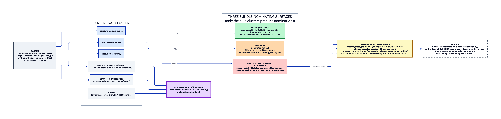

# Research Index — 005: Detecting agentic thrash, operator judgement, and the design basis for `yf-judgement`

## Orientation

This bundle is a **completed yf-research project**. It asks whether *agentic thrash* — an agent
looping without converging — leaves an observable signal early enough to act on, whether that
thrash is caused by an **under-specified objective**, and what class of operator input actually
breaks a loop. It exists to be the design basis for **`yf-judgement`, a prospective skill that does
not yet exist**.

Four things a reader should know before opening anything:

1. **The corpus is 114 plan bundles / 301 review passes across 7 repositories**, measured by
   `scripts/corpus_scan.py`. **The `corpus:` block in `plan.yaml` (127 plans / 391 review passes) is
   SUPERSEDED** — that scan double-counted `.worktrees/<branch>/` mirrors (86 of the 391 files).
   The authoritative figures and the exact file-set definition live in `plan.yaml`'s
   `corpus_corrected:` block and in `Summary.md` §2. Every downstream phase cites the corrected
   baseline.
2. **Everything reasons from residue.** The direct predecessor, **yf-research 004**
   (`docs/research/004-*` in the `dixson3/yoshiko-flow` repo), established that plan bundles record
   **artifacts, not live session behavior**. Thrashing happens inside a session that is not
   retained; only indirect traces survive. That boundary is this study's founding constraint and is
   never crossed.
3. **The headline is a NULL on objective LENGTH — not a refutation of the under-specification
   construct.** Objective word count does not predict thrash (r = −0.002). Specification *quality*
   was never measured, and this corpus cannot measure it independently of length. An earlier draft
   framed this as a refutation; that framing was **withdrawn** during refine. The distinction was
   the red-team's top finding (RT-1 / RT-2).
4. **`yoshiko-flow#264` is operator-supplied input that §8 assesses — not a conclusion.** It is a
   GitHub issue proposing an N-hop escalation architecture. Nothing in the corpus proposed it.

**Reading order.** `Summary.md` alone answers the research questions. For the reasoning behind a
number, follow it to `artifacts/triangulation.md`; for the raw finding, to the `cluster-*.md` that
produced it; for the quote and its credibility band, to `sources.md`.

## Bundle contents

| file | what it is, and why you would open it |
| :-- | :-- |
| [Summary.md](Summary.md) | **The report.** Start here. 10 sections + a red-team dispositions table: what the corpus is, the hypothesis measured, the cross-surface convergence problem, answers to all 6 research questions, which signals survive, the `yf-judgement` recommendation, and the §8 assessment of `yoshiko-flow#264`. |
| [sources.md](sources.md) | **The source register.** 228 entries with verbatim quotes, locators, and evidence-strength bands (local) or adjudicated credibility tiers (web). Every `Summary.md` citation `[N]` anchors here at `#N`. Open it to check any claim. |
| [sources.json](sources.json) | The same 228 records, machine-readable, with per-source scoring components. |
| [plan.yaml](plan.yaml) | The research DAG: topic, primary/secondary questions, the six retrieval clusters, method notes — and the `corpus_corrected` block that supersedes `corpus:`. |
| [index.md](index.md) | This file (reserved OKF bundle listing). |
| [log.md](log.md) | Reserved OKF phase history, newest-first: what each phase produced and when. |

### `artifacts/` — one file per pipeline phase

| file | what it is |
| :-- | :-- |
| [artifacts/tooling-notes.md](artifacts/tooling-notes.md) | **[tooling]** Measured review-pass format variance across all 7 repos (6 finding-id grammars, 4 title conventions), and the corpus correction: 114 bundles / 301 passes after excluding 86 `.worktrees` mirrors. Open it to understand what the scripts can and cannot parse. |
| [artifacts/cluster-review-pass-recurrence.md](artifacts/cluster-review-pass-recurrence.md) | **[retrieve]** The richest surface. Hand-audit of all 40 candidate episodes: 24 TRUE / 7 productive-deepening / 9 FALSE; 50% precision at the shipped operating point. Key reframing: **the phenomenon is misnamed** — ~20 of 24 TRUE episodes are *partial landings*, only 1 is genuine oscillation. The shipped text-similarity detector fails the rival-explanation test (ρ = 0.739 with `plan.md` size). |
| [artifacts/cluster-operator-breakthrough-turns.md](artifacts/cluster-operator-breakthrough-turns.md) | **[retrieve]** The inductive **T0–T9 taxonomy** from 119 hand-coded direction-change events. T1 (fork resolution) dominates at 45 and is 80% *not* pre-elicitable. Source of the r = −0.002 null and of the 40-bundle pre-elicitation natural experiment. |
| [artifacts/cluster-git-churn-signatures.md](artifacts/cluster-git-churn-signatures.md) | **[retrieve]** NEAR-NULL. Git carries a real but sparse, confirmation-only signal, strictly later than review-pass residue: 5/5 narrow hits true, 0 literal reverts in 2,044 commits, 0 of 20 hand-audited file re-touches were intra-plan thrash. Also surfaces a window-construction defect (cross-plan commit contamination). |
| [artifacts/cluster-execution-telemetry.md](artifacts/cluster-execution-telemetry.md) | **[retrieve]** NULL RESULT. `bd` telemetry is a health-check surface, not a thrash-detection surface: 3 reopens in 2,969 status changes, all tooling noise; `discovered-from` chains max depth 2–3. Discovery: `.beads/interactions.jsonl` is a clean field-change event log. |
| [artifacts/cluster-herdr-repo-interrogation.md](artifacts/cluster-herdr-repo-interrogation.md) | **[retrieve]** The external-validity test across the 6 non-`yoshiko-flow` repos. The review-pass *form* generalises everywhere; the *frequency* does not — the signal concentrates in `yoshiko-flow` and `d3-pxe`. Read this before generalising any rate in the report. |
| [artifacts/cluster-prior-art.md](artifacts/cluster-prior-art.md) | **[retrieve]** Prior-art catalogue and transfer table: `grill-me`'s design-tree "grilling" engine, `socrates-skill` (its live-turn machinery does *not* transfer), and requirements-engineering typologies (Derr, W6H) that do. Names the gap: nothing detects clarification-need from post-hoc execution **residue**. |
| [artifacts/triangulation.md](artifacts/triangulation.md) | **[triangulate]** Where most numbers in the report are actually computed. Applies the **plan-size control** to every candidate signal: 3 survive, 11 are named as not surviving (including pass count, ρ = 0.81 with size — it *is* the confounder). Carries the cross-surface overlap analysis and the 7 certified consensus findings. Contains a dated **amendment log** recording a correction made during refine. |
| [artifacts/critique.md](artifacts/critique.md) | **[critique]** The adversarial red-team pass: 30 findings (8 HIGH / 13 MEDIUM / 9 LOW), plus 8 attacks that **failed** and are recorded as failed. This is the document that forced the "refuted" framing to be withdrawn. Its dispositions are tabulated at the end of `Summary.md`. |
| `artifacts/sources-<cluster>.json` (6 files) | The per-cluster source records each retrieval phase emitted, before they were merged, renumbered and scored into the bundle-level `sources.json` / `sources.md`. Provenance only — cite the merged register, not these. |

### `scripts/` — the measuring instruments (re-runnable)

| file | what it does |
| :-- | :-- |
| [scripts/corpus_scan.py](scripts/corpus_scan.py) | Enumerates real plan bundles and review passes across the 7 repos, excluding `.worktrees` mirrors and synthetic fixtures. **The authority for 114 / 301.** |
| [scripts/finding_recurrence.py](scripts/finding_recurrence.py) | Parses `reviews/pass-N.md` finding tables, fingerprints each finding, and detects the same concern recurring across passes. Produces the candidate-episode set the hand-audit graded. |
| [scripts/churn_signature.py](scripts/churn_signature.py) | Scans git history for revert/redo/"actually"/"take 2" commit sequences and repeatedly-touched files inside plan windows. |

All three take `--help` and were re-run by the triangulator, reproducing their outputs exactly.

### `diagrams/`

| file | what it shows |
| :-- | :-- |
| [diagrams/evidence-architecture.png](diagrams/evidence-architecture.png) (source: [`.d2`](diagrams/evidence-architecture.d2)) | The study's **evidence architecture**: six retrieval clusters, only three of which mine a bundle-nominating surface — and two of those three are near-blind (git nominates 5 of 114; `bd` telemetry nominates 0). Hence Jaccard 0.091, a three-way intersection of 0, and exactly one dual-nominated, hand-confirmed bundle (n = 1). Explains why §4's convergence result is a statement about the *instrument*, not about the phenomenon. |

## Directory members (OKF listing)

- [artifacts/](artifacts/) — the per-phase working documents: tooling notes, the six retrieval clusters, triangulation, critique.
- [diagrams/](diagrams/) — `.d2` source plus its rendered `.png`.
- [scripts/](scripts/) — the three re-runnable measuring instruments.
