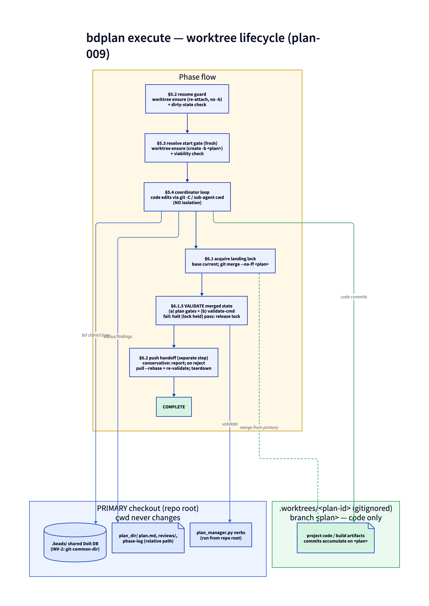

# bdplan

**OVERRIDE:** Replaces native plan mode. Do not use EnterPlanMode/ExitPlanMode.

## SKILL_DIR

```bash
GIT_ROOT=$(git rev-parse --show-toplevel 2>/dev/null || echo .)
SKILL_DIR=$(find ~/.claude/skills ~/.agents/skills "$GIT_ROOT/.claude/skills" "$GIT_ROOT/.agents/skills" .claude/skills .agents/skills -maxdepth 1 -name bdplan -type d 2>/dev/null | head -1)
[ -z "$SKILL_DIR" ] && { echo "ERROR: bdplan skill directory not found"; exit 1; }
```

All skill-internal paths use `${SKILL_DIR}/` prefix.

## Reference skills

bdplan is a beads-backed skill. It does not re-document `bd` usage — it relies on three
companion skills and points at them where a `bd` pattern needs explanation:

- **`beads`** — the canonical routine loop (`bd prime`, `ready`, `show`, `claim`, `create`,
  `close`). Baseline, installed by `bd init`.
- **`yf-beads-extra`** — direct-CLI gotchas this skill's commands depend on: issue-type and
  gate semantics, dependency-edge mutation (`bd dep add` is additive; there is no
  `bd update --deps`), defensive `--json` parsing, transactional `bd batch`, and the
  `bd mol pour` output shape (`new_epic_id`, `id_mapping`).
- **`yf-beads-authoring`** — the formula / `mol pour` / coordinator / `coordinate`
  conventions this skill is built on.

When in doubt about a `bd` behavior, consult `yf-beads-extra` rather than inferring from
the snippets below.

## Invocation

- `/bdplan init` — initialize bdplan for this project
- `/bdplan <objective>` — new plan
- `/bdplan continue [<plan-id>]` — resume open plan
- `/bdplan capture [<plan-id>] [--retro]` — audit plan folder portability and draft missing contract files; `--retro` also mines the current session's conversation (re-entrant, does not advance status)
- `/bdplan execute [<plan-id>]` — begin execution (new session)
- `/bdplan status [<plan-id>]` — show progress
- `/bdplan list` — list all plans

## Pre-flight

**Run on every invocation except `/bdplan init`.** Run the preflight and branch on its
status (it follows the Skill Surface Convention — see the `yf-skill-authoring` skill):

```bash
yf preflight yf-plan --json
```

(The `yf preflight` JSON is a superset of the legacy `plan_manager.py` preflight schema —
same status values and fields — so the branch logic below is unchanged; only the command
moved into the `yf` kernel. See docs/yf/preflight-contract.md.)

- **`ignored`** (operator set `"ignore-skill": true` in `.bdplan.local.json`): exit
  silently, fall back to native plan mode.
- **`ok`**: proceed to the requested command. On `ok`, preflight also ensures the
  idempotent project scaffold (the `docs/plans` dir + the `/.bdplan.local.json` and
  `/.state/` gitignore anchors); anything it created is listed in `scaffold_added`. The
  ensure is additive-only and runs once per scaffold version (gated by `scaffold-ensured`
  state) — it will not re-add an anchor an operator later removes. (`instructions` may
  carry a non-blocking `update available` note for `PLANS.md`.)
- **`system_deps_missing` / `bd_not_initialized`**: tell the user to run `/bdplan init` to
  set up the project. Stop.
- **`rule_missing` / `rule_drift` / `rule_deprecated` / `manifest_*`**: follow the
  `instructions` in the result. The companion rule is installed by the repo installer, so
  these point at `install.sh` (e.g. re-run `install.sh --force` to restore a drifted rule),
  not `init`. Stop.

Config vs state: `ignore-skill` is an operator decision in `.bdplan.local.json` (repo
root, gitignored). The `prereqs-present` and `scaffold-ensured` caches are runtime state in
`.state/bdplan/preflight.json`. The companion rule is installed by the repo installer
(`install.sh`) to the scope+surface rules dir (user-scope `~/.<surface>/rules/PLANS.md`,
project-scope `<git-root>/.<surface>/rules/PLANS.md`; `.claude` or `.agents`); preflight
resolves it in precedence order (user/global copy first) and hash-checks it against
`protocols/manifest.json`.

## /bdplan init

Initialize bdplan for the current project. Spawn a sub-agent (`Agent` with `subagent_type="general-purpose"`) with this prompt:

```
Run bdplan init for Claude Code:

1. Run `yf preflight yf-plan --json` and parse the JSON.
   On status "ok", preflight has already ensured the idempotent scaffold (the docs/plans dir
   plus the `/.bdplan.local.json` and `/.state/` gitignore anchors); `scaffold_added` lists
   what it created. Per-incubator plan roots (`Incubator/<slug>/plans/`) are created lazily.
   The companion rule `PLANS.md` is installed by the repo installer (`install.sh`), not here —
   never write to AGENTS/ and never edit CLAUDE.md.
2. If status is "system_deps_missing" or "bd_not_initialized", return the JSON as-is. Do nothing
   else. (The scaffold is intentionally NOT ensured until the project is ready.)
3. Return JSON: {"status":"ready","actions":<the check's `scaffold_added` array, or []>,"rule":<the check's `rule` object>}
```

Handle the sub-agent result:

- **"ready"**: print actions taken. If the returned `rule.outcome` is not `ok`/`update_available` (e.g. `rule_missing`/`rule_drift`), tell the user the companion rule is missing or drifted and to re-run the repo installer — `install.sh` (add `--force` to clobber a drifted/hand-edited copy); init does not install rules. Then show usage.
- **"system_deps_missing"** or **"bd_not_initialized"**: print the missing items and instructions. Ask: "Would you like to (1) stop and fix the prerequisites, or (2) ignore bdplan in this project?" If ignore, write `{"ignore-skill":true}` to `.bdplan.local.json` at the repo root, and ensure `/.bdplan.local.json` is in `.gitignore`, then exit.

**Rule:** All task tracking uses `bd`. Never use TodoWrite, markdown checklists, or inline task lists.

After editing `protocols/PLANS.md`, refresh the manifest hash:
`uv run ${SKILL_DIR}/scripts/manifest_update.py ${SKILL_DIR}/protocols` (add `--minor`/`--major` for non-patch bumps), and commit the rule + `manifest.json` together.

## Phase Model

```
UPSTREAM --> SCOPE <--> INVESTIGATE --> PLAN --> INTAKE
                                                  |
                                          === session boundary ===
                                                  |
                                              EXECUTE --> RECONCILE --> COMPLETE
```

- SCOPE <-> INVESTIGATE: investigation may revise scope
- PLAN -> SCOPE/INVESTIGATE: draft plan may need more experiments
- PLAN -> INTAKE: only on explicit operator approval

Status values: `scoping | investigating | drafting | review | approved | executing | reconciling | complete`

---

## Phase 0: UPSTREAM DISCOVERY

Runs once per project (persisted to CLAUDE.md), re-validated at start of each new plan.

### 0.1 — Auto-detect

```bash
REMOTE_URL=$(git config --get remote.origin.url 2>/dev/null)
if echo "$REMOTE_URL" | grep -qE 'github\.com'; then
  gh auth status 2>/dev/null && UPSTREAM="github"
elif echo "$REMOTE_URL" | grep -qE 'gitlab\.com|gitlab\.' ; then
  glab auth status 2>/dev/null && UPSTREAM="gitlab"
fi
grep -q "## Upstream Tracking" CLAUDE.md 2>/dev/null && UPSTREAM="configured"
```

### 0.2 — Probe for issues (if no config)

```bash
gh issue list --limit 5 --json number,title,state 2>/dev/null
glab issue list --per-page 5 2>/dev/null
```

### 0.3 — Confirm with operator

Ask: use GitHub Issues, GitLab Issues, Jira, Linear, or none?

### 0.4 — Persist to CLAUDE.md

```markdown
## Upstream Tracking

- **Source:** github
- **Repo:** <owner>/<repo>
- **Tool:** `gh issue`
- **Notes:** <operator instructions>
```

On subsequent plans, read existing config. Re-validate if remote URL changed.

---

## Phase 1: SCOPE

### 1.1 — Check for existing plans

```bash
uv run ${SKILL_DIR}/scripts/plan_manager.py list --json-output
```

If match found, ask: continue existing or start fresh?

### 1.2 — Determine plan root (incubator routing)

Before creating the plan directory, decide whether it belongs in a per-incubator root or the vault-default `docs/plans/`.

1. **Auto-detect from CWD.** If `pwd` is inside `Incubator/<slug>/...`, propose `<slug>` as the incubator.
2. **Confirm with the operator.** Ask: *"Is this plan scoped to an incubator? If yes, which? (detected: `<slug or none>`)"* Accept the slug, `none` for `docs/plans/`, or a different incubator name. If the operator names an incubator that does not yet exist under `Incubator/`, confirm before creating it.
3. **Pass the answer to init.** Use `--incubator <slug>` (or omit for `docs/plans/`).

### 1.3 — Create plan directory

```bash
# Pass --incubator <slug> when the plan is incubator-scoped; omit otherwise.
PLAN_JSON=$(uv run ${SKILL_DIR}/scripts/plan_manager.py init "${objective}" ${incubator:+--incubator "${incubator}"})
plan_id=$(echo "$PLAN_JSON" | uv run ${SKILL_DIR}/scripts/plan_manager.py json-get plan_id)
plan_dir=$(echo "$PLAN_JSON" | uv run ${SKILL_DIR}/scripts/plan_manager.py json-get plan_dir)
```

Plan dirs land under `Incubator/<slug>/plans/<plan-id>/` when an incubator was named, otherwise under `docs/plans/<plan-id>/`. Numbering is global across all roots.

Creates `${plan_dir}/`, `findings/`, `diagrams/` (d2 diagrams per the `yf-diagram-authoring` skill), `assets/` (attachments, not diagrams), `references/`, `reviews/`, initial `plan.md` with `status: scoping`, `README.md` (orientation), and `context.md` (tool-inventory snapshot with hostname+date header). Tool detection is best-effort — missing tools are recorded as `not present` and never block init.

### 1.4 — Upstream issue scan

If upstream tracking configured (not `none`):

```bash
gh issue list --search "<objective keywords>" --json number,title,body,labels,state --limit 20 > /tmp/bdplan-issues.json
uv run ${SKILL_DIR}/scripts/plan_manager.py triage "${plan_dir}" "${objective}" --issues-json /tmp/bdplan-issues.json
```

Present matches with disposition options: `[include] [exclude] [partial] [supersede]`

For <=5 issues, present inline. For >5, direct operator to edit the generated `upstream-triage.md`.

Record decisions in plan.md **Upstream Issues** section.

`triage` also writes `references/upstream-<N>.md` — one file per issue, containing the full (untruncated) body, URL, labels, and state. These files are **regenerated on every re-triage**; operator hand-edits will be clobbered. The 200-char truncation remains in `upstream-triage.md` for readability.

### 1.5 — Scoping

- **Simple** (<=3 questions): ask directly about objective, constraints, investigation needs, scope boundaries, and success criteria. Update plan.md after each.
- **Complex**: generate questionnaire:

```bash
uv run ${SKILL_DIR}/scripts/plan_manager.py scope "${plan_dir}" "${objective}"
```

Direct operator to fill in `scope-answers.md` and say "answers ready".

### 1.6 — Flush plan.md

Write all scoping decisions. Update status:

```bash
uv run ${SKILL_DIR}/scripts/plan_manager.py update-status "${plan_dir}" "investigating" -m "N experiments identified"
```

Transition to INVESTIGATE if unknowns exist, PLAN if none.

---

## Phase 2: INVESTIGATE

### Pre-investigation checkpoint

Before spawning sub-agents, write to plan.md:
- List of experiments with questions
- Scoping decisions so far
- Approach hypothesis (if any)

### Dispatch experiments

Spawn a sub-agent per unknown using `Agent` with `isolation="worktree"`, `mode="bypassPermissions"`. Read `${SKILL_DIR}/agents/investigator.md` for the agent's role, output format, and behavioral rules. Prompt structure:

```
Read ${SKILL_DIR}/agents/investigator.md and follow its instructions.

EXPERIMENT: {question}
CONSTRAINTS: {constraints}
PLAN CONTEXT: {scoping decisions and approach hypothesis}
```

Independent experiments run in parallel.

Track via wisp. Capture the wisp id so it can be burned after investigation (§4.7):

```bash
INVESTIGATION_WISP_ID=$(bd mol wisp plan-investigate \
  --var objective="${objective}" --var plan_dir="${plan_dir}" --json \
  | uv run ${SKILL_DIR}/scripts/plan_manager.py json-get new_epic_id)
```

### Post-investigation

After each sub-agent returns:
1. Write finding to `findings/exp-NNN-<slug>.md`
2. Update plan.md Investigation Findings
3. Both writes BEFORE next sub-agent spawns

### Transitions

- Findings invalidate scope -> SCOPE
- Findings sufficient -> PLAN
- Operator can direct: "rethink the scope", "draft the plan"

---

## Phase 3: PLAN

```bash
uv run ${SKILL_DIR}/scripts/plan_manager.py update-status "${plan_dir}" "drafting" -m "synthesizing plan"
```

### Synthesize plan

Read `${SKILL_DIR}/agents/planner.md` and follow its synthesis procedure. The planner reads scope answers, findings, upstream triage, and current plan.md, then writes the complete plan document per the structure below.

### plan.md structure

```markdown
# Plan: <Objective>

**ID:** plan-NNN-user-hash
**Author:** <git-user>
**Created:** YYYY-MM-DD
**Status:** drafting
**Phase log:**
- YYYY-MM-DD scoping: initial scope captured
- YYYY-MM-DD investigating: N experiments identified
- YYYY-MM-DD drafting: plan v1 presented

## Objective
<what and why>

## Motivation
<why this plan exists — the problem, who is affected, what triggered the work.
Required by the portability contract (spec/portability.md REQ-PORT-004).
Either this section or a motivation.md file must be present and non-empty.>

## Upstream Issues
| Issue | Title | Disposition | Notes | Resolved By |
|-------|-------|-------------|-------|-------------|

## Investigation Findings
<summary of experiments, key decisions>

## Approach
<chosen approach with rationale>

## Epics
### Epic 1: <name>
- Issue 1.1: <description>
- Issue 1.2: <description>
  - depends-on: 1.1
  - resolves-upstream: #142 (include)

## Gates
### Start Gate (mandatory)
- Type: human
- Approvers: operator

### Capability Gate: <name> (if needed)
- Type: human
- Condition: <what must be true>
- Test: <bash command to verify>
- Blocks: <issue refs>
- Instructions: <how to satisfy>

### Reconcile Gate (when upstream issues incorporated)
- Type: auto (all execution beads closed)
- Blocks: reconcile step

## Risks & Mitigations

## Success Criteria
```

```bash
uv run ${SKILL_DIR}/scripts/plan_manager.py update-status "${plan_dir}" "review" -m "plan v1 presented"
```

### Review

Two passes, in order. Both agents are read-only (REQ-AGENT-043); the main session acts on their verdicts.

1. **Conformance** — read `${SKILL_DIR}/agents/reviewer.md` and run its mechanical checklist. Verdict `PASS | INCOMPLETE`. On `INCOMPLETE`, resolve the listed gaps and re-run before proceeding — this is a mechanical gate, not a phase transition. It does not produce a `pass-N.md`.
2. **Adversarial** — once conformance is `PASS`, read `${SKILL_DIR}/agents/red-team.md` and perform a structured adversarial review. **Its verdict drives the phase transition** and owns the `pass-N.md` lifecycle below. Present the red-team verdict and concerns to the operator.

- **APPROVE**: run portability audit, then advance to INTAKE
- **REVISE**: address concerns, stay in PLAN
- **INVESTIGATE-MORE**: return to INVESTIGATE for additional experiments

**Red-team is read-only** (REQ-AGENT-043). The agent never writes files — the main session does.

**Write the report at presentation (create-on-present).** The moment the red-team presents — *before* the operator resolves anything — the main session writes `${plan_dir}/reviews/pass-N.md` **and** appends the phase-log `review:` line, as a **single atomic step**. The file captures, verbatim:

- **Verdict** (APPROVE / REVISE / INVESTIGATE-MORE)
- **Strengths**
- **Concerns** — each with severity (high/medium/low) and recommendation, verbatim
- **Missing** sections
- **Gate Assessment** and **Upstream Assessment**
- An **Operator Resolutions** table with one row per concern and status `unresolved`

Writing at presentation makes the verdict portable the instant it exists: a plan parked in `review` with an outstanding REVISE keeps its report on disk, not only in the drafting conversation (#4).

**Pass numbering is fixed at presentation.** `N` is the count of `^- \d{4}-\d{2}-\d{2} review:` phase-log lines *immediately after* this review's line is appended. Because the file and the phase-log line land in the same atomic step, the REQ-PORT-006 invariant `count(reviews/pass-*.md) == count(phase-log review: lines)` holds *while the plan sits in `review`* — exactly the state #4 makes portable.

**Update in place on resolution.** As the operator resolves each concern, the main session edits the **same** `pass-N.md`: fill that concern's row in the Operator Resolutions table with the resolution and flip its status from `unresolved` to `resolved`, then set the file's final status when all concerns are resolved. Do **not** create a new file and do **not** append a second phase-log `review:` line — both were already written at presentation (above).

**Lifecycle: mutable until resolved, then frozen.** The strict "never overwrite" rule relaxes to: the in-flight `pass-N.md` is **mutable** until every concern is resolved, then **frozen**. A frozen pass file is never edited again.

**REVISE loops produce one file per cycle.** On REVISE, the operator addresses concerns and the red-team runs *again* — that is a new review cycle: a new `pass-(N+1).md` is written at the next presentation (with its own phase-log `review:` line), updated in place, then frozen. Each full review cycle yields exactly one file; files are updated in place within a cycle, never replaced across cycles. The REQ-PORT-006 count-equality (`count(pass-*.md) == count(phase-log review: lines)`) is preserved at every step because file and phase-log line are written together at each presentation.

### Portability audit (last step of PLAN)

After the red-team verdict is APPROVE (and the operator confirms), run the portability audit **before** transitioning to INTAKE. The audit is idempotent — safe to run multiple times during plan development. It is a **script exit-code check, not a bd gate**. Any `fail` finding blocks the transition to INTAKE; the operator fixes the gaps (or runs `/bdplan capture`) and re-runs the audit.

```bash
AUDIT_JSON=$(uv run ${SKILL_DIR}/scripts/plan_manager.py audit "${plan_dir}" --json-output)
AUDIT_STATUS=$(echo "$AUDIT_JSON" | uv run ${SKILL_DIR}/scripts/plan_manager.py json-get status)
if [ "$AUDIT_STATUS" != "pass" ]; then
  echo "$AUDIT_JSON" | uv run ${SKILL_DIR}/scripts/plan_manager.py json-get report
  echo "Plan cannot advance to INTAKE. Remediate the failures above (or run /bdplan capture), then re-approve."
fi
```

On audit pass, transition to INTAKE. On audit fail, stay in PLAN — the operator remediates, re-approves, and the audit re-runs. This loop is idempotent: the audit reads plan state, produces a verdict, and has no side effects.

**Override.** The operator may bypass the audit with explicit `--force` (e.g., "approve --force"). The override appends a phase-log entry recording the bypass and the operator's stated reason:

```
- YYYY-MM-DD approved: portability audit overridden — reasoning: <operator reason>
```

**Grandfather clause.** Plans whose first `scoping:` phase-log entry is before the activation date (`PORTABILITY_ACTIVATION_DATE` in `plan_manager.py`, also recorded in `spec/portability.md`) have missing scaffolding downgraded to `warn` findings instead of `fail`. Audit passes; operator sees the gaps. New plans (first scoped on/after activation) get hard failures. See `spec/portability.md` for the activation date.

### Iteration

- Operator overrides red-team verdict at their discretion
- "what about X?" -> may return to INVESTIGATE or SCOPE
- "change approach to Y" -> revise, stay in PLAN
- "approve" / "looks good" -> run portability audit, then advance to INTAKE on pass

---

## Phase 4: INTAKE

On operator approval:

### 4.1 — Set status `approved`

```bash
uv run ${SKILL_DIR}/scripts/plan_manager.py update-status "${plan_dir}" "approved" -m "operator approved"
```

### 4.2 — Pour molecule

**Duplicate-pour guard.** Before pouring, confirm this plan has no epic already
(re-running intake on an already-intaken plan would pour a second epic — the failure
#2 guards against):

```bash
SCAN=$(uv run ${SKILL_DIR}/scripts/plan_manager.py resume-scan "${plan_dir}" --json)
if [ "$(echo "$SCAN" | uv run ${SKILL_DIR}/scripts/plan_manager.py json-get found)" = "True" ]; then
  echo "An epic already exists for this plan: $(echo "$SCAN" | uv run ${SKILL_DIR}/scripts/plan_manager.py json-get epic_id)"
  echo "Skip the pour and go to /bdplan execute (the resume guard at §5.2 will take over)."
fi
```

If an epic exists, do **not** pour — proceed to `/bdplan execute`. Otherwise pour:

```bash
cp -f "${SKILL_DIR}/formulas/plan-execute.formula.toml" .beads/formulas/
RESULT=$(bd mol pour plan-execute --var objective="${objective}" --var plan_dir="${plan_dir}" --json)
rm -f .beads/formulas/plan-execute.formula.toml

EPIC=$(echo "$RESULT" | uv run ${SKILL_DIR}/scripts/plan_manager.py json-get new_epic_id)
# A gate-type formula step yields TWO beads: a task wrapper (key "plan-execute.start-gate",
# what downstream TASK --deps reference — never an epic, §4.3) and the real gate
# (key "plan-execute.gate-start-gate", what `bd gate resolve` must target).
# See yf-beads-authoring → Formula gate steps.
START_GATE=$(echo "$RESULT" | uv run ${SKILL_DIR}/scripts/plan_manager.py json-get id_mapping "plan-execute.start-gate")
START_GATE_BEAD=$(echo "$RESULT" | uv run ${SKILL_DIR}/scripts/plan_manager.py json-get id_mapping "plan-execute.gate-start-gate")
```

`new_epic_id` and `id_mapping` are the pour result keys — see `yf-beads-extra` →
*`bd mol pour` output shape*. `json-get` is bdplan's hardened defensive JSON parser
(`bd` output may be a multi-document array; see `yf-beads-extra` → *`--json` is not always a
single JSON document*). Use `${START_GATE}` for entry-issue `--deps` wiring (§4.3 — tasks
only, never epics) and `${START_GATE_BEAD}` for `bd gate resolve` (§5.3).

**Persist the plan↔epic linkage immediately** (so a crashed execute session can be resumed
deterministically — Phase 5 resume-guard). Two writes, both keyed on `${EPIC}`:

```bash
# (a) Stamp the epic with its plan_dir so a plan with no **Epic:** field
#     (intaken before this feature) is still findable by resume-scan.
bd update ${EPIC} --metadata "$(jq -nc --arg d "${plan_dir}" '{plan_dir:$d}')" -q

# (b) Record the epic ID in plan.md: an **Epic:** header field plus an inert
#     `- DATE intake: epic <id> poured` phase-log line (matches neither the
#     review: nor scoping: audit regexes). Idempotent.
uv run ${SKILL_DIR}/scripts/plan_manager.py record-epic "${plan_dir}" "${EPIC}"
```

### 4.3 — Create beads from plan.md

**Never block a child epic on the start gate.** `${START_GATE}` is a task, and bd rejects a
task blocking an epic (`epics can only block other epics, not tasks` — see `yf-beads-extra` →
*Epic blocking rule*). Child epics are containers: create them with `--parent` only. Gate the
epic's **entry leaf issues** (those with no intra-plan predecessor) on `${START_GATE}`;
downstream issues depend on their predecessors and inherit the gate transitively.

```bash
# Child epic — parent only, NO start-gate dep (task→epic block is rejected).
EPIC_BEAD=$(bd create "Epic: ${epic_name}" \
  --description="${epic_description}" -t epic -p 2 \
  --parent ${EPIC} \
  --json | uv run ${SKILL_DIR}/scripts/plan_manager.py json-get id)

# Entry issue (no intra-plan predecessor) — gate on the start-gate wrapper task.
ISSUE_BEAD=$(bd create "${entry_issue_description}" \
  --description="${issue_detail}" -t task -p 2 \
  --parent ${EPIC_BEAD} --deps "${START_GATE}" \
  --json | uv run ${SKILL_DIR}/scripts/plan_manager.py json-get id)

# Downstream issue — depends on predecessor(s) only; gate inherited transitively.
ISSUE_BEAD=$(bd create "${issue_description}" \
  --description="${issue_detail}" -t task -p 2 \
  --parent ${EPIC_BEAD} --deps "${dependency_beads}" \
  --json | uv run ${SKILL_DIR}/scripts/plan_manager.py json-get id)
```

### 4.4 — Attach upstream metadata

```bash
bd update ${ISSUE_BEAD} --metadata '{"upstream":"#142","disposition":"include"}' -q
```

### 4.5 — Create capability gates (if any)

Gates are first-class beads (`-t gate`); resolve with `bd gate resolve`. See
`yf-beads-extra` → *Gates*. Create each gate individually (creates need IDs, cannot be
batched):

```bash
CAP_GATE=$(bd create "Gate: ${gate_name}" \
  --description="Condition: ${condition}\nTest: ${test_cmd}\nInstructions: ${instructions}" \
  -t gate --parent ${EPIC} \
  --json | uv run ${SKILL_DIR}/scripts/plan_manager.py json-get id)
```

Wire all dep-add links in a single `bd batch` call after all gates and issues exist:

```bash
# Accumulate dep-add ops for all gate/issue pairs:
DEP_OPS=""
DEP_OPS+="dep add ${ISSUE_BEAD_1} ${CAP_GATE}\n"
DEP_OPS+="dep add ${ISSUE_BEAD_2} ${CAP_GATE}\n"
# ... one line per dep link ...
printf '%b' "${DEP_OPS}" | bd batch -m "plan-${plan_id} dep wiring"
```

**Rule:** Never call `bd dep add A B` as individual shell commands — always accumulate into `DEP_OPS` and pipe once through `bd batch`. An empty `DEP_OPS` is a no-op (skip the printf). For why (single dolt transaction, atomic rollback) see `yf-beads-extra` → *Bulk intake*.

### 4.6 — Create reconcile gate and step

Only when upstream issues incorporated (any non-exclude disposition):

```bash
RECONCILE_GATE=$(bd create "Gate: Reconcile upstream" \
  --description="Blocks reconciliation until execution complete." \
  -t gate --parent ${EPIC} \
  --json | uv run ${SKILL_DIR}/scripts/plan_manager.py json-get id)

RECONCILE_STEP=$(bd create "Reconcile: update upstream issues" \
  --description="Update upstream issues per plan dispositions." \
  -t task -p 1 --parent ${EPIC} --deps "${RECONCILE_GATE}" \
  --metadata "{\"agent\":\"agents/reconciler.md\",\"context\":[\"plan.md\"]}" \
  --json | uv run ${SKILL_DIR}/scripts/plan_manager.py json-get id)
```

### 4.7 — Burn investigation wisp

```bash
bd mol burn ${INVESTIGATION_WISP_ID} 2>/dev/null || true
```

### 4.8 — Handoff

Print plan ID, epic ID, start gate ID. Instruct operator to run `/bdplan execute <plan-id>` in a new session. Start gate can only be released in a new session.

---

## Phase 5: EXECUTE

By default, EXECUTE runs the plan in an isolated git worktree (`.worktrees/<plan-id>`,
branch `<plan-id>`) and lands it via merge-back + merged-state re-validation in Phase 6.
The two address spaces (primary checkout vs. worktree) and the §5.2→§6.2 flow:



On `/bdplan execute [<plan-id>]` in a new session:

### 5.1 — Select plan

If no ID given:

```bash
uv run ${SKILL_DIR}/scripts/plan_manager.py list --json-output
```

Filter for plans with status `approved` and open start gates. A plan already in
`executing` (its start gate resolved by a prior, possibly crashed, session) is also
a valid `/bdplan execute` target — it routes through the resume guard below.

### 5.2 — Resume guard

This section is bdplan's implementation of the yf-beads-authoring resilience contract
(REQ-ORCH-008 resume detection, REQ-ORCH-009 stuck-bead sweep). A prior `bdplan execute`
session can die mid-run (OOM, timeout, abort). Before resolving the start gate or entering
the coordinator loop, detect whether this plan's epic already exists and carries prior
progress:

```bash
SCAN=$(uv run ${SKILL_DIR}/scripts/plan_manager.py resume-scan "${plan_dir}" --json)
FOUND=$(echo "$SCAN" | uv run ${SKILL_DIR}/scripts/plan_manager.py json-get found)
```

`resume-scan` reads the epic from plan.md's `**Epic:**` field (persisted at intake,
§4.2), falling back to the `metadata.plan_dir` stamp for plans intaken before that
field existed. It reports descendant bead counts and the `stuck` list
(`in_progress`/claimed beads a crash left behind).

- **`found` is `false`** — no existing epic. This is a fresh first execution:
  proceed to §5.3 (resolve start gate) normally.
- **`found` is `true`** — an epic already exists for this plan. Do **not** pour or
  create a second epic (the duplicate-epic failure #2 guards against). Prompt the
  operator with `AskUserQuestion`: **Resume** the existing epic (recommended) or
  treat as **New**. On **New**, stop and tell the operator a fresh run requires
  re-intake (a new pour) — execute cannot fabricate a second epic. On **Resume**,
  run the orphan sweep below, then continue at §5.4 (the start gate is already
  resolved from the prior session — do **not** re-resolve it).

**Worktree re-attach (resume only).** On **Resume**, before the orphan sweep,
re-attach the plan's worktree (idempotent — it never creates a second worktree) and
**surface** any dirty prior state without resolving it:

```bash
WT=$(uv run ${SKILL_DIR}/scripts/plan_manager.py worktree ensure "${plan_dir}" --json)
# viable=true → action "reattached-worktree"; dirty=true means a crashed session left
# uncommitted changes. Report dirty_files to the operator; never auto-stash/discard.
# viable=false → run in-place this resume (the §5.3 fallback rationale applies).
```

If the verdict is `dirty`, report the `dirty_files` list and pause for the operator
(the *crashed-worktree* mitigation in plan-009 §Risks) — do not auto-resolve. A
non-viable verdict means this resume runs in-place (worktree mode off for the session).

**Orphan sweep (resume only).** Run it **strictly before the ready loop and before
any reconcile-trigger evaluation** — resetting beads keeps the epic non-terminal, so
reconcile cannot fire on a resumed-but-incomplete plan. Follow the procedure in
`agents/coordinator.md` → *Resume orphan sweep*: **reset** each `stuck` bead from the
scan (`bd update <id> --status open`, making it re-workable) and **report** — never
auto-close — any bead the sweep cannot positively classify, leaving the close
decision to the operator. No bead is auto-closed: there is no reliable bd-state
signal separating disposable scratch from real `discovered-from` work.

Resume order is therefore **re-attach → sweep → loop**.

### 5.3 — Resolve start gate + create worktree

Fresh runs only (skip on a resume — §5.2 already confirmed the gate is resolved and
re-attached the worktree):

```bash
bd gate resolve ${START_GATE_BEAD}   # the gate-* bead, not the wrapper task ${START_GATE}
uv run ${SKILL_DIR}/scripts/plan_manager.py update-status "${plan_dir}" "executing" -m "start gate resolved"
```

**Create the execution worktree (default-on, D2).** After the gate resolves, create the
plan's isolated worktree. This is the **viability check + opt-out gate** (Issue 2.4):

```bash
WT=$(uv run ${SKILL_DIR}/scripts/plan_manager.py worktree ensure "${plan_dir}" --json)
VIABLE=$(echo "$WT" | uv run ${SKILL_DIR}/scripts/plan_manager.py json-get viable)
```

- **`viable` is `true`** — `worktree ensure` created `.worktrees/<plan-id>` on branch
  `<plan-id>` (and ensured `/.worktrees/` is gitignored). The coordinator now runs in
  worktree mode (§5.4): **code edits target the worktree**, while bead tracking and the
  plan folder stay primary-side (see the address-space model below).
- **`viable` is `false`** — a **safe in-place fallback**. Print a one-line reason from
  the verdict (`reason` ∈ `opted-out`, `not-a-git-repo`, `beads-not-initialized`,
  `dirty-locked`, `bd-db-unresolved`) and run the coordinator **in-place exactly as
  before** — no regression in fallback mode. `opted-out` is the operator's
  `"execute.worktree": false` in `.bdplan.local.json`; the rest are environment
  conditions (`bd-db-unresolved` is the INV-2 runtime fallback, M4).

### 5.4 — Run coordinator

Read `${SKILL_DIR}/agents/coordinator.md` and follow its execution loop. The coordinator
drives the bead DAG to completion, handles capability gates, and triggers reconciliation.

**Execution address-space model (worktree mode).** There are **two** address spaces and
operations are explicitly routed (resolves plan-009 red-team C1/M1):

- **Primary checkout (repo root, where `/bdplan execute` ran).** The coordinator IS the
  main session; its cwd is **not** changed per-plan. Primary-side: the **plan folder**
  (`plan.md`, `reviews/`, phase-log, `findings/`), every `plan_manager.py <verb>
  "${plan_dir}"` call (`plan_dir` is relative to cwd), and all **`bd`** calls (INV-2: the
  shared Dolt DB lives in the primary's `.beads/` and is reached from anywhere).
- **Worktree (`.worktrees/<plan-id>`, branch `<plan-id>`).** Only **project code/build
  artifacts** the plan edits. Reach it via `git -C .worktrees/<plan-id>` or by giving an
  agent-backed bead that worktree as its **cwd**. Only these commits land on `<plan-id>`.

So **bead tracking and plan-folder bookkeeping happen primary-side; only code changes
accumulate on the plan branch.** The coordinator never `cd`s into the worktree. In
fallback (in-place) mode there is one address space — the primary — and all edits land
there as today.

### 5.5 — Blocked gates

Drain all unblocked work first. Only report blocked gates when no other work can proceed. Include gate condition, test result, and unblock instructions.

### 5.6 — Reconcile gate

Auto-resolves when all execution beads close. Proceed to Phase 6.

---

## Phase 6: RECONCILE

```bash
uv run ${SKILL_DIR}/scripts/plan_manager.py update-status "${plan_dir}" "reconciling" -m "post-execution reconciliation"
```

**Phase 6 is reordered (plan-009 INV-4): merge-back FIRST, then validate the MERGED
state, then push.** The old order validated pre-merge, which cannot catch class-(b)
integration regressions (each change individually green, broken when integrated). All
Phase-6 steps run **primary-side** (you cannot check out the base branch in two
worktrees at once — §5.4 address-space model).

**In-place (fallback) mode skips the merge.** If §5.3 fell back to in-place, there is no
plan branch to merge — changes are already on the base. Skip §6.1's merge; §6.1.5 still
validates the working tree before the §6.2 handoff.

### 6.1 — Merge-back (worktree mode)

Acquire the single-machine landing lock, bring the base current, and merge the plan
branch into it from the **primary checkout**:

```bash
uv run ${SKILL_DIR}/scripts/plan_manager.py landing-lock acquire "${plan_id}" --json
# exit 3 → held; report the holder and wait. Stale same-host locks self-reclaim.
git pull --rebase                 # bring local base current (other plans may have landed)
git merge --no-ff "${plan_id}"    # --no-ff: auditable merge commit, clean revert (M2)
# defer committing the merge until §6.1.5 validates it (merge leaves it staged/in-progress)
```

`--no-ff` defines the merged tree §6.1.5 validates and keeps the landing as one
revertable commit. The first changes land before any push, so the lock serializes
merge-backs across concurrent plans on this machine.

### 6.1.5 — Validate the merged state

Before any push, validate the merged tree — **layer (a)** the plan's own Gate `Test:`
commands run against the merged checkout (as in the §5.4 loop), **plus layer (b)** the
configured project suite:

```bash
uv run ${SKILL_DIR}/scripts/plan_manager.py validate-merged "${plan_dir}" --json
# layer (b) runs `validate-cmd` from .bdplan.local.json (Issue 3.3). status fail → halt.
```

- **Fail** → halt with the lock **still held** (so the operator fixes under serialization),
  report the failing command. Do not push.
- **Pass** → commit the merge (`git commit` if the merge is still in progress), then
  **release the lock immediately** — the base is now green and the §6.2 push must not hold
  the global lock across the operator-authorization wait (Issue 3.5):

  ```bash
  uv run ${SKILL_DIR}/scripts/plan_manager.py landing-lock release "${plan_id}" --json
  ```

**Honest scope (plan-009 C2).** When `validate-cmd` is **unset**, `validate-merged` runs
layer (a) only and emits a **prominent cross-plan-not-checked notice** — surface it
verbatim; never present a bare green as integration-safe. The configured `validate-cmd`
is the real cross-plan safety net; layer (a) alone cannot catch class-(b) regressions.

### 6.2 — Push handoff (conservative) + teardown

Push authority stays **conservative** (D4, ratified): everything through merge-back +
local re-validation is automated; the upstream push is **reported and run only on explicit
operator/team-maintainer authorization** (yf-beads-authoring REQ-ORCH-014). This is a
**separate primary-side step that does NOT hold the landing lock** (released at §6.1.5).

```bash
git status   # show the merge commit + changed files under ${plan_dir} and .beads/
# Propose (run only when authorized):
#   bd dolt push && git push
```

On an authorized push **rejection** (remote advanced): `git pull --rebase`, then
**re-validate** (re-run §6.1.5) before retrying the push — never push an unvalidated
rebase. After the push is authorized and completed, tear the worktree down:

```bash
uv run ${SKILL_DIR}/scripts/plan_manager.py worktree teardown "${plan_dir}" --json
# remove worktree + delete the now-merged branch (-d) + prune. Refuses on a dirty tree
# without --force (INV-1); a clean merged plan tears down cleanly.
```

> **Full-auto push is NOT the shipped default.** It remains an operator-configurable
> future option (plan-009 Issue 3.6); until ratified, the push is always reported and
> operator-authorized.

Reconciliation (6.3) references pushed commits, so it proceeds only after the push is
authorized and completed.

### 6.3 — Reconcile upstream issues

Read `${SKILL_DIR}/agents/reconciler.md` and follow its procedure. The reconciler parses plan.md dispositions, verifies execution, updates upstream issues, and reports results.

### 6.4 — Close

```bash
bd close ${RECONCILE_STEP} --reason "Upstream issues reconciled" --json
bd close ${EPIC} --reason "Plan complete" --json
uv run ${SKILL_DIR}/scripts/plan_manager.py update-status "${plan_dir}" "complete" -m "plan complete"
```

---

## Phase: CAPTURE (manual)

**Invocation:** `/bdplan capture [<plan-id>] [--retro] [--force]`

Re-entrant and status-agnostic — runs in any phase before intake (`scoping`, `investigating`, `drafting`, `review`). Purely side-effecting on the plan folder; **does NOT advance plan status** and does NOT touch beads.

### Retro mode (`--retro`)

`--retro` extends — does **not** replace — folder-state capture by additionally mining the **current session's conversation** for context that never made it into the plan folder. It is for plans drafted before the portability contract existed, or rescoped mid-draft, where load-bearing context lives only in the drafting conversation.

**Live-session boundary (hard).** `--retro` can only mine the conversation the operator runs it in. It **cannot resurrect a conversation already gone** — run it in a session that still holds the drafting context. Without `--retro`, capture mines folder state only (the default). When the drafting conversation is gone, fall back to plain `/bdplan capture` (folder-state capture remains the fallback).

Under `--retro` the captor mines the conversation for the seven portability classes: **motivation**, **project environment**, **adjacent-concept glossary**, **reviewer verdicts/resolutions**, **upstream issue bodies**, **scope-change history**, and **runtime/environment assumptions**.

### Flow

1. **Audit.** Run the portability audit and present findings to the operator:
   ```bash
   uv run ${SKILL_DIR}/scripts/plan_manager.py audit "${plan_dir}" --json-output
   ```
2. **Draft missing files.** For each `fail` finding, dispatch the captor agent to draft the missing file from current plan state. Read `${SKILL_DIR}/agents/captor.md` and follow its procedure. The captor reads `plan.md`, `findings/`, `upstream-triage.md`, phase log, and (for upstream references) runs `gh issue view <N>`; it returns draft content. **When `--retro` is set, also pass the current conversation** so the captor mines it for the seven portability classes above (folder state still takes precedence; the conversation only fills gaps). **Captor never writes files** — the main session does.
3. **Operator review.** Present each draft in full to the operator before writing. Never overwrite an existing file without `--force`.
4. **Write.** On operator approval, write each file. Re-run the audit to confirm progress.

### Rules

- `/bdplan capture` does not call `update-status`. Plan status is unchanged.
- No bead mutations. No molecule pour.
- Existing files are preserved unless the operator passes `--force`.
- If no findings are `fail`, report "already portable" and exit.
- `--retro` mines the **current** session only. It never claims to recover a conversation that is gone; folder-state capture is the fallback.

---

## Commands

### /bdplan continue [<plan-id>]

1. If plan-id given: read its plan.md, resume at current phase
2. If no argument, one open plan: auto-select
3. If multiple: present choices
4. Fuzzy-match objective text if ambiguous

plan.md is self-contained for cold resume.

### /bdplan list

```bash
uv run ${SKILL_DIR}/scripts/plan_manager.py list
```

### /bdplan status [<plan-id>]

Show plan.md header + `bd show <epic-id> --json` + bead progress.
Without plan-id: show all plans with bead counts.
