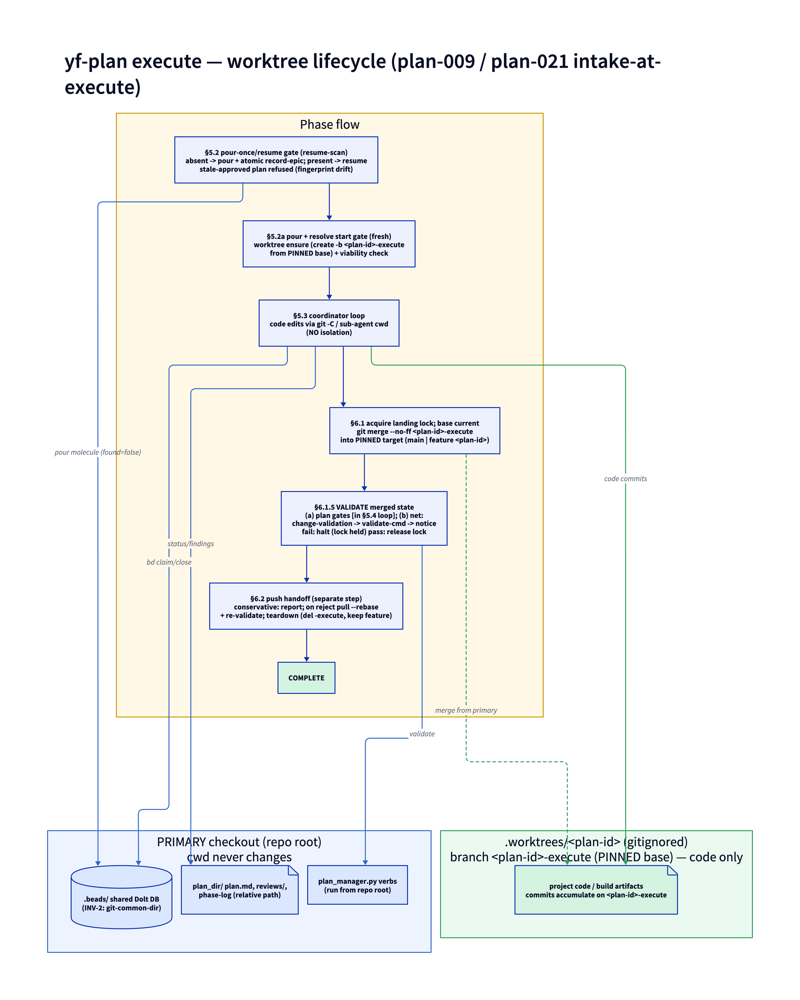

# yf-plan

Structured planning with beads-tracked execution and upstream issue reconciliation.

## Why yf-plan

Claude Code has a native plan mode, but it treats planning as a single-session, single-machine activity: the agent thinks, drafts a plan, and executes it — all in one context. That works for contained tasks. It breaks down when:

- **You need to investigate before committing.** A plan to adopt a new database should benchmark candidates, not guess. yf-plan runs investigation experiments in disposable worktrees during the planning phase, feeding findings back into plan design before any commitment is made.

- **Execution spans multiple environments.** Building a cross-platform tool means some tasks can only run on macOS, others on Windows, others in CI. Native plan mode assumes one machine, one session. yf-plan decomposes plans into epics with dependency-wired issues and gates — a capability gate can block issues that require a platform you don't have, while all other work proceeds. Push the repo, and someone on the right platform picks up where the gate left off.

- **Multiple people need to contribute.** yf-plan tracks execution state in beads, which are stored in the repo alongside the code. Push an in-progress plan upstream and collaborators can pull it into their own environments, claim ready beads, and execute their portion. The bead DAG ensures correct ordering without coordination overhead.

- **You want upstream issue context in the plan.** yf-plan scans GitHub/GitLab issues related to the objective, lets you triage them (include, exclude, partial, supersede, deferred), and wires them into the plan's epics. After execution, the reconcile phase automatically updates or closes those upstream issues with references to what was done.

- **Plans should be durable artifacts.** Native plan mode produces ephemeral output that vanishes with the session. yf-plan writes plans as markdown — versioned in git, reviewable in PRs, searchable in the future. Plans land under `docs/plans/` by default, or under `Incubator/<slug>/plans/` when the plan is scoped to a specific incubator (auto-detected from CWD, confirmed during scoping). The plan document records scoping decisions, investigation findings, approach rationale, and execution status.

### How it works

1. **Scope** — You state an objective. yf-plan scans for related upstream issues, asks scoping questions (interactively or via a questionnaire file), and identifies unknowns that need investigation.

2. **Investigate** — For each unknown, yf-plan spawns a sub-agent in a disposable worktree to run experiments. Findings are captured as structured markdown and fed into plan synthesis. Nothing from investigation worktrees lands in the project.

3. **Plan** — yf-plan synthesizes scope + findings into a structured plan document with epics, issues, dependency wiring, capability gates, and upstream issue linkage. You review, iterate, and approve.

4. **Intake** — On approval, yf-plan writes a content **fingerprint** over the plan's reviewed sections, auto-commits the plan folder **locally** (scoped, never pushed, refused on the default branch), lands it per the `landing-strategy` switch (`main` → merge to `main`; `feature-branch` → keep feature `<plan-id>`), and files the single upstream tracking issue. **No beads are poured here** — the fingerprint is the execution-eligibility token, and the molecule is poured at execute-start (intake-at-execute). This is the handoff point.

5. **Execute** — In a new session, `/yf-plan execute` runs one **pour-once/resume gate** (`resume-scan`): an absent epic is the normal first run, so it pours the `plan-execute` molecule (a DAG mirroring the plan's epics), writes the epic↔plan linkage atomically, resolves the start gate, and runs the coordinator loop — find ready beads, dispatch sub-agents, close beads, repeat. **By default the plan runs in an isolated git worktree** (`.worktrees/<plan-id>`, branch `<plan-id>-execute`) cut from a **pinned base** (`main`, or feature `<plan-id>`) — never ambient HEAD: code edits accumulate on that branch while bead tracking and the plan folder stay in the primary checkout (the shared Dolt DB resolves from the worktree via git-common-dir, so beads never diverge). A plan whose content changed since approval is **stale-approved** and cannot execute until re-reviewed (or `--force`, logged). Execution falls back to in-place automatically (not a git repo, beads not initialized, an unresolvable base, an unsafe worktree state, or the `execute.worktree:false` opt-out). Capability gates block work that requires unavailable resources while all other work continues. If a prior execute session crashed mid-run, the gate's resume branch detects the existing epic (no duplicate pour), re-attaches the worktree (surfacing any dirty state), and an orphan sweep resets stuck `in_progress` beads to `open` — never auto-closing — before the loop resumes.

6. **Reconcile** — After execution, in worktree mode yf-plan brings the base current, merges the `<plan-id>-execute` branch back (`git merge --no-ff`) into the **pinned merge target** for the landing strategy (`main`, or feature `<plan-id>`) under a single-machine landing lock, and **re-validates the merged state** (the plan's gates plus a configured project `validate-cmd`) before any push — catching regressions that only appear once concurrent changes integrate. It then reports a conservative git handoff (proposed `git`/`bd dolt push` commands, pushed only on explicit authorization), tears the worktree down (deleting `<plan-id>-execute`, preserving the feature branch under the feature-branch strategy), and—once the push is authorized—updates upstream issues per the triage dispositions set during scoping.

The worktree execution lifecycle (two address spaces, §5.2→§6.2):



## Prerequisites

Checked at runtime by `scripts/plan_manager.py check`:

| Tool | Version | Install |
|:-----|:--------|:--------|
| `uv` | any | https://docs.astral.sh/uv/ |
| `bd` | >= 1.1.0 | https://github.com/gastownhall/beads |
| `git` | any | system package manager |

Optional:

- `gh` — GitHub CLI (for upstream issue tracking)
- `glab` — GitLab CLI (for upstream issue tracking)

The repo installer (`install.sh`) installs the `PLANS.md` companion rule alongside the skill, to a rules dir anchored by scope and surface — `--scope user` (default) → `~/.<surface>/rules/` (global, shared by every project), `--scope project` → `<git-root>/.<surface>/rules/` (`.claude` or `.agents` per `--surface`). `/yf-plan init` handles consent-only per-project setup (prerequisite check, the prereq-missing opt-out); it does not install the rule. The idempotent scaffold (the `docs/plans` dir + a single `/.yf/` gitignore anchor) is ensured automatically by preflight on every healthy `check`.

## Install

Via the repo-level installer (installs the skill + its companion rule):

```bash
./install.sh                       # all skills -> ~/.claude/{skills,rules}/
./install.sh --scope project       # -> <git-root>/.claude/{skills,rules}/
./install.sh --surface agents      # -> ~/.agents/{skills,rules}/
./install.sh --force yf-plan        # reinstall yf-plan, overwriting its rule
```

Or per-skill, use the canonical installer, which resolves the destination for
**whichever harness you name** rather than hardcoding claude-code's — and deploys
the companion rule with it:

```bash
yf harness skills install yf-plan --harness pi     # or claude-code, codex, opencode, agents
```

## Usage

```
/yf-plan init                     Initialize yf-plan for this project
/yf-plan <objective>              New plan
/yf-plan continue [<plan-id>]     Resume open plan
/yf-plan capture [<plan-id>] [--retro]   Audit portability and draft missing contract files; --retro also mines the current session's conversation (no status change)
/yf-plan execute [<plan-id>]      Begin execution (new session required)
/yf-plan status [<plan-id>]       Show progress
/yf-plan list                     List all plans
```

Also triggers on planning-intent language: "let's design", "let's plan", "how should we build", "let's architect".

## Phase Model

```
UPSTREAM --> SCOPE <--> INVESTIGATE --> PLAN --> INTAKE
                                                  |
                                          === session boundary ===
                                                  |
                                              EXECUTE --> RECONCILE --> COMPLETE
```

Plans are scoped, investigated, and approved in one session. Execution starts in a new session via `/yf-plan execute`. Reconcile updates linked upstream issues after push.

### Portability contract

At intake, every plan folder is subject to a mechanical portability audit (`plan_manager.py audit`). A plan folder must contain:

- `index.md` — the OKF-reserved bundle listing: a `#` heading plus `- [child](path) - description` bullets enumerating the bundle members. **Replaces the legacy `README.md`** file-map / reading-order surface (REQ-PORT-001); its content is folded into the listing bullets. Being an OKF reserved file it carries no `type` and no `okf_spec`, and a bundle-root `index.md` may carry `okf_version`.
- `log.md` — the OKF-reserved update history: newest-first entries under ISO-8601 (`YYYY-MM-DD`) date headings. **Replaces the legacy in-`plan.md` `**Phase log:**` block** (REQ-PORT-006 counts its `review:` lines against `reviews/pass-<N>.md`).
- `context.md` — project environment snapshot (tool inventory with hostname+date header, paths, operator identity, runtime assumptions)
- A `## Motivation` section in `plan.md` or a `motivation.md` file
- `references/upstream-<N>.md` for every non-excluded upstream issue (full body)
- `reviews/pass-<N>.md` for every review cycle (1:1 with phase-log review lines)
- No dangling external refs (absolute paths or `../` outside fenced/inline code)

A cold reader in a different repo, with no access to the drafting conversation, must be able to understand the plan from the folder alone. The audit runs as the **last step of Phase 3 (PLAN)** — after red-team approval, before transition to intake. It is idempotent: safe to run repeatedly as the operator iterates on gaps via `/yf-plan capture`. Override with explicit `--force` on approval (logged to the phase log). See `spec/portability.md` for full requirements and the activation date.

## File Layout

```
skills/yf-plan/
├── agents/
│   ├── captor.md                          # Drafts missing portability-contract files for /yf-plan capture
│   ├── coordinator.md                     # Drives execution DAG to completion
│   ├── investigator.md                    # Runs single experiment in disposable worktree
│   ├── lander.md                          # Adjudicates a landing manifest into a decision document
│   ├── planner.md                         # Synthesizes scope + findings into plan
│   ├── reconciler.md                      # Updates upstream issues per dispositions
│   ├── red-team.md                        # Adversarial plan review before approval (drives the phase transition)
│   └── reviewer.md                        # Conformance/completeness plan check (PASS|INCOMPLETE), runs first
├── fixtures/
│   └── severity-vocabulary/
│       └── off-vocabulary-med.md
├── formulas/
│   ├── plan-execute.formula.toml          # Beads molecule for execution pipeline
│   ├── plan-investigate.formula.toml      # Beads molecule for investigation wisp
│   ├── plan-review.formula.toml           # Beads molecule for the Phase-3 review loop (sequencing only)
│   └── verify-artifact.formula.toml       # ASPECT woven over plan-review's steps at COOK time —
├── protocols/
│   ├── DOC-LINT.md                        # Document-lint on-edit trigger — fires the linter on a create or
│   ├── manifest.json                      # Hash manifest for PLANS.md and DOC-LINT.md
│   └── PLANS.md                           # Planning protocol (installed to the scope+surface rules dir, e.g.
├── scripts/
│   ├── document_types/
│   │   ├── agent.toml
│   │   ├── asset.toml
│   │   ├── context.toml
│   │   ├── escalations.toml
│   │   ├── finding.toml
│   │   ├── plan-relations.toml
│   │   ├── plan-retrospective.toml
│   │   ├── plan.toml
│   │   ├── reference-authored.toml
│   │   ├── reference-comment.toml
│   │   ├── reference-tracker.toml
│   │   ├── reference.toml
│   │   ├── research-artifact.toml
│   │   ├── research-sources.toml
│   │   ├── research-summary.toml
│   │   ├── review.toml
│   │   ├── skill.toml
│   │   ├── upstream-reference.toml
│   │   └── upstream-triage.toml
│   ├── fixtures/
│   │   └── classify/                      # Ground-truth corpus for test_classify_deliverable.py
│   │       ├── d3-pxe-plan-006/
│   │       │   └── plan.md
│   │       ├── d3-pxe-plan-007/
│   │       │   └── plan.md
│   │       ├── d3-pxe-plan-008/
│   │       │   └── plan.md
│   │       ├── d3-pxe-plan-009/
│   │       │   └── plan.md
│   │       ├── d3-pxe-plan-010/
│   │       │   └── plan.md
│   │       ├── d3-pxe-plan-011/
│   │       │   └── plan.md
│   │       ├── d3-pxe-plan-012/
│   │       │   └── plan.md
│   │       ├── d3-pxe-plan-013/
│   │       │   └── plan.md
│   │       ├── d3-pxe-plan-014/
│   │       │   └── plan.md
│   │       ├── yoshiko-flow-plan-031/
│   │       │   └── plan.md
│   │       ├── yoshiko-flow-plan-032/
│   │       │   └── plan.md
│   │       ├── yoshiko-flow-plan-033/
│   │       │   └── plan.md
│   │       ├── yoshiko-flow-plan-034/
│   │       │   └── plan.md
│   │       ├── yoshiko-flow-plan-035/
│   │       │   └── plan.md
│   │       ├── yoshiko-flow-plan-036/
│   │       │   └── plan.md
│   │       ├── yoshiko-flow-plan-037/
│   │       │   └── plan.md
│   │       ├── yoshiko-flow-plan-038/
│   │       │   └── plan.md
│   │       ├── BASELINE.json
│   │       ├── MANIFEST.json
│   │       └── README.md                  # This file
│   ├── close_cascade.py                   # Bottom-up cascade-close of all-terminal containers (§6.4)
│   ├── doc_lint.py
│   ├── gate_consistency.py                # Gate/Blocks-set consistency: self-satisfaction and
│   ├── land_rehearsal.py
│   ├── manifest_update.py                 # Vendored manifest hash/version helper
│   ├── okf.py                             # Vendored OKF engine (byte-identical to _shared/okf.py)
│   ├── plan_extract.py
│   ├── plan_manager.py                    # Plan CRUD, prerequisite checking, portability audit, crash-recovery
│   ├── plan_template.py                   # The canonical plan.md skeleton + producer constants (vendored
│   ├── pour_fidelity.py
│   ├── repair_dangling_epics.py           # One-shot repair for epics orphaned by a crashed pour
│   ├── retrospective_fields.py            # prevention_formula enum check + prevention_vars (#196)
│   ├── test_audit_close.py
│   ├── test_autonomy.py
│   ├── test_cascade_root_resolution.py
│   ├── test_classify_deliverable.py
│   ├── test_cli_enumeration.py
│   ├── test_close_cascade.py
│   ├── test_close_contract.py
│   ├── test_complete_gate.py
│   ├── test_config_tiers.py
│   ├── test_epic_ref_audit.py
│   ├── test_escalations.py
│   ├── test_gate_consistency.py
│   ├── test_gates.py
│   ├── test_index_members.py
│   ├── test_intake_lint_binding.py
│   ├── test_judgement_trigger.py
│   ├── test_land_apply.py
│   ├── test_land_manifest.py
│   ├── test_lander_agent_contract.py
│   ├── test_recheck_criteria.py
│   ├── test_reconcile_step_resolution.py
│   ├── test_retrospective.py
│   ├── test_retrospective_fields.py
│   ├── test_review_agent_contract.py
│   ├── test_review_count.py
│   ├── test_review_verdict.py
│   ├── test_severity_vocabulary.py
│   ├── test_stamp_tracker.py
│   ├── test_update_status_gate.py
│   ├── test_update_status_idempotent.py
│   ├── test_upstream_requirements.py
│   ├── test_verify_beads.py
│   ├── test_verify_reconcile.py
│   ├── test_worktree.py
│   └── verify_beads.py                    # Injection-time verify beads for plan-execute, which
├── spec/
│   ├── agents.md                          # Agent roles, inputs, outputs, and behavioral constraints
│   ├── ci-release-completion.md           # The ci-release completion criterion and its evidence contract
│   ├── cli.md                             # Invocation, pre-flight, and plan_manager.py interface
│   ├── data.md                            # Plan identity, plan.md schema, config, formulas, doc types
│   ├── landing.md                         # The landing capability (REQ-LAND-*): the L0-L19 order, the journal
│   ├── phases.md                          # Phase model and status value requirements
│   ├── portability.md                     # Portability contract, audit semantics, activation date
│   ├── prerequisites.md                   # Required/optional tools, bootstrap flow, install URLs
│   ├── worktree-execute-lifecycle.d2      # d2 source for the worktree execution lifecycle diagram
│   └── worktree-execute-lifecycle.png     # Rendered lifecycle diagram (referenced from SKILL.md)
├── test-harness/
│   ├── .gitignore
│   ├── bootstrap.sh                       # Tier-2 sandboxed-HOME harness setup (see TESTING.md)
│   ├── README.md                          # This file
│   └── smoke.sh                           # Tier-2 mechanical drive of the manager verbs
├── OKF-EXTENSION.md                       # The per-skill OKF extension rules for a plan bundle
├── README.md                              # This file
├── SKILL.md                               # Claude Code skill entry point (includes all phases inline)
└── SPEC.md                                # Requirements (REQ-PLAN-NNN), guardrails, verification map
```

_Every entry above is verified against the shipped tree by
`scripts/test_cli_enumeration.py`; `__pycache__` is excluded as a build artifact._


Per-plan folder layout after `/yf-plan init` (plan root is either `docs/plans/` or `Incubator/<slug>/plans/` depending on the answer to the scoping incubator question; numbering is global):

```
<plan-root>/<plan-id>/
  plan.md                    The plan (status, objective, motivation, approach, epics, gates, risks, success criteria)
  index.md                   OKF-reserved bundle listing — orientation for cold readers (replaces the legacy README.md)
  log.md                     OKF-reserved update history — newest-first, ISO-8601 date headings (replaces plan.md's phase-log block)
  context.md                 Project environment snapshot at plan-authoring time
  findings/                  Investigation experiment results
  references/                Inlined upstream issue bodies (one file per non-excluded issue)
  reviews/                   Reviewer verdicts (one file per review pass)
  diagrams/                  d2 diagrams (.d2 source + .png render) per diagram-authoring
  assets/                    Attachments and generated artifacts (not diagrams)
  scope-answers.md           Scoping questionnaire (complex scoping only)
  upstream-triage.md         Upstream triage working file
```
